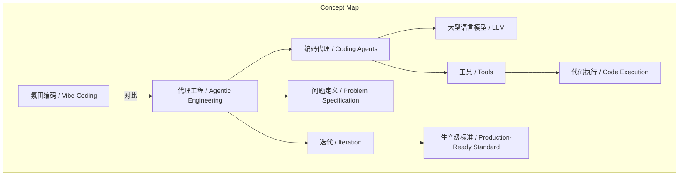
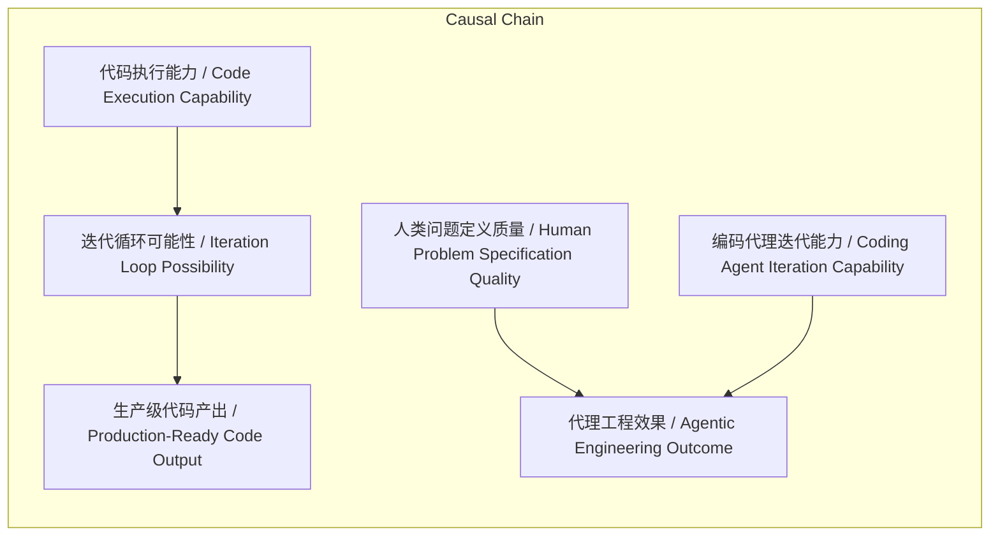

> 一种通过编码代理循环执行代码来辅助软件开发的实践方法。

## 元信息
- 分类：`ai-software/agents-tooling`
- 优先级：`high` (`13`)
- 文档类型：`text-summary`
- 来源分组：`news`
- 原始文件：`reports/news/2026-03-17/1773791713604-news-news-task-1773791678101-2r25wt.md`
- 请求 ID：`1773791678101-2r25wt`

## 原始内容

#### 文本总结

### 代理工程：用编码代理构建软件的实践

#### 整体结构化文档表达
##### 文档卡片
- 主题（中文/English）：代理工程 / Agentic Engineering
- 一句话摘要：一种通过编码代理循环执行代码来辅助软件开发的实践方法。
- 目标读者：软件工程师、AI应用开发者、技术决策者。
- 核心结论（3条）：
  1. 代理工程的核心是使用能编写并执行代码的编码代理，通过循环迭代达成目标。
  2. 它与“氛围编码”不同，后者指未经审查的原型级代码，而代理工程追求生产级质量。
  3. 人类在代理工程中的关键作用是精确定义问题、提供工具并验证迭代结果。

##### 内容结构树
1. 背景与问题定义：引入编码代理及其在软件开发中的辅助角色，提出“什么是代理工程”的核心问题。
2. 核心观点与关键证据：定义代理工程、编码代理及代理；强调代码执行能力是使迭代成为可能的关键；对比代理工程与氛围编码。
3. 方法/机制/路径：人类需提供工具、详细说明问题、验证并迭代结果；代理通过循环调用LLM与工具执行代码。
4. 风险与边界条件：LLM本身不学习，依赖人类更新指令和工具 harness 以克服错误；工具集和问题定义的细节决定效果。
5. 结论与行动建议：代理工程能帮助产出更高质量、解决更 impactful 问题的代码；该领域模式持续演进，需保持更新。

##### 结构化元数据（JSON）
```json
{
  "title": "代理工程：用编码代理构建软件的实践",
  "topic_zh": "代理工程",
  "topic_en": "Agentic Engineering",
  "audience": "软件工程师、AI应用开发者、技术决策者",
  "claims": [
    "代理工程是借助编码代理开发软件的实践",
    "代码执行能力是代理工程可行的定义性能力",
    "人类在代理工程中负责问题定义、工具提供与结果验证",
    "代理工程区别于未经审查的'氛围编码'",
    "LLM不学习，但编码代理可通过人类更新实现改进"
  ],
  "evidence": [
    "Claude Code、OpenAI Codex、Gemini CLI 是流行编码代理示例",
    "代理定义：运行工具循环以实现目标的软件",
    "编码代理工具集包含代码执行器",
    "Andrej Karpathy 于 2025年2月提出'氛围编码'术语",
    "指南本身标记为持续工作进展"
  ],
  "risks": [
    "依赖人类持续更新指令与工具 harness 以克服LLM无记忆的局限",
    "问题定义不清晰或工具不充分会导致代理失效",
    "模式可能随工具进步而过时"
  ],
  "actions": [
    "为编码代理提供解决特定问题所需的工具集",
    "以适当详细程度指定问题目标",
    "验证并迭代代理输出直至达到生产级标准",
    "将经验教训系统化更新到指令与工具中"
  ]
}
```

#### 处理流程
1. 输入识别：用户输入为关于“Agentic Engineering Patterns”的指南文本，阐述代理工程概念、定义、对比与方法论。
2. 信息抽取：实体包括 agentic engineering、coding agents、LLM（如GPT-5、Gemini、Claude）、tools、code execution、vibe coding；概念包括代理定义、循环、工具调用、问题定义、迭代验证；观点包括人类角色、与氛围编码区别；事实包括流行代理例子、术语提出时间。
3. 结构化归纳：定义（代理、编码代理、代理工程）；分类（代理基于工具能力）；比较（代理工程 vs 氛围编码）；因果（代码执行能力 → 迭代循环 → 生产级代码）；方法论（提供工具、详细说明、验证迭代）。
4. 关系建模：编码代理依赖LLM与工具；代理工程效果依赖人类问题定义与代理迭代能力；代码执行是循环迭代的前提。
5. 可视化表达：使用Mermaid绘制概念结构图与逻辑因果图。

#### 概念清单（中英文）
- 代理工程 / Agentic Engineering
- 编码代理 / Coding Agents
- 代理 / Agent
- 大型语言模型 / Large Language Models (LLMs)
- 工具 / Tools
- 代码执行 / Code Execution
- 氛围编码 / Vibe Coding
- 循环 / Loop
- 问题定义 / Problem Specification
- 迭代 / Iteration
- 生产级标准 / Production-Ready Standard
- 工具 harness / Tool Harness
- 模式 / Patterns

#### 概念定义（中英文）
- 代理工程 / Agentic Engineering：开发软件时借助编码代理的实践。
- 编码代理 / Coding Agents：能编写并执行代码的代理。
- 代理 / Agent：运行工具循环以实现目标的软件；调用LLM并传递工具定义，执行LLM请求的工具并将结果反馈回LLM。
- 大型语言模型 / Large Language Models (LLMs)：如GPT-5、Gemini、Claude等模型，作为代理的推理核心。
- 工具 / Tools：代理可调用的功能，编码代理包括代码执行工具。
- 代码执行 / Code Execution：直接运行代码的能力，是代理工程可行的定义性能力。
- 氛围编码 / Vibe Coding： prompting LLM写代码而“忘记代码存在”，指未经审查的原型级代码。
- 循环 / Loop：代理重复生成代码、执行、反馈的过程，直至目标达成。
- 问题定义 / Problem Specification：以适当详细程度向代理描述目标。
- 迭代 / Iteration：基于验证结果调整和重新运行的过程。
- 生产级标准 / Production-Ready Standard：代码经过审查、可靠、可部署的状态。
- 工具 harness / Tool Harness：代理可用的工具集合与调用框架。
- 模式 / Patterns：与编码代理协作的重复有效方法。

#### 概念关联与逻辑关系（中英文）
1. 编码代理 / Coding Agents = LLM / LLM + 工具定义 / Tool Definitions + 代码执行工具 / Code Execution Tool
2. 代理工程效果 / Agentic Engineering Outcome = 人类问题定义质量 / Human Problem Specification Quality × 代理迭代能力 / Agent Iteration Capability
3. 代码执行能力 / Code Execution Capability → 迭代循环可能性 / Iteration Loop Possibility → 生产级代码产出 / Production-Ready Code Output

#### COT逻辑梳理（定义/分类/比较/因果/科学方法论）
- Step 1 (定义)：明确“代理”为运行工具循环实现目标的软件，其核心是LLM与工具的交互；“编码代理”特指工具包含代码执行器的代理。
- Step 2 (分类)：代理可依据其工具集分类，编码代理是其中一种，关键区别在于具备代码执行能力。
- Step 3 (比较)：对比“代理工程”与“氛围编码”；前者强调人类验证迭代至生产级，后者指未经审查的原型代码。
- Step 4 (因果)：代码执行能力使代理能直接验证输出，从而启动迭代循环；无此能力，LLM输出价值有限。
- Step 5 (科学方法论)：有效代理工程需遵循方法论：a) 提供针对性工具集；b) 详细说明问题；c) 严格验证并迭代；d) 将经验教训系统化更新至工具harness以克服LLM无记忆缺陷。

#### 事实与看法（病毒）
##### 事实
- Claude Code、OpenAI Codex、Gemini CLI 是流行编码代理示例。
- Andrej Karpathy 于 2025年2月提出“氛围编码”术语，早于Claude Code发布三周。
- 代理定义自1990年代以来是AI研究挑战，本文接受LLM领域的特定定义。
- 指南标记为持续工作进展，章节未完成且会更新。
##### 看法
- 编写代码从来不是软件工程师的唯一活动， craft在于决定写什么代码。
- 人类工作是导航数十种潜在解决方案及其权衡，找到最适合独特情境的选项。
- 有效使用编码代理能帮助人类承担更雄心勃勃的项目。
- 代理工程应帮助我们产出更多、更高质量、解决更 impactful 问题的代码。
- 将“氛围编码”限于原定义（忘记代码存在）比扩展至所有LLM代码生成更有用。

#### FAQ（原文问题整理）
- **Q: 什么是代理工程？**  
  A: 开发软件时借助编码代理的实践。
- **Q: 什么是编码代理？**  
  A: 能编写并执行代码的代理。
- **Q: 什么是代理？**  
  A: 运行工具循环以实现目标的软件；调用LLM并传递工具定义，执行LLM请求的工具并反馈结果。
- **Q: 代码执行为何关键？**  
  A: 它是使代理工程可行的定义性能力，允许代理迭代验证代码直至工作。
- **Q: 与氛围编码有何区别？**  
  A: 氛围编码指未经审查的原型级LLM生成代码；代理工程强调人类验证迭代至生产级标准。
- **Q: 人类在代理工程中做什么？**  
  A: 提供工具、详细说明问题、验证并迭代结果，导航解决方案选项。
- **Q: LLM会从错误中学习吗？**  
  A: 不会，但编码代理可通过人类更新指令和工具harness来改进。
- **Q: 该指南的性质是什么？**  
  A: 持续工作进展，模式会随工具演进而更新，章节未完成。

#### Visualization
##### Mermaid 图 1（概念结构图）

##### Mermaid 图 2（逻辑/因果图）


#### 文章中的类比
未发现明确类比。

#### 10个金句
1. Agents run tools in a loop to achieve a goal. （代理通过循环运行工具来实现目标。）
2. Code execution is the defining capability that makes agentic engineering possible. （代码执行是使代理工程可行的定义性能力。）
3. Writing code has never been the sole activity of a software engineer. （编写代码从来不是软件工程师的唯一活动。）
4. Our job is to navigate those options and find the ones that are the best fit for our unique set of circumstances and requirements. （我们的工作是导航这些选项，找到最适合我们独特情境和要求的那一个。）
5. We need to provide our coding agents with the tools they need to solve our problems, specify those problems in the right level of detail and verify and iterate on the results. （我们需要为编码代理提供解决问题所需的工具，以适当详细程度说明问题，并验证和迭代结果。）
6. LLMs don't learn from their past mistakes but coding agents can, provided we deliberately update our instructions and tool harnesses. （LLM不会从过去错误中学习，但编码代理可以，只要我们刻意更新指令和工具harness。）
7. Used effectively, coding agents can help us be much more ambitious with the projects we take on. （有效使用下，编码代理能帮助我们对所承担项目更具雄心。）
8. Agentic engineering should help us produce more better quality code that solves more impactful problems. （代理工程应帮助我们产出更多、更高质量、解决更 impactful 问题的代码。）
9. Vibe coding is more useful in its original definition - we need a term to describe unreviewed prototype-quality LLM-generated code. （氛围编码在原定义下更有用——我们需要一个术语描述未经审查的原型级LLM生成代码。）
10. No chapter should be considered finished. （没有章节应被视为已完成。）
