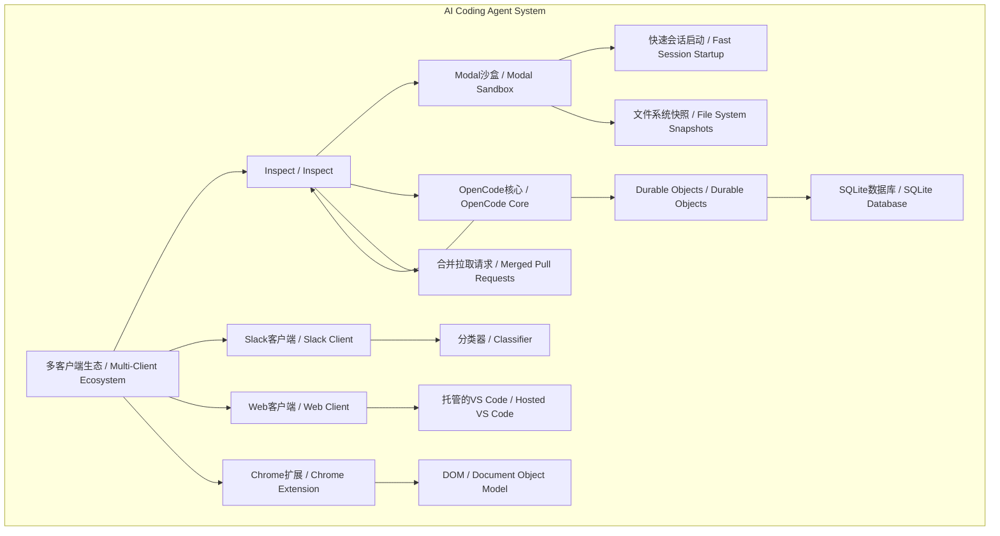
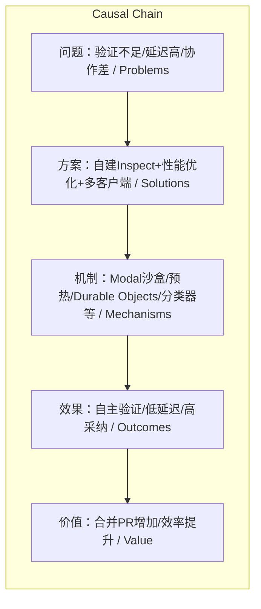

> Ramp通过Inspect代理实现沙盒环境下的代码自主验证，OpenCode优化性能与多用户协作，并构建Slack/Web/Chrome多客户端生态，共同形成高效、可复现的AI编程代理系统。

## 元信息
- 分类：`ai-software/agents-tooling`
- 优先级：`high` (`14`)
- 文档类型：`link-summary`
- 来源分组：`news`
- 原始文件：`reports/news/2026-03-19/1773962525781-news-news-task-1773962197333-v4n8gz.md`
- 请求 ID：`1773962197333-v4n8gz`

## 原始内容

#### 链接总结

- URL: https://builders.ramp.com/post/why-we-built-our-background-agent

### 构建高效协作的AI编程代理系统

#### 整体结构化文档表达
##### 文档卡片
- 主题（AI编程代理系统构建 / AI Coding Agent System Construction）：
- 一句话摘要：Ramp通过Inspect代理实现沙盒环境下的代码自主验证，OpenCode优化性能与多用户协作，并构建Slack/Web/Chrome多客户端生态，共同形成高效、可复现的AI编程代理系统。
- 目标读者：开发者、技术管理者、AI工具决策者
- 核心结论（3条）：
  1. 沙盒环境与完整工具链实现代码自主验证闭环，使代理能像工程师一样证明工作成果。
  2. 预热沙箱、Durable Objects等机制显著降低延迟，支持无限并发，严格优于本地开发。
  3. 多客户端策略（Slack/Web/Chrome）基于组织工作习惯设计，通过降低门槛和追踪合并PR指标提高采纳率。

##### 内容结构树
1. **背景与问题定义**：现有编码代理缺乏完整上下文和工具，无法自主验证代码；开发中存在延迟问题；团队协作需求未满足。
2. **核心观点与关键证据**：自建代理Inspect能闭环验证（30% PR由它编写）；OpenCode通过预热沙箱、独立SQLite等优化性能；多客户端适配不同场景（Slack分类器、Web托管VS Code、Chrome DOM处理）。
3. **方法/机制/路径**：使用Modal沙盒快速构建完整工具链环境；采用OpenCode服务器优先架构；实现沙箱预热池与异步文件同步；采用Cloudflare Durable Objects管理状态；Slack bot集成GPT 5.2分类器；Web客户端提供hosted VS Code和统计；Chrome扩展通过DOM和React内部机制获取元素树。
4. **风险与边界条件**：文件同步可能阻塞编辑；图像构建时间长但用户无感知；代理生成过多会话需管理；分类器需初始调整；MDM策略依赖组织设备管理；扩展更新服务器需维护。
5. **结论与行动建议**：建议团队自建工具以更好适配需求；提供构建规范促进复现；根据组织工作习惯选择并实现多客户端；追踪合并PR数作为关键指标；通过公共空间使用创造病毒循环。

##### 结构化元数据（JSON）
```json
{
  "title": "构建高效协作的AI编程代理系统",
  "topic_zh": "AI编程代理系统构建",
  "topic_en": "AI Coding Agent System Construction",
  "audience": "开发者、技术管理者、AI工具决策者",
  "claims": [
    "沙盒环境与完整工具链实现代码自主验证闭环",
    "预热沙箱、Durable Objects等机制显著降低延迟并支持高并发",
    "多客户端策略基于工作习惯设计，提高采纳率，合并PR为关键指标"
  ],
  "evidence": [
    "Inspect在沙盒VM中运行，包含Vite、Postgres、Temporal等工具",
    "约30%的合并到前端和后端仓库的拉取请求由Inspect编写",
    "会话在Modal上启动快速，基于文件系统快照恢复状态",
    "每个会话有独立SQLite数据库，确保高性能",
    "多用户协作中，每个用户的代码更改attributed to them",
    "Slack bot使用GPT 5.2分类器确定仓库",
    "Web客户端提供托管的VS Code实例和统计页面",
    "Chrome扩展使用DOM和React内部机制获取元素树而非发送图片"
  ],
  "risks": [
    "文件编辑在同步完成前被阻塞可能导致操作延迟",
    "图像构建时间长但用户无感知，需管理沙箱池过期",
    "代理生成过多会话可能需自我约束机制",
    "分类器初始可能需要调整",
    "MDM策略依赖组织设备管理",
    "扩展更新服务器需维护"
  ],
  "actions": [
    "使用Modal沙盒构建执行环境",
    "采用OpenCode作为代理核心",
    "实现沙箱预热和会话池管理",
    "使用Cloudflare Durable Objects构建API",
    "根据团队工作流定制客户端界面（Slack/Web/Chrome）",
    "集成GitHub认证并传递作者信息到每个提示",
    "建立统计页面监控合并PR和实时提示数"
  ]
}
```

#### 处理流程
1. **输入识别**：来源为三个网页正文（Ramp Inspect、OpenCode优化、客户端生态），内容均关于AI编程代理系统的设计与实现。
2. **信息抽取**：抽取实体（Inspect、Modal、OpenCode、Durable Objects）、概念（沙盒VM、预热、多用户协作）、问题（验证不足、延迟高、协作差）、事实（30% PR、独立SQLite）、观点（代理应有自主性、多客户端关键）。
3. **结构化归纳**：定义AI编程代理系统；分类为验证机制、性能优化、客户端策略；比较自建与现成工具、预热与否、单多客户端；因果分析沙盒如何实现快速启动；方法论为通过指标验证和提供规范。
4. **关系建模**：建立概念间依赖、因果等关系，如Inspect依赖Modal沙盒、预热沙箱降低延迟、代码作为真实源防止幻觉、多客户端提高采纳率。
5. **可视化表达**：使用Mermaid绘制概念结构图（展示系统组成）和逻辑因果图（展示问题-方案-效果链）。

#### 概念清单（中英文）
- Inspect / Inspect
- 背景编码代理 / Background Coding Agent
- 沙盒VM / Sandboxed VM
- Modal / Modal
- OpenCode / OpenCode
- Vite / Vite
- Postgres / Postgres
- Temporal / Temporal
- Sentry / Sentry
- Datadog / Datadog
- LaunchDarkly / LaunchDarkly
- Braintrust / Braintrust
- GitHub / GitHub
- Slack / Slack
- Buildkite / Buildkite
- 前沿模型 / Frontier Models
- MCPs / MCPs
- 自定义工具 / Custom Tools
- 技能 / Skills
- 拉取请求 / Pull Request (PR)
- 遥测 / Telemetry
- 功能标志 / Feature Flags
- 截图 / Screenshots
- 实时预览 / Live Previews
- 语音 / Voice
- Chrome扩展 / Chrome Extension
- VS Code编辑器 / VS Code Editor
- 多人会话 / Multiplayer Session
- 会话 / Session
- 首字延迟 / Time-to-First-Token
- 镜像注册表 / Image Registry
- 文件系统快照 / File System Snapshots
- GitHub应用 / GitHub App
- 安装令牌 / Installation Token
- git配置 / Git Config
- 代码作为真实源 / Code as Source of Truth
- 预热沙箱 / Warm Sandbox
- 会话池 / Session Pool
- 文件同步 / File Synchronization
- 构建步骤 / Build Step
- 后续提示 / Follow-up Prompts
- 会话生成 / Session Spawning
- API / API
- Durable Objects / Durable Objects
- SQLite数据库 / SQLite Database
- Agents SDK / Agents SDK
- WebSockets Hibernation API / WebSockets Hibernation API
- 多用户协作 / Multiplayer
- GitHub认证 / GitHub Authentication
- 分类器 / Classifier
- GPT 5.2 / GPT 5.2
- Block Kit / Block Kit
- Web客户端 / Web Client
- 托管的VS Code / Hosted VS Code
- 流式桌面视图 / Streamed Desktop View
- React应用 / React App
- 文档对象模型 / DOM
- React内部机制 / React Internals
- React Grab / React Grab
- 扩展更新服务器 / Extension Update Server
- 移动设备管理 / MDM
- ExtensionInstallForcelist / ExtensionInstallForcelist

#### 概念定义（中英文）
- Inspect / Inspect: 中文：Ramp自建背景编码代理，能自主编写并验证代码；English: A self-built background coding agent by Ramp that autonomously writes and verifies code.
- 背景编码代理 / Background Coding Agent: 中文：在后台运行、能独立完成编码任务的AI代理；English: An AI agent that runs in the background and independently performs coding tasks.
- 沙盒VM / Sandboxed VM: 中文：隔离的虚拟机环境，包含完整开发工具链；English: An isolated virtual machine environment with a full development toolchain.
- Modal / Modal: 中文：云AI基础设施平台，用于快速启动沙盒；English: A cloud platform for AI infrastructure used to spin up sandboxes quickly.
- OpenCode / OpenCode: 中文：开源编码代理，采用服务器优先架构；English: An open-source coding agent with a server-first architecture.
- Vite / Vite: 中文：前端构建工具；English: A frontend build tool.
- Postgres / Postgres: 中文：开源关系数据库；English: An open-source relational database.
- Temporal / Temporal: 中文：工作流编排平台；English: A workflow orchestration platform.
- Sentry / Sentry: 中文：错误监控平台；English: An error monitoring platform.
- Datadog / Datadog: 中文：监控与分析平台；English: A monitoring and analytics platform.
- LaunchDarkly / LaunchDarkly: 中文：功能标志管理服务；English: A feature flag management service.
- Braintrust / Braintrust: 中文：AI评估平台；English: An AI evaluation platform.
- GitHub / GitHub: 中文：代码托管平台；English: A code hosting platform.
- Slack / Slack: 中文：团队协作工具；English: A team collaboration tool.
- Buildkite / Buildkite: 中文：CI/CD平台；English: A CI/CD platform.
- 前沿模型 / Frontier Models: 中文：最先进的大型语言模型；English: State-of-the-art large language models.
- MCPs / MCPs: 中文：模型上下文协议；English: Model Context Protocols.
- 自定义工具 / Custom Tools: 中文：团队特定功能的工具；English: Tools for team-specific functionalities.
- 技能 / Skills: 中文：编码代理的能力模块；English: Capability modules for coding agents.
- 拉取请求 / Pull Request (PR): 中文：代码合并请求；English: A request to merge code changes.
- 遥测 / Telemetry: 中文：系统运行数据收集；English: Collection of system operational data.
- 功能标志 / Feature Flags: 中文：控制功能发布的开关；English: Toggles to control feature releases.
- 截图 / Screenshots: 中文：屏幕图像捕获；English: Captured screen images.
- 实时预览 / Live Previews: 中文：实时查看更改效果；English: Real-time view of changes.
- 语音 / Voice: 中文：语音交互功能；English: Voice interaction capability.
- Chrome扩展 / Chrome Extension: 中文：Chrome浏览器插件；English: A plugin for Chrome browser.
- VS Code编辑器 / VS Code Editor: 中文：Visual Studio Code编辑器；English: Visual Studio Code editor.
- 多人会话 / Multiplayer Session: 中文：多人协作的代理会话；English: Collaborative agent sessions with multiple participants.
- 会话 / Session: 中文：代理的一次独立运行实例；English: A single independent run instance of an agent.
- 首字延迟 / Time-to-First-Token: 中文：模型生成首个输出令牌的时间；English: The time for a model to generate the first output token.
- 镜像注册表 / Image Registry: 中文：存储容器镜像的仓库；English: A repository for storing container images.
- 文件系统快照 / File System Snapshots: 中文：文件系统状态的保存点；English: Saved states of the file system.
- GitHub应用 / GitHub App: 中文：GitHub平台的应用集成；English: An application integration on GitHub platform.
- 安装令牌 / Installation Token: 中文：GitHub应用安装时生成的令牌；English: A token generated during GitHub app installation.
- git配置 / Git Config: 中文：Git版本控制配置；English: Configuration for Git version control.
- 代码作为真实源 / Code as Source of Truth: 中文：将代码库本身作为AI代理理解行为的唯一可靠依据，防止幻觉；English: Using the codebase itself as the sole reliable reference for the AI agent's behavior to prevent hallucinations.
- 预热沙箱 / Warm Sandbox: 中文：在用户输入前提前初始化沙箱，以加速后续操作；English: Pre-initializing a sandbox before user input to accelerate subsequent operations.
- 会话池 / Session Pool: 中文：预先保持一组已就绪的沙箱，用于高流量仓库以快速响应；English: A pre-maintained pool of ready sandboxes for fast response in high-traffic repositories.
- 文件同步 / File Synchronization: 中文：将最新代码变更同步到沙箱的过程，可能延迟；English: The process of syncing latest code changes to the sandbox, which may introduce latency.
- 构建步骤 / Build Step: 中文：在创建仓库镜像时预先执行的环境准备操作，如运行测试以生成缓存；English: Pre-executed environment preparation during repository image creation, such as running tests to generate caches.
- 后续提示 / Follow-up Prompts: 中文：在代理执行当前任务期间发送的新提示；English: New prompts sent during the agent's execution of the current task.
- 会话生成 / Session Spawning: 中文：代理创建新沙箱会话的能力；English: The agent's ability to create new sandbox sessions.
- API / API: 中文：支持多种客户端输入并同步状态的应用程序接口；English: Application Programming Interface that supports input from various clients and synchronizes state.
- Durable Objects / Durable Objects: 中文：Cloudflare提供的服务，为每个会话提供独立SQLite数据库，确保高性能；English: A Cloudflare service providing each session with a dedicated SQLite database for high performance.
- SQLite数据库 / SQLite Database: 中文：每个会话关联的轻量级数据库，用于状态存储；English: A lightweight database associated with each session for state storage.
- Agents SDK / Agents SDK: 中文：Cloudflare的SDK，简化沙箱、API与客户端间的实时流处理；English: Cloudflare's SDK that simplifies real-time streaming between sandboxes, APIs, and clients.
- WebSockets Hibernation API / WebSockets Hibernation API: 中文：允许WebSocket在空闲时休眠以节省计算成本的API；English: An API allowing WebSockets to hibernate when idle to save computational costs.
- 多用户协作 / Multiplayer: 中文：多个用户在同一会话中协同工作，更改归属各自作者；English: Multiple users collaborating in the same session with changes attributed to respective authors.
- GitHub认证 / GitHub Authentication: 中文：使用GitHub身份验证，获取用户令牌以代表用户操作；English: Using GitHub authentication to obtain user tokens for operating on behalf of users.
- 分类器 / Classifier: 中文：使用模型（如GPT 5.2）将用户消息映射到对应仓库的组件；English: A component using models (e.g., GPT 5.2) to map user messages to corresponding repositories.
- GPT 5.2 / GPT 5.2: 中文：用于快速分类的AI模型（具体版本未指定）；English: An AI model (specific version unspecified) used for fast classification.
- Block Kit / Block Kit: 中文：Slack的UI框架，用于设计消息布局；English: Slack's UI framework for designing message layouts.
- Web客户端 / Web Client: 中文：基于浏览器的用户界面，用于访问代理功能；English: A browser-based user interface for accessing agent functionalities.
- 托管的VS Code / Hosted VS Code: 中文：在沙箱内运行的VS Code实例，允许用户直接编辑代码；English: A VS Code instance running inside the sandbox allowing direct code editing.
- 流式桌面视图 / Streamed Desktop View: 中文：实时流式传输桌面画面，用于视觉验证；English: Real-time streaming of desktop view for visual verification.
- React应用 / React App: 中文：使用React框架构建的Web应用；English: A web application built with the React framework.
- 文档对象模型 / DOM: 中文：Web页面的编程接口，表示文档结构；English: Programming interface for web documents representing their structure.
- React内部机制 / React Internals: 中文：React框架的内部状态和组件树信息；English: Internal state and component tree information of the React framework.
- React Grab / React Grab: 中文：开源工具，用于获取React元素树；English: An open-source tool for extracting React element trees.
- 扩展更新服务器 / Extension Update Server: 中文：托管Chrome扩展更新文件的服务器；English: A server hosting update files for Chrome extensions.
- 移动设备管理 / MDM: 中文：管理移动设备和策略的系统；English: A system for managing mobile devices and policies.
- ExtensionInstallForcelist / ExtensionInstallForcelist: 中文：MDM属性，用于强制安装扩展；English: An MDM property for forcing extension installation.

#### 概念关联与逻辑关系（中英文）
1. Inspect / Inspect 依赖 Modal沙盒 / Modal Sandbox 提供执行环境：Inspect ← Modal沙盒
2. 预热沙箱 / Warm Sandbox 导致 用户感知延迟降低 / Reduced User-Perceived Latency：预热沙箱 → 延迟↓
3. 代码作为真实源 / Code as Source of Truth 与 代理理解 / Agent Understanding 共同 防止幻觉 / Prevent Hallucination：代码作为真实源 ∧ 代理理解 → ¬幻觉
4. 多客户端策略 / Multi-Client Strategy 提高 用户采纳率 / User Adoption：多客户端策略 → 采纳率↑
5. Durable Objects / Durable Objects 与 SQLite数据库 / SQLite Database 实现 高性能状态管理 / High-Performance State Management：Durable Objects + SQLite → 高性能

#### COT逻辑梳理（定义/分类/比较/因果/科学方法论）
- **Step 1 (定义问题)**：现有编码代理缺乏完整上下文和工具，无法自主验证代码，导致开发效率低下；同时存在延迟高、协作不足的问题。
- **Step 2 (分类方案)**：解决方案分为自建代理（如Inspect）、性能优化（如预热沙箱、Durable Objects）、客户端策略（Slack/Web/Chrome）三类。
- **Step 3 (比较优势)**：自建代理比现成工具深度集成内部工具链；预热沙箱比冷启动显著降低延迟；多客户端比单客户端更适配不同工作习惯，提高采纳率。
- **Step 4 (因果关系)**：因为采用Modal沙盒和预热机制，所以会话速度仅受模型首字延迟限制，实现快速启动和无限并发；因为将代码作为真实源，所以代理理解准确，减少幻觉；因为多客户端适配不同场景，所以用户采纳率提升，合并PR增加。
- **Step 5 (科学方法论)**：通过内部实验（跟踪PR合并率、实时提示数）验证效果；迭代优化分类器等组件；提供构建规范（如使用Modal、OpenCode）促进可复现性。

#### 事实与看法（病毒）
##### 事实
- Inspect在沙盒VM中运行，包含Vite、Postgres、Temporal等工具。
- 支持Sentry、Datadog、LaunchDarkly、Braintrust、GitHub、Slack、Buildkite集成。
- 约30%的合并到前端和后端仓库的拉取请求由Inspect编写。
- 会话在Modal上启动快速，基于文件系统快照恢复状态。
- 镜像每30分钟构建一次，确保代码库最多延迟30分钟。
- 支持所有前沿模型、MCPs、自定义工具和技能。
- 会话为多人协作，可分享给同事。
- 提供Chrome扩展、Slack集成、Web界面和VS Code编辑器客户端。
- 添加了语音交互功能。
- OpenCode允许代理立即读文件即使同步未完成，但阻塞编辑直到同步完成。
- 每个会话有独立SQLite数据库，避免相互影响。
- 使用Cloudflare Durable Objects和Agents SDK处理实时流。
- 多用户协作中，每个用户的代码更改attributed to them。
- Slack bot使用GPT 5.2分类器，输入包括消息、线程上下文和频道名。
- Web客户端提供托管的VS Code实例、流式桌面视图和截图功能。
- Chrome扩展通过DOM和React内部机制获取元素树，而非发送图片。
- 统计页面追踪合并PR数和实时提示数。
- 使用GitHub token调用GitHub pull request API创建拉取请求。
- 设置GitHub webhook监听分支和拉取请求事件。

##### 看法
- “Agents should have agency.”（代理应具有自主性。）
- “We believe it has critical advantages over other agents.”（相信OpenCode相比其他代理有关键优势。）
- “We think anyone should be able to build this.”（认为任何人都应能构建此类工具。）
- “When background agents are fast, they’re strictly better than local.”（快速背景代理严格优于本地开发。）
- “Owning the tooling lets you build something significantly more powerful than an off-the-shelf tool will ever be.”（拥有工具链能构建比现成工具强大得多的产品。）
- “Having the code as its source of truth is extremely powerful.”（将代码作为真实源是极其强大的。）
- “Warm the sandbox for your session as soon as a user starts to type their prompt.”（当用户开始输入提示时，立即为会话预热沙箱。）
- “Multiplayer is a mission-critical feature, and something we have not seen in any other product yet.”（多用户协作是一个关键任务功能，是我们在任何其他产品中尚未看到的功能。）
- “This is the most important metric to track, as merged pull requests indicate that the agent is producing valuable work.”（合并拉取请求是最重要的追踪指标，因为它表明代理正在产生有价值的工作。）
- “Slack integration is extremely effective because it allows you to quickly triage issues from many sources and introduce a virality loop.”（Slack集成极其有效，因为它允许快速处理多种来源的问题并引入病毒循环。）

#### FAQ（原文问题整理）
- 未发现文中明确提问。文章为叙述性技术说明，未直接设置问题。

#### Visualization
##### Mermaid 图 1（概念结构图）


##### Mermaid 图 2（逻辑/因果图）


#### 文章中的类比
- 未发现明确类比。

#### 10个金句
1. “Inspect writes the code like any other coding agent, but closes the loop on verifying its work by having all the context and tools needed to prove it, as a Ramp engineer would.”（Inspect像其他编码代理一样编写代码，但通过拥有所有上下文和工具来闭环验证工作，如同Ramp工程师所做。）
2. “Agents should have agency.”（代理应具有自主性。）
3. “session speed should only be limited by model-provider time-to-first-token.”（会话速度应仅受模型提供商的首字延迟限制。）
4. “When background agents are fast, they’re strictly better than local: same intelligence, more power, and unlimited concurrency.”（当背景代理快速时，它们严格优于本地：相同智能、更强能力、无限并发。）
5. “~30% of all pull requests merged to our frontend and backend repos are written by Inspect.”（约30%合并到前端和后端仓库的拉取请求由Inspect编写。）
6. “We didn’t force anyone to use Inspect over their own tools. We built to people’s needs, created virality loops through letting it work in public spaces, and let the product do the talking.”（我们未强迫任何人使用Inspect而非自有工具。我们基于需求构建，通过让其在公共空间工作创造病毒循环，让产品自身说话。）
7. “Owning the tooling lets you build something significantly more powerful than an off-the-shelf tool will ever be.”（拥有工具链能构建比现成工具强大得多的产品。）
8. “Having the code as its source of truth is extremely powerful.”（将代码作为真实源是极其强大的。）
9. “Warm the sandbox for your session as soon as a user starts to type their prompt.”（当用户开始输入提示时，立即为会话预热沙箱。）
10. “Multiplayer is a mission-critical feature, and something we have not seen in any other product yet.”（多用户协作是一个关键任务功能，是我们在任何其他产品中尚未看到的功能。）
