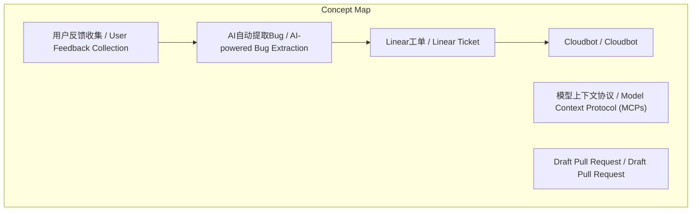
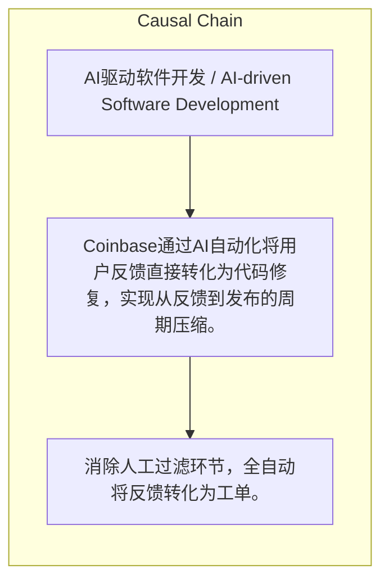

> Coinbase通过AI自动化将用户反馈直接转化为代码修复，实现从反馈到发布的周期压缩。

## 元信息
- 分类：`ai-software/agents-tooling`
- 优先级：`high` (`13`)
- 文档类型：`text-summary`
- 来源分组：`news`
- 原始文件：`reports/news/2026-03-22/1774140553303-news-news-task-1774140499761-ylwm75.md`
- 请求 ID：`1774140499761-ylwm75`

## 原始内容

#### 文本总结

### Coinbase AI驱动开发流程案例

#### 整体结构化文档表达
##### 文档卡片
- 主题（中文/English）：AI驱动软件开发 / AI-driven Software Development
- 一句话摘要：Coinbase通过AI自动化将用户反馈直接转化为代码修复，实现从反馈到发布的周期压缩。
- 目标读者：开发团队、技术管理者
- 核心结论（3条）：
- 消除人工过滤环节，全自动将反馈转化为工单。
- Cloudbot利用MCPs跨系统获取上下文并自主编写代码。
- 即时验证机制允许开发者在修复发布前快速测试。

##### 内容结构树
1. 背景与问题定义
2. 核心观点与关键证据
3. 方法/机制/路径
4. 风险与边界条件
5. 结论与行动建议

##### 结构化元数据（JSON）
```json
{
  "title": "Coinbase AI驱动开发流程案例",
  "topic_zh": "AI驱动软件开发",
  "topic_en": "AI-driven Software Development",
  "audience": "开发团队、技术管理者",
  "claims": [
    "传统流程中产品经理的人工过滤被取消。",
    "AI能直接从语音中提取Bug并建议标题和用户旅程。",
    "Cloudbot能自动定位代码库并生成Draft PR。"
  ],
  "evidence": [
    "使用自建工具录制用户反馈的原始音频和视频。",
    "通过系统提示词让LLM提取Bug信息。",
    "在Linear中自动创建排版清晰的追踪工单。",
    "利用模型上下文协议（MCPs）从Datadog、Sentry等提取数据。",
    "生成带有分支深度链接和测试二维码的Slack通知。"
  ],
  "risks": [],
  "actions": []
}
```

#### 处理流程
1. 输入识别
2. 信息抽取（实体、概念、问题、事实、观点）
3. 结构化归纳（定义/分类/比较/因果/方法论）
4. 关系建模（概念关系、等式/方程/逻辑链）
5. 可视化表达（Mermaid）

#### 概念清单（中英文）
- 用户反馈收集 / User Feedback Collection
- AI自动提取Bug / AI-powered Bug Extraction
- Linear工单 / Linear Ticket
- 模型上下文协议 / Model Context Protocol (MCPs)
- Cloudbot / Cloudbot
- Draft Pull Request / Draft Pull Request
- 即时验证 / Instant Validation

#### 概念定义（中英文）
##### 用户反馈收集 / User Feedback Collection
- 中文定义：通过录制音频视频等方式零阻力收集用户反馈的过程。
- English Definition: The process of collecting user feedback with zero friction, such as through audio/video recordings.

##### AI自动提取Bug / AI-powered Bug Extraction
- 中文定义：使用大语言模型从原始反馈中自动识别和提取Bug信息。
- English Definition: Automatically identifying and extracting bug information from raw feedback using large language models.

##### Linear工单 / Linear Ticket
- 中文定义：在Linear项目管理工具中自动创建的Bug追踪工单，包含标题和用户旅程信息。
- English Definition: An automatically created bug tracking ticket in the Linear project management tool, including title and user journey details.

##### 模型上下文协议 / Model Context Protocol (MCPs)
- 中文定义：用于从Datadog、Sentry等内部数据库自动提取跨系统全局上下文的协议。
- English Definition: A protocol for automatically extracting cross-system global context from internal databases like Datadog and Sentry.

##### Cloudbot / Cloudbot
- 中文定义：Coinbase内部构建的Slack AI代理，负责执行代码修复。
- English Definition: An internal Slack AI agent built by Coinbase responsible for executing code fixes.

##### Draft Pull Request / Draft Pull Request
- 中文定义：自动生成的代码合并请求，处于草稿状态供验证。
- English Definition: An automatically generated code merge request in draft status for validation.

##### 即时验证 / Instant Validation
- 中文定义：通过Slack消息中的二维码快速测试修复版本的过程。
- English Definition: The process of quickly testing a fix version via a QR code in a Slack message.


#### 概念关联与逻辑关系（中英文）
- 用户反馈收集/User Feedback Collection -> AI自动提取Bug/AI-powered Bug Extraction | concept | 触发
- AI自动提取Bug/AI-powered Bug Extraction -> Linear工单/Linear Ticket | concept | 创建
- Linear工单/Linear Ticket -> Cloudbot/Cloudbot | concept | 触发

##### 可形式化关系
- 用户反馈收集 → AI自动提取Bug → Linear工单创建
- Linear工单 → 触发Cloudbot → 自动生成Draft Pull Request
- Draft Pull Request → Slack即时通知 → 开发者扫码验证 → 合并发布

#### COT逻辑梳理（定义/分类/比较/因果/科学方法论）
- Step 1: 收集实时用户反馈（音频/视频），发送给大语言模型提取Bug信息。
- Step 2: AI在Linear自动创建工单，触发Cloudbot；Cloudbot通过MCPs从Datadog、Sentry等获取上下文并生成Draft PR。
- Step 3: Slack发送PR通知和测试二维码，开发者扫码验证后合并代码并发布更改。

#### 事实与看法（区分）
##### 事实
- Coinbase团队在产品测试（Dogfooding）或“反馈咖啡馆”活动中录制原始反馈。
- Cloudbot是Coinbase内部构建的Slack机器人。
- 使用二维码进行独立修复版本的快速测试。

##### 看法
- 零阻力的反馈收集方式优于人工手写文档。
- 取消人工过滤环节能提高效率。

#### FAQ（原文问题整理）
- 未发现明确 FAQ

#### Visualization
##### Mermaid 图 1（概念结构图）


##### Mermaid 图 2（逻辑/因果图）


#### 文章中的类比
- 未发现明确类比

#### 10个金句
- 原文未提供
