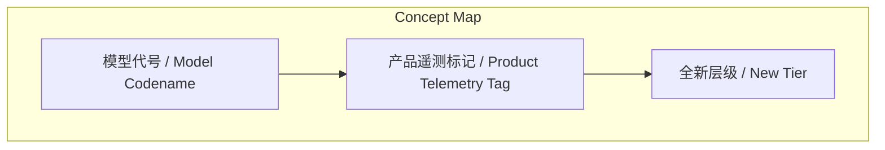
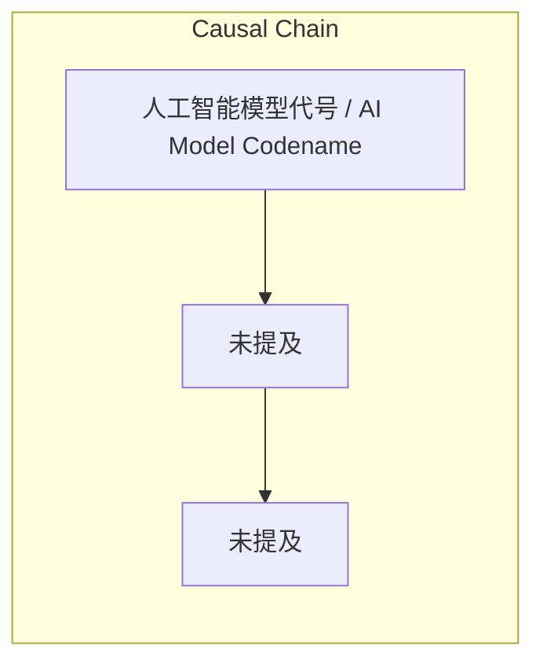

> 通过分析Anthropic Claude Code源码，澄清了Tengu、Fennec等代号的实际指代，并揭示了Capybara作为全新模型层级的定位及其代号泄漏演变时间线。

## 元信息
- 分类：`ai-software/agents-tooling`
- 优先级：`medium` (`12`)
- 文档类型：`text-summary`
- 来源分组：`news`
- 原始文件：`reports/news/2026-04-02/1775088381439-news-news-task-1775088346651-9d24w8.md`
- 请求 ID：`1775088346651-9d24w8`

## 原始内容

#### 文本总结

##### 运行信息
- model: stepfun/step-3.5-flash:free
- schema_fallback: no
- attempted_models: stepfun/step-3.5-flash:free

### 源码澄清Claude模型代号与层级真相

#### 整体结构化文档表达
##### 文档卡片
- 主题（中文/English）：人工智能模型代号 / AI Model Codename
- 一句话摘要：通过分析Anthropic Claude Code源码，澄清了Tengu、Fennec等代号的实际指代，并揭示了Capybara作为全新模型层级的定位及其代号泄漏演变时间线。
- 目标读者：技术分析师、AI研究者
- 核心结论（3条）：
- 源码证据纠正了早期误认：Tengu是Claude Code产品本身的项目代号，而非任何模型；Fennec对应2026年2月发布的Claude Sonnet 5。
- Capybara并非模型版本，而是自2024年Haiku/Sonnet/Opus体系以来新增的、比Opus更强的全新第四层级。
- 模型代号经历了从CMS配置错误泄漏、源码暴露到最终以/buddy虚拟宠物形式公开的演变过程。

##### 内容结构树
1. 背景与问题定义
2. 核心观点与关键证据
3. 方法/机制/路径
4. 风险与边界条件
5. 结论与行动建议

##### 结构化元数据（JSON）
```json
{
  "title": "源码澄清Claude模型代号与层级真相",
  "topic_zh": "人工智能模型代号",
  "topic_en": "AI Model Codename",
  "audience": "技术分析师、AI研究者",
  "claims": [
    "Tengu ≡ Claude Code (产品)",
    "Fennec → Claude Sonnet 5",
    "Capybara > Opus (层级更高)"
  ],
  "evidence": [
    "966个logEvent('tengu_*')调用与880个tengu_*功能开关",
    "迁移文件migrateFennecToOpus.ts将fennec-latest别名映射至Opus产品线",
    "prompts.ts注释提及'Capybara v8'、'capy v8 counterweight'，并描述其为'全新第四层级'"
  ],
  "risks": [
    "未提及"
  ],
  "actions": [
    "未提及"
  ]
}
```

#### 处理流程
1. 输入识别
2. 信息抽取（实体、概念、问题、事实、观点）
3. 结构化归纳（定义/分类/比较/因果/方法论）
4. 关系建模（概念关系、等式/方程/逻辑链）
5. 可视化表达（Mermaid）

#### 概念清单（中英文）
- 模型代号 / Model Codename
- 产品遥测标记 / Product Telemetry Tag
- 全新层级 / New Tier

#### 概念定义（中英文）
##### 模型代号 / Model Codename
- 中文定义：用于内部指代AI模型的非正式名称
- English Definition: Informal name used internally to refer to an AI model

##### 产品遥测标记 / Product Telemetry Tag
- 中文定义：用于记录产品使用数据的功能开关或事件前缀
- English Definition: Feature flag or event prefix used for recording product usage data

##### 全新层级 / New Tier
- 中文定义：在现有模型家族（如Haiku/Sonnet/Opus）之上新增的能力更强的分类
- English Definition: A new, more capable classification added above the existing model family (e.g., Haiku/Sonnet/Opus)


#### 概念关联与逻辑关系（中英文）
- Tengu/Tengu -> Claude Code/Claude Code | concept | ≡ (等价于产品代号)
- Fennec/Fennec -> Claude Sonnet 5/Claude Sonnet 5 | concept | → (映射至模型)
- Capybara/Capybara -> Opus/Opus | concept | > (层级高于)

##### 可形式化关系
- Tengu ≡ Claude Code (产品) [证据: logEvent('tengu_*') ×966, 功能开关 tengu_* ×880]
- Fennec → Claude Sonnet 5 (2026-02发布) [证据: migrateFennecToOpus.ts 迁移文件]
- Capybara > Opus (层级) [证据: prompts.ts 注释 'Capybara v8', 'capy v8 counterweight']

#### COT逻辑梳理（定义/分类/比较/因果/科学方法论）
- Step 1: 基于源码中的遥测标记（tengu_*前缀）与功能开关，判定Tengu为Claude Code产品代号，而非模型代号，纠正早期误传。
- Step 2: 通过迁移文件migrateFennecToOpus.ts及prompts.ts注释，建立Fennec→Claude Sonnet 5、Capybara为全新层级的精确对照关系。
- Step 3: 整合时间线事件（CMS泄漏、源码泄露、/buddy上线），分析代号从隐藏、暴露到公开玩具化的演变逻辑。

#### 事实与看法（区分）
##### 事实
- 源码中有966个使用tengu_*前缀的logEvent调用和880个tengu_*开头的功能开关。
- 存在一个名为migrateFennecToOpus.ts的迁移文件，将fennec-latest别名映射到Opus产品线。
- prompts.ts文件中有'Capybara v8'、'capy v8 counterweight'等注释，并称其为'全新第四层级'。
- 2026年2月发布了Claude Sonnet 5。
- 2024年建立了Haiku/Sonnet/Opus模型体系。
- 3月26日因CMS配置错误泄露了关于'Claude Mythos'模型的博客草稿。
- 3月31日npm source map泄露了整个Claude Code代码库。
- 4月1日/buddy功能上线，用户可领养虚拟水豚宠物。
- prompts.ts第402行有注释：'Remove this section when we launch numbat'。

##### 看法
- 未提及

#### FAQ（原文问题整理）
##### Tengu到底是什么？
- 根据源码证据，Tengu是Claude Code产品本身的项目代号，通过大量tengu_*前缀的遥测标记和功能开关体现，并非任何AI模型的名称。

##### Capybara是模型版本吗？
- 不是。源码注释表明Capybara是自2024年Haiku/Sonnet/Opus体系以来新增的'全新第四层级'，比Opus更大、更强、更贵，是一个层级概念而非版本迭代。

##### 代号泄漏事件的时间顺序是什么？
- 1) 3月26日：CMS泄漏'Claude Mythos'博客草稿；2) 3月31日：npm source map泄露Claude Code代码库；3) 4月1日：/buddy上线，将隐藏的'Capybara'代号以虚拟宠物形式公开。

#### Visualization
##### Mermaid 图 1（概念结构图）


##### Mermaid 图 2（逻辑/因果图）


#### 文章中的类比
- 未提及

#### 10个金句
- 未提及
