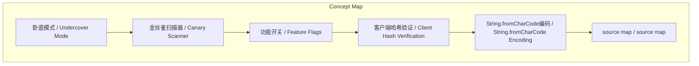
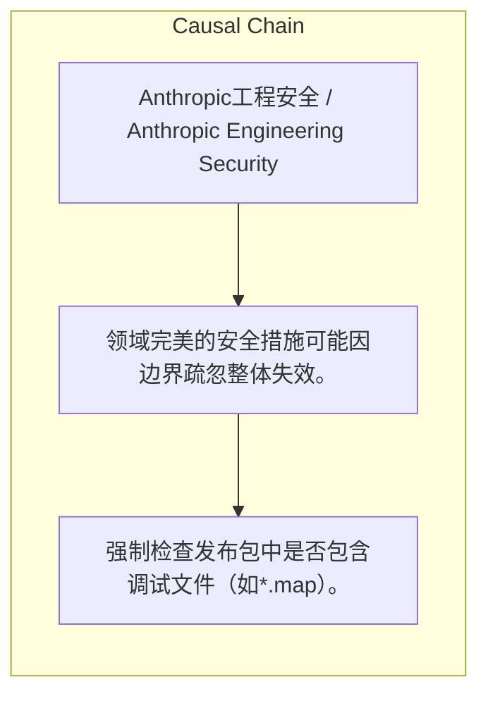

> Anthropic的七套领域内完美的安全系统因未保护发布文件边界，导致一个*.map文件缺失造成整体失效。

## 元信息
- 分类：`ai-software/agents-tooling`
- 优先级：`high` (`13`)
- 文档类型：`text-summary`
- 来源分组：`news`
- 原始文件：`reports/news/2026-04-02/1775090335997-news-news-task-1775090301233-wrx2yd.md`
- 请求 ID：`1775090301233-wrx2yd`

## 原始内容

#### 文本总结

##### 运行信息
- model: stepfun/step-3.5-flash:free
- schema_fallback: no
- attempted_models: stepfun/step-3.5-flash:free

### Anthropic安全系统因*.map文件缺失失效

#### 整体结构化文档表达
##### 文档卡片
- 主题（中文/English）：Anthropic工程安全 / Anthropic Engineering Security
- 一句话摘要：Anthropic的七套领域内完美的安全系统因未保护发布文件边界，导致一个*.map文件缺失造成整体失效。
- 目标读者：技术决策者、安全工程师
- 核心结论（3条）：
- 七套安全系统在各自领域（如git提交、编译产物、运行时）内设计精巧但未守护系统间边界，导致整体防御被单一文件缺失攻破。
- 直接失效原因为Bun默认生成source map且未在.npmignore中忽略，使内部物种名等敏感信息随发布文件暴露。
- 暴露了工程流程中忽视跨系统假设与边界检查的深层问题，类似马奇诺防线与NASA火星探测器案例。

##### 内容结构树
1. 背景与问题定义
2. 核心观点与关键证据
3. 方法/机制/路径
4. 风险与边界条件
5. 结论与行动建议

##### 结构化元数据（JSON）
```json
{
  "title": "Anthropic安全系统因*.map文件缺失失效",
  "topic_zh": "Anthropic工程安全",
  "topic_en": "Anthropic Engineering Security",
  "audience": "技术决策者、安全工程师",
  "claims": [
    "Undercover Mode通过检查git远程地址与14个内部仓库白名单匹配，在公开仓库自动清除提交信息中的模型代号与内部引用。",
    "金丝雀扫描器检测编译二进制文件中的禁止字符串（如'capybara'），发现则构建失败，促使使用十六进制编码规避。",
    "客户端哈希验证系统（cch头）由Bun的HTTP栈覆盖计算哈希，服务器验证以确认请求来自官方客户端。",
    "String.fromCharCode编码将全部18个物种名转为十六进制，使编译扫描器无法通过模式识别触发。",
    "失效直接诱因是Bun在生产模式默认输出source map，且.npmignore未排除*.map文件。"
  ],
  "evidence": [
    "源码中Undercover Mode、金丝雀扫描器、客户端哈希、String.fromCharCode编码等七套系统实现细节。",
    "Bun默认生成source map的行为及3月11日报告的bug。",
    ".npmignore文件中未包含*.map规则。",
    "马奇诺防线与NASA火星探测器案例作为类比证据。"
  ],
  "risks": [
    "领域完美的安全措施可能因边界疏忽整体失效。",
    "工具链默认行为（如source map生成）可能绕过精心设计的防护。",
    "跨团队假设不一致（如NASA案例）会导致系统集成失败。"
  ],
  "actions": [
    "强制检查发布包中是否包含调试文件（如*.map）。",
    "建立跨系统边界的安全审查流程，验证领域间假设一致性。",
    "工具链配置需显式禁用非必要输出（如生产模式source map）。"
  ]
}
```

#### 处理流程
1. 输入识别
2. 信息抽取（实体、概念、问题、事实、观点）
3. 结构化归纳（定义/分类/比较/因果/方法论）
4. 关系建模（概念关系、等式/方程/逻辑链）
5. 可视化表达（Mermaid）

#### 概念清单（中英文）
- 卧底模式 / Undercover Mode
- 金丝雀扫描器 / Canary Scanner
- 功能开关 / Feature Flags
- 客户端哈希验证 / Client Hash Verification
- String.fromCharCode编码 / String.fromCharCode Encoding
- source map / source map

#### 概念定义（中英文）
##### 卧底模式 / Undercover Mode
- 中文定义：基于git远程地址白名单自动切换内部/公开仓库行为，清除敏感信息。
- English Definition: Automatically switches behavior based on git remote whitelist to scrub sensitive data in public repos.

##### 金丝雀扫描器 / Canary Scanner
- 中文定义：扫描编译二进制文件中的禁止字符串，触发则构建失败。
- English Definition: Scans compiled binaries for forbidden strings; build fails if detected.

##### 功能开关 / Feature Flags
- 中文定义：通过GrowthBook等工具服务端控制运行时行为，支持A/B实验。
- English Definition: Server-side runtime behavior control via tools like GrowthBook, with disk caching and experiment logging.

##### 客户端哈希验证 / Client Hash Verification
- 中文定义：HTTP头cch由客户端Bun栈覆盖为哈希，服务器验证请求来源。
- English Definition: HTTP header cch overwritten by client Bun stack with hash; server verifies authentic client.

##### String.fromCharCode编码 / String.fromCharCode Encoding
- 中文定义：将物种名统一十六进制编码，避免编译扫描器通过明文检测。
- English Definition: Hex-encodes species names uniformly to evade binary string scanners.

##### source map / source map
- 中文定义：调试映射文件，Bun默认生产模式生成，未忽略导致敏感信息泄露。
- English Definition: Debug mapping file; Bun's default production generation caused leak when not ignored.


#### 概念关联与逻辑关系（中英文）
- 卧底模式/Undercover Mode -> git提交/git commit | concept | 防护
- 金丝雀扫描器/Canary Scanner -> 编译二进制文件/compiled binary | concept | 防护
- 客户端哈希验证/Client Hash Verification -> API请求/API request | concept | 防护
- source map/source map -> 发布文件/release files | concept | 未防护边界
- 功能开关/Feature Flags -> 运行时行为/runtime behavior | concept | 防护
- 马奇诺防线/Maginot Line -> Anthropic安全系统/Anthropic security systems | concept | 类比

##### 可形式化关系
- Undercover Mode激活条件: git_remote ∉ internal_whitelist(14 repos) → 自动清除提交信息中的敏感字段。
- 金丝雀扫描器触发条件: ∃ forbidden_string ∈ binary_content → build_status = failed。
- 客户端哈希验证: request.cch_initial = '00000' → Bun_HTTP_Stack.replace(cch, compute_hash(request)) → server.verify(cch) == valid ? accept : reject。

#### COT逻辑梳理（定义/分类/比较/因果/科学方法论）
- Step 1: Anthropic部署七套独立安全系统，每套针对特定泄露路径（如git提交、编译产物、运行时、API请求）进行领域内完美防护，但各系统间无协同。
- Step 2: 失效直接触发点：Bun工具链在生产模式默认生成source map，且.npmignore未排除*.map文件，导致包含内部物种名编码的source map随npm包公开。
- Step 3: 根本原因：所有系统仅守护自身领域边界（如金丝雀扫描器只查二进制文件，不查并列的source map），未考虑发布包整体边界，且工程流程未强制检查跨系统假设（如文件发布清单）。

#### 事实与看法（区分）
##### 事实
- Anthropic有14个内部仓库白名单。
- 金丝雀扫描器因禁止字符串'capybara'触发，促使使用十六进制编码。
- Bun的HTTP栈基于Zig实现，用于覆盖cch头。
- source map文件在3月11日被报告为Bun bug，生产模式仍生成。
- 暴露的tarball大小为59.8 MB。

##### 看法
- 这些安全措施是'持续的、创造性的、对抗性的信息泄漏思维'体现。
- 七套系统'重蹈了马奇诺防线的命运'，因边界疏忽而失效。
- 失效源于'一行点文件里的内容没有人写上去'，强调流程执行比技术设计更重要。

#### FAQ（原文问题整理）
##### 七套系统具体指哪些？
- Undercover Mode、金丝雀扫描器、编译时死代码消除、GrowthBook功能开关、代号遮蔽、反蒸馏防御、String.fromCharCode编码。

##### 为何source map导致失效？
- 金丝雀扫描器只检查编译二进制文件，不检查并列发布的source map；source map包含十六进制编码的物种名，暴露了防护逻辑。

##### 如何防止类似问题？
- 显式配置工具链禁用非必要输出（如生产模式source map），并在发布流程中强制检查所有并列文件。

#### Visualization
##### Mermaid 图 1（概念结构图）


##### Mermaid 图 2（逻辑/因果图）


#### 文章中的类比
- 马奇诺防线：各系统工事坚固但未守护阿登森林式边界，被绕过。
- NASA火星探测器：因团队单位制假设不一致（英磅力vs牛顿）且问题未按流程记录导致损失。

#### 10个金句
- 七套系统。每一套都真正精巧。
- 这些不是走过场的安全措施。它们代表着持续的、创造性的、对抗性的信息泄漏思维。
- 一行。六个字符加一个文件扩展名。*.map
