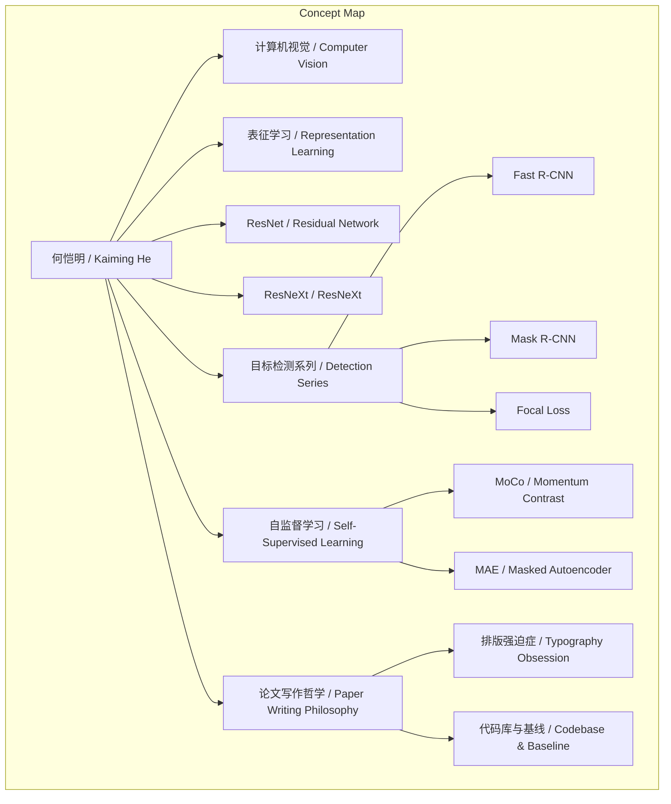
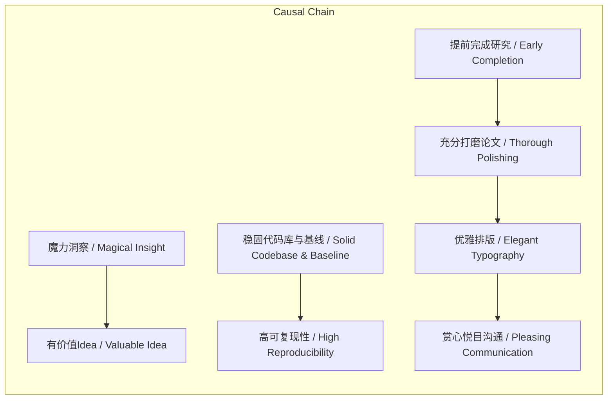

> 访谈通过谢赛宁视角，展现何恺明在计算机视觉领域的里程碑工作及其对论文写作极致审美的追求。

## 元信息
- 分类：`ai-software/agents-tooling`
- 优先级：`high` (`13`)
- 文档类型：`text-summary`
- 来源分组：`news`
- 原始文件：`reports/news/2026-03-21/1774104018115-news-news-task-1774103929358-j9mw3i.md`
- 请求 ID：`1774103929358-j9mw3i`

## 原始内容

#### 文本总结

### 何恺明：AI里程碑塑造者与论文美学大师

#### 整体结构化文档表达
##### 文档卡片
- 主题（中文/English）：何恺明的学术贡献与论文写作哲学 / Kaiming He's Academic Contributions and Paper Writing Philosophy
- 一句话摘要：访谈通过谢赛宁视角，展现何恺明在计算机视觉领域的里程碑工作及其对论文写作极致审美的追求。
- 目标读者：AI研究者、学生、科技爱好者
- 核心结论（3条）：
  1. 何恺明的工作多次定义计算机视觉领域方向，如ResNet、MoCo、MAE。
  2. 他注重底层代码库和基线建设，显著提升研究可复现性和基准水平。
  3. 论文写作追求排版完美和提前完成，以提供“赏心悦目的沟通界面”。

##### 内容结构树
1. 背景与问题定义：何恺明作为影响AI发展的顶尖研究员，其贡献和写作哲学值得深入分析。
2. 核心观点与关键证据：包括视觉架构（ResNet/ResNeXt）、目标检测（Fast R-CNN等）、自监督学习（MoCo/MAE）的里程碑工作，以及写作哲学的具体表现。
3. 方法/机制/路径：研究上注重基础建设、扩展性验证和简单有效方法；写作上提前完成、精细打磨、严格排版。
4. 风险与边界条件：未提及。
5. 结论与行动建议：研究者应学习其严谨态度，注重基础代码库、提前规划、追求排版优雅。

##### 结构化元数据（JSON）
```json
{
  "title": "何恺明：AI里程碑塑造者与论文美学大师",
  "topic_zh": "何恺明的学术贡献与论文写作哲学",
  "topic_en": "Kaiming He's Academic Contributions and Paper Writing Philosophy",
  "audience": "AI研究者、学生、科技爱好者",
  "claims": [
    "何恺明的工作多次定义计算机视觉领域方向",
    "他注重底层代码库和基线建设，提升研究可复现性",
    "论文写作追求排版完美和提前完成，以提供赏心悦目的沟通界面"
  ],
  "evidence": [
    "ResNet被列为改变AI历史进程的20多篇伟大论文之一",
    "ResNeXt在ImageNet上展示宽度扩展性，命名巧妙融入合作者名字",
    "在目标检测工作中搭建稳固代码库和基线，使基础水平远超普通论文",
    "MoCo是第一个将对比学习框架真正做Work的论文",
    "MAE几乎是何恺明单枪匹马完成底层搭建、实验和撰写",
    "提前一到两个月完成研究，用一个月打磨论文",
    "规定论文中不能出现占比小于60%的空白孤词"
  ],
  "risks": ["未提及"],
  "actions": [
    "研究者应注重基础代码库和基线建设",
    "提前规划研究进度，留出时间打磨论文",
    "追求论文排版的优雅和统一"
  ]
}
```

#### 处理流程
1. 输入识别（来源：用户输入文本）
2. 信息抽取（实体、概念、问题、事实、观点）
3. 结构化归纳（定义/分类/比较/因果/方法论）
4. 关系建模（概念关系、等式/方程/逻辑链）
5. 可视化表达（Mermaid）

#### 概念清单（中英文）
- 何恺明 / Kaiming He
- 计算机视觉 / Computer Vision
- 表征学习 / Representation Learning
- ResNet / Residual Network
- ResNeXt / ResNeXt
- Fast R-CNN / Fast R-CNN
- Mask R-CNN / Mask R-CNN
- Focal Loss / Focal Loss
- MoCo / Momentum Contrast
- MAE / Masked Autoencoder
- 自监督学习 / Self-Supervised Learning
- 对比学习 / Contrastive Learning
- 去噪自编码器 / Denoising Autoencoder
- 代码库 / Codebase
- 基线 / Baseline
- 论文写作 / Paper Writing
- 排版强迫症 / Typography Obsession
- 空白孤词 / Trailing word
- 混合专家模型 / Mixture of Experts (MoE)

#### 概念定义（中英文）
- 何恺明：深刻影响AI发展进程的顶尖研究员，在计算机视觉和表征学习领域发表多篇里程碑论文。
- ResNet：被评价为改变AI历史进程的深度残差网络论文，解决深度网络训练问题。
- ResNeXt：在庞大网络中平行分布小网络，展示模型宽度扩展性的架构，命名融入合作者名字。
- MoCo：何恺明主导的第一个将对比学习框架真正做Work（有效）的论文。
- MAE：使用遮挡图片并重建的方式学习表征的自编码器方法，由何恺明几乎单枪匹马完成底层工作。
- 代码库：研究中搭建的稳固底层实现，用于支撑实验和基线比较。
- 基线：研究中的基础性能基准，用于评估算法改进。
- 排版强迫症：对论文排版细节的极致要求，如避免空白孤词。
- 混合专家模型：一种模型结构，通过并行分布多个小网络处理任务，ResNeXt类似此思路。

#### 概念关联与逻辑关系（中英文）
1. ResNet（残差网络）与ResNeXt都致力于解决深度网络的扩展性问题：ResNet关注深度，ResNeXt关注宽度。
   - 形式化：ResNet → 深度可行性；ResNeXt → 宽度扩展性
2. MoCo（动量对比学习）与MAE（带遮挡的自编码器）都是自监督学习方法，但采用不同机制：对比学习 vs 重建目标。
   - 形式化：MoCo 使用对比损失；MAE 使用重建损失；两者目标均为学习通用表征
3. 代码库建设与论文写作质量共同影响工作的传播和影响力：稳固基线提升可信度，优雅排版改善阅读体验。
   - 形式化：代码库质量 ↑ ∧ 论文排版质量 ↑ → 工作影响力 ↑

#### COT逻辑梳理（定义/分类/比较/因果/科学方法论）
- Step 1（定义）：何恺明的工作范畴是计算机视觉与表征学习，核心贡献包括架构设计、检测算法和自监督学习。
- Step 2（分类）：其贡献可分为三类：视觉骨干网络（ResNet/ResNeXt）、目标检测基石（Fast R-CNN等）、自监督学习突破（MoCo/MAE）。
- Step 3（比较）：比较不同方法——ResNet（残差连接）解决深度退化，ResNeXt（并行小网络）展示宽度扩展；MoCo（对比学习）与MAE（重建学习）是自监督的两种路径，后者更简单。
- Step 4（因果）：何恺明工作成功的原因：a) 洞察力将普通思路变有价值（如ResNeXt命名）；b) 投入精力搭建稳固代码库和基线，使基础水平高；c) 论文写作极致审美提升沟通效果。
- Step 5（科学方法论）：他采用“提前完成研究→留足时间打磨论文→严格排版控制”的方法论，确保工作高质量完成和传播。

#### 事实与看法（病毒）
##### 事实
- 谢赛宁将ResNet列为改变AI历史进程的20多篇伟大论文之一。
- ResNeXt是谢赛宁与何恺明在FAIR实习期间共同完成，命名融入“Xie”。
- ResNeXt在ImageNet挑战赛上展示模型宽度扩展性。
- 何恺明在目标检测工作中搭建了极其稳固的底层代码库和基线。
- MoCo是何恺明主导的第一个将对比学习框架真正做Work的论文。
- MAE几乎是何恺明单枪匹马承担底层基线搭建、实验运行和论文撰写。
- 何恺明通常提前一到两个月完成研究，用整整一个月打磨论文。
- 他规定论文中不能出现某一行文字占比小于60%的空白孤词。

##### 看法
- 何恺明有“极具魔力的洞察”。
- ResNeXt将“一个普通的思路变成了一个极具价值的Idea”。
- 何恺明写文章有“排版强迫症”。
- 他认为写文章是为了给读者提供一个“赏心悦目的沟通界面”。

#### FAQ（原文问题整理）
- 未发现明确提问。

#### Visualization
##### Mermaid 图 1（概念结构图）


##### Mermaid 图 2（逻辑/因果图）


#### 文章中的类比
- ResNeXt的平行小网络结构类似于现在的MoE混合专家模型。

#### 10个金句
1. “改变AI历史进程的20多篇伟大论文之一”
2. “极具魔力的洞察”
3. “将一个普通的思路变成了一个极具价值的Idea”
4. “在ImageNet挑战赛上展示了模型宽度的扩展性”
5. “恺明巧妙地将谢赛宁的名字（Xie）融入其中”
6. “投入大量精力搭建了极其稳固的底层代码库和基线”
7. “第一个将对比学习框架真正做Work的论文”
8. “几乎是‘单枪匹马’承担了绝大部分的底层基线搭建、实验运行和论文撰写工作”
9. “拒绝赶工，提前一个月写完”
10. “规定论文中绝对不能出现某一行文字占比小于60%的空白孤词”
