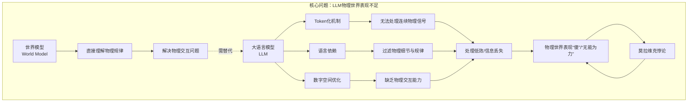
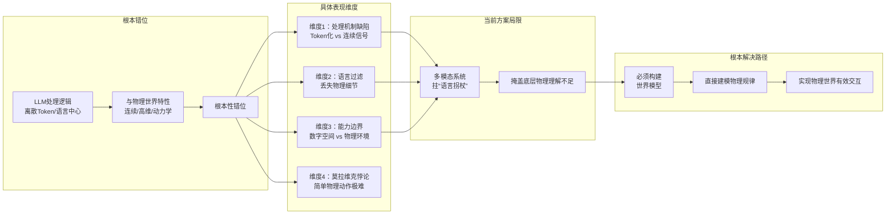

> 学者指出大语言模型因处理机制与物理世界特性根本错位，在物理交互中表现不足，需构建世界模型。

## 元信息
- 分类：`ai-software/agents-tooling`
- 优先级：`high` (`13`)
- 文档类型：`text-summary`
- 来源分组：`news`
- 原始文件：`reports/news/2026-03-21/1774078162797-news-news-task-1774078095210-x7tzu8.md`
- 请求 ID：`1774078095210-x7tzu8`

## 原始内容

#### 文本总结

### 大语言模型物理认知局限解析

#### 整体结构化文档表达
##### 文档卡片
- 主题（中文/English）：大语言模型物理世界理解 / LLM Physical World Understanding
- 一句话摘要：学者指出大语言模型因处理机制与物理世界特性根本错位，在物理交互中表现不足，需构建世界模型。
- 目标读者：人工智能研究者、技术开发者、科技政策制定者
- 核心结论（3条）：
  1. LLM的Token化机制不适用于连续、高维、有噪音的物理信号处理。
  2. 语言作为交流工具天然过滤物理细节，导致AI丧失对真实物理规律的洞察。
  3. 脱离数字空间后，LLM因缺乏物理交互能力与“世界模型”，在物理环境中必然“无能为力”。

##### 内容结构树
1. 背景与问题定义：LLM在物理世界表现“傻”或“无能为力”，根源在于信息处理维度和运作逻辑与物理世界存在根本错位。
2. 核心观点与关键证据：从四个维度论证错位——处理连续信号低效、语言过滤物理规律、缺乏物理交互、陷入莫拉维克悖论。
3. 方法/机制/路径：当前多模态系统依赖LLM作为“语言拐杖”，表面聪明但底层物理理解不足；根本解决需打造“世界模型”。
4. 风险与边界条件：若不构建真正理解物理规律的世界模型，LLM在物理世界中将永远无法有效运行。
5. 结论与行动建议：必须开发不依赖语言Token化、能直接建模物理规律的世界模型。

##### 结构化元数据（JSON）
```json
{
  "title": "大语言模型物理认知局限解析",
  "topic_zh": "大语言模型物理世界理解",
  "topic_en": "LLM Physical World Understanding",
  "audience": "人工智能研究者、技术开发者、科技政策制定者",
  "claims": [
    "LLM的Token化机制不适用于连续物理信号处理",
    "语言过滤导致AI失去物理规律洞察",
    "缺乏世界模型使LLM在物理交互中无能为力"
  ],
  "evidence": [
    "物理信号连续高维有噪音，强行Token化成冗余一维序列不合理",
    "语言只关注事件结果状态，忽略动力学规律与变化轨迹",
    "LLM在数字空间（如维基百科、法律、代码）聪明，但无法处理真实物理感官数据",
    "莫拉维克悖论：对人简单的物理感知/动作对机器极难"
  ],
  "risks": [
    "多模态系统仅依赖LLM的语义推理，掩盖底层物理理解不足",
    "不打造世界模型，LLM永远无法在物理世界（医院、工厂、家庭）有效运行"
  ],
  "actions": [
    "研发不依赖语言Token化的新型架构",
    "构建能直接理解物理动力学规律的世界模型"
  ]
}
```

#### 处理流程
1. 输入识别：识别出用户提供的文本，核心为谢赛宁等学者对LLM物理世界表现的分析。
2. 信息抽取：抽取实体（LLM、物理世界、Token化、语言、莫拉维克悖论、世界模型、多模态系统）、概念、问题（为何LLM在物理世界“傻”）、事实（四个维度具体描述）、观点（“不合理”、“无能为力”等评价）。
3. 结构化归纳：将四个维度归类为“处理机制缺陷”、“语言特性局限”、“交互能力缺失”、“理论悖论困境”；归纳出“根本错位”这一核心问题。
4. 关系建模：建立“LLM处理机制”与“物理信号特性”之间的不匹配关系；“语言过滤”与“物理规律丢失”之间的因果关系；“缺乏世界模型”与“物理交互失败”之间的必要条件关系。
5. 可视化表达：使用Mermaid绘制概念结构图与因果链图。

#### 概念清单（中英文）
- 大语言模型（LLM）/ Large Language Model
- 物理世界 / Physical World
- Token化 / Tokenization
- 连续物理信号 / Continuous Physical Signals
- 语言（交流工具）/ Language (Communication Tool)
- 莫拉维克悖论 / Moravec's Paradox
- 多模态系统 / Multimodal Systems
- 世界模型 / World Model
- 数字空间 / Digital Space
- 物理环境 / Physical Environment
- 动力学规律 / Dynamical Laws
- Transformer / Transformer
- 空间状态信息 / Spatial State Information

#### 概念定义（中英文）
- 大语言模型（LLM）：基于Transformer架构，通过大规模文本数据训练，擅长处理离散Token序列并进行语义推理的人工智能模型。
- 物理世界：真实的、连续的、高维度的、充满噪音的客观环境，其信号（如视觉、力觉）蕴含整体的空间状态与动力学规律。
- Token化：将连续或非离散数据（如文本、图像帧）强制转换为离散的、一维的Token序列的过程，是LLM处理非文本输入的标准方式。
- 连续物理信号：来自物理世界的原始感官数据（如视频流、传感器读数），在时间与空间上连续变化，非天然离散。
- 语言（交流工具）：人类为高效沟通而发明的符号系统，其表达会天然舍弃物理细节，聚焦于事件的结果与状态。
- 莫拉维克悖论：人工智能领域现象，即对人类而言简单的感知与物理动作（如识别物体、行走）对机器而言极其困难，而复杂的逻辑推理（如棋类、考试）反而相对容易。
- 多模态系统：能处理多种类型输入（如文本、图像、声音）的AI系统，当前常以LLM为核心进行语义对齐与推理。
- 世界模型：能够直接理解、预测并模拟物理世界运作规律（包括动力学、因果性）的内部表示或计算模型，不依赖于语言描述。
- 数字空间：由离散符号与数据构成的虚拟环境（如数据库、代码库、文本 corpora），LLM在此类环境中表现优异。
- 物理环境：机器人或智能体需要交互的真实世界场景（如医院、工厂、家庭），包含连续感官输入与物理约束。
- 动力学规律：描述物理对象运动与变化的基本法则（如牛顿定律），蕴含在连续信号中，常被语言描述所忽略。
- Transformer：一种基于自注意力机制的神经网络架构，平等对待序列中每个Token，是LLM的核心。
- 空间状态信息：物理场景在某一时刻的整体几何、拓扑与关系信息，存在于连续信号中，序列化后易丢失。

#### 概念关联与逻辑关系（中英文）
1. **LLM处理机制（LLM Processing Mechanism）** 与 **物理信号连续性（Physical Signal Continuity）** 不匹配，导致 **处理低效（Inefficient Processing）**。
   - 形式化：`Tokenization(LLM) ⊕ Continuous(Signal) → Inefficiency`
2. **语言作为交流工具（Language as Communication Tool）** 过滤 **物理细节（Physical Details）**，造成 **物理规律洞察缺失（Loss of Physical Law Insight）**。
   - 形式化：`Filtering(Language) ∧ Details(Physical) → Missing(Insight)`
3. **缺乏世界模型（Lack of World Model）** 与 **物理交互需求（Need for Physical Interaction）** 共同导致 **LLM在物理世界失败（LLM Failure in Physical World）**。
   - 形式化：`¬WorldModel ∧ Need(Interaction) → Failure(LLM)`

#### COT逻辑梳理（定义/分类/比较/因果/科学方法论）
- **Step 1 定义问题**：LLM在物理世界表现“傻”或“无能为力”，其核心是信息处理逻辑与物理世界特性存在根本错位。
- **Step 2 分类归因**：将错位具体分为四类——①处理机制（Token化 vs 连续信号）；②语言媒介（交流工具 vs 物理细节）；③能力范畴（数字空间 vs 物理环境）；④理论悖论（莫拉维克悖论）。
- **Step 3 比较分析**：对比LLM在数字空间（擅长语义推理、事实记忆）与物理环境（需要连续感知、动力学理解）的能力差异，凸显其边界。
- **Step 4 因果推导**：根本原因链为：LLM依赖离散Token序列处理 → 无法有效编码连续物理信号的空间状态信息 → 同时语言描述本身已过滤动力学规律 → 导致系统无法建立物理世界的因果模型 → 最终在需要物理交互时失败。
- **Step 5 科学方法论**：解决路径需范式转变——从“语言中心”的Token预测，转向“物理中心”的世界模型构建，即开发能直接接收连续信号、学习并模拟物理规律的新一代AI架构。

#### 事实与看法（病毒）
##### 事实
- 谢赛宁和杨立昆等学者认为LLM在物理世界表现不足。
- 物理世界信号是连续的、高维度的且充满噪音的。
- 语言是人类发明的交流工具，为高效沟通会舍弃物理细节。
- LLM擅长在数字空间（如维基百科、法律、代码）执行任务。
- 莫拉维克悖论指出：对人简单的物理感知/动作对机器极难。
- 当前多模态系统常以LLM为核心进行语义对齐。
- Transformer机制平等对待每个Token。
##### 看法
- LLM面对物理世界时会显得很“傻”或“无能为力”。
- 用处理文本的方式处理连续物理信号“极其低效”。
- 把物理画面强行序列化成冗余Token“完全不make sense”（不合理）。
- 过度依赖语言会使AI“失去对物理世界真实规律的洞察”。
- 多模态系统是“拄着LLM这根‘语言的拐杖’在走路”。
- 如果不打造世界模型，LLM在物理世界“永远都跑不起来”。

#### FAQ（原文问题整理）
- **Q：为什么大语言模型（LLM）在真实的物理世界中会显得“傻”或无能为力？**
  - A：核心原因在于LLM的信息处理维度和运作逻辑（如Token化、语言依赖）与真实物理世界的连续性、高维度、动力学规律存在根本性错位，具体体现在四个维度。
- **Q：LLM处理物理信号的主要缺陷是什么？**
  - A：将连续、高维、有噪音的物理信号（如视频流）强行Token化为冗长离散序列，完全不合理，且Transformer平等对待Token的机制无法高效解决连续空间认知问题。
- **Q：语言作为交流工具如何影响AI对物理世界的理解？**
  - A：语言天然过滤掉物理细节（如动力学规律、变化轨迹），只保留结果状态，导致过度依赖语言的AI系统失去对真实物理规律的洞察。
- **Q：LLM在哪些场景下表现好，哪些场景下表现差？**
  - A：在数字虚拟空间（吸收知识、法律咨询、写代码）表现聪明；在需要与真实物理环境（医院、工厂、家庭）交互时无能为力，因物理感官数据难Token化。
- **Q：莫拉维克悖论如何解释LLM的困境？**
  - A：该悖论表明，对人简单的物理感知/动作（如扫地）对机器难如登天，而LLM擅长的逻辑推理对人反而难。纯语言系统缺乏物理理解，必在物理世界表现不佳。
- **Q：当前多模态系统的根本问题是什么？如何解决？**
  - A：问题在于它们依赖LLM的语义推理（“语言拐杖”），掩盖了底层物理理解不足。解决之道是打造不依赖语言、真正理解物理规律的“世界模型”。

#### Visualization
##### Mermaid 图 1（概念结构图）

##### Mermaid 图 2（逻辑/因果图）


#### 文章中的类比
- 未发现明确类比

#### 10个金句
1. 大语言模型（LLM）在面对真实的物理世界时会显得很“傻”或无能为力。
2. 用处理文本的方式处理连续物理信号极其低效（强行Token化不合理）。
3. 物理世界的画面背后蕴含着整体的空间状态信息，把它强行序列化成冗余的Token是完全不合理的（完全不make sense）。
4. 语言作为“交流工具”，天然过滤掉了物理动力学规律。
5. 当描述“杯子掉在地上碎了”时，语言只关心这个事件的“结果和状态”，却完全忽略了杯子坠落过程中的动力学规律、物理变化轨迹等丰富的真实世界密码。
6. 过度依赖语言会使得AI系统失去对物理世界真实规律的洞察。
7. LLM只在虚拟数字空间中显得聪明，缺乏物理交互能力。
8. 真实的物理感官数据很难被简单地Token化。
9. 当前的许多多模态系统其实是拄着LLM这根“语言的拐杖”在走路。
10. 如果不打造真正理解真实物理规律的“世界模型”，大语言模型在物理世界中永远都跑不起来。
