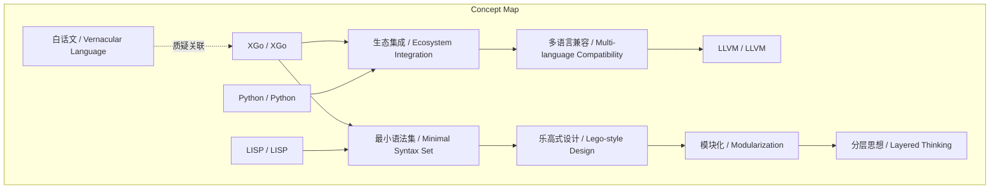
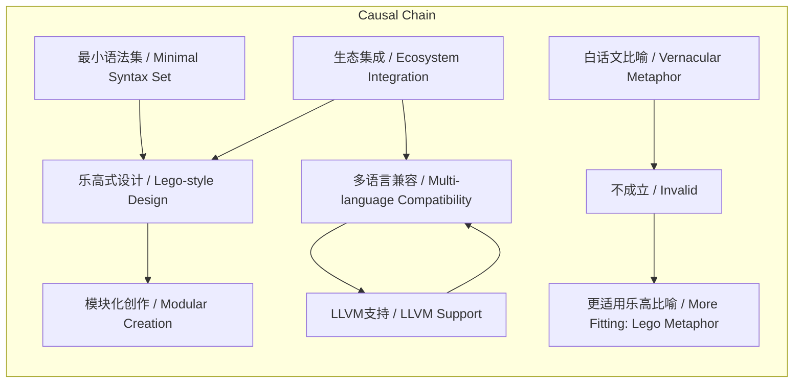

> 作者质疑将XGo比喻为“编程语言里的白话文”，认为其设计核心是“乐高”式模块化与多语言生态集成，并强调LLVM在生态兼容中的关键作用。

## 元信息
- 分类：`ai-software/agents-tooling`
- 优先级：`high` (`13`)
- 文档类型：`text-summary`
- 来源分组：`news`
- 原始文件：`reports/news/2026-03-19/1773930874516-news-news-task-1773930778073-andtan.md`
- 请求 ID：`1773930778073-andtan`

## 原始内容

#### 文本总结

### 质疑XGo“白话文”比喻：设计哲学与生态兼容性探讨

#### 整体结构化文档表达
##### 文档卡片
- 主题（中文/English）：编程语言设计比喻评估 / Programming Language Design Metaphor Evaluation
- 一句话摘要：作者质疑将XGo比喻为“编程语言里的白话文”，认为其设计核心是“乐高”式模块化与多语言生态集成，并强调LLVM在生态兼容中的关键作用。
- 目标读者：编程语言设计者、开发者、技术评论者
- 核心结论（3条）：
  1. “白话文”比喻缺乏充分依据，与XGo的实际设计特点（最小语法集、生态集成）无本质关联。
  2. XGo的设计哲学更接近“乐高”式模块化，通过分层思想实现灵活创作。
  3. 现代编程语言的生态兼容性主要归功于LLVM等底层工具，而非高级语言本身。

##### 内容结构树
1. 背景与问题定义：许式伟将XGo比喻为“编程语言里的白话文”，作者对此提出质疑。
2. 核心观点与关键证据：分析XGo设计特点（最小语法集、集成多语言生态），与LISP、Python等比较，指出“白话文”比喻不成立。
3. 方法/机制/路径：XGo采用模块化设计（类似乐高），底层自有生态但兼容其他语言生态。
4. 风险与边界条件：比喻的模糊性可能导致误解；设计哲学讨论易陷入主观偏好。
5. 结论与行动建议：否定“白话文”比喻，建议关注实际设计特性（模块化、生态集成）而非营销比喻。

##### 结构化元数据（JSON）
```json
{
  "title": "质疑XGo“白话文”比喻：设计哲学与生态兼容性探讨",
  "topic_zh": "编程语言设计比喻评估",
  "topic_en": "Programming Language Design Metaphor Evaluation",
  "audience": "编程语言设计者、开发者、技术评论者",
  "claims": [
    "“白话文”比喻缺乏充分依据，与XGo的实际设计特点无本质关联",
    "XGo的设计哲学更接近“乐高”式模块化",
    "现代编程语言的生态兼容性主要归功于LLVM等底层工具"
  ],
  "evidence": [
    "XGo设计目标：最小语法集、集成最全编程语言生态",
    "LISP用不到10个原语建立整个语言，命令式语言难以比拟",
    "Python高度兼容C生态，现代语言普遍通过LLVM实现兼容",
    "XGo设计哲学被描述为“乐高”式搭积木创作"
  ],
  "risks": [
    "比喻的模糊性可能导致对语言特性的误解",
    "设计哲学讨论易陷入主观偏好，缺乏客观标准"
  ],
  "actions": [
    "关注编程语言的实际设计特性（如模块化、生态集成）而非营销比喻",
    "评估语言时优先考虑底层工具（如LLVM）对生态兼容的贡献"
  ]
}
```

#### 处理流程
1. 输入识别：识别到用户提供了一段关于XGo编程语言“白话文”比喻的讨论文本。
2. 信息抽取：从文本中抽取关键概念（XGo、白话文、语法集、生态集成、LISP、乐高、LLVM等）、事实（设计特点、语言比较）与观点（对比喻的质疑）。
3. 结构化归纳：将内容归纳为背景、核心观点、方法、风险、结论五个部分，形成逻辑骨架。
4. 关系建模：建立概念间关系，如“最小语法集”与“生态集成”共同构成“乐高式设计”；“LLVM”是“生态兼容”的关键工具。
5. 可视化表达：使用Mermaid绘制概念结构图和逻辑因果图，展示概念关联与因果链。

#### 概念清单（中英文）
- XGo / XGo
- 白话文 / Vernacular Language
- 语法集 / Syntax Set
- 编程语言生态 / Programming Language Ecosystem
- LISP / LISP
- 乐高 / Lego
- 模块化 / Modularization
- 分层思想 / Layered Thinking
- LLVM / LLVM
- 命令式语言 / Imperative Language
- Python / Python
- Go / Go
- C/C++ / C/C++
- Javascript / Javascript

#### 概念定义（中英文）
- XGo / XGo：许式伟开发的一门新编程语言，设计目标是采用最小语法集并集成多语言生态。
- 白话文 / Vernacular Language：文中被质疑的比喻，意指像日常语言一样简单易懂，但作者认为与XGo特性不符。
- 语法集 / Syntax Set：编程语言语法的集合，文中讨论“最小语法集”作为设计目标。
- 编程语言生态 / Programming Language Ecosystem：指语言的标准库、第三方包、工具链等整体环境。
- LISP / LISP：一种编程语言，以极简原语（不到10个）构建整个语言体系。
- 乐高 / Lego：比喻XGo的设计哲学，像搭积木一样通过模块组合创作。
- 模块化 / Modularization：将系统分解为独立模块的设计思想，文中认为是优秀编程语言的共同特点。
- 分层思想 / Layered Thinking：设计中的层次化结构，与模块化相关。
- LLVM / LLVM：一个编译器基础设施，使现代语言能高效兼容C生态，文中认为是生态兼容的关键。
- 命令式语言 / Imperative Language：以命令语句改变程序状态的语言范式，文中与LISP对比。
- Python / Python：一种编程语言，高度兼容C生态。
- Go / Go：一种编程语言，XGo可能与其有关联（作者最爱）。
- C/C++ / C/C++：系统级编程语言，生态成熟，常被其他语言兼容。
- Javascript / Javascript：一种脚本语言，常被提及在生态集成中。

#### 概念关联与逻辑关系（中英文）
1. XGo（XGo） 与 最小语法集（Minimal Syntax Set） 共同影响 乐高式设计（Lego-style Design）：XGo通过最小语法集实现类似乐高的模块化创作。
2. 生态集成（Ecosystem Integration） 与 LLVM（LLVM） 共同影响 多语言兼容（Multi-language Compatibility）：集成其他语言生态（如Go、C/C++、Python、Javascript）依赖LLVM等底层工具。
3. 模块化（Modularization） 与 分层思想（Layered Thinking） 共同影响 优秀编程语言（Excellent Programming Language）：文中认为好的编程语言都具备模块化和分层思想。

#### COT逻辑梳理（定义/分类/比较/因果/科学方法论）
Step 1: 定义问题。问题：将XGo比喻为“编程语言里的白话文”是否合理？依据：比喻需基于本质相似性。
Step 2: 分类分析。将编程语言设计特点分类：语法集大小（如LISP极简）、生态集成能力（如兼容多语言）、设计哲学（如模块化）。
Step 3: 比较论证。比较XGo与LISP（语法集）、与Python（生态兼容）、与“乐高”（设计哲学），发现“白话文”比喻缺乏独特对应点。
Step 4: 因果推断。因果链：采用最小语法集 + 集成多语言生态 → 实现乐高式模块化设计 → 但生态兼容的实际功劳归于LLVM → 因此“白话文”比喻不成立，更接近“乐高”比喻。
Step 5: 科学方法论评估。评估比喻的有效性：需可验证的相似性。文中指出“白话文”比喻无法验证（“有啥关系捏？”），而“乐高”比喻更贴合实际机制（搭积木创作）。同时，设计哲学讨论具有主观性（“我觉得的最好的编程语言”）。

#### 事实与看法（病毒）
##### 事实
- 许式伟为XGo语言教材前言中提到“xgo 就是编程语言里的白话文”的比喻。
- XGo的设计目标包括：使用最小的语法集、集成最全的编程语言生态（如直接导入Go、C/C++、Python、Javascript的包）。
- LISP使用不到10个原语建立整个语言。
- Python高度兼容C生态。
- 现代编程语言普遍通过LLVM实现生态兼容。
- XGo的设计哲学被描述为“乐高”式搭积木创作，低层有自有生态也兼容其他生态。
##### 看法
- 作者认为“白话文”比喻是“虚假广告”。
- 作者认为XGo与“白话文”无本质关系。
- 作者认为好的编程语言都是模块化的、有分层思想的，都像“乐高”。
- 作者认为搭积木的功劳是LLVM的，与高级语言无关。
- 作者认为设计哲学最终归结为个人偏好（“我觉得的最好的编程语言”）。

#### FAQ（原文问题整理）
1. 问：xgo 有啥和别的语言不一样的能被称为“白话文”？
   答：文中未发现XGo有独特特性可对应“白话文”比喻；其设计特点（最小语法集、生态集成）与其他语言（如LISP、Python）有重叠，无本质区别。
2. 问：和“白话文”有啥关系捏？
   答：无明确关系；“白话文”比喻未体现XGo的核心设计哲学（模块化、生态集成），更接近“乐高”比喻。

#### Visualization
##### Mermaid 图 1（概念结构图）

##### Mermaid 图 2（逻辑/因果图）


#### 文章中的类比
- “xgo 就是编程语言里的白话文”：将XGo比作编程语言中的白话文，但作者质疑其合理性。
- “XGo 的设计哲学有点儿像乐高”：将XGo的设计哲学比作乐高积木，强调模块化搭积木创作。

#### 10个金句
1. “xgo 就是编程语言里的白话文”。
2. “这不是比喻 这是虚假广告”。
3. “xgo 有啥和别的语言不一样的能被称为‘白话文’？”
4. “老许的想法是让 XGo 用最小的语法集（最简单的语法） 集成最全的编程语言生态”。
5. “LISP用不到10个原语就建立了整个语言”。
6. “XGo 的设计哲学有点儿像乐高 搭积木创作”。
7. “好的编程语言都是模块化的 都是有分层思想的 都‘乐高’”。
8. “Python 还高度兼容C生态呢”。
9. “其实现代语言基本都高度兼容C生态 因为有LLVM这种东西”。
10. “要说搭积木 其实功劳是LLVM的 和一个高级语言有毛关系”。
