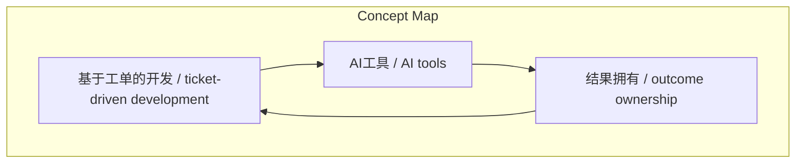
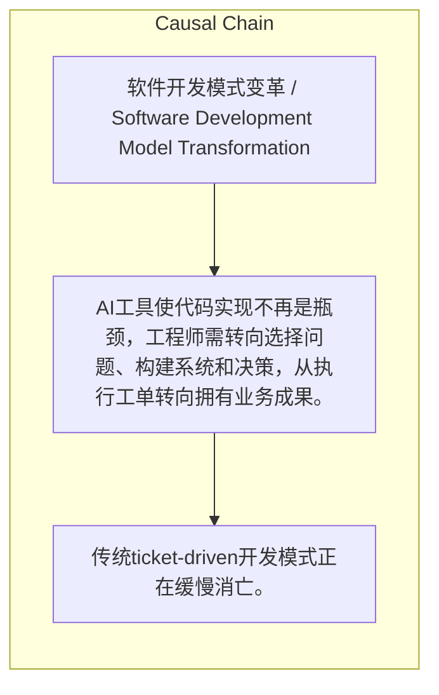

> AI工具使代码实现不再是瓶颈，工程师需转向选择问题、构建系统和决策，从执行工单转向拥有业务成果。

## 元信息
- 分类：`ai-software/agents-tooling`
- 优先级：`high` (`13`)
- 文档类型：`text-summary`
- 来源分组：`news`
- 原始文件：`reports/news/2026-03-22/1774138726953-news-news-task-1774138678277-dvnm51.md`
- 请求 ID：`1774138678277-dvnm51`

## 原始内容

#### 文本总结

### AI时代软件开发：从执行工单到拥有结果

#### 整体结构化文档表达
##### 文档卡片
- 主题（中文/English）：软件开发模式变革 / Software Development Model Transformation
- 一句话摘要：AI工具使代码实现不再是瓶颈，工程师需转向选择问题、构建系统和决策，从执行工单转向拥有业务成果。
- 目标读者：软件工程师、产品经理
- 核心结论（3条）：
- 传统ticket-driven开发模式正在缓慢消亡。
- 开发瓶颈已从代码编写转移到问题选择、系统结构设计和决策。
- 工程师需从执行工单转向拥有业务成果，关注问题本质和最小可行交付。

##### 内容结构树
1. 背景与问题定义
2. 核心观点与关键证据
3. 方法/机制/路径
4. 风险与边界条件
5. 结论与行动建议

##### 结构化元数据（JSON）
```json
{
  "title": "AI时代软件开发：从执行工单到拥有结果",
  "topic_zh": "软件开发模式变革",
  "topic_en": "Software Development Model Transformation",
  "audience": "软件工程师、产品经理",
  "claims": [],
  "evidence": [],
  "risks": [],
  "actions": []
}
```

#### 处理流程
1. 输入识别
2. 信息抽取（实体、概念、问题、事实、观点）
3. 结构化归纳（定义/分类/比较/因果/方法论）
4. 关系建模（概念关系、等式/方程/逻辑链）
5. 可视化表达（Mermaid）

#### 概念清单（中英文）
- 基于工单的开发 / ticket-driven development
- AI工具 / AI tools
- 结果拥有 / outcome ownership

#### 概念定义（中英文）
##### 基于工单的开发 / ticket-driven development
- 中文定义：PM编写工单，工程师领取并交付代码的循环流程。
- English Definition: A workflow where PM writes tickets, engineers pick them up, and ship code in a repeat cycle.

##### AI工具 / AI tools
- 中文定义：能生成实现代码、测试、重构甚至整个功能的人工智能工具。
- English Definition: Artificial intelligence tools capable of generating implementation code, tests, refactors, or even entire features.

##### 结果拥有 / outcome ownership
- 中文定义：工程师对业务成果负责，而非仅执行工单。
- English Definition: Engineers are responsible for business outcomes, not just executing tickets.


#### 概念关联与逻辑关系（中英文）
- 基于工单的开发/ticket-driven development -> AI工具/AI tools | concept | 使过时
- AI工具/AI tools -> 结果拥有/outcome ownership | concept | 促成
- 结果拥有/outcome ownership -> 基于工单的开发/ticket-driven development | concept | 取代

##### 可形式化关系
- AI tools的出现导致开发瓶颈从代码编写转移到问题选择、系统结构和决策。
- 瓶颈转移促使工程师从执行工单转向拥有业务成果。
- outcome ownership要求工程师关注问题本质、最小可行交付和效果验证。

#### COT逻辑梳理（定义/分类/比较/因果/科学方法论）
- Step 1: 过去，代码编写是瓶颈，ticket-driven开发模式有效。
- Step 2: AI工具使代码生成不再是瓶颈，约束转移到问题选择、系统结构和决策。
- Step 3: 因此，工程师需拥有业务成果，关注问题本质、最小交付和效果验证。

#### 事实与看法（区分）
##### 事实
- 未发现明确客观事实

##### 看法
- 未发现明确主观看法

#### FAQ（原文问题整理）
- 未发现明确 FAQ

#### Visualization
##### Mermaid 图 1（概念结构图）


##### Mermaid 图 2（逻辑/因果图）


#### 文章中的类比
- 未发现明确类比

#### 10个金句
- 原文未提供
