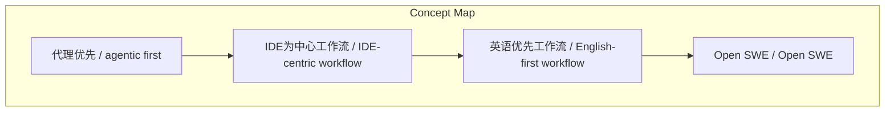
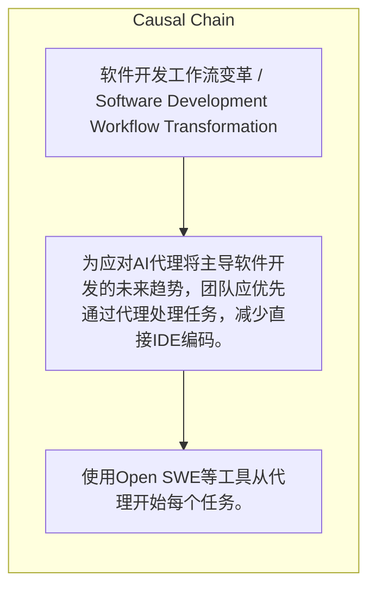

> 为应对AI代理将主导软件开发的未来趋势，团队应优先通过代理处理任务，减少直接IDE编码。

## 元信息
- 分类：`ai-software/agents-tooling`
- 优先级：`high` (`13`)
- 文档类型：`text-summary`
- 来源分组：`news`
- 原始文件：`reports/news/2026-03-22/1774141051903-news-news-task-1774140997318-gaixr6.md`
- 请求 ID：`1774140997318-gaixr6`

## 原始内容

#### 文本总结

### 倡导以AI代理为中心的软件开发新范式

#### 整体结构化文档表达
##### 文档卡片
- 主题（中文/English）：软件开发工作流变革 / Software Development Workflow Transformation
- 一句话摘要：为应对AI代理将主导软件开发的未来趋势，团队应优先通过代理处理任务，减少直接IDE编码。
- 目标读者：软件工程师及开发团队
- 核心结论（3条）：
- 应减少IDE使用，转向以AI代理优先的工作流。
- 手动编写代码将在短期内被代理大幅取代。
- 立即养成所有任务始于代理的习惯以适应未来。

##### 内容结构树
1. 背景与问题定义
2. 核心观点与关键证据
3. 方法/机制/路径
4. 风险与边界条件
5. 结论与行动建议

##### 结构化元数据（JSON）
```json
{
  "title": "倡导以AI代理为中心的软件开发新范式",
  "topic_zh": "软件开发工作流变革",
  "topic_en": "Software Development Workflow Transformation",
  "audience": "软件工程师及开发团队",
  "claims": [
    "IDE将开发者锚定在较慢、手动的工作流中。",
    "软件工程正从IDE为中心转向英语优先的工作流。",
    "传统IDE循环是串行且人脑瓶颈的。",
    "代理已接近能完成全部工程任务。"
  ],
  "evidence": [],
  "risks": [],
  "actions": [
    "使用Open SWE等工具从代理开始每个任务。",
    "将IDE仅用于diff查看和代码审查。",
    "即使简单代码变更也通过代理处理以养成习惯。"
  ]
}
```

#### 处理流程
1. 输入识别
2. 信息抽取（实体、概念、问题、事实、观点）
3. 结构化归纳（定义/分类/比较/因果/方法论）
4. 关系建模（概念关系、等式/方程/逻辑链）
5. 可视化表达（Mermaid）

#### 概念清单（中英文）
- 代理优先 / agentic first
- IDE为中心工作流 / IDE-centric workflow
- 英语优先工作流 / English-first workflow
- Open SWE / Open SWE

#### 概念定义（中英文）
##### 代理优先 / agentic first
- 中文定义：所有工程任务首先通过AI代理处理的工作方式。
- English Definition: An approach where every engineering task starts with an AI agent.

##### IDE为中心工作流 / IDE-centric workflow
- 中文定义：以打开编辑器、查找文件、编写代码为核心的串行开发流程。
- English Definition: A serial development process centered on opening editor, finding files, and writing code.

##### 英语优先工作流 / English-first workflow
- 中文定义：通过自然语言（英语）与代理交互主导开发的方式。
- English Definition: A development approach dominated by natural language (English) interaction with agents.

##### Open SWE / Open SWE
- 中文定义：开源云编码代理，集成GitHub、Slack和Linear。
- English Definition: An open-source cloud-based coding agent integrated with GitHub, Slack, and Linear.


#### 概念关联与逻辑关系（中英文）
- 代理优先/agentic first -> IDE使用/IDE usage | concept | 减少
- IDE为中心工作流/IDE-centric workflow -> 开发效率/development efficiency | concept | 限制
- Open SWE/Open SWE -> 代理优先习惯/agentic-first habit | concept | 促进

##### 可形式化关系
- 代理优先工作流 ⇒ IDE使用频率降低
- IDE为中心工作流 ⇒ 开发效率受限于人脑瓶颈
- Open SWE工具 ⇒ 促进代理优先习惯养成

#### COT逻辑梳理（定义/分类/比较/因果/科学方法论）
- Step 1: 识别传统IDE工作流的低效性（串行、人脑瓶颈）。
- Step 2: 确立代理优先原则，所有任务始于AI代理。
- Step 3: 采用Open SWE等工具将代理集成到现有流程（如Slack、GitHub）。

#### 事实与看法（区分）
##### 事实
- 未发现明确客观事实

##### 看法
- IDEs锚定较慢工作流。
- 软件工程正抽象 away from IDE。
- 一年内可能不再手动编写代码。
- 代理已接近完成全部工程任务。

#### FAQ（原文问题整理）
- 未发现明确 FAQ

#### Visualization
##### Mermaid 图 1（概念结构图）


##### Mermaid 图 2（逻辑/因果图）


#### 文章中的类比
- 未发现明确类比

#### 10个金句
- I want to see your IDEs open less
