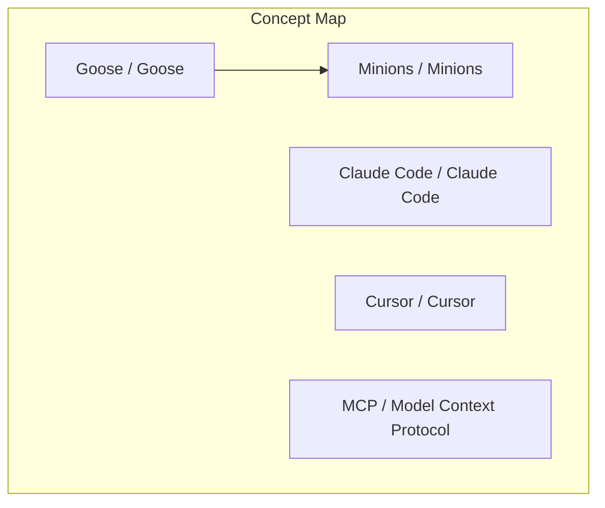
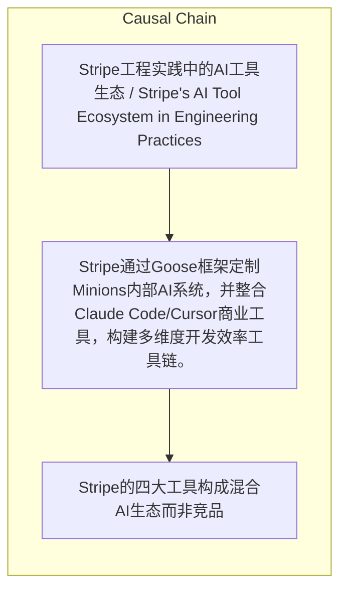

> Stripe通过Goose框架定制Minions内部AI系统，并整合Claude Code/Cursor商业工具，构建多维度开发效率工具链。

## 元信息
- 分类：`ai-software/agents-tooling`
- 优先级：`high` (`13`)
- 文档类型：`text-summary`
- 来源分组：`news`
- 原始文件：`reports/news/2026-03-27/1774604011874-news-news-task-1774603967044-9oyx1f.md`
- 请求 ID：`1774603967044-9oyx1f`

## 原始内容

#### 文本总结

##### 运行信息
- model: openrouter/free
- schema_fallback: yes
- attempted_models: openrouter/free

### Stripe的混合AI工具生态与开发者效率

#### 整体结构化文档表达
##### 文档卡片
- 主题（中文/English）：Stripe工程实践中的AI工具生态 / Stripe's AI Tool Ecosystem in Engineering Practices
- 一句话摘要：Stripe通过Goose框架定制Minions内部AI系统，并整合Claude Code/Cursor商业工具，构建多维度开发效率工具链。
- 目标读者：软件工程师、AI开发者
- 核心结论（3条）：
- Stripe的四大工具构成混合AI生态而非竞品
- Minions作为Stripe专属内部AI系统，基于Goose框架实现端到端自动化
- 商业工具Claude Code/Cursor被广泛整合，支持跨工具互通开发

##### 内容结构树
1. 背景与问题定义
2. 核心观点与关键证据
3. 方法/机制/路径
4. 风险与边界条件
5. 结论与行动建议

##### 结构化元数据（JSON）
```json
{
  "title": "Stripe的混合AI工具生态与开发者效率",
  "topic_zh": "Stripe工程实践中的AI工具生态",
  "topic_en": "Stripe's AI Tool Ecosystem in Engineering Practices",
  "audience": "软件工程师、AI开发者",
  "claims": [],
  "evidence": [],
  "risks": [],
  "actions": []
}
```

#### 处理流程
1. 输入识别
2. 信息抽取（实体、概念、问题、事实、观点）
3. 结构化归纳（定义/分类/比较/因果/方法论）
4. 关系建模（概念关系、等式/方程/逻辑链）
5. 可视化表达（Mermaid）

#### 概念清单（中英文）
- Goose / Goose
- Minions / Minions
- Claude Code / Claude Code
- Cursor / Cursor
- MCP / Model Context Protocol

#### 概念定义（中英文）
##### Goose / Goose
- 中文定义：开源AI代理框架，作为Minions的基础构建平台
- English Definition: Open-source AI agent framework serving as the base platform for Minions

##### Minions / Minions
- 中文定义：Stripe专属内部AI智能体系统，集成云环境和代码库
- English Definition: Stripe-exclusive internal AI agent system integrated with cloud environment and codebase

##### Claude Code / Claude Code
- 中文定义：Anthropic推出的商业AI编程辅助工具
- English Definition: Commercial AI programming assistant developed by Anthropic

##### Cursor / Cursor
- 中文定义：商业AI编程工具，支持交互式开发
- English Definition: Commercial AI programming tool supporting interactive development

##### MCP / Model Context Protocol
- 中文定义：Stripe内部专用模型上下文协议
- English Definition: Stripe's proprietary Model Context Protocol for internal resource access


#### 概念关联与逻辑关系（中英文）
- Goose/Goose -> Minions/Minions | concept | 基础框架关系
- Claude Code/Claude Code -> Stripe/Stripe | concept | 商业工具整合
- Cursor/Cursor -> Stripe/Stripe | concept | 商业工具整合

##### 可形式化关系
- Goose作为Minions的基础框架和循环系统
- Minions与Stripe内部环境深度融合实现自动化开发
- Claude Code/Cursor通过MCP协议访问Stripe内部资源

#### COT逻辑梳理（定义/分类/比较/因果/科学方法论）
- Step 1: 确定核心理念 - 无单一工具解决所有问题
- Step 2: 构建Minions基于Goose框架实现端到端自动化
- Step 3: 集成Claude Code/Cursor商业工具支持跨工具开发

#### 事实与看法（区分）
##### 事实
- 未发现明确客观事实

##### 看法
- 未发现明确主观看法

#### FAQ（原文问题整理）
- 未发现明确 FAQ

#### Visualization
##### Mermaid 图 1（概念结构图）


##### Mermaid 图 2（逻辑/因果图）


#### 文章中的类比
- 未发现明确类比

#### 10个金句
- 原文未提供
