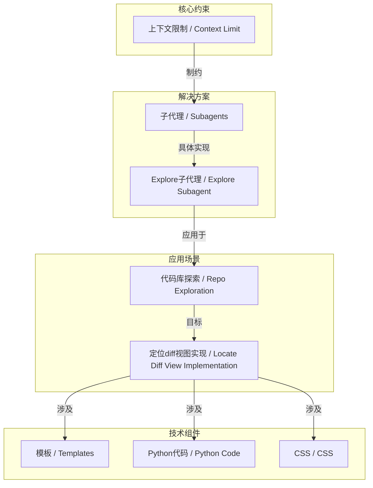
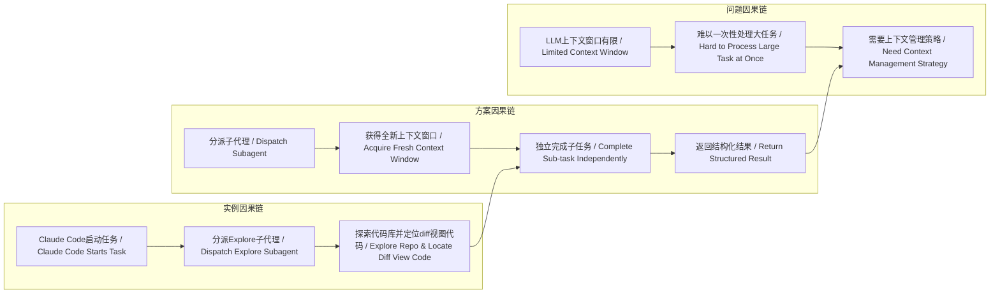

> 通过分派子代理到独立上下文窗口，LLM能有效处理超出其原生上下文限制的复杂任务。

## 元信息
- 分类：`ai-software/agents-tooling`
- 优先级：`high` (`14`)
- 文档类型：`text-summary`
- 来源分组：`news`
- 原始文件：`reports/news/2026-03-17/1773791453289-news-news-task-1773791412180-hhk8dt.md`
- 请求 ID：`1773791412180-hhk8dt`

## 原始内容

#### 文本总结

### 子代理突破LLM上下文限制的工程实践

#### 整体结构化文档表达
##### 文档卡片
- 主题（中文/English）：子代理在LLM工程中的应用 / Subagents in LLM Engineering
- 一句话摘要：通过分派子代理到独立上下文窗口，LLM能有效处理超出其原生上下文限制的复杂任务。
- 目标读者：AI工程师、LLM应用开发者、技术决策者。
- 核心结论（3条）：
    1. 上下文窗口大小是制约LLM处理复杂任务的关键工程瓶颈。
    2. 子代理通过“分治”策略，将大任务分解并由拥有全新上下文窗口的副本来执行，是突破此瓶颈的有效模式。
    3. Claude Code的“Explore”子代理是此模式的具体实践，用于在代码库中高效定位信息。

##### 内容结构树
1. **背景与问题定义**：LLM能力提升但上下文窗口（约100万tokens）未显著增大，管理上下文以适配窗口是获得优质输出的关键。
2. **核心观点与关键证据**：子代理提供了一种简单有效的方法来处理大任务，避免耗尽主代理宝贵的顶层上下文。证据：Claude Code在启动新任务时，默认使用“Explore”子代理来探索代码库。
3. **方法/机制/路径**：主代理像调用普通工具一样分派子代理，为其构建一个全新的起始提示词和上下文窗口，子代理完成任务后返回结果。
4. **风险与边界条件**：未明确提及风险，但隐含边界在于子代理任务的粒度设计与协调开销。
5. **结论与行动建议**：对于需要大量上下文探索的任务（如理解陌生代码库），应优先设计并使用子代理模式。

##### 结构化元数据（JSON）
```json
{
  "title": "子代理突破LLM上下文限制的工程实践",
  "topic_zh": "子代理在LLM工程中的应用",
  "topic_en": "Subagents in LLM Engineering",
  "audience": "AI工程师、LLM应用开发者、技术决策者",
  "claims": [
    "上下文窗口大小是制约LLM处理复杂任务的关键工程瓶颈",
    "子代理通过分治策略能有效突破上下文限制",
    "Claude Code的Explore子代理是此模式的具体实践"
  ],
  "evidence": [
    "LLM上下文窗口通常上限在100万tokens左右，高质量结果常在20万tokens以下",
    "Claude Code在启动新任务时，首先分派一个Explore子代理去探索代码库",
    "子代理被分派时拥有一个全新的上下文窗口和起始提示词"
  ],
  "risks": [],
  "actions": [
    "对于需要大量上下文探索的任务，设计并使用子代理模式",
    "精心构建分派给子代理的起始提示词，以引导其高效完成任务"
  ]
}
```

#### 处理流程
1.  **输入识别**：识别出核心矛盾（LLM能力提升 vs. 上下文窗口限制）及解决方案（Subagents模式），并捕获具体案例（Claude Code的Explore子代理）。
2.  **信息抽取**：抽取实体（LLMs, context limit, tokens, Subagents, Claude Code, Explore subagent, prompt, Django blog, diff view, templates, Python code, difflib, JavaScript, CSS）；抽取问题（如何管理上下文以处理大任务）；抽取事实（窗口大小数值、子代理工作方式）；抽取观点（子代理“简单但有效”、模型“有品味的自我提示”）。
3.  **结构化归纳**：将“子代理”定义为一种**分治**工程模式；将任务按上下文需求分类（适合主代理 vs. 适合子代理）；比较主代理直接处理与使用子代理的差异（上下文消耗 vs. 任务分解开销）。
4.  **关系建模**：建立“上下文窗口限制”与“子代理使用”的因果关系；建立“主代理”与“子代理”的委托关系；建立“Explore子代理”与“代码库信息定位”的功能关系。
5.  **可视化表达**：使用Mermaid绘制概念结构图与因果链图。

#### 概念清单（中英文）
- 大语言模型 / Large Language Models (LLMs)
- 上下文限制 / Context Limit
- 令牌 / Tokens
- 工作记忆 / Working Memory
- 子代理 / Subagents
- 编码代理 / Coding Agent
- Claude Code / Claude Code
- Explore子代理 / Explore Subagent
- 提示词 / Prompt
- Django博客 / Django Blog
- 差异视图 / Diff View
- 模板 / Templates
- Python代码 / Python Code
- difflib / difflib
- JavaScript / JavaScript
- 层叠样式表 / Cascading Style Sheets (CSS)
- 代码库 / Repository (Repo)
- 章节 / Chapters
- 修订 / Revision
- 历史 / History
- 比较 / Compare

#### 概念定义（中英文）
- **大语言模型 (LLMs)**：一种基于深度神经网络的大型人工智能模型，能够理解和生成人类语言。
- **上下文限制 (Context Limit)**：LLM在单次推理中能处理的最大令牌数量，由其架构决定。
- **令牌 (Tokens)**：模型处理文本的基本单位，可对应单词、子词或字符。
- **工作记忆 (Working Memory)**：LLM在生成响应时可访问的即时上下文信息范围。
- **子代理 (Subagents)**：由主LLM代理分派出的、拥有独立全新上下文窗口的副本来执行特定子任务。
- **编码代理 (Coding Agent)**：一个被配置用于编程任务的LLM代理实例。
- **Claude Code**：Anthropic公司开发的、集成子代理模式的代码助手。
- **Explore子代理 (Explore Subagent)**：Claude Code中专门用于探索和理解代码库结构的子代理类型。
- **提示词 (Prompt)**：提供给LLM的初始指令或上下文，用以引导其行为。
- **Django博客 (Django Blog)**：一个使用Django Web框架构建的博客应用程序。
- **差异视图 (Diff View)**：用于可视化显示两个文本版本之间差异的界面组件。
- **模板 (Templates)**：在Web框架（如Django）中，用于生成HTML输出的文件。
- **Python代码 (Python Code)**：使用Python编程语言编写的源代码。
- **difflib**：Python标准库中用于计算序列差异的模块。
- **JavaScript**：一种在浏览器中运行的脚本语言，常用于实现网页交互。
- **层叠样式表 (CSS)**：用于描述HTML或XML文档呈现样式的样式表语言。
- **代码库 (Repository)**：存储源代码及相关文件的版本控制仓库。
- **章节 (Chapters)**：文档或书籍中的主要部分。
- **修订 (Revision)**：对文档或代码的更新版本。
- **历史 (History)**：记录所有修订版本的序列。
- **比较 (Compare)**：并排查看两个版本以识别差异的操作。

#### 概念关联与逻辑关系（中英文）
1.  **上下文限制 (Context Limit)** 直接制约了 **大语言模型 (LLMs)** 处理单次任务的信息容量。
2.  **子代理 (Subagents)** 机制通过为每个子任务提供**全新上下文窗口 (New Context Window)**，绕过了主代理的**上下文限制 (Context Limit)**。
3.  **Explore子代理 (Explore Subagent)** 是 **子代理 (Subagents)** 在 **代码库 (Repository)** 探索场景下的一个**具体实现 (Concrete Implementation)**，其目标是定位实现**差异视图 (Diff View)** 的相关代码（**模板 (Templates)**, **Python代码 (Python Code)**, **CSS**）。

#### COT逻辑梳理（定义/分类/比较/因果/科学方法论）
- **Step 1 (定义问题)**：定义核心工程约束。LLM的**上下文限制 (Context Limit)** 指其单次可处理的**令牌 (Tokens)** 数量上限，这限制了其一次性分析大型代码库或长文档的能力。
- **Step 2 (分类任务)**：将任务按上下文需求分类。一类是可在小上下文内完成的原子任务；另一类是需要大量上下文探索的复合任务（如“理解一个陌生Django博客的diff视图实现”）。
- **Step 3 (比较方案)**：比较两种处理复合任务的方案。方案A：主代理在自身有限上下文内硬扛，易丢失信息且效率低。方案B：使用**子代理 (Subagents)** 进行分治，为每个子任务分配全新上下文，虽增加协调成本但显著提升处理能力。
- **Step 4 (因果分析)**：建立因果链。因为存在**上下文限制 (Context Limit)**，所以需要管理上下文。因为**子代理 (Subagents)** 能提供**全新上下文窗口**，所以它能有效管理大任务上下文，从而解决限制问题。Claude Code的**Explore子代理**正是此因果链上的一个应用实例。
- **Step 5 (科学方法论)**：此模式体现了**实验/观察**方法论。通过实际运行（如用户提供的会话 transcript），观察到模型能自主构建有效的子代理提示词（“Find the code that implements...”），并验证了子代理返回结构化发现（“Perfect! Now let me create a comprehensive...”）的有效性，从而支持了该模式的可行性。

#### 事实与看法（病毒）
##### 事实
- LLM的上下文窗口上限通常在100万tokens左右，高质量结果常在20万tokens以下。
- Claude Code在启动新任务时，会首先分派一个“Explore”子代理去探索目标代码库。
- 子代理的工作方式类似于工具调用：主代理分派并等待响应。
- 在示例会话中，Explore子代理的起始提示词明确要求搜索特定目录（templates/ static/ blog/）和关键词（"diff", "chapter"等）。
- Explore子代理返回了其发现的结构化摘要。

##### 看法
- “Subagents provide a simple but effective way to handle larger tasks...” （子代理为处理更大任务提供了一种简单但有效的方式。）
- “It's interesting to see models prompt themselves in this way - they generally have good taste in prompting strategies.” （有趣的是看到模型以这种方式自我提示——它们通常在提示策略上很有品味。）
- 精心管理上下文以适配窗口是“critical to getting great results”（获得卓越结果的关键）。

#### FAQ（原文问题整理）
- **未发现明确提问**：输入文本主要为描述性说明与示例，未包含需要直接回答的疑问句。

#### Visualization
##### Mermaid 图 1（概念结构图）


##### Mermaid 图 2（逻辑/因果图）


#### 文章中的类比
- **未发现明确类比**：输入文本未使用类比修辞。

#### 10个金句
1. LLMs are restricted by their context limit.
2. Carefully managing the context such that it fits within those limits is critical to getting great results out of a model.
3. Subagents provide a simple but effective way to handle larger tasks without burning through too much of the coding agent’s valuable top-level context.
4. When a coding agent uses a subagent it effectively dispatches a fresh copy of itself to achieve a specified goal with a new context window.
5. Claude Code uses subagents extensively as part of its standard way of working.
6. Any time you start a new task against an existing repo Claude Code first needs to explore that repo.
7. It does this by constructing a prompt and dispatching a subagent to perform that exploration and return a description of what it finds.
8. Subagents work similar to any other tool call.
9. It's interesting to see models prompt themselves in this way - they generally have good taste in prompting strategies.
10. Perfect! Now let me create a comprehensive with all the findings.
    *（注：第10条为子代理返回内容的开头，原文如此，可能为“comprehensive summary”的截断。按原文输出。）*
