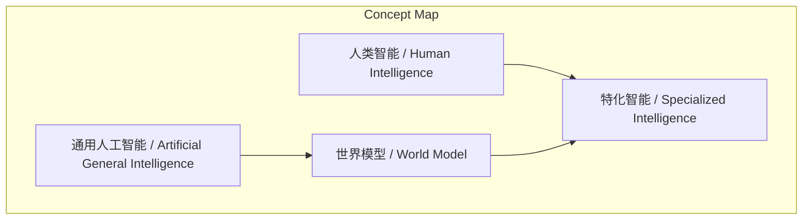
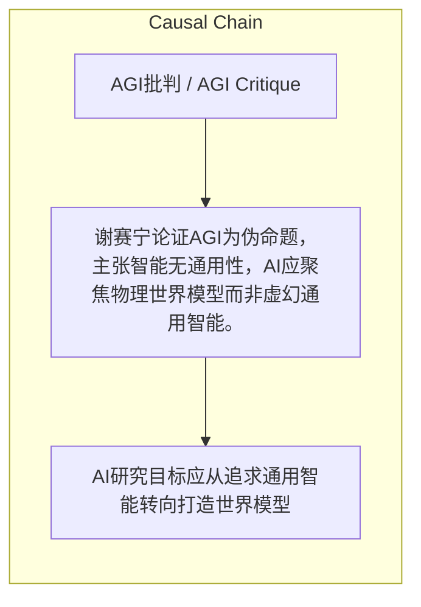

> 谢赛宁论证AGI为伪命题，主张智能无通用性，AI应聚焦物理世界模型而非虚幻通用智能。

## 元信息
- 分类：`ai-software/models-research`
- 优先级：`medium` (`12`)
- 文档类型：`text-summary`
- 来源分组：`news`
- 原始文件：`reports/news/2026-03-23/1774225555965-news-news-task-1774225451183-0kmqji.md`
- 请求 ID：`1774225451183-0kmqji`

## 原始内容

#### 文本总结

##### 运行信息
- model: stepfun/step-3.5-flash:free
- schema_fallback: yes
- attempted_models: stepfun/step-3.5-flash:free

### 谢赛宁批AGI为伪命题：智能无通用性

#### 整体结构化文档表达
##### 文档卡片
- 主题（中文/English）：AGI批判 / AGI Critique
- 一句话摘要：谢赛宁论证AGI为伪命题，主张智能无通用性，AI应聚焦物理世界模型而非虚幻通用智能。
- 目标读者：AI研究者、科技哲学家
- 核心结论（3条）：
- AGI是建立在人类自大妄想上的错误叙事
- 人类智能是特化的，不存在全知全能的通用智能
- 未来AI目标应是打造世界模型，理解不同层级智能本质

##### 内容结构树
1. 背景与问题定义
2. 核心观点与关键证据
3. 方法/机制/路径
4. 风险与边界条件
5. 结论与行动建议

##### 结构化元数据（JSON）
```json
{
  "title": "谢赛宁批AGI为伪命题：智能无通用性",
  "topic_zh": "AGI批判",
  "topic_en": "AGI Critique",
  "audience": "AI研究者、科技哲学家",
  "claims": [
    "人类智能是特化的，受限于感官带宽，不存在全知全能的通用智能",
    "应打破人类自大，认识到不同动物都有适应生存的智能形态",
    "打造'松鼠的智能'（物理世界生存智能）比让AI写代码或考奥数更难且本质"
  ],
  "evidence": [
    "引用杨立昆与DeepMind创始人Demis的辩论：人类有约200万个视觉神经纤维，处理信息趋近于零",
    "举例：黑猩猩懂得权力博弈，某些鸟类藏匿食物时懂得避开同伴视线",
    "引用强化学习之父Rich Sutton：让AI写代码、拿奥赛金牌容易，但打造松鼠的智能难"
  ],
  "risks": [],
  "actions": [
    "AI研究目标应从追求通用智能转向打造世界模型"
  ]
}
```

#### 处理流程
1. 输入识别
2. 信息抽取（实体、概念、问题、事实、观点）
3. 结构化归纳（定义/分类/比较/因果/方法论）
4. 关系建模（概念关系、等式/方程/逻辑链）
5. 可视化表达（Mermaid）

#### 概念清单（中英文）
- 通用人工智能 / Artificial General Intelligence
- 人类智能 / Human Intelligence
- 特化智能 / Specialized Intelligence
- 世界模型 / World Model

#### 概念定义（中英文）
##### 通用人工智能 / Artificial General Intelligence
- 中文定义：指追求全知全能、适用于所有任务的智能概念，但谢赛宁认为是基于人类自大的伪命题。
- English Definition: The concept of intelligence that is all-knowing and capable of all tasks, but criticized by Xie as a pseudo-proposition based on human arrogance.

##### 人类智能 / Human Intelligence
- 中文定义：人类所拥有的智能，被描述为特化的、受感官带宽限制的，无法认知超出感官范围的事物。
- English Definition: The intelligence possessed by humans, described as specialized and limited by sensory bandwidth, unable to perceive beyond sensory range.

##### 特化智能 / Specialized Intelligence
- 中文定义：智能的一种形式，特定于特定环境或任务，如人类视觉处理或动物生存技能，非通用。
- English Definition: A form of intelligence that is specific to particular environments or tasks, such as human visual processing or animal survival skills, not general.

##### 世界模型 / World Model
- 中文定义：能感知世界、预测物理规律的模型，是未来AI应追求的目标，以理解不同层级智能本质。
- English Definition: A model that can perceive the world and predict physical laws, the goal for future AI to understand the essence of intelligence at different levels.


#### 概念关联与逻辑关系（中英文）
- 人类智能/Human Intelligence -> 特化智能/Specialized Intelligence | concept | 是
- AGI/Artificial General Intelligence -> 世界模型/World Model | concept | 应被替代为
- 世界模型/World Model -> 特化智能/Specialized Intelligence | concept | 用于理解

##### 可形式化关系
- AGI ≡ 伪命题
- 人类智能 → 特化智能
- AI目标 → 世界模型

#### COT逻辑梳理（定义/分类/比较/因果/科学方法论）
- Step 1: 批判AGI概念，指出其基于人类自大，人类智能本身是特化的，且动物智能形态多样，故不存在通用智能。
- Step 2: 引用Rich Sutton观点，强调在真实物理世界中生存的智能（如松鼠智能）比写代码或奥数更难，这才是智能的本质问题。
- Step 3: 主张未来AI目标应是回归物理世界，打造能感知世界、预测规律的世界模型，而非追求虚幻的通用智能。

#### 事实与看法（区分）
##### 事实
- 人类约有200万个视觉神经纤维
- 黑猩猩懂得权力博弈，具备'心智理论'
- 某些鸟类藏匿食物时懂得避开同伴视线
- Rich Sutton是强化学习之父

##### 看法
- 未发现明确主观看法

#### FAQ（原文问题整理）
- 未发现明确 FAQ

#### Visualization
##### Mermaid 图 1（概念结构图）


##### Mermaid 图 2（逻辑/因果图）


#### 文章中的类比
- 未发现明确类比

#### 10个金句
- 杨立昆与DeepMind创始人Demis的辩论：人类有约200万个视觉神经纤维，能处理的信息趋近于零
- Rich Sutton：让AI写代码、拿奥赛金牌其实很容易，但打造一只'松鼠的智能'——让它能在真实物理世界中活下去——这才是最难且最本质的问题
