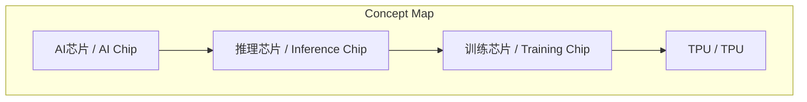
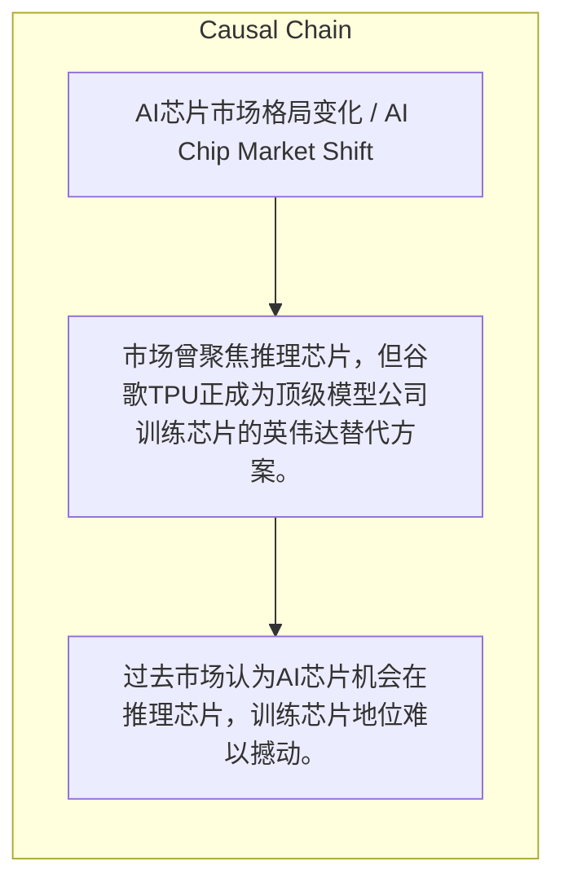

> 市场曾聚焦推理芯片，但谷歌TPU正成为顶级模型公司训练芯片的英伟达替代方案。

## 元信息
- 分类：`ai-software/models-research`
- 优先级：`medium` (`12`)
- 文档类型：`text-summary`
- 来源分组：`news`
- 原始文件：`reports/news/2026-03-25/1774446073644-news-news-task-1774446011353-khw11d.md`
- 请求 ID：`1774446011353-khw11d`

## 原始内容

#### 文本总结

##### 运行信息
- model: stepfun/step-3.5-flash:free
- schema_fallback: yes
- attempted_models: stepfun/step-3.5-flash:free

### TPU成AI训练芯片新选择，挑战英伟达地位

#### 整体结构化文档表达
##### 文档卡片
- 主题（中文/English）：AI芯片市场格局变化 / AI Chip Market Shift
- 一句话摘要：市场曾聚焦推理芯片，但谷歌TPU正成为顶级模型公司训练芯片的英伟达替代方案。
- 目标读者：科技行业从业者与投资者
- 核心结论（3条）：
- 过去市场认为AI芯片机会在推理芯片，训练芯片地位难以撼动。
- 当前越来越多顶级模型公司采用谷歌TPU。
- TPU正在成为英伟达在训练芯片领域的替代方案。

##### 内容结构树
1. 背景与问题定义
2. 核心观点与关键证据
3. 方法/机制/路径
4. 风险与边界条件
5. 结论与行动建议

##### 结构化元数据（JSON）
```json
{
  "title": "TPU成AI训练芯片新选择，挑战英伟达地位",
  "topic_zh": "AI芯片市场格局变化",
  "topic_en": "AI Chip Market Shift",
  "audience": "科技行业从业者与投资者",
  "claims": [
    "整个市场认为未来AI芯片机会在推理芯片",
    "谷歌TPU正在成为英伟达的替代方案"
  ],
  "evidence": [],
  "risks": [],
  "actions": []
}
```

#### 处理流程
1. 输入识别
2. 信息抽取（实体、概念、问题、事实、观点）
3. 结构化归纳（定义/分类/比较/因果/方法论）
4. 关系建模（概念关系、等式/方程/逻辑链）
5. 可视化表达（Mermaid）

#### 概念清单（中英文）
- AI芯片 / AI Chip
- 推理芯片 / Inference Chip
- 训练芯片 / Training Chip
- TPU / TPU

#### 概念定义（中英文）
##### AI芯片 / AI Chip
- 中文定义：未提及
- English Definition: Not mentioned

##### 推理芯片 / Inference Chip
- 中文定义：未提及
- English Definition: Not mentioned

##### 训练芯片 / Training Chip
- 中文定义：未提及
- English Definition: Not mentioned

##### TPU / TPU
- 中文定义：未提及
- English Definition: Not mentioned


#### 概念关联与逻辑关系（中英文）
- TPU/TPU -> 英伟达/NVIDIA | concept | 替代

##### 可形式化关系
- 英伟达在训练芯片市场占据主导地位
- TPU属于训练芯片范畴
- TPU正在替代英伟达在训练芯片市场的地位

#### COT逻辑梳理（定义/分类/比较/因果/科学方法论）
- Step 1: 过去市场观点认为AI芯片机会在推理芯片，训练芯片地位稳固。
- Step 2: 当前观察显示越来越多顶级模型公司采用谷歌TPU。
- Step 3: 因此，TPU正在成为英伟达在训练芯片领域的替代方案。

#### 事实与看法（区分）
##### 事实
- 谷歌TPU在顶级模型公司中成为英伟达的替代方案

##### 看法
- 市场认为未来AI芯片机会在推理芯片

#### FAQ（原文问题整理）
- 未发现明确 FAQ

#### Visualization
##### Mermaid 图 1（概念结构图）


##### Mermaid 图 2（逻辑/因果图）


#### 文章中的类比
- 未发现明确类比

#### 10个金句
- 原文未提供
