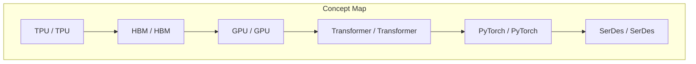
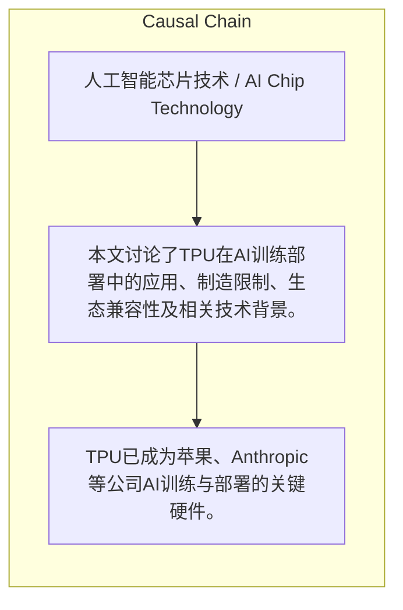

> 本文讨论了TPU在AI训练部署中的应用、制造限制、生态兼容性及相关技术背景。

## 元信息
- 分类：`ai-software/models-research`
- 优先级：`high` (`13`)
- 文档类型：`text-summary`
- 来源分组：`news`
- 原始文件：`reports/news/2026-03-25/1774447817930-news-news-task-1774447714767-3i5glp.md`
- 请求 ID：`1774447714767-3i5glp`

## 原始内容

#### 文本总结

##### 运行信息
- model: stepfun/step-3.5-flash:free
- schema_fallback: yes
- attempted_models: stepfun/step-3.5-flash:free

### TPU应用与制造特点分析

#### 整体结构化文档表达
##### 文档卡片
- 主题（中文/English）：人工智能芯片技术 / AI Chip Technology
- 一句话摘要：本文讨论了TPU在AI训练部署中的应用、制造限制、生态兼容性及相关技术背景。
- 目标读者：技术决策者与工程师
- 核心结论（3条）：
- TPU已成为苹果、Anthropic等公司AI训练与部署的关键硬件。
- TPU制造工艺严格，良率不佳时无法降级挽救，只能报废。
- TPU生态与主流框架PyTorch兼容性不足，需原生硬件库支持。

##### 内容结构树
1. 背景与问题定义
2. 核心观点与关键证据
3. 方法/机制/路径
4. 风险与边界条件
5. 结论与行动建议

##### 结构化元数据（JSON）
```json
{
  "title": "TPU应用与制造特点分析",
  "topic_zh": "人工智能芯片技术",
  "topic_en": "AI Chip Technology",
  "audience": "技术决策者与工程师",
  "claims": [],
  "evidence": [],
  "risks": [],
  "actions": []
}
```

#### 处理流程
1. 输入识别
2. 信息抽取（实体、概念、问题、事实、观点）
3. 结构化归纳（定义/分类/比较/因果/方法论）
4. 关系建模（概念关系、等式/方程/逻辑链）
5. 可视化表达（Mermaid）

#### 概念清单（中英文）
- TPU / TPU
- HBM / HBM
- GPU / GPU
- Transformer / Transformer
- PyTorch / PyTorch
- SerDes / SerDes
- ICI / ICI

#### 概念定义（中英文）
##### TPU / TPU
- 中文定义：未提及
- English Definition: Not mentioned

##### HBM / HBM
- 中文定义：未提及
- English Definition: Not mentioned

##### GPU / GPU
- 中文定义：未提及
- English Definition: Not mentioned

##### Transformer / Transformer
- 中文定义：未提及
- English Definition: Not mentioned

##### PyTorch / PyTorch
- 中文定义：未提及
- English Definition: Not mentioned

##### SerDes / SerDes
- 中文定义：未提及
- English Definition: Not mentioned

##### ICI / ICI
- 中文定义：未提及
- English Definition: Not mentioned


#### 概念关联与逻辑关系（中英文）
- 未发现明确概念关系

##### 可形式化关系
- 苹果公司使用TPU进行Apple Intelligence训练
- Anthropic公司使用TPU部署模型并采购100万颗TPU
- TPU芯片制造无法通过降级挽救不良品

#### COT逻辑梳理（定义/分类/比较/因果/科学方法论）
- 未发现明确逻辑步骤

#### 事实与看法（区分）
##### 事实
- 苹果Apple Intelligence全部使用TPU训练
- Anthropic拿下100万颗TPU订单并使用TPU部署模型
- HBM内存生产被SK海力士、三星、美光垄断
- TPU不能像GPU那样通过阉割降级挽救良率不好的芯片
- Transformer架构由谷歌发明
- PyTorch与TPU生态兼容性不够，需原生硬件库支持
- 博通负责TPU芯片间物理层面的混合信号连接和布局
- Jonathan Ross是TPU核心团队成员，创立Groq后被英伟达收购并成为VP

##### 看法
- 未发现明确主观看法

#### FAQ（原文问题整理）
- 未发现明确 FAQ

#### Visualization
##### Mermaid 图 1（概念结构图）


##### Mermaid 图 2（逻辑/因果图）


#### 文章中的类比
- 未发现明确类比

#### 10个金句
- 原文未提供
