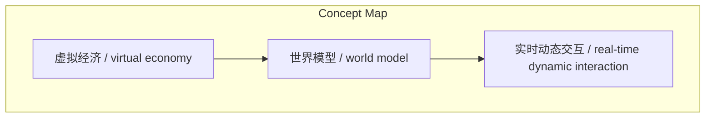
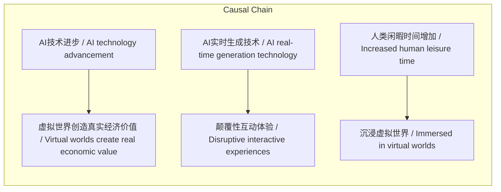

> AI驱动的游戏将成为融合虚拟经济、实时交互和无限算力的新型数字空间，超越电影成为人类未来主要生活方式。

## 元信息
- 分类：`ai-software/models-research`
- 优先级：`medium` (`12`)
- 文档类型：`text-summary`
- 来源分组：`news`
- 原始文件：`reports/news/2026-03-24/1774312535514-news-news-task-1774312518651-esno9l.md`
- 请求 ID：`1774312518651-esno9l`

## 原始内容

#### 文本总结

##### 运行信息
- model: openrouter/free
- schema_fallback: no
- attempted_models: openrouter/free

### AI驱动游戏将成人类第二生活

#### 整体结构化文档表达
##### 文档卡片
- 主题（中文/English）：AI驱动游戏 / AI-driven gaming
- 一句话摘要：AI驱动的游戏将成为融合虚拟经济、实时交互和无限算力的新型数字空间，超越电影成为人类未来主要生活方式。
- 目标读者：游戏开发者、科技爱好者、未来学家
- 核心结论（3条）：
- 虚拟世界将创造真实经济价值，成为GDP来源
- AI实时生成带来颠覆性互动体验，解锁全新玩法
- 游戏将成为容纳人类闲暇时间的'第二生活'

##### 内容结构树
1. 背景与问题定义
2. 核心观点与关键证据
3. 方法/机制/路径
4. 风险与边界条件
5. 结论与行动建议

##### 结构化元数据（JSON）
```json
{
  "title": "AI驱动游戏将成人类第二生活",
  "topic_zh": "AI驱动游戏",
  "topic_en": "AI-driven gaming",
  "audience": "游戏开发者、科技爱好者、未来学家",
  "claims": [
    "AI驱动的游戏规模和影响力将超过所有电影的总和",
    "未来每个像素都将由AI实时生成和渲染",
    "人类将减少物理世界移动，转而在虚拟世界创造经济价值"
  ],
  "evidence": [
    "随着世界模型进步，生成3D虚拟世界将变得非常容易",
    "AI可以根据事件驱动实时动态生成整个世界和NPC",
    "AI替代高智力工作后，人类将拥有更多闲暇时间"
  ],
  "risks": [
    "未提及"
  ],
  "actions": [
    "未提及"
  ]
}
```

#### 处理流程
1. 输入识别
2. 信息抽取（实体、概念、问题、事实、观点）
3. 结构化归纳（定义/分类/比较/因果/方法论）
4. 关系建模（概念关系、等式/方程/逻辑链）
5. 可视化表达（Mermaid）

#### 概念清单（中英文）
- 虚拟经济 / virtual economy
- 世界模型 / world model
- 实时动态交互 / real-time dynamic interaction

#### 概念定义（中英文）
##### 虚拟经济 / virtual economy
- 中文定义：在虚拟世界中创造的真实经济价值和GDP
- English Definition: Real economic value and GDP created in virtual worlds

##### 世界模型 / world model
- 中文定义：AI理解和生成虚拟世界的技术
- English Definition: AI technology for understanding and generating virtual worlds

##### 实时动态交互 / real-time dynamic interaction
- 中文定义：AI根据事件驱动实时生成内容和NPC
- English Definition: AI generates content and NPCs in real-time based on events


#### 概念关联与逻辑关系（中英文）
- AI技术进步/AI technology advancement -> 虚拟世界创造真实经济价值/Virtual worlds create real economic value | causal | 导致
- AI实时生成技术/AI real-time generation technology -> 颠覆性互动体验/Disruptive interactive experiences | causal | 导致
- 人类闲暇时间增加/Increased human leisure time -> 沉浸虚拟世界/Immersed in virtual worlds | causal | 导致

##### 可形式化关系
- IF AI技术进步 AND 世界模型成熟 THEN 生成3D虚拟世界变得容易
- IF AI替代高智力工作 THEN 人类拥有更多闲暇时间
- IF 底层算力爆发 THEN 每个像素都可由AI实时生成

#### COT逻辑梳理（定义/分类/比较/因果/科学方法论）
- Step 1: AI技术进步使生成3D虚拟世界变得容易
- Step 2: 虚拟世界创造真实经济价值，人类减少物理移动
- Step 3: AI实时生成带来颠覆性互动体验，解锁全新玩法

#### 事实与看法（区分）
##### 事实
- AI驱动的游戏将融合无限算力、实时动态交互和虚拟经济
- 未来游戏制作将从预先编写剧本转变为AI实时生成
- 英伟达等底层算力进步将加速AI在游戏中的应用

##### 看法
- 游戏将成为人类未来极其重要的生活与消费阵地
- AI驱动的互动游戏规模将超过所有电影的总和
- 游戏不再是简单娱乐消遣，而是新型数字空间

#### FAQ（原文问题整理）
##### AI驱动的游戏如何创造真实经济价值？
- 人们在虚拟世界中可以创造游戏、消费、买卖物品，从而创造出真实的GDP

##### AI实时生成技术如何改变游戏体验？
- AI可以根据事件驱动实时动态生成整个世界和NPC，解锁全新的互动玩法

##### 为什么说游戏将成为'第二生活'？
- 当AI替代大量工作后，人类将拥有更多闲暇时间沉浸在虚拟世界中

#### Visualization
##### Mermaid 图 1（概念结构图）


##### Mermaid 图 2（逻辑/因果图）


#### 文章中的类比
- 游戏将超越电影，成为人类主要的娱乐和生活方式

#### 10个金句
- 未来这种AI驱动的互动游戏，其规模和影响力'会超过电影的所有总和'
