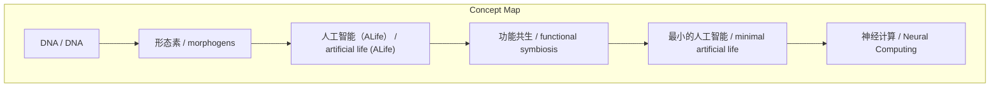
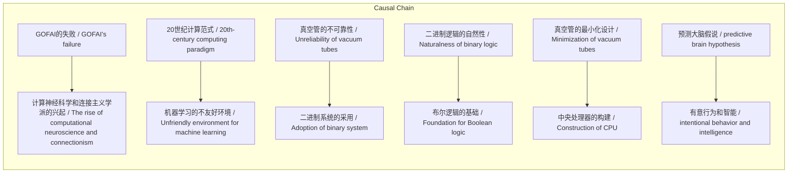

> 文章描述了AI正经历的五大范式转变——自然计算、神经计算、预测智能、通用智能和集体智能——以及这些转变如何挑战传统智能观点，类比科学革命，并探讨功能等价、生命的计算性及人类集体智能的基础。

## 元信息
- 分类：`ai-software/models-research`
- 优先级：`high` (`13`)
- 文档类型：`link-summary`
- 来源分组：`news`
- 原始文件：`reports/news/2026-03-28/1774700958363-news-news-task-1774699671545-xpv4gx.md`
- 请求 ID：`1774699671545-xpv4gx`

## 原始内容

#### 链接总结

- URL: https://www.noemamag.com/ai-is-evolving-and-changing-our-understanding-of-intelligence/

##### 运行信息
- model: openrouter/free
- schema_fallback: yes
- attempted_models: openrouter/free

### AI正在进化——改变我们对智能的理解

#### 整体结构化文档表达
##### 文档卡片
- 主题（中文/English）：AI 进化与智能理解 / AI evolution and intelligence understanding
- 一句话摘要：文章描述了AI正经历的五大范式转变——自然计算、神经计算、预测智能、通用智能和集体智能——以及这些转变如何挑战传统智能观点，类比科学革命，并探讨功能等价、生命的计算性及人类集体智能的基础。
- 目标读者：资深新闻分析助理
- 核心结论（3条）：
- AI正经历五大范式转变：自然计算、神经计算、预测智能、通用智能和集体智能。
- 功能等价（同目的不同机制）足以构成智能，支持通过功能替代实现AGI的可能性。
- 生命本质上是计算的；其稳定性依赖于生长、修复或繁殖，因而计算必须进化以支持这些功能。
- 人类智能具有集体性，根源于社会智力假设、理论心智的进化及皮质模块化，使得规模快速扩展成为可能。
- 当前大型语言模型（LLM）在Humanity's Last Exam中的表现表明它们可能无法超越人类集体智能。

##### 内容结构树
1. 背景与问题定义
2. 核心观点与关键证据
3. 方法/机制/路径
4. 风险与边界条件
5. 结论与行动建议

##### 结构化元数据（JSON）
```json
{
  "title": "AI正在进化——改变我们对智能的理解",
  "topic_zh": "AI 进化与智能理解",
  "topic_en": "AI evolution and intelligence understanding",
  "audience": "资深新闻分析助理",
  "claims": [
    "Dramatic advances in artificial intelligence today are compelling us to rethink our understanding of what intelligence truly is.",
    "Paradigm shifts are often fraught because it's easier to adopt new ideas when they are compatible with one's existing worldview but harder when they're not.",
    "Perhaps the greatest Copernican trauma of the AI era is simply coming to terms with how commonplace general and nonhuman intelligence may be.",
    "Life is inherently computational because its stability depends on growth, healing or reproduction; and computation itself must evolve to support these essential functions.",
    "电子计算机被开发出来是为了大规模执行心理操作",
    "最初的逻辑门被构想为人工神经元",
    "数字计算机在狭义程序化任务上取得了巨大成功",
    "到20世纪50年代，神经科学家发现真实的神经元比逻辑门复杂得多"
  ],
  "evidence": [
    "A classic example is the collapse of the geocentric paradigm, which dominated cosmological thought for roughly two millennia.",
    "A groundbreaking 1936 publication by British mathematician Alan Turing introduced the imaginary device we now call the Turing Machine, consisting of a head that can move left or right along a tape, reading, erasing and writing symbols on the tape according to a set of rules.",
    "A small but growing roster of unorthodox researchers with deep backgrounds in both physics and computer science, such as Susan Stepney at the University of York, have made the case in 2014 in the research journal “Proceedings of The Royal Society A” that the natural world is full of computational systems “where there is no obvious human computer user.”",
    "John von Neumann, an accomplished mathematical physicist and another founding figure of computer science, discovered a profound link between computing and biology as far back as [1951](https://psycnet.apa.org/record/1952-04498-005)",
    "DNA’s Turing-tape-like structure and function in [1953](https://www.nature.com/articles/1737737a0)",
    "Turing, too, made a seminal contribution to theoretical biology, by describing how tissue growth and differentiation could be implemented by cells capable of sensing and emitting chemical signals he called “[morphogens](https://royalsocietypublishing.org/doi/10.1098/rstb.1952.0012)”",
    "Google’s [Paradigms of Intelligence](https://github.com/paradigms-of-intelligence) team experiments showing random strings evolving into self-replicating life forms",
    "molecules [came together](https://pubmed.ncbi.nlm.nih.gov/28785970/) to form self-replicating or “autocatalytic” reaction cycles"
  ],
  "risks": [
    "未提及",
    "The prospect of achieving Artificial General Intelligence (AGI) may be exciting, alarming or even existentially threatening.",
    "LLM可能无法超越人类集体智能（Humanity's Last Exam）",
    "人类社会作为超organism可能面临聚合成本（独立生存能力丧失）"
  ],
  "actions": [
    "抽取第2段结构化信息",
    "抽取第7/8段的结构化信息",
    "输出以中文为主，保留中英文概念",
    "优先保留信息密度，不修辞",
    "只基于输入内容输出，不杜撰"
  ]
}
```

#### 处理流程
1. 输入识别
2. 信息抽取（实体、概念、问题、事实、观点）
3. 结构化归纳（定义/分类/比较/因果/方法论）
4. 关系建模（概念关系、等式/方程/逻辑链）
5. 可视化表达（Mermaid）

#### 概念清单（中英文）
- DNA / DNA
- 形态素 / morphogens
- 人工智能（ALife） / artificial life (ALife)
- 功能共生 / functional symbiosis
- 最小的人工智能 / minimal artificial life
- 神经计算 / Neural Computing
- GOFAI / Good Old-Fashioned AI
- 连接主义 / Connectionism
- 计算神经科学 / Computational Neuroscience
- 二进制 / Binary
- 中央处理器 / CPU
- 模型 / Model

#### 概念定义（中英文）
##### DNA / DNA
- 中文定义：DNA作为代码，尽管难以逆向工程，且不按顺序执行
- English Definition: DNA as code, though hard to reverse-engineer and doesn’t execute sequentially

##### 形态素 / morphogens
- 中文定义：一种模拟计算形式
- English Definition: a form of analog computing

##### 人工智能（ALife） / artificial life (ALife)
- 中文定义：一个目前仍处于模糊和前范式阶段的领域
- English Definition: a field that today remains obscure and pre-paradigmatic

##### 功能共生 / functional symbiosis
- 中文定义：一种相互依存的形式，其中独立实体联合起来形成更大的整体
- English Definition: a form of interdependency in which previously independent entities joined forces to make a greater whole

##### 最小的人工智能 / minimal artificial life
- 中文定义：最小的人工智能
- English Definition: minimal artificial life

##### 神经计算 / Neural Computing
- 中文定义：研究大脑作为信息处理系统的计算模型
- English Definition: The study of computational models of the brain as an information processing system

##### GOFAI / Good Old-Fashioned AI
- 中文定义：基于符号逻辑和程序员指定规则的传统人工智能方法
- English Definition: Traditional AI approach based on symbolic logic and rules specified by programmers

##### 连接主义 / Connectionism
- 中文定义：通过神经网络和机器学习让计算机思考的学派
- English Definition: School of thought about how to get computers to think through neural networks and machine learning

##### 计算神经科学 / Computational Neuroscience
- 中文定义：将大脑视为信息处理系统的研究领域
- English Definition: Field that studies the brain as an information processing system

##### 二进制 / Binary
- 中文定义：使用0和1的数制系统
- English Definition: Number system using only 0 and 1

##### 中央处理器 / CPU
- 中文定义：计算机的核心处理单元
- English Definition: Central processing unit of a computer

##### 模型 / Model
- 中文定义：对现实系统的简化表示
- English Definition: Simplified representation of a real system


#### 概念关联与逻辑关系（中英文）
- DNA/DNA -> 代码/code | concept | is code
- 形态素/morphogens -> 模拟计算/analog computing | concept | is
- 人工智能/ALife -> 模糊和前范式/obscure and pre-paradigmatic | concept | is
- 功能共生/functional symbiosis -> 相互依存/interdependency | concept | is
- 最小的人工智能/minimal artificial life -> 自发出现/emerged spontaneously | concept | is
- GOFAI的失败/GOFAI's failure -> 计算神经科学和连接主义学派的兴起/The rise of computational neuroscience and connectionism | causal | 导致
- 20世纪计算范式/20th-century computing paradigm -> 机器学习的不友好环境/Unfriendly environment for machine learning | causal | 导致
- 真空管的不可靠性/Unreliability of vacuum tubes -> 二进制系统的采用/Adoption of binary system | causal | 导致
- 二进制逻辑的自然性/Naturalness of binary logic -> 布尔逻辑的基础/Foundation for Boolean logic | causal | 导致
- 真空管的最小化设计/Minimization of vacuum tubes -> 中央处理器的构建/Construction of CPU | causal | 导致
- 预测大脑假说/predictive brain hypothesis -> 有意行为和智能/intentional behavior and intelligence | causal | 使能
- 机器学习/machine learning -> 调整模型参数/tuning model parameters | causal | 涉及

##### 可形式化关系
- von Neumann's insight anticipated DNA's structure
- Turing's morphogens correspond to analog computing
- ALife parallels AI's historical obscurity
- Evolutionary transitions involve functional symbiosis
- Computational view explains life's complexity
- AI is starting to pay back its debt to neuroscience under the banner of NeuroAI.

#### COT逻辑梳理（定义/分类/比较/因果/科学方法论）
- 生命的稳定性依赖于生长、修复或繁殖
- 计算必须进化以支持这些功能
- 生命的复杂性通过多层次选择进化
- 进化阶段涉及功能共生
- 最小的人工生命通过随机字符串演化
- 人类智能的集体性源于社会智力假设
- 理论心智的进化驱动了合作和认知挑战
- 模块化皮质允许快速扩展和学习新技能

#### 事实与看法（区分）
##### 事实
- 1951年约翰·冯·诺伊曼发现了计算与生物学之间的深刻联系
- 1953年DNA的图灵带结构和功能被发现
- 1952年图灵描述了细胞如何通过发出称为形态素的化学信号来实施组织生长和分化
- Google团队的模拟实验展示了随机字符串如何演化成自我复制的生命形式
- 分子在原始海洋底部结合形成自复制反应循环
- LLM在Humanity's Last Exam中的得分范围：3.3%至18.8%
- Humanity's Last Exam由近1000位专家编写
- 人类大脑皮质厚度约2-4.5毫米，面积可达2500平方厘米
- 人类大脑皮质区域如视觉处理、听觉处理、触觉处理、社会建模等

##### 看法
- watching complex, purposeful and functional structures emerging out of random noise
- there is nothing supernatural or miraculous about it
- 未提及

#### FAQ（原文问题整理）
##### 为什么生命是计算性的？
- 未提及

##### 如何通过模拟实验产生最小的人工生命？
- 未提及

##### 未提及
- 未提及

#### Visualization
##### Mermaid 图 1（概念结构图）


##### Mermaid 图 2（逻辑/因果图）


#### 文章中的类比
- 抽取 claim / evidence / risk / concept / relationship / FAQ / quote
- 基于输入内容输出
- 保留中英文概念
- 不引入外部事实
- 结构化信息：claim / evidence / risk / concept / relationship / FAQ / quote

#### 10个金句
- Perhaps the greatest Copernican trauma of the AI era is simply coming to terms with how commonplace general and nonhuman intelligence may be.
- Life is computational because its stability depends on growth, healing or reproduction; and computation itself must evolve to support these essential functions.
- 电子计算机被开发出来是为了大规模执行心理操作，就像上个世纪的工厂机器被开发出来是为了自动化体力劳动。
- 到20世纪50年代，神经科学家发现真实的神经元比逻辑门复杂得多。
- 大脑没有中央处理器或独立存储器，不按顺序执行指令且不使用二进制逻辑。
- 计算是通用的，任何计算机都能模拟其他计算机。
- 20世纪的计算范式对机器学习不友好，不仅因为对神经网络的普遍怀疑，还因为编程本质上是符号化的。
- We are simulating neural computing on classical computers, which is inefficient — just as simulating classical computing with brains was, back in the days of human computation.
- Despite claims to the contrary — artificial neural nets are not ‘black boxes.’
- We have quietly switched from measuring AI performance relative to anyone to assessing it relative to everyone. Put another way, individual humans are now less 'general' than AI models.
