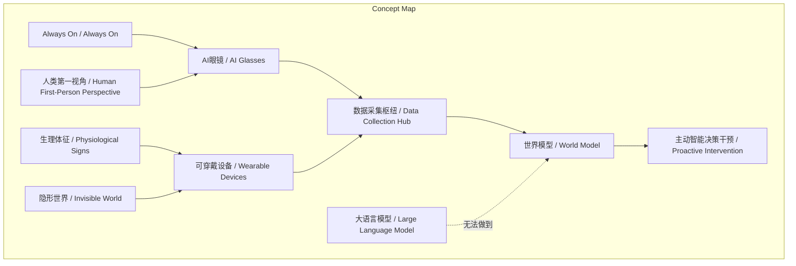
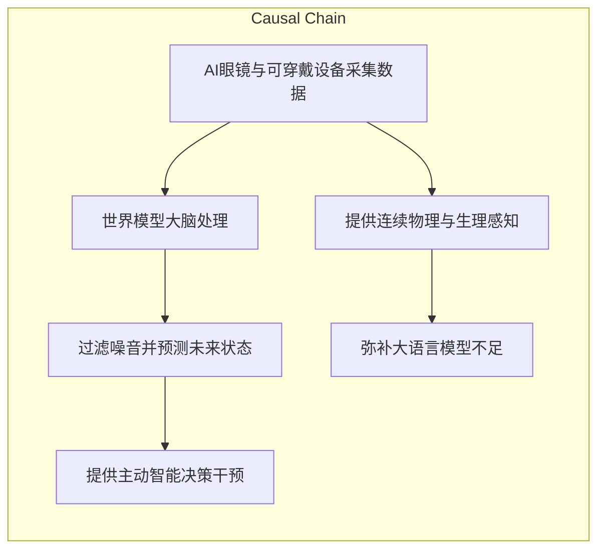

> AI眼镜通过Always On、人类第一视角、细粒度生理监测和深入隐形场景四大维度，成为构建世界模型的核心数据采集枢纽，提供大语言模型缺乏的连续物理感知。

## 元信息
- 分类：`ai-software/models-research`
- 优先级：`high` (`13`)
- 文档类型：`text-summary`
- 来源分组：`news`
- 原始文件：`reports/news/2026-03-21/1774077547431-news-news-task-1774077435566-8c3m9t.md`
- 请求 ID：`1774077435566-8c3m9t`

## 原始内容

#### 文本总结

### AI眼镜：世界模型构建的关键数据枢纽

#### 整体结构化文档表达
##### 文档卡片
- 主题（中文/English）：AI眼镜与世界模型构建 / AI Glasses and World Model Construction
- 一句话摘要：AI眼镜通过Always On、人类第一视角、细粒度生理监测和深入隐形场景四大维度，成为构建世界模型的核心数据采集枢纽，提供大语言模型缺乏的连续物理感知。
- 目标读者：未提及
- 核心结论（3条）：
  1. AI眼镜及可穿戴设备是构建世界模型、实现“下载人类”的关键数据采集枢纽。
  2. 其四大核心维度提供了大语言模型缺乏的连续物理感知能力，能采集海量、原始、高维度的物理与生理数据。
  3. 采集的数据对接世界模型大脑后，可过滤噪音、预测未来状态，实现主动智能决策干预。

##### 内容结构树
1. 背景与问题定义：当前大语言模型仅依托文字符号，无法进行深入物理和生理维度的连续感知与预测；未来构建世界模型需要持续、多模态的数据采集，AI眼镜被视为关键枢纽。
2. 核心观点与关键证据：核心观点是AI眼镜通过四个维度辅助世界模型采集数据。证据：维度1 Always On实现无间断收集；维度2 人类第一视角捕捉连续、高维度、充满噪音的视觉流；维度3 获取细颗粒度生理体征与生活行为模式；维度4 深入隐形世界（如养老院）构建数据与决策反馈闭环。
3. 方法/机制/路径：AI眼镜采集庞杂数据，对接后端“世界模型大脑”，世界模型过滤海量噪音，预测未来状态变化，为人类提供主动智能决策干预（如压力提醒）。
4. 风险与边界条件：未提及
5. 结论与行动建议：结论是AI眼镜对世界模型构建至关重要；行动建议未明确提及，但文中设想医院为养老院老人配备设备以捕捉健康数据。

##### 结构化元数据（JSON）
```json
{
  "title": "AI眼镜：世界模型构建的关键数据枢纽",
  "topic_zh": "AI眼镜与世界模型构建",
  "topic_en": "AI Glasses and World Model Construction",
  "audience": "未提及",
  "claims": [
    "AI眼镜及可穿戴设备是构建世界模型、实现“下载人类”的关键数据采集枢纽",
    "其四大核心维度提供了大语言模型缺乏的连续物理感知能力",
    "数据对接世界模型可实现主动智能决策干预"
  ],
  "evidence": [
    "Always On特性实现无间断数据收集",
    "人类第一视角捕捉连续、高维度、充满噪音的视觉流",
    "获取细颗粒度生理体征与生活行为模式",
    "深入隐形世界构建数据与决策反馈闭环"
  ],
  "risks": [],
  "actions": []
}
```

#### 处理流程
未提及

#### 概念清单（中英文）
- AI眼镜 / AI Glasses
- 可穿戴设备 / Wearable Devices
- 世界模型 / World Model
- 下载人类 / Download Human
- 数据采集枢纽 / Data Collection Hub
- 谢赛宁 / Xie Sai Ning
- Always On / Always On
- 大语言模型 / Large Language Model (LLM)
- 人类第一视角 / Human First-Person Perspective
- 连续视觉流 / Continuous Visual Stream
- 物理世界 / Physical World
- 无限物理细节 / Infinite Physical Details
- 因果规律 / Causality
- 原始信号 / Raw Signals
- infinite tokens / infinite tokens
- 生理体征 / Physiological Signs
- 生活行为模式 / Life Behavior Patterns
- 心跳频率 / Heart Rate
- 隐形世界 / Invisible World
- 反向OpenAI模式 / Reverse OpenAI Model
- 硅谷巨头 / Silicon Valley Giants
- 垂直场景 / Vertical Scenarios
- 养老院 / Nursing Home
- 医疗记录 / Medical Records
- 世界模型大脑 / World Model Brain
- 海量噪音 / Massive Noise
- 未来状态变化 / Future State Changes
- 主动智能决策干预 / Proactive Intelligent Decision Intervention
- 压力 / Stress
- 休假休息 / Rest and Vacation

#### 概念定义（中英文）
- AI眼镜 / AI Glasses: 未来可穿戴设备，具备“Always On”特性，用于无间断采集人类第一视角的视觉流及生理数据。
- 可穿戴设备 / Wearable Devices: 可随身佩戴的电子设备，能持续监控生理体征和生活行为模式。
- 世界模型 / World Model: 旨在理解真实物理世界、预测未来状态变化的模型，通过处理海量多模态数据实现。
- 下载人类 / Download Human: 指通过数据采集和模型构建，将人类经验、行为模式等数字化并复现的设想目标。
- 数据采集枢纽 / Data Collection Hub: 指AI眼镜及可穿戴设备作为中心节点，持续汇聚多源数据的作用。
- Always On / Always On: 设备无间断运行、持续工作的特性。
- 大语言模型 / Large Language Model (LLM): 当前主要基于文本符号进行训练和推理的AI模型，缺乏连续物理感知能力。
- 人类第一视角 / Human First-Person Perspective: 从人类双眼角度直接捕捉的视觉信息，未经提纯的原始视角。
- 连续视觉流 / Continuous Visual Stream: 人类视觉系统接收的连续、高维度、包含噪音的原始画面序列。
- 物理世界 / Physical World: 客观存在的物质世界，包含无限细节和因果规律。
- 原始信号 / Raw Signals: 未经加工或提纯的原始数据，如连续视觉流、生理数据。
- infinite tokens / infinite tokens: 指连续视觉流中蕴含的无限信息单元，类比于文本中的token。
- 生理体征 / Physiological Signs: 身体可测量的指标，如心跳频率、睡眠质量等。
- 生活行为模式 / Life Behavior Patterns: 日常生活中的细微行为习惯，如饮咖啡时间、运动动作。
- 隐形世界 / Invisible World: 指对大型科技公司而言难以获取的垂直场景真实物理数据（如养老院日常）。
- 世界模型大脑 / World Model Brain: 指处理AI眼镜采集数据、进行预测和决策的核心模型系统。
- 海量噪音 / Massive Noise: 原始数据中无关或干扰性的信息，需要被过滤。
- 主动智能决策干预 / Proactive Intelligent Decision Intervention: 模型基于预测主动向人类提供建议或提醒的行为。

#### 概念关联与逻辑关系（中英文）
1. AI眼镜 / AI Glasses 与 可穿戴设备 / Wearable Devices 共同作为 数据采集枢纽 / Data Collection Hub，为 世界模型 / World Model 提供训练数据。
   - 形式化：数据采集枢纽 = AI眼镜 + 可穿戴设备
2. Always On / Always On 特性 使得 AI眼镜 / AI Glasses 能够实现 无间断数据收集 / Continuous Data Collection，从而捕获 连续视觉流 / Continuous Visual Stream。
   - 形式化：Always On → 无间断数据收集 → 连续视觉流
3. 人类第一视角 / Human First-Person Perspective 捕捉的 原始信号 / Raw Signals（包括 连续视觉流 和 生理体征） 输入 世界模型大脑 / World Model Brain 后，经处理产生 主动智能决策干预 / Proactive Intervention。
   - 形式化：人类第一视角 + 生理体征 → 世界模型大脑 → 主动干预

#### COT逻辑梳理
- Step 1 (定义): 明确核心问题——当前大语言模型（LLM）仅处理文本符号，无法实现连续物理感知；世界模型需理解物理世界并预测未来，依赖多模态数据。
- Step 2 (分类): 将AI眼镜的数据采集能力分为四个维度：Always On（时间连续性）、人类第一视角（空间与模态）、细粒度生理（生物信号）、隐形世界（场景覆盖）。
- Step 3 (比较): 对比LLM（间歇性、文本提纯、离散符号）与世界模型所需数据（无间断、原始信号、连续流），突出AI眼镜提供的互补性。
- Step 4 (因果): 建立因果链：AI眼镜采集数据（因）→ 世界模型过滤噪音并预测（过程）→ 主动干预（果）；同时，四大维度共同导致数据质量提升。
- Step 5 (科学方法论): 采用实证方法——通过可穿戴设备在真实场景（如养老院）持续收集数据，验证世界模型在预测和决策上的有效性，形成“采集-处理-干预”闭环。

#### 事实与看法
##### 事实
- AI眼镜具备“always on”特性，能无间断工作。
- AI眼镜能实时记录人类双眼看到的一切连续、高维度且充满噪音的视觉流。
- 可穿戴设备能时刻监控身体体征（如心跳频率）和生活细节（如饮咖啡时间）。
- 世界模型通过过滤海量噪音，可预测未来状态变化。
- 大语言模型目前仅依托文字符号运作。
##### 看法
- AI眼镜及可穿戴设备是构建世界模型、实现“下载人类”的“至关重要的数据采集枢纽”。
- 连续视觉流是“包含了无限物理细节和因果规律的原始信号（infinite tokens）”。
- 大语言模型对深入物理和生理维度的连续感知与预测“完全无法做到”。
- 医院为养老院老人配备设备能“实时捕捉老人的行为模式、日常服药情况、心情和健康状态”。

#### FAQ（原文问题整理）
未发现明确提问（原文均为陈述句）

#### Visualization
##### Mermaid 图 1（概念结构图）


##### Mermaid 图 2（逻辑/因果图）


#### 文章中的类比
未发现明确类比

#### 10个金句
1. 未来AI眼镜及可穿戴设备将成为构建世界模型、实现“下载人类”至关重要的数据采集枢纽。
2. 它们能一刻不停歇地工作，时刻将人类处于真实物理世界中的状态转化为海量的数据流输入到系统中。
3. 世界模型的核心在于理解真实物理世界，而AI眼镜能够实时记录下人类双眼所能看到的一切连续、高维度且充满噪音的视觉流。
4. 这些画面不再是被人类提纯过的文本描述，而是包含了无限物理细节和因果规律的原始信号（infinite tokens）。
5. 除了视觉信号，可穿戴设备还能时刻监控人类的身体体征（如实时的心跳频率）以及极其微小的生活细节。
6. 它能精准记录你今天几点喝了一杯咖啡、这杯咖啡如何影响了你晚上的睡眠质量。
7. 大量真实世界的物理数据对硅谷巨头来说是隐形的，而AI眼镜可以深入这些垂直场景。
8. 如果医院给养老院里的每一个老人配备这种设备，它就能实时捕捉老人的行为模式、日常服药情况、心情和健康状态。
9. 世界模型通过过滤海量噪音，预测未来的状态变化，进而为人类提供主动的智能决策干预。
10. 这种深入物理和生理维度的连续感知与预测，是目前仅依托文字符号运作的大语言模型完全无法做到的。
