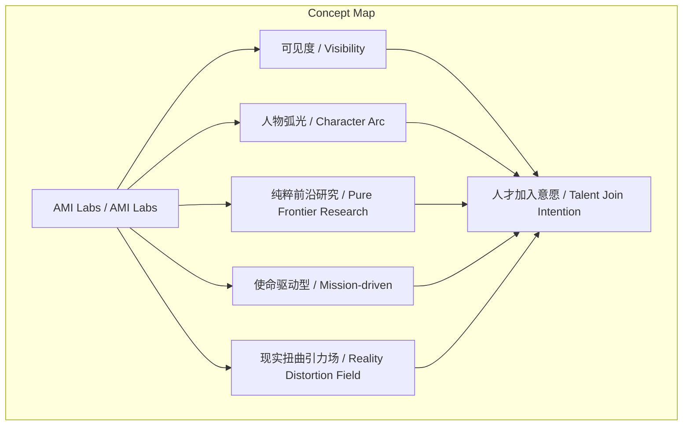
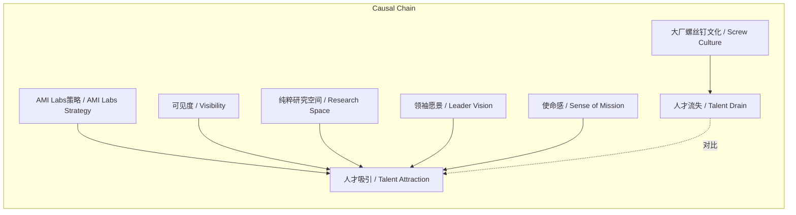

> AMI Labs通过科研愿景、反内卷文化、领袖魅力等非薪酬因素，吸引顶尖AI人才放弃大厂高额期权。

## 元信息
- 分类：`ai-software/models-research`
- 优先级：`high` (`13`)
- 文档类型：`text-summary`
- 来源分组：`news`
- 原始文件：`reports/news/2026-03-21/1774078445044-news-news-task-1774078330174-kew9ra.md`
- 请求 ID：`1774078330174-kew9ra`

## 原始内容

#### 文本总结

### AMI Labs以非薪酬策略吸引AI顶尖人才

#### 整体结构化文档表达
##### 文档卡片
- 主题（中文/English）：AI人才吸引策略 / AI Talent Attraction Strategy
- 一句话摘要：AMI Labs通过科研愿景、反内卷文化、领袖魅力等非薪酬因素，吸引顶尖AI人才放弃大厂高额期权。
- 目标读者：AI行业管理者、创业者、人力资源从业者、组织文化研究者
- 核心结论（3条）：
  1. 非薪酬因素（愿景、文化、领袖）是吸引顶尖AI人才的核心竞争力。
  2. 赋予个人“可见度”与“人物弧光”能有效对抗大厂“螺丝钉”文化。
  3. 领袖的清晰愿景与放权管理形成强大的精神感召力，驱动人才选择。

##### 内容结构树
1. 背景与问题定义：硅谷大厂为赢得模型竞赛，趋向标准化与产品周期驱动，剥夺研究员个人色彩与探索空间，导致人才流失。
2. 核心观点与关键证据：AMI Labs通过五大维度吸引人才——拒绝螺丝钉文化、提供纯粹科研氧气、招募潜力股、领袖引力场与放权、唤醒理想主义。
3. 方法/机制/路径：保留20%-30%纯粹研究时间；采用“划帆船”管理哲学；聚焦世界模型基础研究；招募使命驱动型人才。
4. 风险与边界条件：未提及明确风险；策略高度依赖领袖个人魅力，可持续性可能受挑战。
5. 结论与行动建议：总结AMI Labs模式以非薪酬激励为核心；建议其他组织借鉴但需评估文化适配性（原文未提供具体行动建议）。

##### 结构化元数据（JSON）
```json
{
  "title": "AMI Labs以非薪酬策略吸引AI顶尖人才",
  "topic_zh": "AI人才吸引策略",
  "topic_en": "AI Talent Attraction Strategy",
  "audience": "AI行业管理者、创业者、人力资源从业者、组织文化研究者",
  "claims": [
    "非薪酬因素是吸引顶尖AI人才的关键",
    "赋予个人可见度与成长弧光能对抗大厂螺丝钉文化",
    "领袖愿景与放权管理形成精神感召力"
  ],
  "evidence": [
    "人才放弃OpenAI/Meta数千万美元期权加入AMI Labs",
    "保留20%-30%纯粹前沿研究空间",
    "招募使命驱动型潜力股而非已成名超级英雄",
    "LeCun的现实扭曲引力场与帆船式管理",
    "人才因使命感舍弃1500-2000万美元期权"
  ],
  "risks": [],
  "actions": []
}
```

#### 处理流程
1. 输入识别：用户提供谢赛宁关于AMI Labs吸引人才策略的分享文本。
2. 信息抽取：抽取实体（AMI Labs、谢赛宁、Yann LeCun）、概念（可见度、人物弧光）、观点（反感大厂文化）和事实（人才放弃高薪）。
3. 结构化归纳：将内容归纳为五大策略维度，并映射至背景、观点、方法等结构。
4. 关系建模：建立概念间因果与关联，如“可见度”与“人物弧光”共同影响“人才加入”。
5. 可视化表达：设计Mermaid图展示概念结构与因果链。

#### 概念清单（中英文）
- AMI Labs / AMI Labs
- 谢赛宁 / Xie Saining
- OpenAI / OpenAI
- Meta / Meta
- 大厂 / Large Tech Companies
- Neo Labs / Neo Labs
- 可见度 / Visibility
- 人物弧光 / Character Arc
- 产品周期 / Product Cycle
- 纯粹前沿研究 / Pure Frontier Research
- 世界模型基础研究 / World Model Fundamental Research
- 超级英雄 / Superhero
- 潜力股 / High-Potential Talent
- 使命驱动型 / Mission-driven
- Yann LeCun / Yann LeCun
- 杨立昆 / Yang Likun
- 现实扭曲引力场 / Reality Distortion Field
- 帆船式管理 / Sailing Management
- 自主决断权 / Autonomy
- 精神电池 / Spiritual Battery
- 理想主义 / Idealism
- 使命感 / Sense of Mission

#### 概念定义（中英文）
- 可见度 / Visibility：研究员的个人贡献被公开认可和展示的程度，AMI Labs承诺给予年轻人充分可见度。
- 人物弧光 / Character Arc：研究员在职业发展中成长和变化的轨迹，AMI Labs希望年轻人拥有自己的“人物弧光”以成长为顶尖研究员。
- 产品周期 / Product Cycle：科技公司为追赶产品发布而设定的时间表，常压缩研究空间。
- 纯粹前沿研究 / Pure Frontier Research：无短期产品目标、以科学突破为导向的基础探索，AMI Labs保留20%-30%此类空间。
- 世界模型基础研究 / World Model Fundamental Research：针对AI世界模型的基础性科学研究，AMI Labs被视为该领域的唯一可行之地。
- 超级英雄 / Superhero：已功成名就、发表过改变历史级论文的AI研究者，AMI Labs不刻意招募此类人才。
- 潜力股 / High-Potential Talent：能力极强、声誉良好但尚未广为人知、极度专注解决问题的使命驱动型人才。
- 使命驱动型 / Mission-driven：以解决重大科学问题为内在动力，而非外部奖励的人才类型。
- 现实扭曲引力场 / Reality Distortion Field：领袖通过极度清晰且坚定的愿景，使周围人克服挑战、相信可能性的感染力（类比自乔布斯）。
- 帆船式管理 / Sailing Management：领袖给予充分信任与自主权，仅在必要时校正方向的管理哲学。
- 自主决断权 / Autonomy：个人在决策和行动上的独立控制权，AMI Labs研究员享有此权。
- 精神电池 / Spiritual Battery：领袖的愿景感召力，为人才提供持续的精神激励。
- 理想主义 / Idealism：追求崇高目标而非短期利益的价值取向。
- 使命感 / Sense of Mission：对参与改变AI历史进程的强烈责任感和信念。

#### 概念关联与逻辑关系（中英文）
1. AMI Labs的“可见度”策略与“人物弧光”目标共同影响“人才加入意愿”。
   - AMI Labs / AMI Labs 的 “可见度” / Visibility 策略 与 “人物弧光” / Character Arc 目标 共同影响 “人才加入意愿” / Talent Join Intention
2. “纯粹前沿研究空间”与“领袖愿景”共同导致“人才舍弃高薪”。
   - “纯粹前沿研究空间” / Pure Frontier Research Space 与 “领袖愿景” / Leader Vision 共同导致 “人才舍弃高薪” / Talent Reject High Salary
3. “使命驱动型人才”与“自主决断权”环境相互增强“理想主义唤醒”。
   - “使命驱动型人才” / Mission-driven Talent 与 “自主决断权” / Autonomy 环境 相互增强 “理想主义唤醒” / Idealism Awakening

#### COT逻辑梳理（定义/分类/比较/因果/科学方法论）
- Step 1（定义问题）：硅谷大厂为赢得大模型军备竞赛，推行“产品周期”驱动，将研究员变为“螺丝钉”，剥夺“可见度”与探索空间，引发人才流失。
- Step 2（分类策略）：AMI Labs从五个维度提供非薪酬激励：1) 个人成长维度（可见度、人物弧光）；2) 研究环境维度（纯粹前沿研究空间）；3) 人才选拔维度（招募潜力股而非超级英雄）；4) 领导力维度（现实扭曲引力场、帆船式管理）；5) 动机维度（唤醒理想主义与使命感）。
- Step 3（比较差异）：与大厂相比，AMI Labs更侧重长期科学突破而非短期产品，更尊重个人贡献与自主性，更依赖愿景而非权威。
- Step 4（因果分析）：这些策略满足顶尖人才的自主（Autonomy）、专精（Mastery）、目的（Purpose）需求，使其甘愿放弃高薪期权，选择AMI Labs。
- Step 5（科学方法论）：基于对人才动机的实证理解，采用“愿景驱动+放权执行”的方法论，通过文化设计而非薪酬竞争吸引人才。

#### 事实与看法（病毒）
##### 事实
- AMI Labs是一家初创公司。
- 谢赛宁进行了相关分享。
- 许多顶尖人才放弃了OpenAI或Meta提供的几千万美元期权加入AMI Labs。
- AMI Labs保留20%到30%的纯粹前沿研究空间。
- Yann LeCun是AMI Labs的执行董事长，图灵奖得主。
- 人才面对1500万到2000万美元的期权诱惑仍选择加入AMI Labs。
##### 看法
- 谢赛宁极其反感大厂抹杀个人贡献的做法。
- AMI Labs被视为“唯一一个可以真正做世界模型基础研究的地方”。
- “一个人很难被闪电击中两次”（已成名者难再突破）。
- LeCun身上有类似乔布斯的“现实扭曲引力场”。
- 人才因强烈使命感而舍弃短期财务回报。

#### FAQ（原文问题整理）
- 未发现明确提问

#### Visualization
##### Mermaid 图 1（概念结构图）

##### Mermaid 图 2（逻辑/因果图）


#### 文章中的类比
- 大厂螺丝钉
- 人物弧光
- 纯粹科研氧气
- 超级英雄
- 潜力股
- 现实扭曲引力场
- 帆船式管理
- 精神电池

#### 10个金句
1. “一个人很难被闪电击中两次”
2. “起床、吃饭、洗澡时都在思考这一个问题”
3. “赋予年轻人‘可见度’与‘人物弧光’”
4. “保留了20%到30%的纯粹前沿研究空间”
5. “唯一一个可以真正做这件事情（世界模型基础研究）的地方”
6. “身上有一种类似乔布斯的‘现实扭曲引力场’”
7. “采用他热爱的‘划帆船’哲学”
8. “给予每个人充分的信任与自主决断权”
9. “甘愿舍弃短期的巨大财务回报”
10. “相信自己在这里有机会真正参与并改变人工智能的历史进程”
