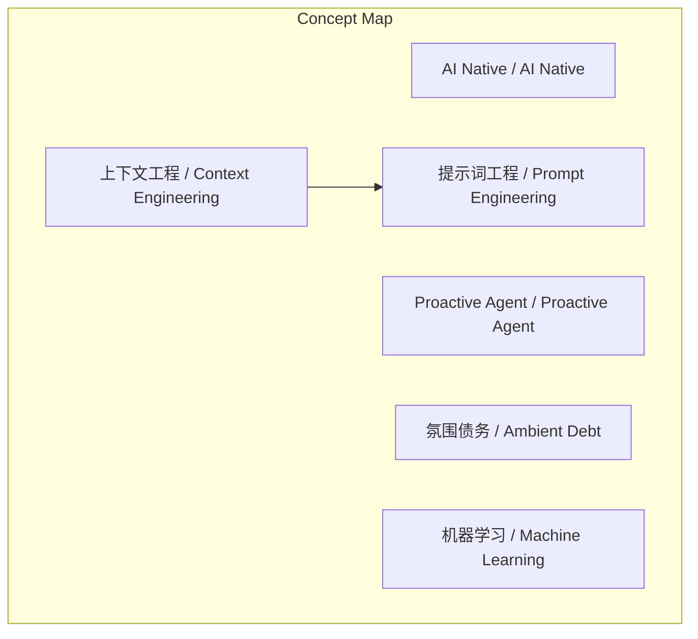
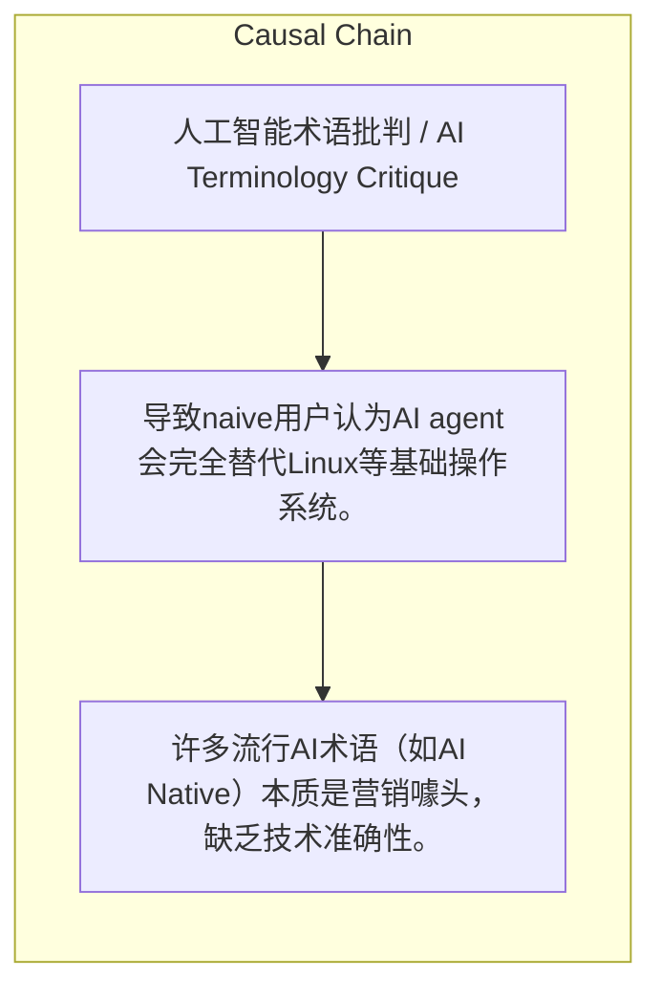

> 本文批判了多个AI流行术语，指出它们多为营销手段而非准确技术描述，并警告危险的类比可能误导用户。

## 元信息
- 分类：`ai-software/models-research`
- 优先级：`high` (`13`)
- 文档类型：`text-summary`
- 来源分组：`news`
- 原始文件：`reports/news/2026-03-22/1774198375414-news-news-task-1774198262492-nfpmvh.md`
- 请求 ID：`1774198262492-nfpmvh`

## 原始内容

#### 文本总结

##### 运行信息
- model: stepfun/step-3.5-flash:free
- schema_fallback: yes
- attempted_models: stepfun/step-3.5-flash:free

### AI术语鉴伪：批判流行营销词汇

#### 整体结构化文档表达
##### 文档卡片
- 主题（中文/English）：人工智能术语批判 / AI Terminology Critique
- 一句话摘要：本文批判了多个AI流行术语，指出它们多为营销手段而非准确技术描述，并警告危险的类比可能误导用户。
- 目标读者：未提及
- 核心结论（3条）：
- 许多流行AI术语（如AI Native）本质是营销噱头，缺乏技术准确性。
- 将AI Agent类比为新操作系统是危险误导，掩盖了其作为统计模型的本质。
- Context Engineering是准确且实用的概念，应取代过渡性的Prompt Engineering和抽象的Harness。

##### 内容结构树
1. 背景与问题定义
2. 核心观点与关键证据
3. 方法/机制/路径
4. 风险与边界条件
5. 结论与行动建议

##### 结构化元数据（JSON）
```json
{
  "title": "AI术语鉴伪：批判流行营销词汇",
  "topic_zh": "人工智能术语批判",
  "topic_en": "AI Terminology Critique",
  "audience": "未提及",
  "claims": [
    "AI Native是类似cloud native的营销噱头，业界笑话如将loading改为thinking即宣称。",
    "Proactive Agent是故作神秘，将基本统计预测包装成高大上buzzword。",
    "Ambient Debt是开发者甩锅技术债务给AI的借口。",
    "Machine Learning是误导性名称，造成像人脑学习的错误印象。",
    "Context Engineering是准确且实用的概念。",
    "AI Agent=OS类比错误，LLM不是CPU，AI agent不严格管理资源。"
  ],
  "evidence": [
    "软件'loading'改成'thinking'就宣称是AI Native。",
    "LLM只是统计概率模型，非严格指令驱动硬件。",
    "AI agent仅在loosely模仿'资源调度'，非严格管理。",
    "AI模型无长期记忆，依赖外部上下文窗口；输入混乱会导致失败。"
  ],
  "risks": [
    "导致naive用户认为AI agent会完全替代Linux等基础操作系统。",
    "类比不是技术的本质，会让人误解技术实际如何工作。"
  ],
  "actions": []
}
```

#### 处理流程
1. 输入识别
2. 信息抽取（实体、概念、问题、事实、观点）
3. 结构化归纳（定义/分类/比较/因果/方法论）
4. 关系建模（概念关系、等式/方程/逻辑链）
5. 可视化表达（Mermaid）

#### 概念清单（中英文）
- AI Native / AI Native
- Proactive Agent / Proactive Agent
- 氛围债务 / Ambient Debt
- 机器学习 / Machine Learning
- 上下文工程 / Context Engineering
- 提示词工程 / Prompt Engineering
- Harness / Harness
- AI Agent / AI Agent
- 操作系统 / Operating System
- LLM / LLM
- CPU / CPU
- 上下文 / Context

#### 概念定义（中英文）
##### AI Native / AI Native
- 中文定义：营销噱头，类似cloud native；业界笑话：将软件loading改为thinking即宣称。
- English Definition: Marketing buzzword similar to cloud native; industry joke: claiming AI Native for changing software 'loading' to 'thinking'.

##### Proactive Agent / Proactive Agent
- 中文定义：故作神秘，将基本的统计预测机制包装成高大上的buzzword。
- English Definition: Pretentious buzzword that packages basic statistical prediction mechanisms as something advanced.

##### 氛围债务 / Ambient Debt
- 中文定义：从'ambient coding'衍生，被嘲讽为开发者把自己的技术债务甩锅给AI的借口。
- English Definition: Derived from 'ambient coding'; sarcastic term for developers shifting blame for technical debt to AI.

##### 机器学习 / Machine Learning
- 中文定义：误导性名称，造成'像人脑一样学习'的错误印象；实际只是统计预测和数学参数训练。
- English Definition: Misleading name implying 'learning like human brain'; actually just statistical prediction and mathematical parameter training.

##### 上下文工程 / Context Engineering
- 中文定义：准确且实用的概念：AI模型无长期记忆，依赖外部上下文窗口；必须系统地约束、过滤、优先排序输入数据。
- English Definition: Accurate and practical concept: AI models have no long-term memory, rely on external context window; developers must systematically constrain, filter, and prioritize input data.

##### 提示词工程 / Prompt Engineering
- 中文定义：过渡阶段；好的终端产品不应该让用户'工程化'提示词。
- English Definition: Transitional phase; good end products should not require users to 'engineer' prompts.

##### Harness / Harness
- 中文定义：更新更抽象的buzzword，试图替代context engineering。
- English Definition: Newer, more abstract buzzword attempting to replace context engineering.

##### AI Agent / AI Agent
- 中文定义：被类比为操作系统，但实际只是loosely模仿'资源调度'。
- English Definition: Analogized to operating system but actually only loosely mimics 'resource scheduling'.

##### 操作系统 / Operating System
- 中文定义：严格管理硬件、驱动、内核安全、I/O的平台。
- English Definition: Platform that strictly manages hardware, drivers, kernel security, I/O.

##### LLM / LLM
- 中文定义：在类比中比作CPU，但只是统计概率模型。
- English Definition: Compared to CPU in analogy but is merely a statistical probability model.

##### CPU / CPU
- 中文定义：严格的指令驱动硬件。
- English Definition: Strictly instruction-driven hardware.

##### 上下文 / Context
- 中文定义：在类比中比作RAM，但AI agent的上下文管理不同于RAM。
- English Definition: Compared to RAM in analogy but AI agent's context management differs from RAM.


#### 概念关联与逻辑关系（中英文）
- 上下文工程/Context Engineering -> 提示词工程/Prompt Engineering | concept | is more accurate than
- 上下文工程/Context Engineering -> Harness/Harness | concept | is more accurate than
- AI Agent/AI Agent -> 操作系统/Operating System | concept | is not equivalent to

##### 可形式化关系
- AI Native ≡ Marketing Hype
- Context Engineering ⊨ Effective AI Interaction
- AI Agent ≢ OS

#### COT逻辑梳理（定义/分类/比较/因果/科学方法论）
- Step 1: 识别并批判流行AI术语（AI Native, Proactive Agent, Ambient Debt, Machine Learning）的营销本质和误导性。
- Step 2: 提出Context Engineering作为准确概念，并对比其与Prompt Engineering和Harness的优劣。
- Step 3: 警告AI Agent与OS的类比危害，强调类比非技术本质，可能误导用户。

#### 事实与看法（区分）
##### 事实
- AI模型没有长期记忆，完全依赖外部上下文窗口。
- 输入混乱、矛盾、无优先级的文本会导致AI失败。
- LLM只是统计概率模型，不是严格的指令驱动硬件。
- AI agent仅在loosely模仿'资源调度'。

##### 看法
- AI Native是业界笑话。
- Proactive Agent故作神秘。
- Ambient Debt是开发者甩锅技术债务给AI的借口。
- Machine Learning是误导性名称。
- AI Agent=OS类比是危险的。

#### FAQ（原文问题整理）
- 未发现明确 FAQ

#### Visualization
##### Mermaid 图 1（概念结构图）


##### Mermaid 图 2（逻辑/因果图）


#### 文章中的类比
- AI Agent = 新操作系统
- LLM = CPU
- Context = RAM

#### 10个金句
- 原文未提供
