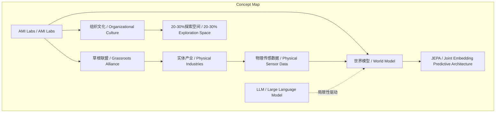
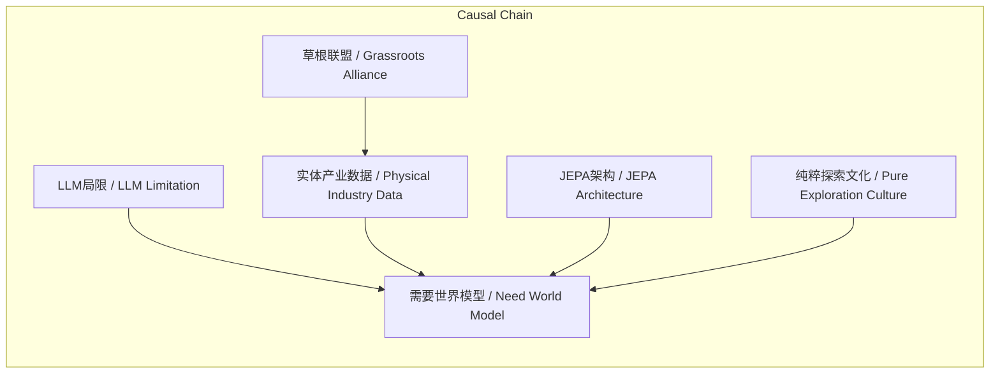

> AMI Labs旨在通过构建物理世界模型、联合实体产业形成草根联盟、建立纯粹探索文化，突破大语言模型局限，推动AI科学革命。

## 元信息
- 分类：`ai-software/models-research`
- 优先级：`high` (`13`)
- 文档类型：`text-summary`
- 来源分组：`news`
- 原始文件：`reports/news/2026-03-21/1774077876742-news-news-task-1774077813612-enwebk.md`
- 请求 ID：`1774077813612-enwebk`

## 原始内容

#### 文本总结

### AMI Labs：打造物理世界模型，探索AI新范式

#### 整体结构化文档表达
##### 文档卡片
- 主题（中文/English）：AMI Labs愿景 / AMI Labs Vision
- 一句话摘要：AMI Labs旨在通过构建物理世界模型、联合实体产业形成草根联盟、建立纯粹探索文化，突破大语言模型局限，推动AI科学革命。
- 目标读者：AI研究者、产业决策者、科技投资者
- 核心结论（3条）：
  1. 核心技术是打造基于物理信号处理的“世界模型”，而非局限于语言工具的LLM。
  2. 商业路径采用“反向”策略，联合实体产业组建去中心化“草根联盟”以获取物理数据。
  3. 组织文化定位为介于学术与商业大厂之间，保留20%-30%空间以促进纯粹前沿探索。

##### 内容结构树
1. 背景与问题定义：硅谷被LLM主导，但LLM缺乏物理理解，实体产业拥有未被利用的物理传感数据且面临AI焦虑。
2. 核心观点与关键证据：世界模型是通向人类级别智能的基石；JEPA是核心架构；草根联盟模式可解决数据获取问题；硅谷“内卷”挤压纯粹探索空间。
3. 方法/机制/路径：采用JEPA处理连续高维物理信号；通过草根联盟合作解决真实物理问题以收集数据；组织保留20%-30%探索空间。
4. 风险与边界条件：未提及明确风险或边界条件。
5. 结论与行动建议：AMI Labs不追逐LLM赛道，而是探索物理世界，构建通用机器智能大脑；行动包括联合产业、提供研究员友好环境。

##### 结构化元数据（JSON）
```json
{
  "title": "AMI Labs：打造物理世界模型，探索AI新范式",
  "topic_zh": "AMI Labs愿景",
  "topic_en": "AMI Labs Vision",
  "audience": "AI研究者、产业决策者、科技投资者",
  "claims": ["核心技术是打造基于物理信号处理的“世界模型”，而非局限于语言工具的LLM", "商业路径采用“反向”策略，联合实体产业组建去中心化“草根联盟”以获取物理数据", "组织文化定位为介于学术与商业大厂之间，保留20%-30%空间以促进纯粹前沿探索"],
  "evidence": ["谢赛宁与杨立昆共同创办AMI Labs", "JEPA是联合嵌入预测架构", "草根联盟比喻为小银行联合创立Mastercard模式", "硅谷大型科技公司深陷LLM打榜和产品发布", "组织保留20%-30%纯粹前沿探索空间"],
  "risks": ["未提及"],
  "actions": ["联合实体产业组建草根联盟以获取物理传感数据", "提供“对研究员友好”的环境并给予试错空间", "采用JEPA架构构建世界模型"]
}
```

#### 处理流程
1. 输入识别（来源：用户输入文本）
2. 信息抽取（实体、概念、问题、事实、观点）
3. 结构化归纳（定义/分类/比较/因果/方法论）
4. 关系建模（概念关系、等式/方程/逻辑链）
5. 可视化表达（Mermaid）

#### 概念清单（中英文）
- 谢赛宁 / Xie Saining
- 杨立昆 / Yann LeCun
- AMI Labs / AMI Labs
- 大语言模型 / Large Language Model (LLM)
- 世界模型 / World Model
- 预测性大脑 / Predictive Brain
- Transformer / Transformer
- ChatGPT / ChatGPT
- 人类级别智能 / Human-level Intelligence
- JEPA / Joint Embedding Predictive Architecture (JEPA)
- 联合嵌入预测架构 / Joint Embedding Predictive Architecture
- 物理信号 / Physical Signals
- 因果推理 / Causal Reasoning
- OpenAI / OpenAI
- 反向的OpenAI / Reverse OpenAI
- 实体产业 / Physical Industries
- 草根联盟 / Grassroots Alliance
- Mastercard / Mastercard
- Visa / Visa
- 硅谷 / Silicon Valley
- 内卷 / Involution
- 前沿探索 / Frontier Exploration
- 高校学术实验室 / Academic Laboratories
- 商业大厂 / Commercial Giants
- 大航海时代 / Age of Exploration
- 通用机器智能大脑 / General Machine Intelligence Brain

#### 概念定义（中英文）
- 谢赛宁 / Xie Saining：AMI Labs联合创始人，与杨立昆共同推动世界模型研究。
- 杨立昆 / Yann LeCun：AMI Labs联合创始人，图灵奖得主，AI领域权威。
- AMI Labs / AMI Labs：由谢赛宁与杨立昆共同创办的研究机构，致力于打造物理世界模型。
- 大语言模型 / Large Language Model (LLM)：基于海量文本训练的语言模型，本质为交流工具，缺乏物理理解。
- 世界模型 / World Model：能理解物理世界、预测未来状态并进行因果推理的底层认知架构。
- 预测性大脑 / Predictive Brain：世界模型的功能描述，强调预测能力。
- Transformer / Transformer：大语言模型的核心架构，引发AI革命。
- ChatGPT / ChatGPT：基于Transformer的对话模型，代表LLM应用高峰。
- 人类级别智能 / Human-level Intelligence：与人类相当的通用智能水平。
- JEPA / Joint Embedding Predictive Architecture (JEPA)：一种联合嵌入预测架构，用于构建世界模型，处理物理信号。
- 联合嵌入预测架构 / Joint Embedding Predictive Architecture：JEPA的中文全称，一种预测性架构。
- 物理信号 / Physical Signals：来自物理世界的连续、高维度、充满噪音的传感数据。
- 因果推理 / Causal Reasoning：基于因果关系进行推理和规划的能力。
- OpenAI / OpenAI：以互联网文本训练LLM并推向市场的典型AI公司。
- 反向的OpenAI / Reverse OpenAI：AMI Labs提出的路径，从实体产业物理问题出发获取数据，而非从互联网文本。
- 实体产业 / Physical Industries：如农场、医院、工厂等拥有物理传感数据的产业。
- 草根联盟 / Grassroots Alliance：由AMI Labs联合实体产业形成的去中心化合作组织，类比小银行联合创立Mastercard。
- Mastercard / Mastercard：全球支付公司，由小银行联合创立以抗衡Visa。
- Visa / Visa：全球支付公司，作为草根联盟类比中的抗衡对象。
- 硅谷 / Silicon Valley：全球科技中心，当前深陷LLM竞争。
- 内卷 / Involution：在有限赛道（如LLM打榜）中过度竞争，挤压探索空间。
- 前沿探索 / Frontier Exploration：自下而上、定义新问题的纯粹科学研究。
- 高校学术实验室 / Academic Laboratories：以自由探索为特征的学术研究环境。
- 商业大厂 / Commercial Giants：高度封闭、以产品为导向的大型科技公司。
- 大航海时代 / Age of Exploration：比喻AMI Labs志在探索未知物理世界的新时代。
- 通用机器智能大脑 / General Machine Intelligence Brain：超越语言边界的通用智能系统。

#### 概念关联与逻辑关系（中英文）
1. 世界模型 / World Model 的实现依赖于 JEPA / Joint Embedding Predictive Architecture 作为核心架构。
   - 形式化：World_Model = f(JEPA, Physical_Signals)
2. 草根联盟 / Grassroots Alliance 的构建旨在获取 物理传感数据 / Physical Sensor Data，以训练 世界模型 / World Model。
   - 形式化：Grassroots_Alliance → Data_Acquisition → World_Model_Training
3. LLM / Large Language Model 的局限性（缺乏物理理解）驱动了 世界模型 / World Model 的需求。
   - 形式化：LLM_Limitation → Need_World_Model

#### COT逻辑梳理（定义/分类/比较/因果/科学方法论）
- Step 1 定义问题：当前AI以LLM为主，但LLM本质是语言工具，缺乏对物理世界的真实理解，无法实现人类级别智能。
- Step 2 分类：将AI路径分为两类——基于互联网文本的“正向”路径（如OpenAI）和基于物理世界的“反向”路径（如AMI Labs）。
- Step 3 比较：比较LLM与世界模型，LLM处理离散文本，世界模型处理连续物理信号；LLM擅长交流，世界模型擅长预测和规划。
- Step 4 因果分析：因LLM无法解决物理痛点，实体产业有数据但焦虑，故需反向路径；因硅谷内卷，故需独立组织文化。
- Step 5 科学方法论：通过草根联盟收集真实物理数据，应用JEPA架构构建可验证的世界模型，在保留探索空间的环境中迭代理论突破。

#### 事实与看法（病毒）
##### 事实
- 谢赛宁与杨立昆共同创办AMI Labs。
- AMI Labs愿景包含三个核心维度：技术、商业、组织。
- JEPA是联合嵌入预测架构。
- 草根联盟比喻为小银行联合创立Mastercard以抗衡Visa。
- 组织保留20%-30%纯粹前沿探索空间。
- 实体产业拥有非视觉、物理传感数据。
##### 看法
- LLM本质上是一种缺乏真实物理理解的“交流工具”。
- 硅谷大型科技公司深陷于LLM打榜和产品发布的“有限游戏”。
- 纯粹的、自下而上的科学探索空间被严重挤压。
- AMI Labs志在探索下一个大航海时代。
- 世界模型是通向人类级别智能的基石。

#### FAQ（原文问题整理）
- 未发现明确提问。原文为陈述性描述，未直接提出问题。

#### Visualization
##### Mermaid 图 1（概念结构图）

##### Mermaid 图 2（逻辑/因果图）


#### 文章中的类比
- 草根联盟比喻为当年众多小银行联合创立Mastercard以抗衡Visa的模式。
- 探索物理世界比喻为“下一个大航海时代”。

#### 10个金句
1. 打造真正理解物理世界的底层“世界模型”（预测性大脑）。
2. 当前的LLM虽然强大，但它本质上只是一种缺乏真实物理理解的“交流工具”。
3. 走一条“反向”之路：联合这些遍布全球的实体产业，组建一个去中心化的“草根联盟”。
4. 像当年众多小银行联合创立Mastercard以抗衡Visa的模式。
5. 介于高校学术实验室和高度封闭的商业大厂之间（大约保留20%-30%的纯粹前沿探索空间）。
6. 提供一个“对研究员友好”的环境，将那些有使命感、致力于定义新问题的年轻人聚集在一起。
7. 目标直指下一次AI领域的重大理论突破（breakthrough）。
8. 探索下一个大航海时代——深入真实的物理世界。
9. 用真正反共识的科研底色，去构建超越语言边界的通用机器智能大脑。
10. 原文未提供
