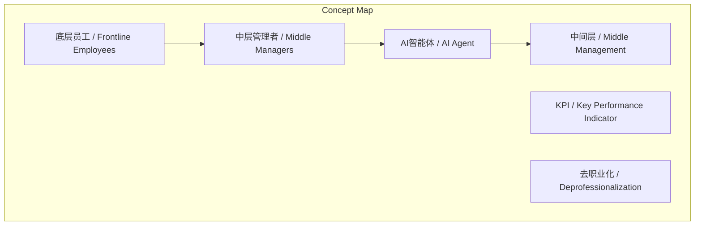
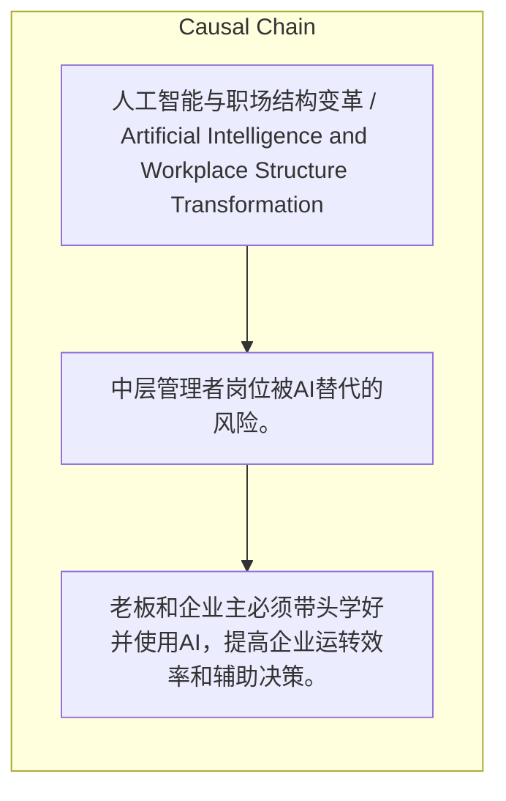

> 大模型将消灭职场中间层，工作模式向决策与验收两端集中，中层管理者面临最大危机且是AI应用的主要阻力。

## 元信息
- 分类：`ai-software/models-research`
- 优先级：`high` (`13`)
- 文档类型：`text-summary`
- 来源分组：`news`
- 原始文件：`reports/news/2026-03-23/1774274428408-news-news-task-1774274327743-qs9kcr.md`
- 请求 ID：`1774274327743-qs9kcr`

## 原始内容

#### 文本总结

##### 运行信息
- model: stepfun/step-3.5-flash:free
- schema_fallback: yes
- attempted_models: stepfun/step-3.5-flash:free

### AI将导致职场工作模式向决策与验收两端集中

#### 整体结构化文档表达
##### 文档卡片
- 主题（中文/English）：人工智能与职场结构变革 / Artificial Intelligence and Workplace Structure Transformation
- 一句话摘要：大模型将消灭职场中间层，工作模式向决策与验收两端集中，中层管理者面临最大危机且是AI应用的主要阻力。
- 目标读者：企业管理者、职场员工、AI研究者
- 核心结论（3条）：
- AI必然消灭中间商与职场中间层，未来工作流程向决策与验收两端集中。
- 中层管理者因岗位危机感成为企业推进AI的最大阻力。
- AI工具在公司普及呈自下而上特征，底层员工积极使用，中层管理者因KPI和怕麻烦而抗拒。

##### 内容结构树
1. 背景与问题定义
2. 核心观点与关键证据
3. 方法/机制/路径
4. 风险与边界条件
5. 结论与行动建议

##### 结构化元数据（JSON）
```json
{
  "title": "AI将导致职场工作模式向决策与验收两端集中",
  "topic_zh": "人工智能与职场结构变革",
  "topic_en": "Artificial Intelligence and Workplace Structure Transformation",
  "audience": "企业管理者、职场员工、AI研究者",
  "claims": [
    "大模型在商业上消灭中间商、在职场组织架构中消灭中间层是不可避免的趋势。",
    "未来的工作流程将主要向人类负责决策和验收的两端集中，中间执行环节由AI智能体完成。",
    "随着AI能力增强，决策和验收过程会变得越来越快、越来越简单。",
    "中层管理者对AI抵触情绪最大、阻力最强，因其深知业务被AI替代会导致饭碗不保。",
    "老板可能通过AI直接获取结果，跳过或裁掉中间管理层。",
    "AI工具在公司普及是自下而上的，底层优秀员工为提高效率积极使用。",
    "老板必须带头学好AI以提高企业效率和辅助决策，否则被时代抛弃。",
    "普通人最务实的方法是用AI加持自己，强化学习和输出能力，努力成为顶尖专家以跳出中间层陷阱。"
  ],
  "evidence": [
    "AI能力越来越强，决策和验收过程会变快变简单。",
    "中层管理者有强烈岗位危机感，业务被AI替代会保不住饭碗。",
    "VP或高管可直接通过指挥AI完成工作，无需中间层。",
    "底层员工为提高效率、省出时间'摸鱼'，会积极自由使用AI。",
    "中层管理者背负KPI或害怕麻烦，抗拒AI渗入。"
  ],
  "risks": [
    "中层管理者岗位被AI替代的风险。",
    "企业因拒绝AI应用而丧失竞争力的风险。",
    "知识工作者被'去职业化'淘汰的风险。"
  ],
  "actions": [
    "老板和企业主必须带头学好并使用AI，提高企业运转效率和辅助决策。",
    "普通打工人用AI疯狂加持自己，强化学习和输出能力，努力成为岗位或公司里最顶尖的专家。"
  ]
}
```

#### 处理流程
1. 输入识别
2. 信息抽取（实体、概念、问题、事实、观点）
3. 结构化归纳（定义/分类/比较/因果/方法论）
4. 关系建模（概念关系、等式/方程/逻辑链）
5. 可视化表达（Mermaid）

#### 概念清单（中英文）
- AI智能体 / AI Agent
- 中间层 / Middle Management
- 中层管理者 / Middle Managers
- 底层员工 / Frontline Employees
- KPI / Key Performance Indicator
- 去职业化 / Deprofessionalization

#### 概念定义（中英文）
##### AI智能体 / AI Agent
- 中文定义：指能够自主感知环境、决策并执行任务的AI系统，在文中指完成中间执行环节的AI。
- English Definition: An AI system capable of autonomously perceiving the environment, making decisions, and executing tasks, referring to AI that completes intermediate execution steps in the text.

##### 中间层 / Middle Management
- 中文定义：企业组织架构中位于高层和基层之间的管理者层级，在文中指可能被AI替代的中间管理层。
- English Definition: The managerial layer between senior leadership and frontline employees in corporate structure, referring to middle management that may be replaced by AI in the text.

##### 中层管理者 / Middle Managers
- 中文定义：企业中层管理人员，在文中指因AI替代而面临岗位危机的人群。
- English Definition: Middle-level managers in enterprises, referring to those facing job crisis due to AI substitution in the text.

##### 底层员工 / Frontline Employees
- 中文定义：企业基层员工，在文中指积极使用AI提高效率的人群。
- English Definition: Frontline employees in enterprises, referring to those who actively use AI to improve efficiency in the text.

##### KPI / Key Performance Indicator
- 中文定义：关键绩效指标，企业衡量员工绩效的量化指标，在文中指中层管理者因背负KPI而抗拒AI。
- English Definition: Key Performance Indicator, a quantitative metric used by companies to measure employee performance, referring to middle managers' resistance to AI due to KPI burdens in the text.

##### 去职业化 / Deprofessionalization
- 中文定义：某些职业因技术替代而失去专业特性和价值的过程，在文中指中间程度知识工作被AI替代导致的职业危机。
- English Definition: The process by which certain professions lose their professional characteristics and value due to technological substitution, referring to the career crisis caused by AI replacing intermediate knowledge work in the text.


#### 概念关联与逻辑关系（中英文）
- AI智能体/AI Agent -> 中间层/Middle Management | concept | 替代
- 中层管理者/Middle Managers -> AI智能体/AI Agent | concept | 抵触
- 底层员工/Frontline Employees -> 中层管理者/Middle Managers | concept | AI采用率负相关

##### 可形式化关系
- AI能力增强 → 决策/验收过程简化
- 中层管理者抵触情绪 ↑ → AI推进阻力 ↑
- 底层员工AI使用率 ↑ → 中层管理者AI使用率 ↓

#### COT逻辑梳理（定义/分类/比较/因果/科学方法论）
- Step 1: AI技术发展使中间执行环节自动化成为可能，大模型在商业和职场中消灭中间商与中间层。
- Step 2: 职场结构因此向人类负责决策与验收的两端集中，中间层岗位减少，中层管理者面临岗位危机并成为AI应用的主要阻力。
- Step 3: AI工具普及呈现自下而上特征，底层员工为效率积极使用，中层管理者因KPI和怕麻烦而抗拒，形成扩散模式。

#### 事实与看法（区分）
##### 事实
- 大模型在商业上消灭中间商、在职场组织架构中消灭中间层是明显且不可避免的趋势。
- 未来的工作流程将主要向'两头'集中：人类负责决策和验收，中间执行由AI智能体完成。
- 中层管理者对AI抵触情绪最大、阻力最强。
- AI工具在公司里的普及往往是'自下而上'的。

##### 看法
- 随着AI能力越来越强，决策和验收的过程也会变得越来越快、越来越简单。
- 一旦老板意识到可以通过AI直接获取结果，VP或高管就可以直接向下通过指挥AI来完成工作，从而彻底跳过或裁掉不需要的中间管理层。
- 最底层的优秀员工为了提高工作效率、省出时间'摸鱼'，会非常积极、自由地使用AI。
- 老板必须带头学好如何使用AI来提高企业的运转效率和辅助自己做决策，如果不拥抱AI必定会被时代抛弃。
- 普通人最务实的应对方法就是用AI疯狂加持自己，极大地强化学习和输出能力，努力让自己成为该岗位或公司里'最顶尖的专家'。

#### FAQ（原文问题整理）
##### AI对职场中间层的影响是什么？
- AI将消灭中间执行环节，导致工作模式向决策和验收两端集中，中间层管理者面临岗位危机，且是企业推进AI的最大阻力。

##### 企业如何有效推进AI应用？
- 老板必须带头学习使用AI，提高企业效率和辅助决策；同时需克服中层管理者的抵触，避免其成为阻力。

##### 普通员工如何应对AI带来的职业冲击？
- 积极使用AI加持自己，强化学习和输出能力，努力成为岗位或公司里的顶尖专家，以跳出被替代的中间层陷阱。

#### Visualization
##### Mermaid 图 1（概念结构图）


##### Mermaid 图 2（逻辑/因果图）


#### 文章中的类比
- 未发现明确类比

#### 10个金句
- 原文未提供
