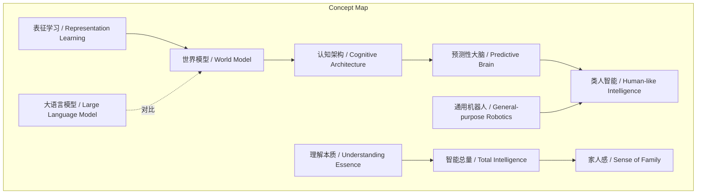
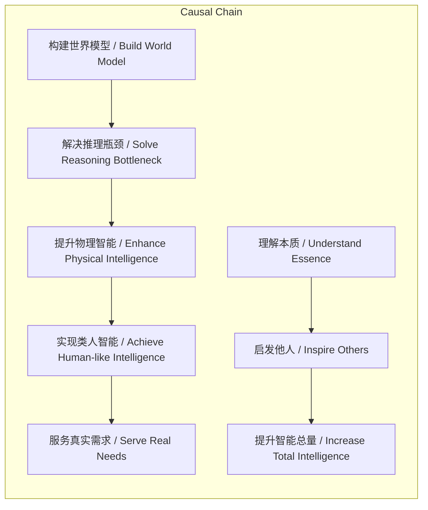

> 谢赛宁主张通过构建通用世界模型和认知架构，提升物理智能，最终以理解本质来增加地球智能总量。

## 元信息
- 分类：`ai-software/models-research`
- 优先级：`high` (`13`)
- 文档类型：`text-summary`
- 来源分组：`news`
- 原始文件：`reports/news/2026-03-20/1774015052142-news-news-task-1774014995524-huvuau.md`
- 请求 ID：`1774014995524-huvuau`

## 原始内容

#### 文本总结

### 谢赛宁：打造预测性大脑的三大追求

#### 整体结构化文档表达
##### 文档卡片
- 主题（中文/English）：人工智能研究理念 / Artificial Intelligence Research Philosophy
- 一句话摘要：谢赛宁主张通过构建通用世界模型和认知架构，提升物理智能，最终以理解本质来增加地球智能总量。
- 目标读者：科技领域研究者、投资者、对AI哲学感兴趣者
- 核心结论（3条）：
  1. 核心路径是构建不依赖语言的通用世界模型作为认知架构底座。
  2. 目标是解决物理世界智能瓶颈，实现类人智能，让机器人服务真实需求。
  3. 科研哲学以理解本质、启发他人、提升地球智能总量为终极目的。

##### 内容结构树
1. 背景与问题定义：当前大语言模型在数字虚拟空间成功，但物理世界机器人缺乏自主推理和规划能力，无法解决真实需求。
2. 核心观点与关键证据：核心观点是“通过不做机器人的方式解决机器人问题”，打造“预测性大脑”。证据：三个层面追求——构建通用世界模型、提升物理智能、提升智能总量。
3. 方法/机制/路径：构建不依赖语言捷径的通用世界模型，作为连接多个神经模块的认知架构；通过预训练“下半场”为通用机器人提供基础大脑。
4. 风险与边界条件：未提及具体技术风险；边界条件是不依赖语言，专注连续高维物理世界信号。
5. 结论与行动建议：结论是追求理解本质、传播认知、提升智能总量。行动建议：专注表征学习与世界模型研究，启发社区。

##### 结构化元数据（JSON）
```json
{
  "title": "谢赛宁：打造预测性大脑的三大追求",
  "topic_zh": "人工智能研究理念",
  "topic_en": "Artificial Intelligence Research Philosophy",
  "audience": ["科技研究者", "AI投资者", "科技哲学爱好者"],
  "claims": [
    "核心路径是构建通用世界模型作为认知架构底座",
    "目标是提升物理世界智能，解决机器人推理瓶颈",
    "科研哲学以理解本质、提升地球智能总量为终极目的"
  ],
  "evidence": [
    "打造不依赖语言捷径的通用世界模型底座",
    "通过预训练下半场为通用机器人提供基础大脑",
    "通过研究理解事物本质，传播认知以启发他人"
  ],
  "risks": ["未提及具体技术风险", "未提及商业化边界"],
  "actions": [
    "专注表征学习与世界模型研究",
    "推动认知架构的神经模块连接",
    "以启发式研究促进智能总量提升"
  ]
}
```

#### 处理流程
1. 输入识别：用户提供谢赛宁访谈文本，阐述三大科研追求。
2. 信息抽取：实体（谢赛宁）、概念（预测性大脑、世界模型）、问题（物理智能瓶颈）、事实（三个层面）、观点（科研哲学）。
3. 结构化归纳：定义世界模型为认知架构；比较大语言模型与物理智能；因果链：构建世界模型→解决推理瓶颈→实现类人智能。
4. 关系建模：世界模型作为认知架构底座；理解本质启发他人提升智能总量。
5. 可视化表达：用Mermaid展示概念结构与因果链。

#### 概念清单（中英文）
- 谢赛宁 / Xie Saining
- 预测性大脑 / Predictive Brain
- 世界模型 / World Model
- 认知架构 / Cognitive Architecture
- 表征学习 / Representation Learning
- 大语言模型 / Large Language Model (LLM)
- 通用机器人 / General-purpose Robotics
- 类人智能 / Human-like Intelligence
- 预训练下半场 / Second Phase of Pre-training
- 智能总量 / Total Intelligence
- 影响力 / Impact
- 家人感 / Sense of Family

#### 概念定义（中英文）
- 谢赛宁 / Xie Saining：访谈中的研究者，提出通过构建预测性大脑解决机器人问题的三大追求。
- 预测性大脑 / Predictive Brain：机器人或AI系统的核心认知部件，能理解物理世界并预测，本质是认知架构。
- 世界模型 / World Model：不依赖语言捷径、理解连续高维物理世界信号的通用模型，作为认知架构的底座。
- 认知架构 / Cognitive Architecture：将多个神经模块连接在一起的系统，是智能体的大脑。
- 表征学习 / Representation Learning：从数据中学习有效表示，被认为是未来最重要的事情。
- 大语言模型 / Large Language Model (LLM)：在数字虚拟空间成功的AI模型，但缺乏物理世界推理和规划能力。
- 通用机器人 / General-purpose Robotics：能解决各种真实需求的机器人，需要自主推理和规划。
- 类人智能 / Human-like Intelligence：类似人类的智能，能在物理世界自主行动。
- 预训练下半场 / Second Phase of Pre-training：为通用机器人提供基础大脑的训练阶段，解决推理瓶颈。
- 智能总量 / Total Intelligence：地球上所有智能体（包括人类和AI）的总体认知能力。
- 影响力 / Impact：用侵略性方式强行改造世界，非谢赛宁所追求。
- 家人感 / Sense of Family：在提升智能总量过程中寻求的灵魂共鸣。

#### 概念关联与逻辑关系（中英文）
1. 世界模型 / World Model 与 认知架构 / Cognitive Architecture 共同构成 预测性大脑 / Predictive Brain。
  形式化：Predictive Brain = Cognitive Architecture(World Model)
2. 构建通用世界模型 / World Model 提升 物理智能 / Physical Intelligence，解决 推理瓶颈 / Reasoning Bottleneck。
  形式化：World Model → 解决(Reasoning Bottleneck) → 提升(Physical Intelligence)
3. 理解本质 / Understanding Essence 启发 他人 / Inspiring Others，从而增加 智能总量 / Total Intelligence。
  形式化：Understanding Essence ∧ Inspiring Others → 增加(Total Intelligence)

#### COT逻辑梳理（定义/分类/比较/因果/科学方法论）
Step 1: 定义核心问题。当前AI（大语言模型）局限在虚拟空间，缺乏物理世界理解，导致机器人无法自主推理和规划。
Step 2: 分类解决方案。谢赛宁提出三大追求：1) 技术路径（构建世界模型）；2) 应用目标（提升物理智能）；3) 哲学目的（提升智能总量）。
Step 3: 比较现有方法。大语言模型依赖语言捷径，而谢赛宁强调不依赖语言，专注高维物理信号，构建更底层的世界模型。
Step 4: 因果链。构建通用世界模型 → 作为认知架构 → 提供基础大脑 → 解决推理瓶颈 → 实现类人智能 → 让机器人服务千家万户。
Step 5: 科学方法论。以理解本质为出发点，通过研究传播认知，启发社区形成正向循环，最终提升地球智能总量。

#### 事实与看法（病毒）
##### 事实
- 谢赛宁在访谈中表达了三个层面的核心追求。
- 他坚信表征学习是未来最重要的事情。
- 大语言模型在数字虚拟空间成功，但物理世界机器人无法自主推理和规划。
- 预训练“下半场”旨在为通用机器人提供基础大脑。
- 世界模型被定义为不依赖语言、理解物理世界信号的通用模型。
- 认知架构是连接多个神经模块的系统。

##### 看法
- 他不想用侵略性“影响力”强行改造世界。
- 科研终极目的是理解本质、传播认知、启发他人。
- 追求灵魂共鸣与“家人感”。
- 认为世界模型是智能体的“大脑”。
- 强调“通过不做机器人的方式解决机器人问题”。

#### FAQ（原文问题整理）
- 如何解决机器人的推理和规划瓶颈？  
  回答：通过构建通用世界模型作为认知架构，提供基础大脑。
- 谢赛宁的科研终极目的是什么？  
  回答：理解事物本质，传播认知，启发他人，提升地球智能总量。
- 世界模型与大语言模型有何区别？  
  回答：世界模型不依赖语言捷径，专注理解连续高维物理世界信号；大语言模型主要在数字虚拟空间成功。

#### Visualization
##### Mermaid 图 1（概念结构图）


##### Mermaid 图 2（逻辑/因果图）


#### 文章中的类比
未发现明确类比。

#### 10个金句
1. “通过不做机器人的方式去解决机器人的问题”
2. “打造出一个真正的‘预测性大脑’或‘机器人的大脑’”
3. “构建一个不依赖语言捷径、真正能理解连续高维物理世界信号的通用世界模型底座”
4. “这个世界模型不是简单的一个神经网络权重，而是一套将多个神经模块连接在一起的‘认知架构’”
5. “他不满足于大语言模型在数字虚拟空间中的成功”
6. “希望通过预训练的‘下半场’为通用机器人提供强大的基础大脑”
7. “解决它们无法自主推理和规划的瓶颈”
8. “最终通向真正的类人智能，让机器人能够真正走进千家万户解决真实需求”
9. “做科研的终极目的既不是为了追求世俗的声望，也不是为了用侵略性的‘影响力’去强行改造世界”
10. “通过自己的研究去理解事物的本质，将这种认知写下来传播出去，启发更多人对未知产生新的认识”
