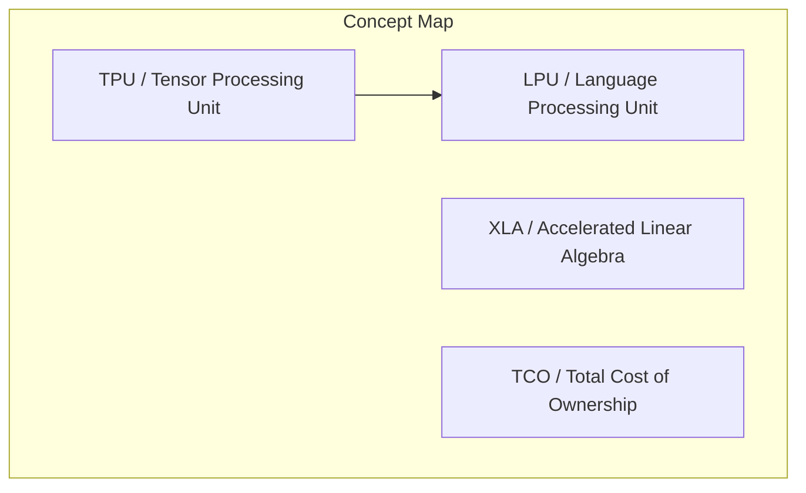
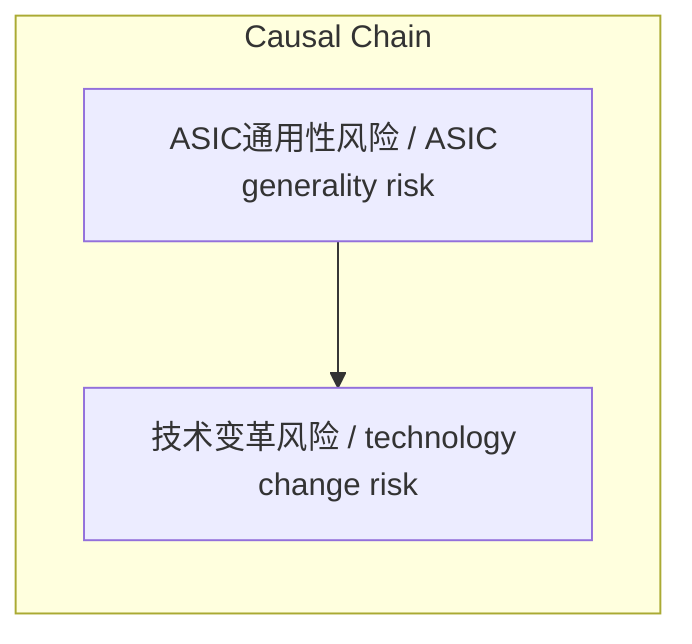

> 对比谷歌TPU与Groq推理芯片的架构特点与应用场景

## 元信息
- 分类：`ai-software/models-research`
- 优先级：`high` (`13`)
- 文档类型：`text-summary`
- 来源分组：`news`
- 原始文件：`reports/news/2026-03-25/1774447401274-news-news-task-1774447302805-w1lnon.md`
- 请求 ID：`1774447302805-w1lnon`

## 原始内容

#### 文本总结

##### 运行信息
- model: openrouter/free
- schema_fallback: no
- attempted_models: openrouter/free

### TPU与Groq芯片对比分析

#### 整体结构化文档表达
##### 文档卡片
- 主题（中文/English）：ASIC芯片技术 / ASIC technology
- 一句话摘要：对比谷歌TPU与Groq推理芯片的架构特点与应用场景
- 目标读者：AI芯片开发者、技术决策者
- 核心结论（3条）：
- TPU采用流水线架构,通过软硬协同设计实现高吞吐成本优势
- Groq专注极低延迟推理,通过编译器精确控制实现单用户独占资源
- ASIC芯片通用性风险高,迭代周期长达2-3年易面临技术变革风险

##### 内容结构树
1. 背景与问题定义
2. 核心观点与关键证据
3. 方法/机制/路径
4. 风险与边界条件
5. 结论与行动建议

##### 结构化元数据（JSON）
```json
{
  "title": "TPU与Groq芯片对比分析",
  "topic_zh": "ASIC芯片技术",
  "topic_en": "ASIC technology",
  "audience": "AI芯片开发者、技术决策者",
  "claims": [
    "TPU架构更像流水线式接力赛,上一步计算中间态直接传输给下一步",
    "Groq硬件比TPU更加单一,完全由软件编译器决定计算单元行为",
    "TPU集群采用铜线直接通信,省去昂贵交换机基础设施成本"
  ],
  "evidence": [
    "TPU被苹果、Anthropic和Meta等公司用于模型训练和部署",
    "Groq创始人是前TPU核心软件团队成员Jonathan Ross",
    "ASIC从设计到量产迭代周期长达2到3年"
  ],
  "risks": [
    "ASIC一旦架构固化,若AI模型底层架构改变将极难调整"
  ],
  "actions": [
    "评估TPU在大规模部署时的总拥有成本优势",
    "考虑Groq在极低延迟场景下的小规模部署模式"
  ]
}
```

#### 处理流程
1. 输入识别
2. 信息抽取（实体、概念、问题、事实、观点）
3. 结构化归纳（定义/分类/比较/因果/方法论）
4. 关系建模（概念关系、等式/方程/逻辑链）
5. 可视化表达（Mermaid）

#### 概念清单（中英文）
- TPU / Tensor Processing Unit
- LPU / Language Processing Unit
- XLA / Accelerated Linear Algebra
- TCO / Total Cost of Ownership

#### 概念定义（中英文）
##### TPU / Tensor Processing Unit
- 中文定义：谷歌专门针对机器学习矩阵计算定制的加速器
- English Definition: Google's custom ASIC for ML workloads

##### LPU / Language Processing Unit
- 中文定义：Groq公司针对极低延迟推理定制的专用芯片
- English Definition: Groq's ASIC for low-latency inference

##### XLA / Accelerated Linear Algebra
- 中文定义：TPU的静态编译器,统筹算子融合和内存管理
- English Definition: TPU's static compiler for optimization

##### TCO / Total Cost of Ownership
- 中文定义：芯片大规模部署的总拥有成本
- English Definition: Total cost for chip deployment


#### 概念关联与逻辑关系（中英文）
- TPU/Tensor Processing Unit -> Groq/Language Processing Unit | comparison | 架构差异
- ASIC通用性风险/ASIC generality risk -> 技术变革风险/technology change risk | causal | 导致

##### 可形式化关系
- TPU采用流水线架构 → 提高计算单元使用率
- Groq通过编译器控制 → 实现单用户独占资源
- ASIC迭代周期长达2-3年 → 面临技术变革风险

#### COT逻辑梳理（定义/分类/比较/因果/科学方法论）
- Step 1: 分析TPU和Groq的核心定位与场景差异
- Step 2: 对比两款芯片的架构特点与部署模式
- Step 3: 探讨ASIC芯片共同面临的通用性风险

#### 事实与看法（区分）
##### 事实
- TPU采用铜线直接通信,省去昂贵交换机基础设施
- Groq被英伟达收购
- TPU驱动了谷歌的Gemini模型

##### 看法
- TPU在物理设计上被刻意变得'更蠢、更机械'
- Groq可以理解为一家'编译器公司'

#### FAQ（原文问题整理）
##### TPU和GPU的核心架构差异是什么
- TPU采用流水线式接力赛架构,GPU强调大量独立单元并行运作

##### Groq芯片的核心优势是什么
- Groq通过编译器精确控制实现极低延迟和单用户独占资源

#### Visualization
##### Mermaid 图 1（概念结构图）


##### Mermaid 图 2（逻辑/因果图）


#### 文章中的类比
- TPU架构像一条'流水线'式的接力赛
- TPU像心脏泵血一样直接传达到各个计算角落

#### 10个金句
- TPU在物理设计上被刻意变得'更蠢、更机械'
