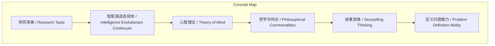
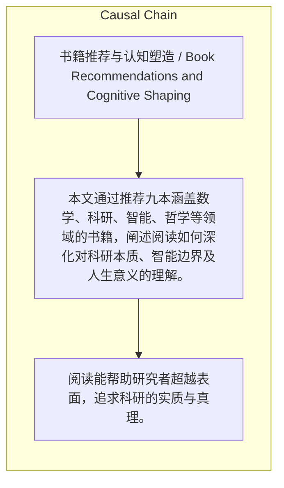

> 本文通过推荐九本涵盖数学、科研、智能、哲学等领域的书籍，阐述阅读如何深化对科研本质、智能边界及人生意义的理解。

## 元信息
- 分类：`ai-software/models-research`
- 优先级：`medium` (`12`)
- 文档类型：`text-summary`
- 来源分组：`news`
- 原始文件：`reports/news/2026-03-22/1774198990581-news-news-task-1774198894841-y7yuqa.md`
- 请求 ID：`1774198894841-y7yuqa`

## 原始内容

#### 文本总结

##### 运行信息
- model: stepfun/step-3.5-flash:free
- schema_fallback: yes
- attempted_models: stepfun/step-3.5-flash:free

### 九本书塑造的科研认知与人生启示

#### 整体结构化文档表达
##### 文档卡片
- 主题（中文/English）：书籍推荐与认知塑造 / Book Recommendations and Cognitive Shaping
- 一句话摘要：本文通过推荐九本涵盖数学、科研、智能、哲学等领域的书籍，阐述阅读如何深化对科研本质、智能边界及人生意义的理解。
- 目标读者：科研工作者、学生及对研究本质感兴趣者
- 核心结论（3条）：
- 阅读能帮助研究者超越表面，追求科研的实质与真理。
- 跨学科阅读能拓宽对智能和认知边界的理解。
- 个人化的阅读体验能引发深刻的人生反思，影响科研价值观。

##### 内容结构树
1. 背景与问题定义
2. 核心观点与关键证据
3. 方法/机制/路径
4. 风险与边界条件
5. 结论与行动建议

##### 结构化元数据（JSON）
```json
{
  "title": "九本书塑造的科研认知与人生启示",
  "topic_zh": "书籍推荐与认知塑造",
  "topic_en": "Book Recommendations and Cognitive Shaping",
  "audience": "科研工作者、学生及对研究本质感兴趣者",
  "claims": [
    "做研究不是为了灌水发论文，而是真正探索无限的未知。",
    "智能是演进连续体，动物同样拥有令人惊叹的智能和‘世界模型’。",
    "好论文应展现探索过程中‘如何做决策’的思辨过程。",
    "凡所有相，皆是虚妄，启发研究者不要沉迷于论文表面的花哨设计。"
  ],
  "evidence": [
    "《交大学生生存手册》指出研究不是为了灌水发论文，而是探索未知。",
    "《我们是否聪明到足以了解动物的聪明程度？》揭示智能是演进连续体。",
    "《故事》认为好论文应展现‘如何做决策’。",
    "《金刚经》的‘凡所有相，皆是虚妄’启发研究者追问实质。"
  ],
  "risks": [],
  "actions": []
}
```

#### 处理流程
1. 输入识别
2. 信息抽取（实体、概念、问题、事实、观点）
3. 结构化归纳（定义/分类/比较/因果/方法论）
4. 关系建模（概念关系、等式/方程/逻辑链）
5. 可视化表达（Mermaid）

#### 概念清单（中英文）
- 研究审美 / Research Taste
- 智能演进连续体 / Intelligence Evolutionary Continuum
- 心智理论 / Theory of Mind
- 哲学共同点 / Philosophical Commonalities
- 故事思维 / Storytelling Thinking
- 定义问题能力 / Problem Definition Ability
- 人生求索 / Personal Quest

#### 概念定义（中英文）
##### 研究审美 / Research Taste
- 中文定义：对研究本质和价值的判断力，不沉迷表面设计而追问实质真理。
- English Definition: The ability to judge the essence and value of research, focusing on substance over superficial designs.

##### 智能演进连续体 / Intelligence Evolutionary Continuum
- 中文定义：智能是一个连续的光谱，非人类独有，动物同样拥有智能和世界模型。
- English Definition: Intelligence is a continuous spectrum, not unique to humans; animals also possess intelligence and world models.

##### 心智理论 / Theory of Mind
- 中文定义：理解他人心理状态的能力，动物社会行为展示此能力。
- English Definition: The ability to attribute mental states to others, demonstrated in animal social behaviors.

##### 哲学共同点 / Philosophical Commonalities
- 中文定义：跨学科寻找共同哲学基础，如哥德尔、巴赫、艾舍尔的联系。
- English Definition: Seeking common philosophical foundations across disciplines, such as connections among Gödel, Bach, and Escher.

##### 故事思维 / Storytelling Thinking
- 中文定义：用叙事结构展现研究过程，强调决策思辨以启发他人。
- English Definition: Using narrative structures to present research processes, emphasizing decision-making to inspire others.

##### 定义问题能力 / Problem Definition Ability
- 中文定义：准确界定研究问题的能力，是科研的关键技能。
- English Definition: The skill of accurately defining research problems, crucial for scientific inquiry.

##### 人生求索 / Personal Quest
- 中文定义：对生命意义的个人化探索过程，通过阅读引发反思。
- English Definition: A personal exploration of life's meaning, triggered by reflective reading.


#### 概念关联与逻辑关系（中英文）
- 《金刚经》/Diamond Sutra -> 研究审美/Research Taste | concept | 启发
- 《我们是否聪明到足以了解动物的聪明程度？》/Are We Smart Enough to Know How Smart Animals Are? -> 智能演进连续体/Intelligence Evolutionary Continuum | concept | 提出
- 《故事》/Story -> 故事思维/Storytelling Thinking | concept | 类比

##### 可形式化关系
- 阅读《金刚经》 → 形成研究审美概念
- 动物智能书籍 → 改变对通用智能目标的看法
- 《故事》的类比 → 应用于论文写作，强调决策过程展示

#### COT逻辑梳理（定义/分类/比较/因果/科学方法论）
- Step 1: 通过阅读获取关键概念（如研究审美、智能连续体）。
- Step 2: 将这些概念应用于反思科研实践和智能目标。
- Step 3: 整合个人体验，形成对科研和人生的整体认知。

#### 事实与看法（区分）
##### 事实
- 理查德·柯朗是纽约大学柯朗数学科学研究所的创立者。
- 《交大学生生存手册》由侯晓迪等学长撰写。
- 何恺明赠送《金刚经》给推荐者。
- 《集异璧之大成》探讨哥德尔、巴赫、艾舍尔的哲学共同点。

##### 看法
- 强烈推荐李飞飞自传。
- 《禅与摩托车维修艺术》阅读体验极其震撼。
- 《集异璧之大成》是人生之书。
- 《金刚经》用来解释Research Taste。

#### FAQ（原文问题整理）
- 未发现明确 FAQ

#### Visualization
##### Mermaid 图 1（概念结构图）


##### Mermaid 图 2（逻辑/因果图）


#### 文章中的类比
- 做研究写论文跟拍电影、讲故事一样。

#### 10个金句
- 凡所有相，皆是虚妄
- 人为什么要学习
- 大学体制哪里错了
- 如何做决策
- 什么重要，什么不重要
