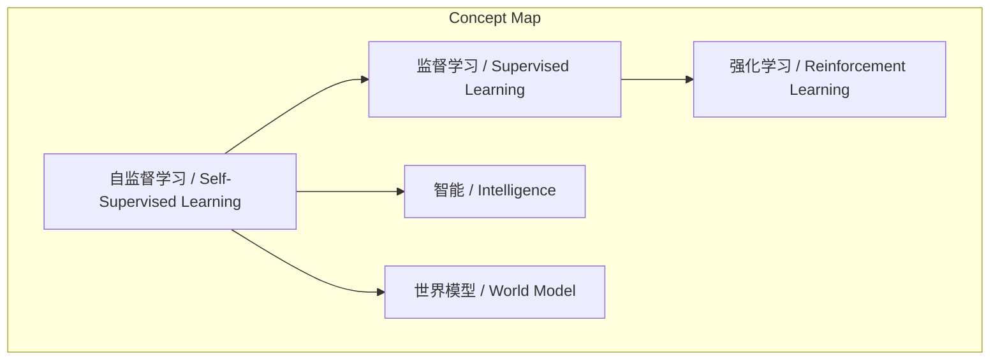
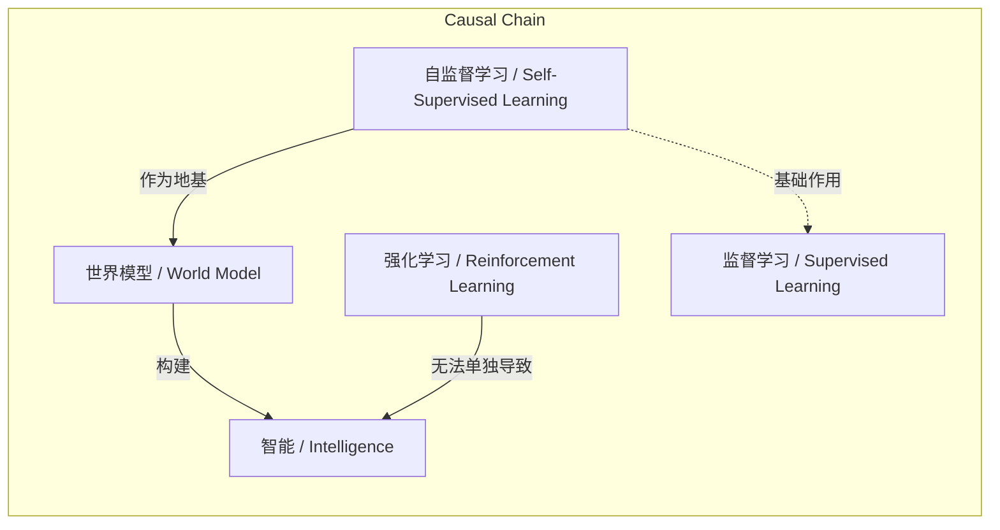

> 杨立昆用蛋糕结构比喻AI学习范式，强调自监督学习是智能系统的基石。

## 元信息
- 分类：`ai-software/models-research`
- 优先级：`high` (`13`)
- 文档类型：`text-summary`
- 来源分组：`news`
- 原始文件：`reports/news/2026-03-19/1773929291042-news-news-task-1773929211750-q5jg20.md`
- 请求 ID：`1773929211750-q5jg20`

## 原始内容

#### 文本总结

### 杨立昆蛋糕理论：自监督学习是AI智能基石

#### 整体结构化文档表达
##### 文档卡片
- 主题（中文/English）：蛋糕理论 / Cake Analogy
- 一句话摘要：杨立昆用蛋糕结构比喻AI学习范式，强调自监督学习是智能系统的基石。
- 目标读者：未提及
- 核心结论（3条）：
  1. 自监督学习是智能系统的最大基础部分。
  2. 监督学习是建立在自监督学习之上的附加层。
  3. 强化学习仅是顶层点缀，无自监督学习则无法通向智能。

##### 内容结构树
1. 背景与问题定义：杨立昆提出蛋糕理论，形象阐述不同机器学习方法在构建智能系统中的地位。
2. 核心观点与关键证据：智能蛋糕由三层构成——底座（自监督学习）、奶油（监督学习）、樱桃（强化学习），且重要性递减。
3. 方法/机制/路径：通过烘焙蛋糕的比喻，说明学习范式的层级依赖关系。
4. 风险与边界条件：若忽视自监督学习，仅依赖强化学习，则无法实现真正的智能。
5. 结论与行动建议：必须优先发展自监督学习，以建立对物理世界的常识和世界模型。

##### 结构化元数据（JSON）
```json
{
  "title": "杨立昆蛋糕理论：自监督学习是AI智能基石",
  "topic_zh": "蛋糕理论",
  "topic_en": "Cake Analogy",
  "audience": "未提及",
  "claims": [
    "自监督学习是智能系统的最大基础部分",
    "监督学习是建立在自监督学习之上的附加层",
    "强化学习仅是顶层点缀，无自监督学习则无法通向智能"
  ],
  "evidence": [
    "蛋糕的底座/主体是自监督学习，构成整个智能的基础和最大组成部分",
    "蛋糕上的奶油是监督学习，建立在底座之上作为附加涂层",
    "最上面的樱桃是强化学习，仅仅是整个蛋糕最顶端的点缀"
  ],
  "risks": [
    "如果没有自监督学习作为庞大的蛋糕底座，仅仅靠着最顶端的一颗樱桃（强化学习），是根本无法通向真正的智能的"
  ],
  "actions": [
    "必须通过自监督学习来为系统建立对真实物理世界的常识，从而构建真正的世界模型大厦的地基"
  ]
}
```

#### 处理流程
1. 输入识别（来源：用户输入文本）
2. 信息抽取（实体、概念、问题、事实、观点）
3. 结构化归纳（定义/分类/比较/因果/科学方法论）
4. 关系建模（概念关系、等式/方程/逻辑链）
5. 可视化表达（Mermaid）

#### 概念清单（中英文）
- 蛋糕理论 / Cake Analogy
- 自监督学习 / Self-Supervised Learning
- 监督学习 / Supervised Learning
- 强化学习 / Reinforcement Learning
- 智能 / Intelligence
- 世界模型 / World Model
- 杨立昆 / Yann LeCun
- 图灵奖 / Turing Award

#### 概念定义（中英文）
- 蛋糕理论 / Cake Analogy：杨立昆提出的用蛋糕结构比喻人工智能学习范式的理论。
- 自监督学习 / Self-Supervised Learning：无需人工标注数据，从数据本身生成监督信号的学习范式，是智能系统的基础。
- 监督学习 / Supervised Learning：依赖人工标注数据进行训练的学习范式，作为附加层建立在自监督学习之上。
- 强化学习 / Reinforcement Learning：通过试错和奖励机制进行学习的方法，在蛋糕理论中仅作为顶层点缀。
- 智能 / Intelligence：人工智能系统所追求的能力，在蛋糕理论中由多层学习范式共同构成。
- 世界模型 / World Model：系统对物理世界的常识性理解，需通过自监督学习构建。
- 杨立昆 / Yann LeCun：图灵奖得主，深度学习先驱，提出蛋糕理论。
- 图灵奖 / Turing Award：计算机科学领域的最高荣誉。

#### 概念关联与逻辑关系（中英文）
1. 自监督学习 / Self-Supervised Learning 是 监督学习 / Supervised Learning 和 强化学习 / Reinforcement Learning 的基础。
2. 智能 / Intelligence 的实现依赖于 自监督学习 / Self-Supervised Learning 作为底座，且 监督学习 / Supervised Learning 和 强化学习 / Reinforcement Learning 仅起辅助作用。
3. 世界模型 / World Model 的构建必须以 自监督学习 / Self-Supervised Learning 为地基。

形式化关系：
- 智能 = f(自监督学习, 监督学习, 强化学习)，其中自监督学习的权重最大。
- 若无自监督学习，则智能无法实现：¬自监督学习 → ¬智能
- 世界模型 = 自监督学习 + 常识

#### COT逻辑梳理（定义/分类/比较/因果/科学方法论）
Step 1: 定义蛋糕理论为一种比喻，用于分类和比较不同机器学习范式在AI系统中的作用。
Step 2: 分类：将学习范式分为三层——基础层（自监督学习）、中间层（监督学习）、顶层（强化学习）。
Step 3: 比较：通过蛋糕结构比较三层的重要性，自监督学习最大，强化学习最小。
Step 4: 因果：自监督学习是因，智能是果；没有自监督学习这个因，智能之果不成立。
Step 5: 科学方法论：使用类比方法（蛋糕烘焙）来阐明复杂概念，强调基础研究的重要性。

#### 事实与看法（病毒）
##### 事实
- 杨立昆是图灵奖得主。
- 蛋糕理论将自监督学习比作蛋糕底座，监督学习比作奶油，强化学习比作樱桃。
- 自监督学习被描述为构成智能的基础和最大部分。
- 监督学习建立在自监督学习之上。
- 强化学习是蛋糕最顶端的点缀。
- 杨立昆等人坚信必须通过自监督学习建立对物理世界的常识。

##### 看法
- 如果没有自监督学习作为底座，仅靠强化学习无法通向真正的智能。
- 自监督学习是构建世界模型大厦的地基。
- 蛋糕理论强调了自监督学习在AI发展中的基础性地位。

#### FAQ（原文问题整理）
原文未直接提出明确问题，但从论述中可提炼：
- 问：不同机器学习方法在AI系统中如何定位？
  答：通过蛋糕理论，自监督学习是底座，监督学习是奶油，强化学习是樱桃。
- 问：为什么强化学习不能单独实现智能？
  答：因为缺少自监督学习这个庞大底座，仅靠顶层点缀无法通向智能。
- 问：如何构建真正的世界模型？
  答：必须通过自监督学习为系统建立对真实物理世界的常识。

#### Visualization
##### Mermaid 图 1（概念结构图）


##### Mermaid 图 2（逻辑/因果图）


#### 文章中的类比
- 蛋糕理论：用做蛋糕的过程比喻AI学习范式，蛋糕底座对应自监督学习，奶油对应监督学习，樱桃对应强化学习。

#### 10个金句
1. “他的蛋糕理论”指的是图灵奖得主杨立昆提出的一个关于人工智能学习范式的经典比喻。
2. 他用做蛋糕的过程来形象地阐述不同机器学习方法在构建智能系统中的地位与作用。
3. 蛋糕的底座/主体——自监督学习：这是构成整个智能的基础和最大的组成部分。
4. 蛋糕上的奶油——监督学习：它建立在底座之上作为附加的涂层。
5. 最上面的樱桃——强化学习：它仅仅是整个蛋糕最顶端的点缀。
6. 杨立昆通过这个比喻强调，虽然蛋糕上的每一层都很重要，但如果没有自监督学习作为庞大的“蛋糕底座”，仅仅靠着最顶端的一颗“樱桃”（强化学习），是根本无法通向真正的智能的。
7. 这也是为什么谢赛宁和杨立昆等人坚信，必须通过自监督学习来为系统建立对真实物理世界的常识。
8. 从而构建真正的“世界模型”大厦的地基。
9. 智能蛋糕的具体构成：底座是自监督学习，奶油是监督学习，樱桃是强化学习。
10. 原文未提供
