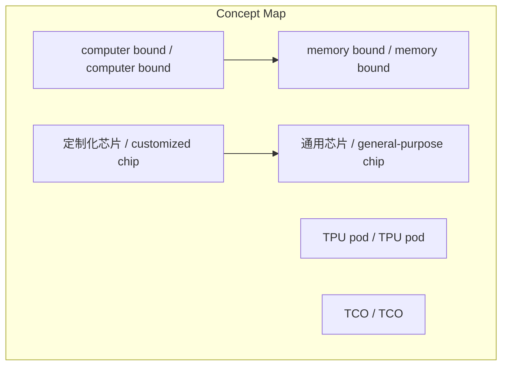
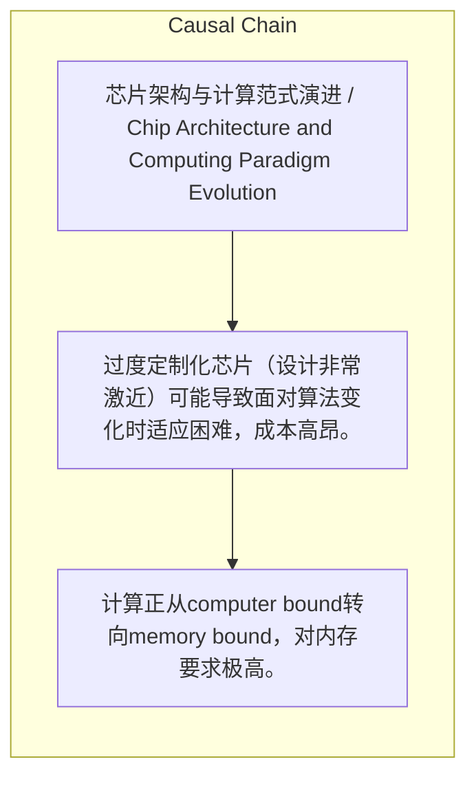

> 在特定大规模部署条件下，定制化TPU在训练效率与TCO上可挑战GPU，但GPU通用性在快速算法迭代中占优，未来生态将定制与通用并存。

## 元信息
- 分类：`ai-software/models-research`
- 优先级：`high` (`13`)
- 文档类型：`text-summary`
- 来源分组：`news`
- 原始文件：`reports/news/2026-03-25/1774446278285-news-news-task-1774446206781-lsoiwm.md`
- 请求 ID：`1774446206781-lsoiwm`

## 原始内容

#### 文本总结

##### 运行信息
- model: stepfun/step-3.5-flash:free
- schema_fallback: yes
- attempted_models: stepfun/step-3.5-flash:free

### TPU与GPU竞争：定制化芯片的现实考量

#### 整体结构化文档表达
##### 文档卡片
- 主题（中文/English）：芯片架构与计算范式演进 / Chip Architecture and Computing Paradigm Evolution
- 一句话摘要：在特定大规模部署条件下，定制化TPU在训练效率与TCO上可挑战GPU，但GPU通用性在快速算法迭代中占优，未来生态将定制与通用并存。
- 目标读者：未提及
- 核心结论（3条）：
- 计算正从computer bound转向memory bound，对内存要求极高。
- TPU通过硬件简化与软件协同，在大规模部署下训练效率和TCO优于GPU。
- GPU因架构通用，在快速算法迭代周期中更具适应性；健康生态需定制与通用平衡。

##### 内容结构树
1. 背景与问题定义
2. 核心观点与关键证据
3. 方法/机制/路径
4. 风险与边界条件
5. 结论与行动建议

##### 结构化元数据（JSON）
```json
{
  "title": "TPU与GPU竞争：定制化芯片的现实考量",
  "topic_zh": "芯片架构与计算范式演进",
  "topic_en": "Chip Architecture and Computing Paradigm Evolution",
  "audience": "未提及",
  "claims": [
    "TPU在现实条件下训练效率和TCO比GPU更加强大。",
    "GPU胜在模型周期短，芯片架构固定后算法改变时TPU难以实现。",
    "未来计算生态是定制环节与通用环节共存的健康生态，将百花齐放。"
  ],
  "evidence": [
    "TPU主打TPU pod，几千张卡协同训练，用户感觉像一张卡的芯片。",
    "可根据workload定制物理芯片层面的设计。",
    "芯片架构一旦固定，算法改变时TPU很难适应，会非常痛苦。"
  ],
  "risks": [
    "过度定制化芯片（设计非常激近）可能导致面对算法变化时适应困难，成本高昂。"
  ],
  "actions": []
}
```

#### 处理流程
1. 输入识别
2. 信息抽取（实体、概念、问题、事实、观点）
3. 结构化归纳（定义/分类/比较/因果/方法论）
4. 关系建模（概念关系、等式/方程/逻辑链）
5. 可视化表达（Mermaid）

#### 概念清单（中英文）
- computer bound / computer bound
- memory bound / memory bound
- TPU pod / TPU pod
- TCO / TCO
- 定制化芯片 / customized chip
- 通用芯片 / general-purpose chip

#### 概念定义（中英文）
##### computer bound / computer bound
- 中文定义：计算瓶颈类型，指计算能力是系统性能的限制因素
- English Definition: Computing bottleneck where computational power is the limiting factor

##### memory bound / memory bound
- 中文定义：计算瓶颈类型，指内存访问速度是系统性能的限制因素
- English Definition: Computing bottleneck where memory access speed is the limiting factor

##### TPU pod / TPU pod
- 中文定义：谷歌TPU的大规模协同训练集群，对外抽象为单卡
- English Definition: Google's TPU large-scale collaborative training cluster, abstracted as a single card to users

##### TCO / TCO
- 中文定义：总拥有成本，衡量芯片长期经济效益的指标
- English Definition: Total Cost of Ownership, a metric for long-term economic efficiency of chips

##### 定制化芯片 / customized chip
- 中文定义：针对特定工作负载优化的芯片设计
- English Definition: Chip design optimized for specific workloads

##### 通用芯片 / general-purpose chip
- 中文定义：设计用于广泛应用的芯片，如GPU
- English Definition: Chip designed for broad applications, such as GPU


#### 概念关联与逻辑关系（中英文）
- computer bound/computer bound -> memory bound/memory bound | concept | 转变
- TPU pod/TPU pod -> TPU/TPU | concept | 实现
- 定制化芯片/customized chip -> 通用芯片/general-purpose chip | concept | 共存于生态

##### 可形式化关系
- workload确定 ∧ 大规模部署 ⇒ TPU性能 > GPU
- 算法周期短 ∧ 架构固定 ⇒ GPU适应性 > TPU
- 定制化程度高 ∧ 算法变化 ⇒ 适应成本高

#### COT逻辑梳理（定义/分类/比较/因果/科学方法论）
- Step 1: 计算瓶颈从computer bound转向memory bound，导致内存需求激增。
- Step 2: 通过硬件简化（如TPU）和软件处理复杂度，在大规模部署下，定制化芯片（TPU）在训练效率和TCO上优于通用芯片（GPU）。
- Step 3: 但GPU因架构通用，在快速算法迭代中更易适应；因此未来生态需定制与通用平衡，实现百花齐放。

#### 事实与看法（区分）
##### 事实
- 未发现明确客观事实

##### 看法
- TPU在现实条件下训练效率和TCO都会比GPU更加强大。
- 一旦芯片架构固定，算法改变时TPU很难实现，会非常痛苦，这是基于现实的妥协。
- 将来是百花齐放的格局，定制与通用环节共存是健康生态。

#### FAQ（原文问题整理）
- 未发现明确 FAQ

#### Visualization
##### Mermaid 图 1（概念结构图）


##### Mermaid 图 2（逻辑/因果图）


#### 文章中的类比
- 硬件变蠢相当于机械式老式软件处理所有复杂度。

#### 10个金句
- TPU一直是一個主打一個TPUP pod它是一個有幾千張卡的一個協同的一個訓練的一個狀態...它用戶的感覺當中是一張卡的芯片。
- 当你知道你的workload是什么时候你就可以根据你的workload去做一些不管是物理的芯片层面的一些定制...
- 一旦你設計的非常激近...萬一有變化呢那你回去的話你就會非常非常的痛苦...
