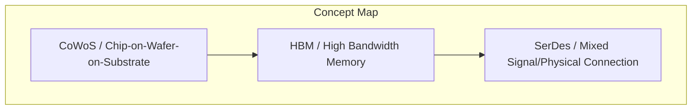
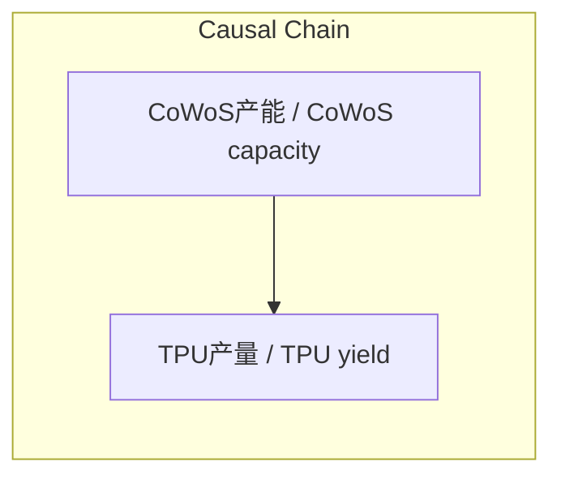

> CoWoS是台积电的高级封装技术，通过堆叠HBM与计算芯片实现TPU产能的核心瓶颈管理。

## 元信息
- 分类：`ai-software/models-research`
- 优先级：`high` (`13`)
- 文档类型：`text-summary`
- 来源分组：`news`
- 原始文件：`reports/news/2026-03-25/1774446810029-news-news-task-1774446538837-ngbvrv.md`
- 请求 ID：`1774446538837-ngbvrv`

## 原始内容

#### 文本总结

##### 运行信息
- model: openrouter/free
- schema_fallback: yes
- attempted_models: stepfun/step-3.5-flash:free, qwen/qwen-2.5-72b-instruct:free, deepseek/deepseek-chat:free, openrouter/free

### CoWoS技术在芯片制造中的关键作用

#### 整体结构化文档表达
##### 文档卡片
- 主题（中文/English）：CoWoS (Chip-on-Wafer-on-Substrate) / Chip-on-Wafer-on-Substrate
- 一句话摘要：CoWoS是台积电的高级封装技术，通过堆叠HBM与计算芯片实现TPU产能的核心瓶颈管理。
- 目标读者：芯片制造与AI训练供应链
- 核心结论（3条）：
- CoWoS产能直接决定TPU芯片最终产量，是制造环节的核心瓶颈
- HBM高带宽内存生产被SK Hynix、Samsung、Micron三家垄断，成为供应链瓶颈
- 博通负责TPU物理连接设计，其SerDes技术是物理连接的核心壁垒

##### 内容结构树
1. 背景与问题定义
2. 核心观点与关键证据
3. 方法/机制/路径
4. 风险与边界条件
5. 结论与行动建议

##### 结构化元数据（JSON）
```json
{
  "title": "CoWoS技术在芯片制造中的关键作用",
  "topic_zh": "CoWoS (Chip-on-Wafer-on-Substrate)",
  "topic_en": "Chip-on-Wafer-on-Substrate",
  "audience": "芯片制造与AI训练供应链",
  "claims": [
    "CoWoS产能分配 ∝ TPU芯片产量",
    "HBM垄断集团数量 = 3",
    "博通SerDes技术 ∧ 物理连接质量"
  ],
  "evidence": [
    "文章明确指出CoWoS是TPU产能核心瓶颈",
    "HBM生产垄断由SK Hynix、Samsung、Micron构成",
    "博通负责TPU芯片间物理连接布局"
  ],
  "risks": [
    "CoWoS产能分配不足可能导致TPU产能短缺",
    "HBM供应链集中度风险",
    "SerDes技术依赖博通专有知识"
  ],
  "actions": [
    "需监测CoWoS产能分配动态",
    "需评估HBM供应商多元化策略",
    "需分析博通技术壁垒的可替代性"
  ]
}
```

#### 处理流程
1. 输入识别
2. 信息抽取（实体、概念、问题、事实、观点）
3. 结构化归纳（定义/分类/比较/因果/方法论）
4. 关系建模（概念关系、等式/方程/逻辑链）
5. 可视化表达（Mermaid）

#### 概念清单（中英文）
- CoWoS / Chip-on-Wafer-on-Substrate
- HBM / High Bandwidth Memory
- SerDes / Mixed Signal/Physical Connection

#### 概念定义（中英文）
##### CoWoS / Chip-on-Wafer-on-Substrate
- 中文定义：高级封装技术，堆叠HBM与计算芯片的2.5D技术
- English Definition: Advanced packaging technology stacking HBM and compute chips

##### HBM / High Bandwidth Memory
- 中文定义：高带宽内存，解决AI内存带宽瓶颈
- English Definition: High Bandwidth Memory solving AI memory bandwidth bottleneck

##### SerDes / Mixed Signal/Physical Connection
- 中文定义：芯片间信号连接的核心技术
- English Definition: Physical connection technology for chip-to-chip signal transmission


#### 概念关联与逻辑关系（中英文）
- CoWoS产能/CoWoS capacity -> TPU产量/TPU yield | causal | directly determines
- HBM垄断集团/HBM monopolists -> SK Hynix/Samsung/Micron/SK Hynix/Samsung/Micron | comparison | composed of
- 博通/Broadcom -> SerDes技术/SerDes technology | comparison | core of

##### 可形式化关系
- CoWoS产能分配 ∝ TPU芯片产量
- HBM垄断集团数量 = 3
- 博通SerDes技术 ∧ 物理连接质量

#### COT逻辑梳理（定义/分类/比较/因果/科学方法论）
- Step 1: 识别CoWoS作为TPU产能核心瓶颈的制造环节
- Step 2: 分析HBM生产垄断集团及其对供应链的影响
- Step 3: 确定博通在物理连接设计中的核心角色

#### 事实与看法（区分）
##### 事实
- CoWoS是台积电的封装技术
- HBM由SK Hynix、Samsung、Micron垄断
- 博通负责TPU物理连接设计

##### 看法
- CoWoS产能分配直接影响TPU产能
- HBM垄断集团构成供应链风险
- 博通SerDes技术是物理连接的核心壁垒

#### FAQ（原文问题整理）
##### CoWoS是什么?
- CoWoS是台积电的高级封装技术，堆叠HBM与计算芯片的2.5D技术

##### 为什么HBM是瓶颈?
- HBM生产被三家公司垄断，成为供应链关键瓶颈

##### 博通的核心技术是什么?
- 博通负责TPU芯片间物理连接的SerDes技术

#### Visualization
##### Mermaid 图 1（概念结构图）


##### Mermaid 图 2（逻辑/因果图）


#### 文章中的类比
- CoWoS类似芯片的多层包装工艺
- HBM垄断类似芯片制造中的单一供应商风险
- SerDes技术类似芯片间通信的专有协议

#### 10个金句
- 文章明确指出CoWoS是TPU产能核心瓶颈
- HBM生产垄断由SK Hynix、Samsung、Micron构成
- 博通负责TPU芯片间物理连接布局
