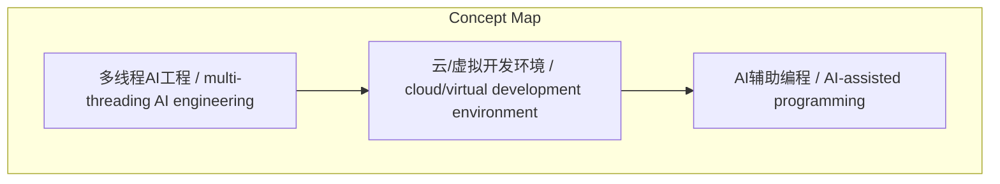
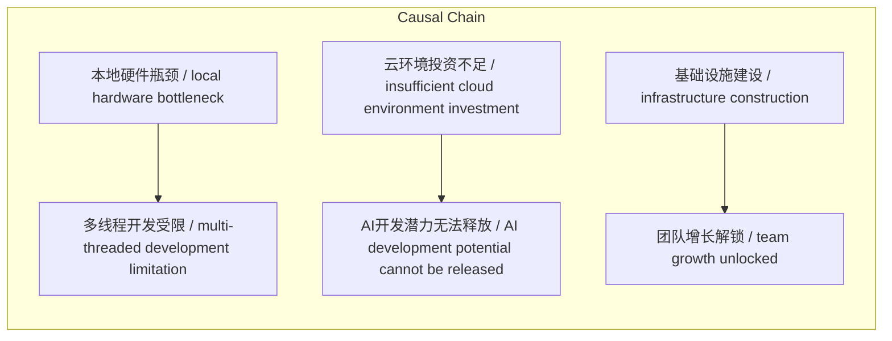

> 云环境投资不足限制AI开发潜力，需重视虚拟化基础设施建设

## 元信息
- 分类：`ai-software/models-research`
- 优先级：`high` (`13`)
- 文档类型：`text-summary`
- 来源分组：`news`
- 原始文件：`reports/news/2026-03-27/1774604368315-news-news-task-1774604348895-kbj8tq.md`
- 请求 ID：`1774604348895-kbj8tq`

## 原始内容

#### 文本总结

##### 运行信息
- model: openrouter/free
- schema_fallback: no
- attempted_models: openrouter/free

### 云环境投资不足阻碍AI开发

#### 整体结构化文档表达
##### 文档卡片
- 主题（中文/English）：云环境投资不足阻碍AI开发 / Cloud environment investment shortage hinders AI development
- 一句话摘要：云环境投资不足限制AI开发潜力，需重视虚拟化基础设施建设
- 目标读者：大型工程团队的CTO和工程副总裁
- 核心结论（3条）：
- 本地硬件物理限制制约多线程AI工程
- 云/虚拟环境是释放开发速度的关键
- 大型团队在云端投资严重不足

##### 内容结构树
1. 背景与问题定义
2. 核心观点与关键证据
3. 方法/机制/路径
4. 风险与边界条件
5. 结论与行动建议

##### 结构化元数据（JSON）
```json
{
  "title": "云环境投资不足阻碍AI开发",
  "topic_zh": "云环境投资不足阻碍AI开发",
  "topic_en": "Cloud environment investment shortage hinders AI development",
  "audience": "大型工程团队的CTO和工程副总裁",
  "claims": [
    "本地机器无法支撑多线程AI工程",
    "云环境对AI辅助编程至关重要",
    "团队忽视基础设施投资"
  ],
  "evidence": [
    "本地运行三四个工作树电脑风扇就极响",
    "开发者误以为仅靠大模型就能本地疯狂工作",
    "业界过度关注大模型而忽视运行环境"
  ],
  "risks": [
    "硬件瓶颈制约开发效率",
    "投资不足导致潜力无法释放"
  ],
  "actions": [
    "投资云端和虚拟开发环境",
    "重视基础设施建设"
  ]
}
```

#### 处理流程
1. 输入识别
2. 信息抽取（实体、概念、问题、事实、观点）
3. 结构化归纳（定义/分类/比较/因果/方法论）
4. 关系建模（概念关系、等式/方程/逻辑链）
5. 可视化表达（Mermaid）

#### 概念清单（中英文）
- 多线程AI工程 / multi-threading AI engineering
- 云/虚拟开发环境 / cloud/virtual development environment
- AI辅助编程 / AI-assisted programming

#### 概念定义（中英文）
##### 多线程AI工程 / multi-threading AI engineering
- 中文定义：同时运行多个工作树进行AI辅助开发的工程模式
- English Definition: Engineering mode of running multiple work trees simultaneously for AI-assisted development

##### 云/虚拟开发环境 / cloud/virtual development environment
- 中文定义：基于云端或虚拟化技术的软件开发环境
- English Definition: Software development environment based on cloud or virtualization technology

##### AI辅助编程 / AI-assisted programming
- 中文定义：利用AI模型辅助软件开发的编程方式
- English Definition: Programming method using AI models to assist software development


#### 概念关联与逻辑关系（中英文）
- 本地硬件瓶颈/local hardware bottleneck -> 多线程开发受限/multi-threaded development limitation | causal | 导致
- 云环境投资不足/insufficient cloud environment investment -> AI开发潜力无法释放/AI development potential cannot be released | causal | 导致
- 基础设施建设/infrastructure construction -> 团队增长解锁/team growth unlocked | causal | 实现

##### 可形式化关系
- 本地硬件瓶颈 → 多线程开发受限
- 云环境投资不足 → AI开发潜力无法释放
- 基础设施建设 → 团队增长解锁

#### COT逻辑梳理（定义/分类/比较/因果/科学方法论）
- Step 1: 本地硬件物理限制制约多线程AI工程
- Step 2: 云环境是释放开发速度的关键
- Step 3: 大型团队投资不足导致潜力无法释放

#### 事实与看法（区分）
##### 事实
- 本地笔记本运行多工作树时风扇极响
- 开发者误以为仅靠大模型就能本地工作
- 业界过度关注大模型而忽视运行环境

##### 看法
- 云/虚拟环境对AI辅助编程至关重要
- 投资云开发环境是解锁团队增长的关键

#### FAQ（原文问题整理）
##### 为什么本地硬件无法支撑AI开发？
- 本地机器物理限制导致同时运行多个工作树时性能严重下降

##### 云环境对AI开发有多重要？
- 云环境是释放开发速度、实现多线程并发的关键所在

##### 投资云开发环境能带来什么收益？
- 能真正解锁团队增长潜力，突破当前瓶颈

#### Visualization
##### Mermaid 图 1（概念结构图）


##### Mermaid 图 2（逻辑/因果图）


#### 文章中的类比
- 本地开发就像用小马拉大车，云环境就像用火车运输

#### 10个金句
- 现在的工程师们都背着极其沉重的MacBook Pro
- 背着两台电脑通勤就像是'旧金山负重越野'
- 如果要在未来一年内投资某项技术以真正解锁团队的增长
