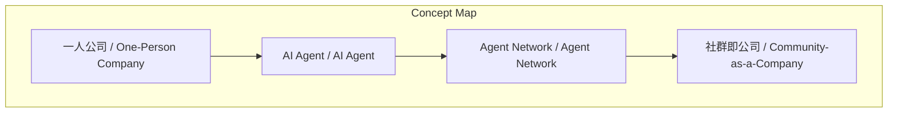
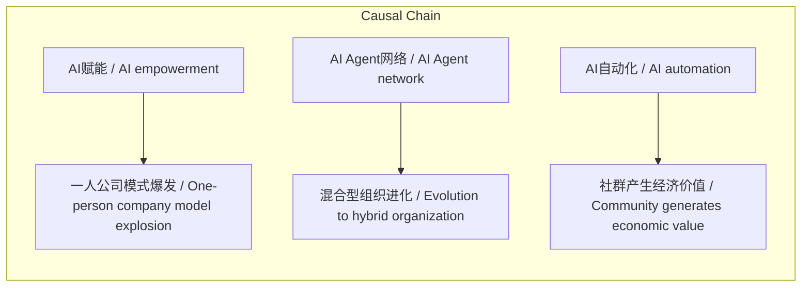

> AI赋能下，个体商业形态将从运营频道转向拥有AI工作室，实现低成本“一人公司”模式。

## 元信息
- 分类：`ai-software/models-research`
- 优先级：`medium` (`12`)
- 文档类型：`text-summary`
- 来源分组：`news`
- 原始文件：`reports/news/2026-03-23/1774276830470-news-news-task-1774276807110-5h3p4n.md`
- 请求 ID：`1774276807110-5h3p4n`

## 原始内容

#### 文本总结

##### 运行信息
- model: openrouter/free
- schema_fallback: yes
- attempted_models: stepfun/step-3.5-flash:free, qwen/qwen-2.5-72b-instruct:free, deepseek/deepseek-chat:free, openrouter/free

### 2026商业物种：AI驱动的“一人公司”崛起

#### 整体结构化文档表达
##### 文档卡片
- 主题（中文/English）：2026年商业物种演变 / Commercial Species Evolution in 2026
- 一句话摘要：AI赋能下，个体商业形态将从运营频道转向拥有AI工作室，实现低成本“一人公司”模式。
- 目标读者：创作者、创业者、商业观察者
- 核心结论（3条）：
- AI驱动“一人公司”模式爆发，运营成本极低且可行性极高
- 创作者将从“粉丝经济”进化为“混合型组织”，由AI代理网络辅助运作
- “社群即公司”成为新型商业形态，AI自动化维持社群经济活动

##### 内容结构树
1. 背景与问题定义
2. 核心观点与关键证据
3. 方法/机制/路径
4. 风险与边界条件
5. 结论与行动建议

##### 结构化元数据（JSON）
```json
{
  "title": "2026商业物种：AI驱动的“一人公司”崛起",
  "topic_zh": "2026年商业物种演变",
  "topic_en": "Commercial Species Evolution in 2026",
  "audience": "创作者、创业者、商业观察者",
  "claims": [
    "AI赋能下，“一人公司”的运营成本被极大降低",
    "未来的头部KOL将借助AI建立自己的体系",
    "社群的运作可以依靠AI自动化维持"
  ],
  "evidence": [
    "人类的核心价值变成“提出想法”和“验收成果”，中间的具体执行工作都可以交给AI Agent来完成",
    "主理人可以指挥海量的AI Agent去服务社群里的每一个人，形成一个“Agent Network加人类”的混合体",
    "硅谷已经出现了许多新一代的创业公司，它们本身就是以社群的形态存在的"
  ],
  "risks": [
    "未提及"
  ],
  "actions": [
    "未提及"
  ]
}
```

#### 处理流程
1. 输入识别
2. 信息抽取（实体、概念、问题、事实、观点）
3. 结构化归纳（定义/分类/比较/因果/方法论）
4. 关系建模（概念关系、等式/方程/逻辑链）
5. 可视化表达（Mermaid）

#### 概念清单（中英文）
- 一人公司 / One-Person Company
- AI Agent / AI Agent
- Agent Network / Agent Network
- 社群即公司 / Community-as-a-Company

#### 概念定义（中英文）
##### 一人公司 / One-Person Company
- 中文定义：由AI赋能的低成本单人运营商业模式
- English Definition: A business model where a single individual leverages AI to operate a company

##### AI Agent / AI Agent
- 中文定义：智能体，负责执行具体任务的AI程序
- English Definition: AI programs that execute specific tasks autonomously

##### Agent Network / Agent Network
- 中文定义：由多个AI Agent组成的网络体系
- English Definition: A network of AI agents working together

##### 社群即公司 / Community-as-a-Company
- 中文定义：以社群形态存在的商业组织
- English Definition: A business structure where the community itself functions as the company


#### 概念关联与逻辑关系（中英文）
- AI赋能/AI empowerment -> 一人公司模式爆发/One-person company model explosion | causal | 导致
- AI Agent网络/AI Agent network -> 混合型组织进化/Evolution to hybrid organization | causal | 导致
- AI自动化/AI automation -> 社群产生经济价值/Community generates economic value | causal | 导致

##### 可形式化关系
- AI Agent 网络 + 人类主理人 = 混合型组织
- 一人公司 = 超级大脑 + 无限算力与执行力
- 社群 + AI自动化 = 产生真实经济价值

#### COT逻辑梳理（定义/分类/比较/因果/科学方法论）
- Step 1: 商业形态从“运营频道”转向“拥有AI工作室”
- Step 2: AI赋能下“一人公司”模式成本降低且可行性提高
- Step 3: 创作者进化为“混合型组织”，社群实现AI自动化运作

#### 事实与看法（区分）
##### 事实
- 硅谷已经出现了许多新一代的创业公司，它们本身就是以社群的形态存在的

##### 看法
- 未来的头部KOL或创作者不仅是内容的生产者，他们会借助AI建立起自己的体系

#### FAQ（原文问题整理）
##### 2026年商业物种的核心变化是什么？
- 从“运营频道”转向“拥有AI工作室”，实现“一人公司”模式

##### AI如何改变创作者的商业模式？
- 创作者将借助AI建立混合型组织，由AI代理网络辅助运作

##### 什么是“社群即公司”？
- 以社群形态存在的商业组织，AI自动化维持社群经济活动

#### Visualization
##### Mermaid 图 1（概念结构图）


##### Mermaid 图 2（逻辑/因果图）


#### 文章中的类比
- 未提及

#### 10个金句
- 未来的头部KOL或创作者不仅是内容的生产者，他们会借助AI建立起自己的体系
