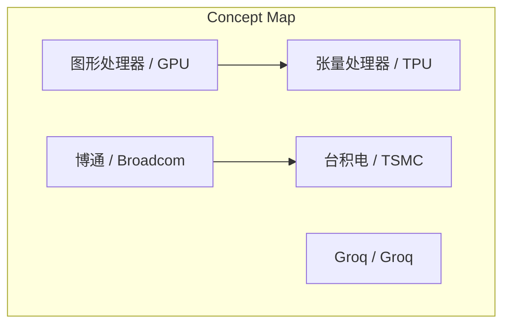
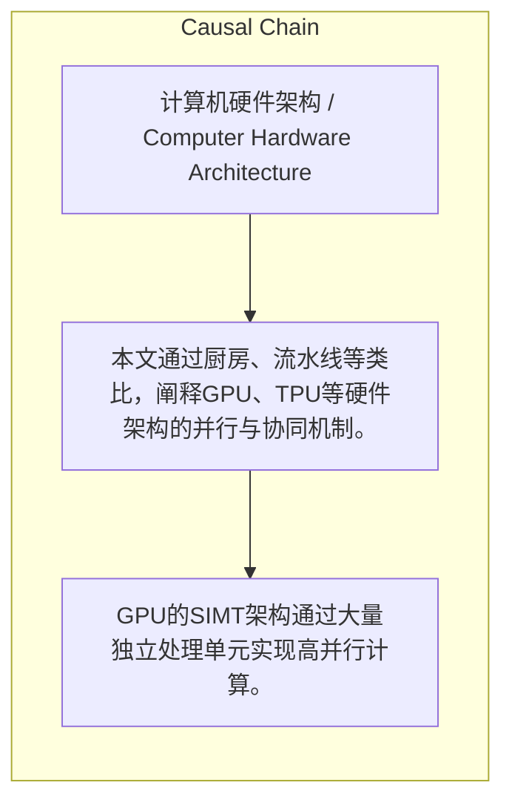

> 本文通过厨房、流水线等类比，阐释GPU、TPU等硬件架构的并行与协同机制。

## 元信息
- 分类：`ai-software/models-research`
- 优先级：`medium` (`12`)
- 文档类型：`text-summary`
- 来源分组：`news`
- 原始文件：`reports/news/2026-03-25/1774447668411-news-news-task-1774447563496-g4y7sy.md`
- 请求 ID：`1774447563496-g4y7sy`

## 原始内容

#### 文本总结

##### 运行信息
- model: stepfun/step-3.5-flash:free
- schema_fallback: yes
- attempted_models: stepfun/step-3.5-flash:free

### 技术架构类比解读

#### 整体结构化文档表达
##### 文档卡片
- 主题（中文/English）：计算机硬件架构 / Computer Hardware Architecture
- 一句话摘要：本文通过厨房、流水线等类比，阐释GPU、TPU等硬件架构的并行与协同机制。
- 目标读者：技术爱好者、学生、初级工程师
- 核心结论（3条）：
- GPU的SIMT架构通过大量独立处理单元实现高并行计算。
- TPU架构通过优化数据流和顺序传递减少调度开销。
- 博通在芯片物理互联中负责混合信号连接等关键工作。

##### 内容结构树
1. 背景与问题定义
2. 核心观点与关键证据
3. 方法/机制/路径
4. 风险与边界条件
5. 结论与行动建议

##### 结构化元数据（JSON）
```json
{
  "title": "技术架构类比解读",
  "topic_zh": "计算机硬件架构",
  "topic_en": "Computer Hardware Architecture",
  "audience": "技术爱好者、学生、初级工程师",
  "claims": [],
  "evidence": [],
  "risks": [],
  "actions": []
}
```

#### 处理流程
1. 输入识别
2. 信息抽取（实体、概念、问题、事实、观点）
3. 结构化归纳（定义/分类/比较/因果/方法论）
4. 关系建模（概念关系、等式/方程/逻辑链）
5. 可视化表达（Mermaid）

#### 概念清单（中英文）
- 图形处理器 / GPU
- 张量处理器 / TPU
- 博通 / Broadcom
- Groq / Groq
- 台积电 / TSMC

#### 概念定义（中英文）
##### 图形处理器 / GPU
- 中文定义：采用SIMT架构，通过多个独立处理单元实现高并行计算的处理器。
- English Definition: 未提及

##### 张量处理器 / TPU
- 中文定义：采用流水线架构，优化数据流传输，减少调度开销的处理器。
- English Definition: 未提及

##### 博通 / Broadcom
- 中文定义：负责芯片间物理连接和混合信号互联的厂商。
- English Definition: 未提及

##### Groq / Groq
- 中文定义：提供本地部署AI集群的公司，强调低延迟响应。
- English Definition: 未提及

##### 台积电 / TSMC
- 中文定义：芯片制造代工厂，负责生产芯片。
- English Definition: 未提及


#### 概念关联与逻辑关系（中英文）
- GPU/GPU -> TPU/TPU | concept | 并行与协同架构对比
- 博通/Broadcom -> 台积电/TSMC | concept | 物理连接设计与制造协作
- Groq/Groq -> 局域网/LAN | concept | 本地部署体验类比

##### 可形式化关系
- GPU SIMT架构 → 高并行度
- TPU数据流设计 → 低调度开销
- 博通混合信号互联 → 高经验要求

#### COT逻辑梳理（定义/分类/比较/因果/科学方法论）
- 未发现明确逻辑步骤

#### 事实与看法（区分）
##### 事实
- 未发现明确客观事实

##### 看法
- TPU架构省去了大量调度。
- 博通处理混合信号互联是极其吃经验的'脏活累活'。

#### FAQ（原文问题整理）
- 未发现明确 FAQ

#### Visualization
##### Mermaid 图 1（概念结构图）


##### Mermaid 图 2（逻辑/因果图）


#### 文章中的类比
- 厨房与大厨：GPU并行计算
- 流水线：TPU架构
- 心脏泵血：TPU数据传输
- 百米赛跑与接力赛：并行与串行
- 图纸打印：博通物理设计
- 脏活累活：混合信号互联

#### 10个金句
- 原文未提供
