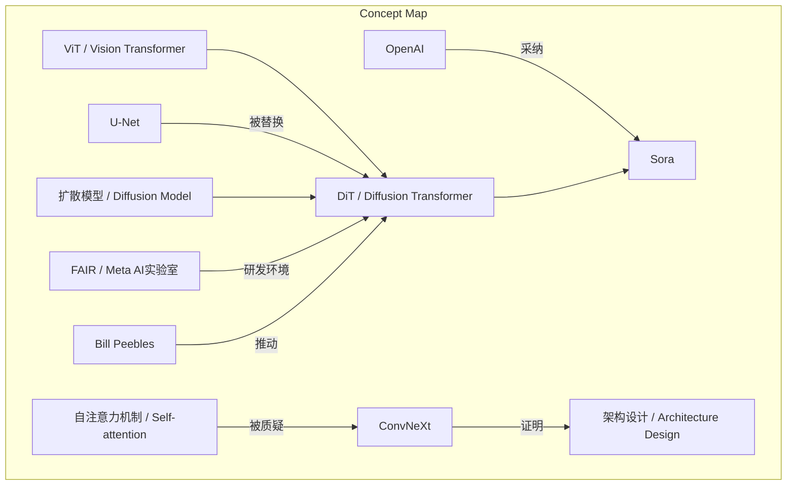
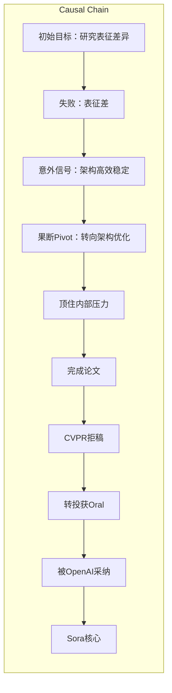

> DiT通过将ViT架构引入扩散模型，从失败的表征研究实验中意外诞生，经历内部压力与拒稿，最终被OpenAI采纳为Sora基础。

## 元信息
- 分类：`ai-software/models-research`
- 优先级：`high` (`13`)
- 文档类型：`text-summary`
- 来源分组：`news`
- 原始文件：`reports/news/2026-03-20/1774012344557-news-news-task-1774012269295-ij25da.md`
- 请求 ID：`1774012269295-ij25da`

## 原始内容

#### 文本总结

### DiT诞生记：从失败实验到Sora核心架构的逆袭

#### 整体结构化文档表达
##### 文档卡片
- 主题（DiT发现过程 / DiT Discovery Process）：
- 一句话摘要：DiT通过将ViT架构引入扩散模型，从失败的表征研究实验中意外诞生，经历内部压力与拒稿，最终被OpenAI采纳为Sora基础。
- 目标读者：AI研究人员、科技爱好者、创新方法论学习者
- 核心结论（3条）：
  1. DiT的诞生源于对ViT架构的反思与应用，而非自注意力机制本身。
  2. 其发现过程体现了“非线性研究”和“从失败实验中寻找灵感信号”的科研方法论。
  3. DiT的成功依赖于架构的简洁性、规模化潜力及后续在OpenAI的环境中被充分挖掘。

##### 内容结构树
1. 背景与问题定义：FAIR内部无人研究扩散模型，谢赛宁与实习生决定尝试，初始目标是研究扩散模型表征与自监督学习表征的区别。
2. 核心观点与关键证据：观点一：宏观与微观整体架构设计比自注意力机制更重要（通过ConvNeXt对照实验证明）；观点二：DiT的发现是意外信号捕捉与果断转向的结果（从失败表征研究中发现新架构高效稳定）。
3. 方法/机制/路径：方法：替换U-Net为ViT进行实验；机制：捕捉意外信号（高效、稳定、可规模化）；路径：从表征研究失败→转向架构优化→顶住压力完成→被拒稿后转投获Oral→被OpenAI采纳。
4. 风险与边界条件：风险：内部资源质疑、CVPR拒稿（认为缺乏新颖性）；边界条件：依赖FAIR允许实验、OpenAI的环境支持。
5. 结论与行动建议：结论：DiT成为Sora核心架构；建议：重视架构整体设计、从失败中敏锐捕捉信号、坚持直觉应对阻力。

##### 结构化元数据（JSON）
```json
{
  "title": "DiT诞生记：从失败实验到Sora核心架构的逆袭",
  "topic_zh": "DiT发现过程",
  "topic_en": "DiT Discovery Process",
  "audience": "AI研究人员、科技爱好者、创新方法论学习者",
  "claims": [
    "DiT的诞生源于对ViT架构的反思与应用，而非自注意力机制本身。",
    "其发现过程体现了“非线性研究”和“从失败实验中寻找灵感信号”的科研方法论。",
    "DiT的成功依赖于架构的简洁性、规模化潜力及后续在OpenAI的环境中被充分挖掘。"
  ],
  "evidence": [
    "谢赛宁在ConvNeXt实验中通过对照证明架构设计是关键因素。",
    "DiT研发初期目标是研究表征，失败后发现新架构高效稳定。",
    "论文被CVPR拒稿但转投获Oral，体现发表随机性。",
    "Bill Peebles加入OpenAI，DiT成为Sora核心。"
  ],
  "risks": [
    "FAIR内部质疑项目边缘化，资源集中对齐核心大项目。",
    "CVPR审稿人以“缺乏新颖性”拒稿。",
    "FAIR初期不允许以机构名义署名DiT。"
  ],
  "actions": [
    "在研发中重视整体架构设计而非单一组件。",
    "从失败实验中系统性地捕捉意外信号。",
    "面对内部压力时，基于直觉坚持有价值的方向。"
  ]
}
```

#### 处理流程
1. 输入识别：识别出访谈内容聚焦于DiT的发现过程及科研方法论。
2. 信息抽取：抽取实体（谢赛宁、ViT、DiT等）、概念（自注意力、架构设计）、事实（实验过程、拒稿）、观点（非线性研究）。
3. 结构化归纳：归纳为背景、观点、方法、风险、结论五个维度。
4. 关系建模：建立概念间因果与影响关系，如失败实验→意外信号→转向。
5. 可视化表达：生成概念结构图与逻辑因果图。

#### 概念清单（中英文）
- ViT / Vision Transformer
- 自注意力机制 / Self-attention Mechanism
- ConvNeXt
- DiT / Diffusion Transformer
- 扩散模型 / Diffusion Model
- U-Net
- FAIR / Meta AI实验室
- Bill Peebles
- OpenAI
- Sora
- CVPR
- Oral Paper / 口头报告论文
- MDL / 最小描述长度
- 规模化潜力 / Scalable Potential
- 非线性研究 / Non-linear Research
- 失败实验 / Failed Experiment
- 灵感信号 / Inspiration Signal

#### 概念定义（中英文）
- ViT / Vision Transformer：将图像分割为图块序列，输入Transformer编码器进行处理的视觉模型。
- 自注意力机制 / Self-attention Mechanism：计算序列中元素间关联权重的机制，是Transformer的核心组件。
- ConvNeXt：谢赛宁等人开发的卷积神经网络模型，通过对照实验证明架构设计的重要性。
- DiT / Diffusion Transformer：使用Transformer架构替代U-Net的扩散模型，具有高效、稳定、可规模化的特点。
- 扩散模型 / Diffusion Model：通过逐步去噪生成数据的生成模型。
- U-Net：扩散模型中常用的编码器-解码器架构。
- FAIR / Meta AI实验室：Meta公司的人工智能研究实验室。
- Bill Peebles：谢赛宁的实习生，后加入OpenAI，参与Sora开发。
- OpenAI：人工智能研究公司，开发了Sora模型。
- Sora：OpenAI开发的现象级视频生成模型，采用DiT作为核心架构。
- CVPR：计算机视觉与模式识别顶级会议。
- Oral Paper / 口头报告论文：在学术会议上进行口头报告的论文，通常代表高质量研究。
- MDL / 最小描述长度：代码审美追求简洁、优雅、短小。
- 规模化潜力 / Scalable Potential：模型性能随计算资源增加而持续提升的能力。
- 非线性研究 / Non-linear Research：不遵循线性规划，允许意外发现的研究方式。
- 失败实验 / Failed Experiment：未达预期目标但可能蕴含新发现的实验。
- 灵感信号 / Inspiration Signal：从失败或意外结果中识别出的有价值线索。

#### 概念关联与逻辑关系（中英文）
1. ViT架构设计 与 宏观微观整体架构 共同影响 模型性能（通过ConvNeXt实验证明）。
2. 失败实验（表征研究） 与 意外信号（高效稳定） 导致 研究方向Pivot（转向DiT）。
3. 内部压力 与 审稿拒绝 影响 发表过程，但最终被OpenAI环境 接纳 成为Sora基础。

#### COT逻辑梳理（定义/分类/比较/因果/科学方法论）
Step 1: 定义关键概念。定义ViT、扩散模型、U-Net、DiT等基础概念，明确研究对象。
Step 2: 分类研究类型。将DiT发现过程分类为“非线性研究”，与预设目标的研究对比。
Step 3: 比较架构差异。比较U-Net与ViT在扩散模型中的表现，突出架构设计的影响。
Step 4: 因果链分析。从失败实验（因）→捕捉意外信号（转折）→果断转向（行动）→顶压完成（坚持）→被拒稿后转投（随机）→被OpenAI采纳（结果）形成完整因果链。
Step 5: 科学方法论总结。提炼“从失败实验中寻找灵感信号”作为核心方法论，强调直觉与实验结合。

#### 事实与看法（病毒）
##### 事实
- 谢赛宁在FAIR与实习生Bill Peebles研究扩散模型。
- 初始实验将扩散模型的U-Net替换为ViT，研究表征差异，但结果差。
- 意外发现新架构比U-Net更高效、稳定、可规模化。
- 论文投CVPR被拒，理由“缺乏新颖性”，后转投获Oral。
- FAIR初期不允许以机构名义署名DiT。
- Bill Peebles加入OpenAI，DiT成为Sora核心。
- 谢赛宁认为论文发表是随机过程。
##### 看法
- ViT的成功主要归功于自注意力机制是行业共识，但谢赛宁认为架构设计更重要。
- DiT的发现完美诠释了“非线性研究”和“从失败实验中寻找灵感信号”。
- 代码简短优雅符合MDL审美。
- 谢赛宁坚信这是扩散模型架构的未来。

#### FAQ（原文问题整理）
未发现明确提问。

#### Visualization
##### Mermaid 图 1（概念结构图）

##### Mermaid 图 2（逻辑/因果图）


#### 文章中的类比
未发现明确类比。

#### 10个金句
1. “ViT的成功主要归功于自注意力机制”这一行业共识被质疑。
2. 宏观与微观的整体架构设计才是决定性能的至关重要的因素。
3. 非线性研究。
4. 从失败实验中寻找灵感信号。
5. 代码极度简短优雅，符合最小描述长度（MDL）的代码审美。
6. 论文发表是一个纯粹的随机过程。
7. 逆势起步与早期的“错误方向”。
8. 捕捉意外信号与果断转向（Pivot）。
9. 顶住内部压力与“反脆弱”的发表过程。
10. 墙内开花墙外香的终局。
