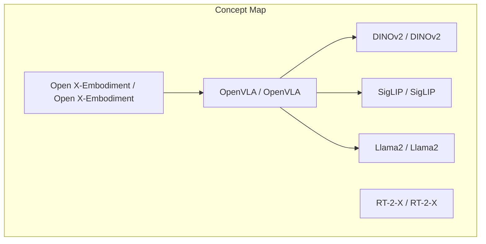
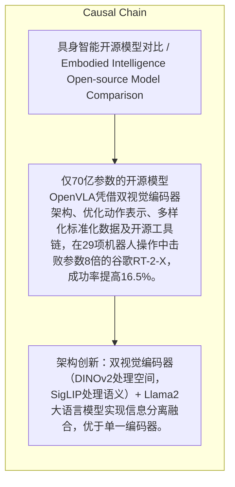

> 仅70亿参数的开源模型OpenVLA凭借双视觉编码器架构、优化动作表示、多样化标准化数据及开源工具链，在29项机器人操作中击败参数8倍的谷歌RT-2-X，成功率提高16.5%。

## 元信息
- 分类：`ai-software/models-research`
- 优先级：`medium` (`12`)
- 文档类型：`text-summary`
- 来源分组：`news`
- 原始文件：`reports/news/2026-03-27/1774600526274-news-news-task-1774600026125-wcsv6c.md`
- 请求 ID：`1774600026125-wcsv6c`

## 原始内容

#### 文本总结

##### 运行信息
- model: openrouter/free
- schema_fallback: yes
- attempted_models: stepfun/step-3.5-flash:free, qwen/qwen-2.5-72b-instruct:free, deepseek/deepseek-chat:free, openrouter/free

### 开源模型胜谷歌RT-2-X

#### 整体结构化文档表达
##### 文档卡片
- 主题（中文/English）：具身智能开源模型对比 / Embodied Intelligence Open-source Model Comparison
- 一句话摘要：仅70亿参数的开源模型OpenVLA凭借双视觉编码器架构、优化动作表示、多样化标准化数据及开源工具链，在29项机器人操作中击败参数8倍的谷歌RT-2-X，成功率提高16.5%。
- 目标读者：AI研究者、机器人工程师
- 核心结论（3条）：
- 架构创新：双视觉编码器（DINOv2处理空间，SigLIP处理语义）+ Llama2大语言模型实现信息分离融合，优于单一编码器。
- 数据优势：Open X-Embodiment提供高多样性、标准化数据，显著提升泛化和空间推理能力。
- 生态协同：开源工具链LeRobot和Genesis降低门槛，形成模型-数据-工具联动的组合拳。

##### 内容结构树
1. 背景与问题定义
2. 核心观点与关键证据
3. 方法/机制/路径
4. 风险与边界条件
5. 结论与行动建议

##### 结构化元数据（JSON）
```json
{
  "title": "开源模型胜谷歌RT-2-X",
  "topic_zh": "具身智能开源模型对比",
  "topic_en": "Embodied Intelligence Open-source Model Comparison",
  "audience": "AI研究者、机器人工程师",
  "claims": [
    "OpenVLA的成功率比RT-2-X高16.5%。",
    "OpenVLA仅有70亿参数，而RT-2-X有550亿参数。",
    "Open X-Embodiment包含22种机器人本体、超过100万条真实轨迹。",
    "Genesis在RTX 4090上的模拟速度是实时速度的43万倍。"
  ],
  "evidence": [
    "OpenVLA具有70亿参数。",
    "RT-2-X具有550亿参数。",
    "在29项机器人操作中，OpenVLA成功率比RT-2-X高16.5%。",
    "OpenVLA采用双视觉编码器DINOv2（空间）和SigLIP（语义）+ Llama2大语言模型。",
    "Open X-Embodiment由20多个顶级研究机构贡献，数据覆盖厨房、实验室、仓库、办公室等场景，并定义统一数据格式。",
    "LeRobot统一数据格式并实现从数据采集到真实机器人部署的全流程。",
    "Genesis在一张RTX 4090消费级显卡上达到实时速度的43万倍模拟速度。"
  ],
  "risks": [],
  "actions": []
}
```

#### 处理流程
1. 输入识别
2. 信息抽取（实体、概念、问题、事实、观点）
3. 结构化归纳（定义/分类/比较/因果/方法论）
4. 关系建模（概念关系、等式/方程/逻辑链）
5. 可视化表达（Mermaid）

#### 概念清单（中英文）
- OpenVLA / OpenVLA
- RT-2-X / RT-2-X
- DINOv2 / DINOv2
- SigLIP / SigLIP
- Llama2 / Llama2
- Open X-Embodiment / Open X-Embodiment
- LeRobot / LeRobot
- Genesis / Genesis

#### 概念定义（中英文）
##### OpenVLA / OpenVLA
- 中文定义：仅70亿参数的开源具身智能模型，采用双视觉编码器（DINOv2、SigLIP）+ Llama2 大语言模型架构。
- English Definition: An open-source embodied intelligence model with 7 billion parameters, using a dual visual encoder (DINOv2, SigLIP) plus Llama2 LLM architecture.

##### RT-2-X / RT-2-X
- 中文定义：谷歌DeepMind的闭源具身智能模型，参数量550亿，在29项机器人操作中被OpenVLA击败。
- English Definition: Google DeepMind's closed-source embodied intelligence model with 55 billion parameters, defeated by OpenVLA in 29 robot manipulation tasks.

##### DINOv2 / DINOv2
- 中文定义：OpenVLA中负责理解空间关系的第一个视觉编码器。
- English Definition: The first visual encoder in OpenVLA responsible for understanding spatial relationships.

##### SigLIP / SigLIP
- 中文定义：OpenVLA中负责理解语义和常识的第二个视觉编码器。
- English Definition: The second visual encoder in OpenVLA responsible for understanding semantics and commonsense.

##### Llama2 / Llama2
- 中文定义：开源大语言模型，在OpenVLA中充当“大脑”，融合空间和语义信息进行指令处理和推理。
- English Definition: An open-source large language model serving as the “brain” in OpenVLA, fusing spatial and semantic information for instruction processing and reasoning.

##### Open X-Embodiment / Open X-Embodiment
- 中文定义：由20多个顶级研究机构贡献的多样化开源数据集，包含22种机器人本体、超过100万条真实轨迹，覆盖厨房、实验室、仓库、办公室等场景，并定义了统一的数据格式。
- English Definition: A diverse open-source dataset contributed by over 20 top research institutions, containing 22 robot embodiments and over 1 million real trajectories across kitchens, labs, warehouses, offices, with a standardized data format.

##### LeRobot / LeRobot
- 中文定义：Hugging Face的开源工具链，统一数据格式并打通从数据采集到真实机器人部署的全流程。
- English Definition: An open-source toolchain from Hugging Face that unifies data format and connects data collection to real-robot deployment.

##### Genesis / Genesis
- 中文定义：CMU主导的开源仿真工具，能在一张RTX 4090消费级显卡上实现实时速度的43万倍模拟速度，大幅降低训练成本和时间。
- English Definition: An open-source simulation tool led by CMU that achieves 430,000× real-time speed on a single RTX 4090 consumer GPU, greatly reducing training cost and time.


#### 概念关联与逻辑关系（中英文）
- OpenVLA/OpenVLA -> DINOv2/DINOv2 | concept | uses
- OpenVLA/OpenVLA -> SigLIP/SigLIP | concept | uses
- OpenVLA/OpenVLA -> Llama2/Llama2 | concept | uses
- Open X-Embodiment/Open X-Embodiment -> OpenVLA/OpenVLA | concept | provides_training_data
- LeRobot/LeRobot -> OpenVLA/OpenVLA | concept | provides_toolchain
- Genesis/Genesis -> OpenVLA/OpenVLA | concept | provides_simulation

##### 可形式化关系
- OpenVLA.success_rate = RT-2-X.success_rate + 16.5%
- OpenVLA.parameters = 7B ; RT-2-X.parameters = 55B (8×)
- OpenVLA.architecture = DualVisualEncoders(DINOv2, SigLIP) + Llama2

#### COT逻辑梳理（定义/分类/比较/因果/科学方法论）
- Step 1: 架构设计采用双视觉编码器分离空间和语义信息，由Llama2大语言模型融合进行指令处理和推理。
- Step 2: 利用Open X-Embodiment的多样化标准化数据进行训练，提升模型在不同场景和机器人本体上的泛化及空间推理能力。
- Step 3: 配合开源工具链LeRobot（数据管线）和Genesis（高速仿真），实现低成本训练和端到端部署，形成模型-数据-工具的生态协同优势。

#### 事实与看法（区分）
##### 事实
- OpenVLA具有70亿参数。
- RT-2-X具有550亿参数。
- OpenVLA在29项机器人操作中成功率比RT-2-X高16.5%。
- Open X-Embodiment包含22种机器人本体、超过100万条真实轨迹。
- Genesis在RTX 4090上的模拟速度是实时速度的43万倍。
- LeRobot统一数据格式并实现从数据采集到真实机器人部署的全流程。

##### 看法
- 未发现明确主观看法

#### FAQ（原文问题整理）
##### OpenVLA如何击败谷歌的RT-2-X？
- OpenVLA通过双视觉编码器架构（DINOv2处理空间，SigLIP处理语义）+ Llama2大语言模型融合、利用多样化标准化的Open X-Embodiment数据进行训练，并借助LeRobot和Genesis等开源工具链降低研发门槛，在29项机器人操作中使成功率提高16.5%。

#### Visualization
##### Mermaid 图 1（概念结构图）


##### Mermaid 图 2（逻辑/因果图）


#### 文章中的类比
- 未发现明确类比

#### 10个金句
- 原文未提供
