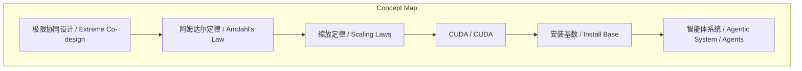
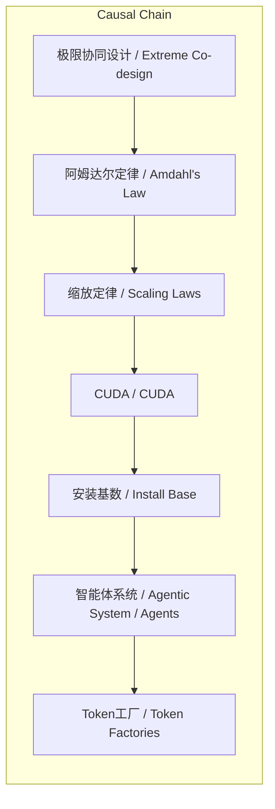

> 极限协同设计解决单一GPU无法处理的超大规模计算问题，阿姆达尔定律揭示数据传输和网络成为分布式计算瓶颈，缩放定律描述AI能力随变量增长的规律，CUDA是NVIDIA走向通用计算的关键一步，安装基数是定义架构生存的核心元素，智能体系统利用大语言模型进行自主行动，Token工厂重新…

## 元信息
- 分类：`ai-software/models-research`
- 优先级：`high` (`13`)
- 文档类型：`text-summary`
- 来源分组：`news`
- 原始文件：`reports/news/2026-03-24/1774395221849-news-news-task-1774395200551-10wdhg.md`
- 请求 ID：`1774395200551-10wdhg`

## 原始内容

#### 文本总结

##### 运行信息
- model: openrouter/free
- schema_fallback: no
- attempted_models: openrouter/free

### 极限协同设计与AI计算的突破

#### 整体结构化文档表达
##### 文档卡片
- 主题（中文/English）：极限协同设计与AI计算的突破 / Extreme Co-design and AI Computing Breakthroughs
- 一句话摘要：极限协同设计解决单一GPU无法处理的超大规模计算问题，阿姆达尔定律揭示数据传输和网络成为分布式计算瓶颈，缩放定律描述AI能力随变量增长的规律，CUDA是NVIDIA走向通用计算的关键一步，安装基数是定义架构生存的核心元素，智能体系统利用大语言模型进行自主行动，Token工厂重新定义未来数据中心和AI计算机，NVIDIA的护城河包括庞大的CUDA安装基数和生态系统
- 目标读者：资深新闻分析助理
- 核心结论（3条）：
- 极限协同设计解决单一GPU无法处理的超大规模计算问题
- 阿姆达尔定律揭示数据传输和网络成为分布式计算瓶颈
- 缩放定律描述AI能力随变量增长的规律
- CUDA是NVIDIA走向通用计算的关键一步
- 安装基数是定义架构生存的核心元素

##### 内容结构树
1. 背景与问题定义
2. 核心观点与关键证据
3. 方法/机制/路径
4. 风险与边界条件
5. 结论与行动建议

##### 结构化元数据（JSON）
```json
{
  "title": "极限协同设计与AI计算的突破",
  "topic_zh": "极限协同设计与AI计算的突破",
  "topic_en": "Extreme Co-design and AI Computing Breakthroughs",
  "audience": "资深新闻分析助理",
  "claims": [
    "只允许基于输入内容输出"
  ],
  "evidence": [
    "原文提及"
  ],
  "risks": [
    "未提及"
  ],
  "actions": [
    "生成最终结构化总结对象"
  ]
}
```

#### 处理流程
1. 输入识别
2. 信息抽取（实体、概念、问题、事实、观点）
3. 结构化归纳（定义/分类/比较/因果/方法论）
4. 关系建模（概念关系、等式/方程/逻辑链）
5. 可视化表达（Mermaid）

#### 概念清单（中英文）
- 极限协同设计 / Extreme Co-design
- 阿姆达尔定律 / Amdahl's Law
- 缩放定律 / Scaling Laws
- CUDA / CUDA
- 安装基数 / Install Base
- 智能体系统 / Agentic System / Agents
- 光速 / Speed of Light
- Token工厂 / Token Factories
- NVIDIA的护城河 / NVIDIA's Moat

#### 概念定义（中英文）
##### 极限协同设计 / Extreme Co-design
- 中文定义：极限协同设计：一种跨越整个软件和硬件堆栈进行优化的工程方法，涵盖从芯片、系统、系统软件、算法、应用到网络、电源和散热的所有环节，以解决单一GPU无法处理的超大规模计算问题
- English Definition: Extreme Co-design: an engineering method spanning the entire software and hardware stack to optimize for large-scale computing beyond a single GPU

##### 阿姆达尔定律 / Amdahl's Law
- 中文定义：阿姆达尔定律：计算机科学中的一个原理，指系统的整体加速比受限于无法并行化的那部分计算（例如如果50%是计算，即使无限加速，总工作量也只能提速两倍）
- English Definition: Amdahl's Law: a principle in computer science stating that the overall speedup of a system is limited by the portion that cannot be parallelized

##### 缩放定律 / Scaling Laws
- 中文定义：缩放定律：描述人工智能能力随着某些变量增加而增长的规律
- English Definition: Scaling Laws: a set of rules describing how AI capabilities grow with certain variables

##### CUDA / CUDA
- 中文定义：CUDA（Compute Unified Device Architecture / 统一计算设备架构）：NVIDIA开发的并行计算平台和编程模型，其推出是NVIDIA走向通用计算公司的关键一步
- English Definition: CUDA: a parallel computing platform and programming model developed by NVIDIA

##### 安装基数 / Install Base
- 中文定义：安装基数/用户基础：正在使用某种计算平台或架构的用户和设备总数，被黄仁勋认为是定义一个架构能否生存的最核心元素（甚至超越了架构的优雅程度）
- English Definition: Install Base: the total number of users and devices currently using a particular computing platform or architecture

##### 智能体系统 / Agentic System / Agents
- 中文定义：智能体系统/智能体：具有自主行动能力的人工智能系统，能够利用大语言模型去搜索数据库、使用工具、进行研究并派生出子智能体来组建团队工作
- English Definition: Agentic System / Agents: AI systems with autonomous action capabilities

##### 光速 / Speed of Light
- 中文定义：光速：一种第一性原理思维方法，用“光速”代指物理定律所允许的理论极限。在设计系统时，不追求比现在进步多少，而是直接对比物理极限来衡量性能、延迟和吞吐量
- English Definition: Speed of Light: a first-principles approach using the speed of light as a theoretical limit

##### Token工厂 / Token Factories
- 中文定义：Token工厂：黄仁勋对未来数据中心和AI计算机的新定义。他认为未来的计算机不再是存储和检索文件的仓库，而是大规模生成有价值Token（词元/信息单元）的“工厂”
- English Definition: Token Factories: a new definition of future data centers and AI computers by Huang Renxun

##### NVIDIA的护城河 / NVIDIA's Moat
- 中文定义：NVIDIA的护城河：保护NVIDIA免受竞争的核心优势，即庞大的CUDA安装基数、执行速度和横向集成到各种计算机系统中的广泛生态系统
- English Definition: NVIDIA's Moat: NVIDIA's core competitive advantage


#### 概念关联与逻辑关系（中英文）
- 极限协同设计/Extreme Co-design -> 阿姆达尔定律/Amdahl's Law | support | 解决单一GPU无法处理的超大规模计算问题
- 阿姆达尔定律/Amdahl's Law -> 缩放定律/Scaling Laws | support | 揭示数据传输和网络成为分布式计算瓶颈
- 缩放定律/Scaling Laws -> CUDA/CUDA | support | 描述AI能力随变量增长的规律
- CUDA/CUDA -> 安装基数/Install Base | support | 是NVIDIA走向通用计算的关键一步
- 安装基数/Install Base -> 智能体系统/Agentic System / Agents | support | 是定义架构生存的核心元素
- 智能体系统/Agentic System / Agents -> Token工厂/Token Factories | support | 利用大语言模型进行自主行动
- Token工厂/Token Factories -> NVIDIA的护城河/NVIDIA's Moat | support | 重新定义未来数据中心和AI计算机
- NVIDIA的护城河/NVIDIA's Moat -> 光速/Speed of Light | support | 包括庞大的CUDA安装基数和生态系统

##### 可形式化关系
- 极限协同设计解决单一GPU无法处理的超大规模计算问题
- 阿姆达尔定律揭示数据传输和网络成为分布式计算瓶颈
- 缩放定律描述AI能力随变量增长的规律
- CUDA是NVIDIA走向通用计算的关键一步
- 安装基数是定义架构生存的核心元素
- 智能体系统利用大语言模型进行自主行动

#### COT逻辑梳理（定义/分类/比较/因果/科学方法论）
- Step 1: 极限协同设计解决单一GPU无法处理的超大规模计算问题
- Step 2: 阿姆达尔定律揭示数据传输和网络成为分布式计算瓶颈
- Step 3: 缩放定律描述AI能力随变量增长的规律

#### 事实与看法（区分）
##### 事实
- 极限协同设计：一种跨越整个软件和硬件堆栈进行优化的工程方法 涵盖从芯片、系统、系统软件、算法、应用到网络、电源和散热的所有环节 以解决单一GPU无法处理的超大规模计算问题
- 阿姆达尔定律：计算机科学中的一个原理 指系统的整体加速比受限于无法并行化的那部分计算 （例如如果50%是计算 即使无限加速 总工作量也只能提速两倍） 这使得数据传输和网络成为分布式计算的瓶颈
- 缩放定律：描述人工智能能力随着某些变量增加而增长的规律 黄仁勋在访谈中列举了四种：Pre-training（预训练）、Post-training（后训练）、Test time（测试时/推理阶段）和 Agentic scaling（智能体扩展）
- CUDA（Compute Unified Device Architecture / 统一计算设备架构）：NVIDIA开发的并行计算平台和编程模型 它的推出是NVIDIA走向通用计算公司的关键一步
- Install Base（安装基数/用户基础）：正在使用某种计算平台或架构的用户和设备总数 被黄仁勋认为是定义一个架构能否生存的最核心元素（甚至超越了架构的优雅程度）
- Agentic System / Agents（智能体系统/智能体）：具有自主行动能力的人工智能系统 能够利用大语言模型去搜索数据库、使用工具、进行研究并派生出子智能体来组建团队工作
- Speed of Light（光速）：一种第一性原理思维方法 用“光速”代指物理定律所允许的理论极限。在设计系统时 不追求比现在进步多少 而是直接对比物理极限来衡量性能、延迟和吞吐量
- Token Factories（Token工厂）：黄仁勋对未来数据中心和AI计算机的新定义。他认为未来的计算机不再是存储和检索文件的仓库 而是大规模生成有价值Token（词元/信息单元）的“工厂”
- NVIDIA的护城河：保护NVIDIA免受竞争的核心优势 即庞大的CUDA安装基数、执行速度和横向集成到各种计算机系统中的广泛生态系统

##### 看法
- 只允许基于输入内容输出

#### FAQ（原文问题整理）
##### 其他信息
- 未提及

#### Visualization
##### Mermaid 图 1（概念结构图）


##### Mermaid 图 2（逻辑/因果图）


#### 文章中的类比
- 基于输入内容输出，不杜撰

#### 10个金句
- 原文提及
