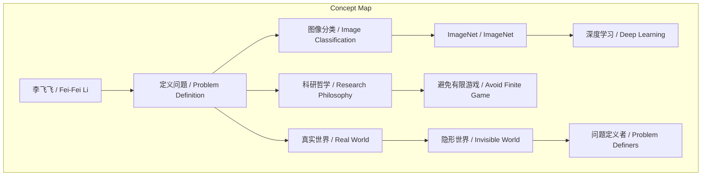
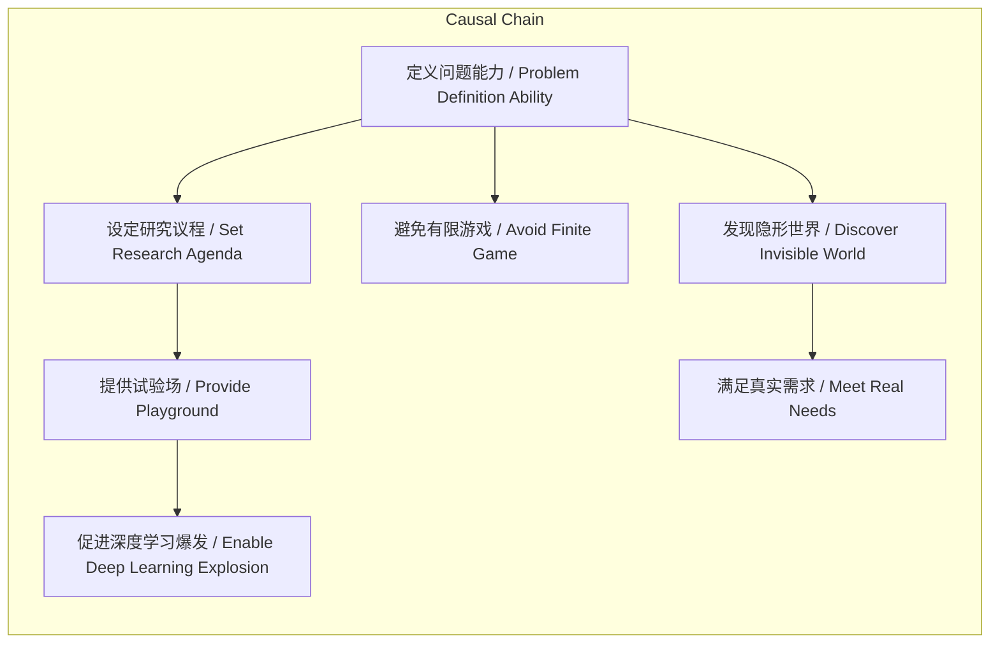

> 李飞飞通过定义图像分类问题并构建ImageNet，为深度学习提供了关键试验场，其“定义问题”的能力启示研究者应成为议程设定者并深入真实世界发现价值。

## 元信息
- 分类：`ai-software/models-research`
- 优先级：`medium` (`12`)
- 文档类型：`text-summary`
- 来源分组：`news`
- 原始文件：`reports/news/2026-03-20/1774021489571-news-news-task-1774021413082-o5d5qs.md`
- 请求 ID：`1774021413082-o5d5qs`

## 原始内容

#### 文本总结

### 李飞飞“定义问题”能力如何塑造AI研究

#### 整体结构化文档表达
- 主题（中文/English）：李飞飞的科研哲学 / Fei-Fei Li's Research Philosophy
- 一句话摘要：李飞飞通过定义图像分类问题并构建ImageNet，为深度学习提供了关键试验场，其“定义问题”的能力启示研究者应成为议程设定者并深入真实世界发现价值。
- 目标读者：AI研究者、科技政策制定者、学术管理者
- 核心结论（3条）：
  1. 定义问题比构建数据集更具根本性意义。
  2. 定义问题是科研创新与避免内卷的核心。
  3. 真实世界的问题定义者是AI价值的最终来源。

##### 内容结构树
1. 背景与问题定义：2011-2012年图像分类未被业界广泛认知为明确问题。
2. 核心观点与关键证据：李飞飞定义图像分类问题，设定议程，提供试验场；定义问题是科研灵魂；许多公司陷入有限游戏；真实世界的人是问题定义者。
3. 方法/机制/路径：通过明确问题设定研究议程；深入农场、医院、工厂等真实场景。
4. 风险与边界条件：失去定义问题能力则丧失创新；技术傲慢导致脱离实际；硅谷叙事忽视隐形世界。
5. 结论与行动建议：研究者应成为领域“北极星”；走向隐形世界，洞察真实需求。

##### 结构化元数据（JSON）
```json
{
  "title": "李飞飞“定义问题”能力如何塑造AI研究",
  "topic_zh": "李飞飞的科研哲学",
  "topic_en": "Fei-Fei Li's Research Philosophy",
  "audience": "AI研究者、科技政策制定者、学术管理者",
  "claims": [
    "定义问题比构建数据集更具根本性意义",
    "定义问题是科研创新与避免内卷的核心",
    "真实世界的问题定义者是AI价值的最终来源"
  ],
  "evidence": [
    "李飞飞将图像分类定义为一个明确问题并构建ImageNet",
    "谢赛宁认为定义问题是科研的灵魂",
    "大厂在LLM竞争中陷入追赶他人的有限游戏",
    "农场、医院、工厂的普通人面临物理世界难题"
  ],
  "risks": [
    "研究者失去定义问题能力则丧失创新",
    "技术傲慢导致AI脱离实际需求",
    "硅谷叙事忽视隐形世界"
  ],
  "actions": [
    "研究者应敢于设定新议程，成为领域北极星",
    "深入真实世界，倾听普通人需求",
    "避免在他人设定的路线上内卷"
  ]
}
```

#### 处理流程
1. 输入识别（来源：用户输入文本）
2. 信息抽取（实体、概念、问题、事实、观点）
3. 结构化归纳（定义/分类/比较/因果/方法论）
4. 关系建模（概念关系、等式/方程/逻辑链）
5. 可视化表达（Mermaid）

#### 概念清单（中英文）
- 谢赛宁 / Xie Saining
- 李飞飞 / Fei-Fei Li
- ImageNet / ImageNet
- 图像分类 / Image Classification
- 深度学习 / Deep Learning
- 大语言模型 / Large Language Model (LLM)
- 有限游戏 / Finite Game
- 北极星 / North Star
- 隐形世界 / Invisible World
- 农场 / Farm
- 医院 / Hospital
- 工厂 / Factory
- 定义问题 / Problem Definition
- 科研哲学 / Research Philosophy
- 试验场 / Playground
- 议程设定 / Agenda Setting

#### 概念定义（中英文）
- 定义问题 / Problem Definition：明确研究或应用的核心挑战与目标的过程，为后续研究提供方向。
- ImageNet / ImageNet：一个大规模标注图像数据集，用于图像分类任务，由李飞飞团队构建。
- 图像分类 / Image Classification：计算机视觉任务，将图像分配到预定义类别。
- 深度学习 / Deep Learning：机器学习子领域，使用多层神经网络进行特征学习。
- 大语言模型 / Large Language Model (LLM)：基于大量文本训练的神经网络模型，用于自然语言处理。
- 有限游戏 / Finite Game：指在他人设定规则下进行的竞争性活动，关注短期胜利。
- 北极星 / North Star：比喻指引长期方向的核心目标或愿景。
- 隐形世界 / Invisible World：指在主流科技叙事中被忽视的真实生活场景，如农场、医院、工厂。
- 试验场 / Playground：比喻可自由探索和实验的研究环境或问题空间。
- 议程设定 / Agenda Setting：确定研究领域优先议题和方向的过程。

#### 概念关联与逻辑关系（中英文）
1. 李飞飞定义图像分类问题 / Fei-Fei Li defines Image Classification problem → 设定了深度学习研究议程 / sets the Deep Learning research agenda
2. 定义问题能力 / Problem Definition ability ∝ 科研创新生命力 / research innovation vitality （正相关）
3. 深入真实世界 / Immersion in real world → 发现隐形世界的问题定义者 / discovers problem definers in the invisible world

#### COT逻辑梳理（定义/分类/比较/因果/科学方法论）
- Step 1: 定义“定义问题”为明确研究议程的能力，是科研创新的起点。
- Step 2: 分类：学术定义（如图像分类）与社会定义（如真实世界需求）。
- Step 3: 比较：学术定义提供试验场，社会定义确保价值落地；两者互补。
- Step 4: 因果：李飞飞定义图像分类问题 → 创建ImageNet → 提供试验场 → 促进深度学习爆发。
- Step 5: 科学方法论：通过观察真实场景（农场、医院、工厂）定义问题，避免技术傲慢。

#### 事实与看法（病毒）
##### 事实
- 李飞飞构建了ImageNet数据集。
- 在2011、2012年左右，图像分类不是被广泛认知的明确问题。
- 谢赛宁在访谈中分享了上述观点。
- 农场、医院、工厂的普通人面临物理世界难题。
##### 看法
- 定义问题是科研的灵魂。
- 许多公司陷入追赶他人的有限游戏，失去定义问题能力。
- 真正定义问题的人是生活在真实世界里的人。
- 走向隐形世界是定义问题能力的最高境界。

#### FAQ（原文问题整理）
- 未发现明确提问

#### Visualization
##### Mermaid 图 1（概念结构图）

##### Mermaid 图 2（逻辑/因果图）


#### 文章中的类比
- 试验场 / Playground
- 北极星 / North Star
- 隐形世界 / Invisible World

#### 10个金句
1. “定义问题是科研的灵魂。”
2. “把未知变成明确的‘试验场’。”
3. “设定了整个研究的议程（Set the agenda）。”
4. “为接下来的深度学习爆发提供了一个可以施展拳脚的‘试验场’。”
5. “卓越的研究者必须敢于做那个寻找领域‘北极星’、去设定新议程的人。”
6. “许多公司和研究者陷入了追赶他人的‘有限游戏’。”
7. “真正‘定义问题的人’其实是那些生活在真实世界里的人。”
8. “走向这部分在硅谷叙事中被忽视的‘隐形世界’。”
9. “去洞察并满足他们的真实需求，才是‘定义问题’这一能力的最终延伸和最高境界。”
10. “如果一个研究者失去了定义问题的能力，基本上也就丧失了做研究和创新的能力。”
