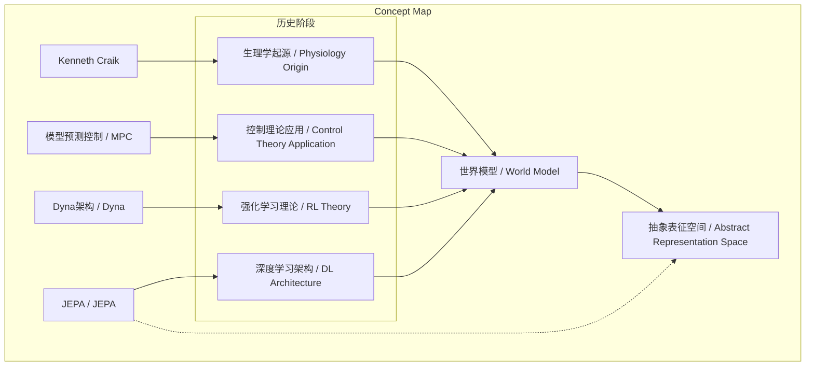
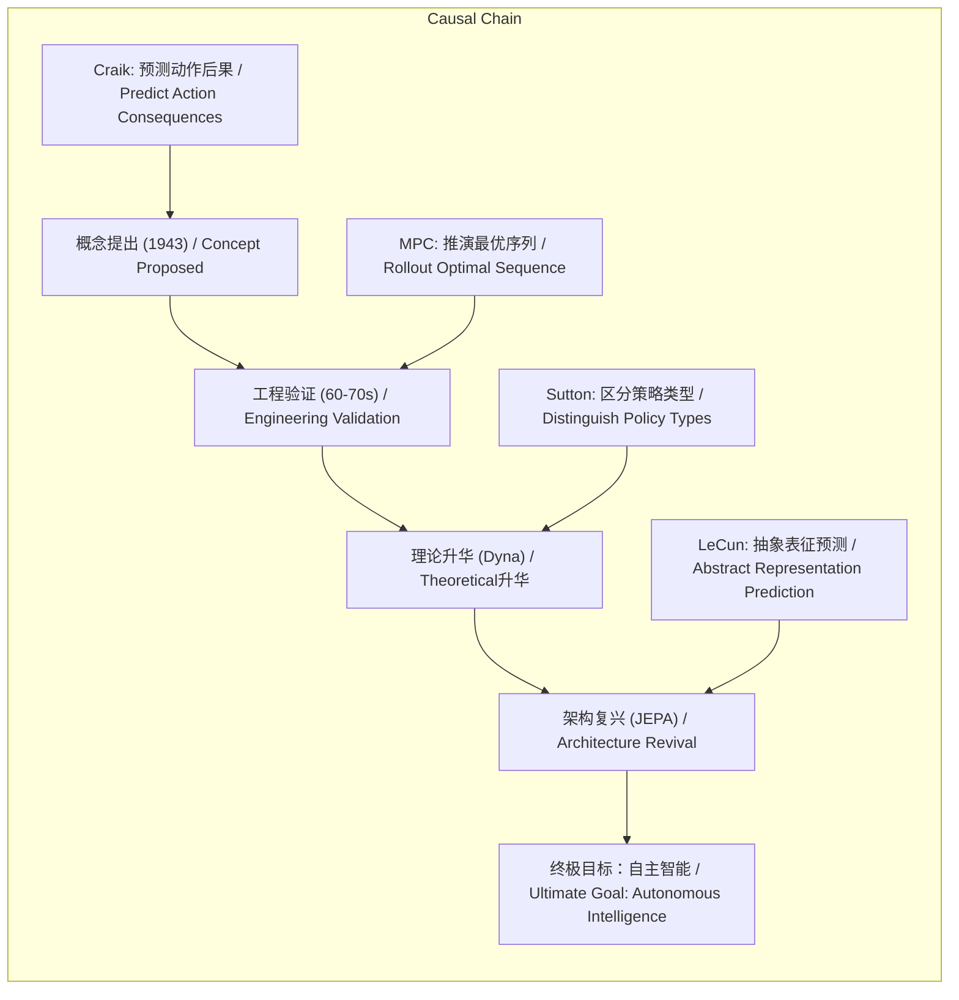

> 本文基于谢赛宁访谈，系统梳理“世界模型”概念自1943年Craik提出后，在生理学、控制理论、强化学习及深度学习等领域的发展脉络与核心思想。

## 元信息
- 分类：`ai-software/models-research`
- 优先级：`high` (`13`)
- 文档类型：`text-summary`
- 来源分组：`news`
- 原始文件：`reports/news/2026-03-21/1774103667522-news-news-task-1774103587771-z1icb7.md`
- 请求 ID：`1774103587771-z1icb7`

## 原始内容

#### 文本总结

### 世界模型：从生理假说到AI终局的演进脉络

#### 整体结构化文档表达
##### 文档卡片
- 主题（中文/English）：世界模型的历史演进与核心思想 / Historical Evolution and Core Ideas of World Models
- 一句话摘要：本文基于谢赛宁访谈，系统梳理“世界模型”概念自1943年Craik提出后，在生理学、控制理论、强化学习及深度学习等领域的发展脉络与核心思想。
- 目标读者：人工智能研究者、学生及科技爱好者
- 核心结论（3条）：
  1. “世界模型”并非新概念，其历史贯穿生理学、控制理论、强化学习与深度学习，是AI领域的长期目标。
  2. 其核心本质是“基于当前状态和动作预测下一状态”，以指导决策与规划。
  3. 当代以JEPA为代表的架构强调在抽象表征空间进行预测，而非重建像素细节，是通向自主机器智能的关键路径。

##### 内容结构树
1. 背景与问题定义：澄清“世界模型”概念的悠久历史与跨领域重要性，反驳其仅为近期流行词的观点。
2. 核心观点与关键证据：分四个历史阶段（生理学起源、控制理论应用、强化学习理论、深度学习复兴）列举关键人物、理论与算法，论证概念的延续性与演变。
3. 方法/机制/路径：具体介绍模型预测控制（MPC）、Dyna架构（反应式与基于模型策略）、JEPA架构（联合嵌入预测）的实现机制。
4. 风险与边界条件：未提及
5. 结论与行动建议：不同技术路径（大语言模型、视频生成、机器人）正殊途同归，共同指向构建能理解、推理并预测物理世界的世界模型。

##### 结构化元数据（JSON）
```json
{
  "title": "世界模型：从生理假说到AI终局的演进脉络",
  "topic_zh": "世界模型的历史演进与核心思想",
  "topic_en": "Historical Evolution and Core Ideas of World Models",
  "audience": "人工智能研究者、学生及科技爱好者",
  "claims": [
    "世界模型概念历史悠久，非生成式AI爆火后的新创",
    "其核心是基于状态与动作预测下一状态以指导决策",
    "当代JEPA架构强调抽象表征预测，是构建自主智能的关键"
  ],
  "evidence": [
    "1943年，Kenneth Craik首次提出大脑存在世界模型以预知动作后果",
    "20世纪60-70年代，控制理论中的模型预测控制（MPC）应用世界模型思想进行工程推演",
    "Richard Sutton在《Dyna》论文中区分反应式策略与基于模型的规划策略",
    "Yann LeCun在2022年论文中提出JEPA架构，主张在抽象表征空间预测"
  ],
  "risks": [],
  "actions": []
}
```

#### 处理流程
1. 输入识别：来源为谢赛宁访谈文本，主题聚焦“世界模型”概念的历史发展与技术演进。
2. 信息抽取：实体包括Kenneth Craik、Richard Sutton、Yann LeCun；关键概念包括世界模型、模型预测控制（MPC）、Dyna架构、反应式策略、基于模型的策略、JEPA、抽象表征空间；核心事实为各历史阶段的时间、人物与贡献。
3. 结构化归纳：按时间顺序将内容归纳为四个演进阶段，明确各阶段的核心贡献与机制。
4. 关系建模：建立“世界模型”核心功能（预测）与各阶段具体实现（MPC、Dyna、JEPA）之间的演进与统一关系。
5. 可视化表达：设计概念结构图与逻辑因果图，展示概念间的层级与因果链条。

#### 概念清单（中英文）
- 世界模型 / World Model
- 生理学 / Physiology
- 控制理论 / Control Theory
- 强化学习 / Reinforcement Learning
- 人工智能 / Artificial Intelligence
- Kenneth Craik
- 模型预测控制 / Model Predictive Control (MPC)
- 模型推演 / Rollout
- Dyna架构 / Dyna Architecture
- 反应式策略 / Reactive Policy
- 基于模型的策略 / Model-based Policy
- 规划 / Planning
- Yann LeCun
- JEPA（联合嵌入预测架构） / Joint Embedding Predictive Architecture (JEPA)
- 抽象表征空间 / Abstract Representation Space
- 像素细节 / Pixel-level Details
- 自主机器智能 / Autonomous Machine Intelligence

#### 概念定义（中英文）
- 世界模型 / World Model：智能体内部用于预测自身动作所导致未来状态的模型，其核心是基于当前状态和动作预测下一状态，以指导决策与行动。
- 生理学 / Physiology：研究生物体正常功能的科学，在本文中指Craik从人脑功能角度提出世界模型假说。
- 控制理论 / Control Theory：研究如何使动态系统按期望方式运行的理论，在本文中指其应用世界模型思想进行工程预测与控制。
- 强化学习 / Reinforcement Learning：智能体通过与环境交互学习最优行为策略的机器学习领域。
- 人工智能 / Artificial Intelligence：使机器模拟人类智能行为的科学与技术。
- Kenneth Craik：苏格兰生理学家和哲学家，于1943年首次提出世界模型概念。
- 模型预测控制 / Model Predictive Control (MPC)：一种控制理论算法，通过内部模型预测未来状态序列，并选择最优动作执行。
- 模型推演 / Rollout：在MPC等算法中，基于模型对潜在动作序列进行模拟预测的过程。
- Dyna架构 / Dyna Architecture：由Richard Sutton提出，整合学习、规划与行动的强化学习架构，区分反应式与基于模型策略。
- 反应式策略 / Reactive Policy：无需复杂模型推演，依赖经验或“快思考”直接映射状态到动作的策略。
- 基于模型的策略 / Model-based Policy：依赖世界模型进行规划与预测，以评估未来状态并选择动作的策略。
- 规划 / Planning：基于模型对未来状态进行推演，以选择达成目标的最优动作序列的过程。
- Yann LeCun：图灵奖得主，深度学习先驱，世界模型的积极倡导者。
- JEPA（联合嵌入预测架构） / Joint Embedding Predictive Architecture (JEPA)：由Yann LeCun提出，在抽象表征空间而非像素空间进行预测的世界模型架构。
- 抽象表征空间 / Abstract Representation Space：对物理世界进行高度抽象、去除无关细节（如像素）的特征空间。
- 像素细节 / Pixel-level Details：图像或视频中每个像素的原始信息，通常庞杂且冗余。
- 自主机器智能 / Autonomous Machine Intelligence：能够自主理解、推理、预测并与物理世界交互的机器智能。

#### 概念关联与逻辑关系（中英文）
1. 世界模型（World Model）的核心功能是预测下一状态（Next State），其基本形式可表示为：`World Model: (State_t, Action_t) → State_{t+1}`。
2. 不同历史阶段的技术实现（MPC、Dyna、JEPA）均服务于构建世界模型（World Model）这一共同目标，即：`MPC ⊆ World Model ∧ Dyna ⊆ World Model ∧ JEPA ⊆ World Model`。
3. JEPA（Joint Embedding Predictive Architecture）通过抽象表征（Abstract Representation）实现高效预测，其关系可表达为：`JEPA = Predict(Abstract_Representation)`，其中抽象表征摒弃了像素细节（Pixel-level Details）。

#### COT逻辑梳理（定义/分类/比较/因果/科学方法论）
- **Step 1 (定义)**：明确“世界模型”为智能体内部用于预测动作后果的模型，核心是`(当前状态, 动作) → 下一状态`的映射。
- **Step 2 (分类)**：按历史阶段将世界模型的发展分为四类：1) 生理学/认知假说类（Craik）；2) 工程控制类（MPC）；3) 强化学习理论类（Dyna）；4) 深度学习架构类（JEPA）。
- **Step 3 (比较)**：比较各阶段方法的异同。相同点：均依赖内部模型进行预测。不同点：Craik侧重生理基础，MPC侧重工程优化，Dyna侧重策略分类，JEPA侧重抽象表征与预测效率。
- **Step 4 (因果)**：分析因果链条：概念起源（Craik）→ 工程验证（MPC）→ 理论深化（Dyna）→ 架构革新（JEPA）。每一阶段都因前期的理论或实践需求而发展，同时为后续阶段奠定基础。
- **Step 5 (科学方法论)**：采用历史演进与跨领域验证的方法论。通过追溯概念在不同学科（生理学、工程、AI）的应用，证明世界模型是理解智能行为的普适性框架；通过对比不同实现路径（MPC vs. JEPA），揭示从具体重建到抽象预测的方法论进步。

#### 事实与看法（病毒）
##### 事实
- 1943年，苏格兰生理学家Kenneth Craik首次提出“世界模型”概念。
- 模型预测控制（MPC）在20世纪60-70年代被用于复杂工程问题（如探测器登月）。
- Richard Sutton发表了里程碑论文《Dyna》，提出反应式策略与基于模型策略的区分。
- Yann LeCun于2022年发表论文《通向自主机器智能之路》，提出JEPA架构。
- JEPA的核心是在抽象表征空间进行预测，而非重建像素细节。

##### 看法
- 谢赛宁认为“世界模型”不是在近期才成为流行词，而是多年前就被持续推动的理念。
- 谢赛宁认为世界模型是人工智能领域一直试图抵达的“目的”与“终局”。
- 谢赛宁认为当前研究大语言模型、视频生成模型、通用机器人的工作，都在殊途同归地构建世界模型。

#### FAQ（原文问题整理）
- **Q：世界模型是最近生成式AI爆火后出现的新概念吗？**
  A：不是。其历史渊源极其深厚，最早可追溯到1943年。
- **Q：世界模型的核心本质是什么？**
  A：基于当前状态和动作来预测下一个状态，以预知动作后果并指导决策。
- **Q：控制理论时期如何应用世界模型思想？**
  A：通过模型预测控制（MPC）算法，机器不断推演动作序列，用内部模型预测状态，筛选最优动作。
- **Q：Dyna架构对智能体决策方式做了何种关键区分？**
  A：区分为反应式策略（快思考/肌肉记忆）和基于模型的策略（依赖世界模型进行规划）。
- **Q：Yann LeCun提出的JEPA架构核心精髓是什么？**
  A：世界模型应在抽象表征空间预测，而非死记硬背或重建物理世界的像素细节。
- **Q：当前AI各领域（大语言模型、视频生成、机器人）与世界模型的关系？**
  A：研究者们正在殊途同归，沿着历史轨迹向着构建真正能理解、推理并预测物理世界的世界模型进发。

#### Visualization
##### Mermaid 图 1（概念结构图）


##### Mermaid 图 2（逻辑/因果图）


#### 文章中的类比
- 未发现明确类比

#### 10个金句
1. 世界模型并不是在最近生成式AI爆火后才诞生的新概念。
2. 它的作用是让人们能够预知自身动作带来的后果（例如意识到把手伸进火堆里会疼）。
3. 机器需要不断地推演（rollout）接下来的动作序列，并用内部的“模型”去预测每一个动作会导致的系统状态。
4. 反应式策略类似于人类开车熟练后的肌肉记忆或“快思考”。
5. 基于模型的策略需要依赖一个足够强大的“世界模型”来进行规划（planning）和预测。
6. 真正的世界模型不应该去死记硬背或重建物理世界中庞杂的像素细节。
7. 必须在一个抽象的表征空间（abstract representation space）里面去做预测。
8. 世界模型在历史长河中虽然变幻了不同的形态，但它从来都不是一种单一的算法或技术路线。
9. 它是整个人工智能领域一直试图抵达的“目的”与“终局”。
10. 研究者们实际上都在殊途同归地沿着历史的轨迹，向着构建一个真正能够理解、推理并预测物理世界的“世界模型”进发。
11. 原文未提供
12. 原文未提供
