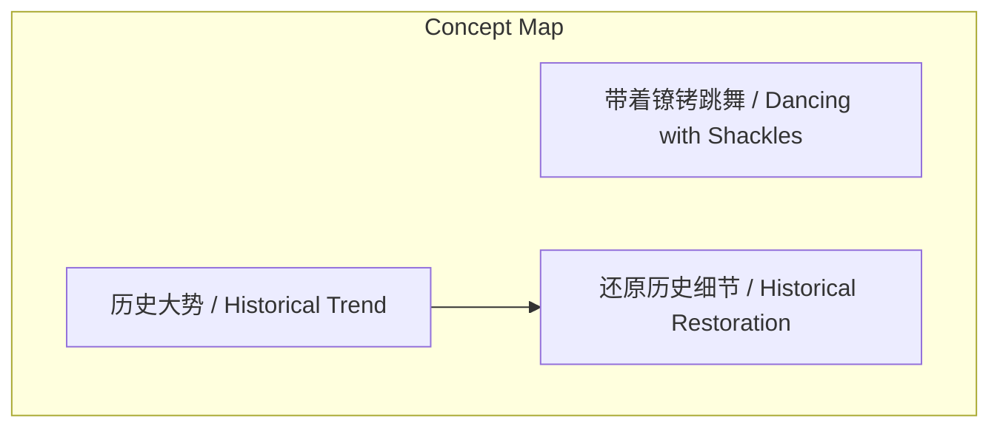
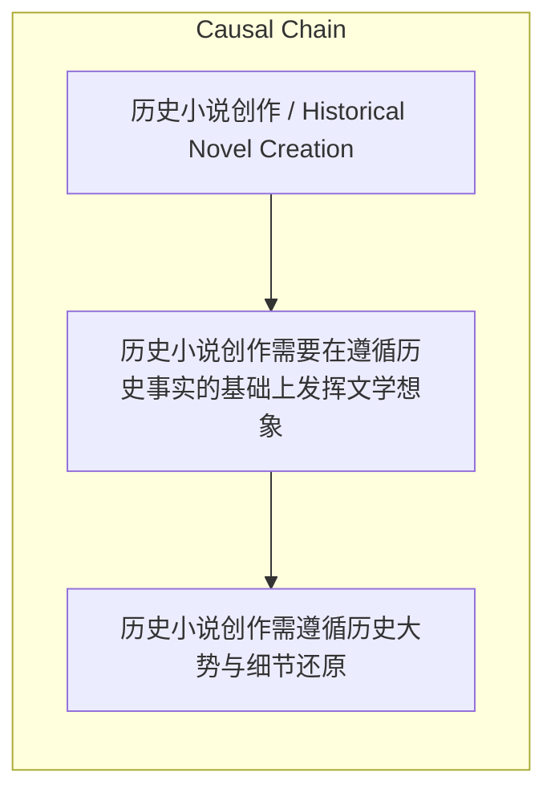

> 历史小说创作需要在遵循历史事实的基础上发挥文学想象

## 元信息
- 分类：`ai-software/models-research`
- 优先级：`high` (`13`)
- 文档类型：`text-summary`
- 来源分组：`news`
- 原始文件：`reports/news/2026-03-29/1774781027770-news-news-task-1774780834857-ypqyfj.md`
- 请求 ID：`1774780834857-ypqyfj`

## 原始内容

#### 文本总结

##### 运行信息
- model: openrouter/free
- schema_fallback: yes
- attempted_models: openrouter/free

### 历史小说创作的“镣铐与舞步”

#### 整体结构化文档表达
##### 文档卡片
- 主题（中文/English）：历史小说创作 / Historical Novel Creation
- 一句话摘要：历史小说创作需要在遵循历史事实的基础上发挥文学想象
- 目标读者：历史小说创作者、文学研究者
- 核心结论（3条）：
- 历史小说创作需遵循历史大势与细节还原
- 文学想象力在历史框架内创造感染力
- 《金瓯缺》是历史小说创作的典范之作

##### 内容结构树
1. 背景与问题定义
2. 核心观点与关键证据
3. 方法/机制/路径
4. 风险与边界条件
5. 结论与行动建议

##### 结构化元数据（JSON）
```json
{
  "title": "历史小说创作的“镣铐与舞步”",
  "topic_zh": "历史小说创作",
  "topic_en": "Historical Novel Creation",
  "audience": "历史小说创作者、文学研究者",
  "claims": [
    "历史小说创作的最基本要求是贴合历史大势",
    "优秀的创作者需要还原当时的历史氛围",
    "在真实历史素材上建立文学张力极其强大"
  ],
  "evidence": [
    "《金瓯缺》严格遵循北宋末年真实历史轨迹",
    "极其细致地还原了北宋都城的历史景象",
    "演讲者将其评价为“读过最好的中国历史小说之一”"
  ],
  "risks": [],
  "actions": []
}
```

#### 处理流程
1. 输入识别
2. 信息抽取（实体、概念、问题、事实、观点）
3. 结构化归纳（定义/分类/比较/因果/方法论）
4. 关系建模（概念关系、等式/方程/逻辑链）
5. 可视化表达（Mermaid）

#### 概念清单（中英文）
- 带着镣铐跳舞 / Dancing with Shackles
- 历史大势 / Historical Trend
- 还原历史细节 / Historical Restoration

#### 概念定义（中英文）
##### 带着镣铐跳舞 / Dancing with Shackles
- 中文定义：在遵循历史既定规则的基础上发挥文学想象
- English Definition: Creating within historical constraints while exercising literary imagination

##### 历史大势 / Historical Trend
- 中文定义：历史发展的基本走向和规律
- English Definition: The fundamental direction and patterns of historical development

##### 还原历史细节 / Historical Restoration
- 中文定义：对历史时期生活器物与氛围的细致描摹
- English Definition: Detailed depiction of historical period's living objects and atmosphere


#### 概念关联与逻辑关系（中英文）
- 带着镣铐跳舞/Dancing with Shackles -> 历史小说创作/Historical Novel Creation | concept | 核心创作理念
- 历史大势/Historical Trend -> 还原历史细节/Historical Restoration | concept | 创作基础
- 文学想象/Literary Imagination -> 历史真实性/Historical Authenticity | concept | 创作张力

##### 可形式化关系
- 历史小说创作 = 遵循历史大势 + 还原历史细节 + 文学想象
- 《金瓯缺》 = 北宋末年历史背景 + 东京汴梁景象 + 文学张力
- 优秀历史小说 = 历史真实性 + 文学感染力

#### COT逻辑梳理（定义/分类/比较/因果/科学方法论）
- Step 1: 理解历史小说创作的基本要求 - 遵循历史大势
- Step 2: 掌握还原历史细节的技巧 - 描摹生活器物与氛围
- Step 3: 在历史框架内发挥文学想象 - 创造感染力与张力

#### 事实与看法（区分）
##### 事实
- 《金瓯缺》设定在徽宗年间
- 故事围绕宋金“海上之盟”展开
- 如实呈现了“靖康之耻”的历史事件

##### 看法
- 《金瓯缺》是“读过最好的中国历史小说之一”
- 文学张力极其强大，让人不忍心多看

#### FAQ（原文问题整理）
##### 什么是“带着镣铐跳舞”？
- 指在遵循历史既定规则的基础上发挥文学想象

##### 《金瓯缺》如何体现这一理念？
- 严格遵循北宋历史，细致还原东京汴梁，在悲剧框架内展现文学张力

#### Visualization
##### Mermaid 图 1（概念结构图）


##### Mermaid 图 2（逻辑/因果图）


#### 文章中的类比
- 未发现明确类比

#### 10个金句
- 读过最好的中国历史小说之一
- 写得太好了，让人不忍心多看
