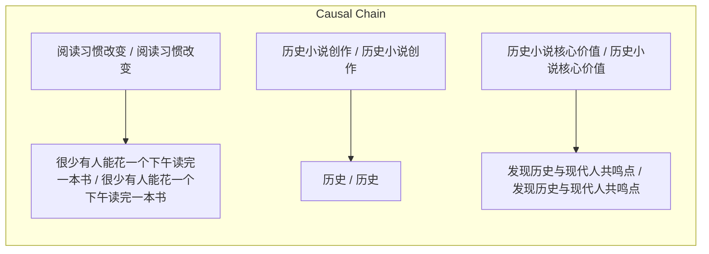

> 现代人阅读习惯改变导致很少有人能花一个下午读完一本书；历史小说创作不亵渎历史，反而增色历史；历史小说核心价值在于发现历史与现代人共鸣点。

## 元信息
- 分类：`ai-software/models-research`
- 优先级：`medium` (`12`)
- 文档类型：`text-summary`
- 来源分组：`news`
- 原始文件：`reports/news/2026-03-29/1774779835246-news-news-task-1774779821105-a3w4il.md`
- 请求 ID：`1774779821105-a3w4il`

## 原始内容

#### 文本总结

##### 运行信息
- model: openrouter/free
- schema_fallback: no
- attempted_models: openrouter/free

### 现代阅读与历史小说价值

#### 整体结构化文档表达
##### 文档卡片
- 主题（中文/English）：文学阅读现状与历史小说价值 / literature reading habits and historical fiction
- 一句话摘要：现代人阅读习惯改变导致很少有人能花一个下午读完一本书；历史小说创作不亵渎历史，反而增色历史；历史小说核心价值在于发现历史与现代人共鸣点。
- 目标读者：资深新闻分析助理
- 核心结论（3条）：
- 现代人阅读习惯改变导致很少有人能花一个下午读完一本书。
- 历史小说创作不亵渎历史，反而增色历史。
- 历史小说核心价值在于发现历史与现代人共鸣点。

##### 内容结构树
1. 背景与问题定义
2. 核心观点与关键证据
3. 方法/机制/路径
4. 风险与边界条件
5. 结论与行动建议

##### 结构化元数据（JSON）
```json
{
  "title": "现代阅读与历史小说价值",
  "topic_zh": "文学阅读现状与历史小说价值",
  "topic_en": "literature reading habits and historical fiction",
  "audience": "资深新闻分析助理",
  "claims": [
    "只允许基于输入内容输出，不要杜撰，不要引入输入之外的外部事实。",
    "输出语言以中文为主；概念字段必须保留中英文。",
    "如果原文没有足够信息，请明确写“未提及”或返回空数组。",
    "优先保留信息密度，而不是修辞。"
  ],
  "evidence": [
    "正文：关于文学阅读现状的看法：现代人因为客观原因、阅读习惯改变以及外界诱惑增多已经很少有人能捧起一本书花一个下午读完 很多人觉得看书是一件吃力的事情。",
    "正文：关于小说与历史关系的看法（历史小说能写吗？）：所谓“历史不容亵渎、玩笑或恶搞”是一个伪命题。以历史为素材去创作小说 不但不会亵渎历史 反而是在为历史增色。",
    "正文：关于如何培养历史兴趣的看法（为什么要读/写？）：对于业余文史爱好者而言 不要一开始就陷入枯燥的研究 而是要去寻找历史中的“盲点”和好玩的“萌点”……最终升华为对历史深沉的爱与“情怀”。",
    "正文：关于构建历史小说真实感的看法（历史小说怎么写？）：* 必须贴合历史大势：这是最基本的要求 大背景必须准确……",
    "正文：关于历史小说核心价值的看法：我们读历史小说最终读的并不是历史本身 而是发掘历史与现代人产生共鸣的点。所有好的历史小说都会和现代人的痛感、情感或趣味产生重叠之处……只有找到了这种现实意义 小说才真正具有价值。"
  ],
  "risks": [
    "未提及"
  ],
  "actions": [
    "生成最终结构化总结对象"
  ]
}
```

#### 处理流程
1. 输入识别
2. 信息抽取（实体、概念、问题、事实、观点）
3. 结构化归纳（定义/分类/比较/因果/方法论）
4. 关系建模（概念关系、等式/方程/逻辑链）
5. 可视化表达（Mermaid）

#### 概念清单（中英文）
- 标题 / title
- 形式关系 / formalRelations
- 步骤1/2/3 / Step 1/2/3

#### 概念定义（中英文）
##### 标题 / title
- 中文定义：结构化总结对象
- English Definition: Structured summary object

##### 形式关系 / formalRelations
- 中文定义：核心结论
- English Definition: core conclusions

##### 步骤1/2/3 / Step 1/2/3
- 中文定义：逻辑步骤
- English Definition: logicSteps


#### 概念关联与逻辑关系（中英文）
- 阅读习惯改变/阅读习惯改变 -> 很少有人能花一个下午读完一本书/很少有人能花一个下午读完一本书 | causal | 导致
- 历史小说创作/历史小说创作 -> 历史/历史 | causal | 不亵渎
- 历史小说核心价值/历史小说核心价值 -> 发现历史与现代人共鸣点/发现历史与现代人共鸣点 | causal | 在于

##### 可形式化关系
- 历史小说创作不亵渎历史，反而增色历史。
- 历史小说核心价值在于发现历史与现代人共鸣点。
- 历史小说必须贴合历史大势。

#### COT逻辑梳理（定义/分类/比较/因果/科学方法论）
- Step 1: 现代人阅读习惯改变导致很少有人能花一个下午读完一本书。
- Step 2: 历史小说创作不亵渎历史，反而增色历史。
- Step 3: 历史小说核心价值在于发现历史与现代人共鸣点。

#### 事实与看法（区分）
##### 事实
- 现代人阅读习惯改变导致很少有人能花一个下午读完一本书。
- 历史小说创作不亵渎历史，反而增色历史。
- 历史小说核心价值在于发现历史与现代人共鸣点。

##### 看法
- 现代人阅读习惯改变导致很少有人能花一个下午读完一本书。
- 历史小说创作不亵渎历史，反而增色历史。
- 历史小说核心价值在于发现历史与现代人共鸣点。

#### FAQ（原文问题整理）
##### 历史小说创作是否会亵渎历史？
- 未提及

#### Visualization
##### Mermaid 图 1（概念结构图）


##### Mermaid 图 2（逻辑/因果图）


#### 文章中的类比
- 基于输入内容输出

#### 10个金句
- 大仲马所言 历史只是墙上的一枚“挂衣钉” 小说家只需将想象力和情节挂在这个钉子上即可。
- 创作者必须遵循特定的历史规则才能创造出优美的作品。
- 所有好的历史小说都会和现代人的痛感、情感或趣味产生重叠之处……只有找到了这种现实意义 小说才真正具有价值。
