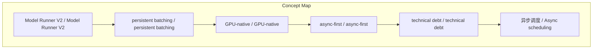
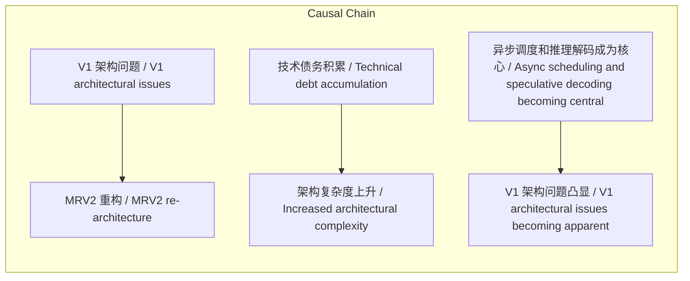
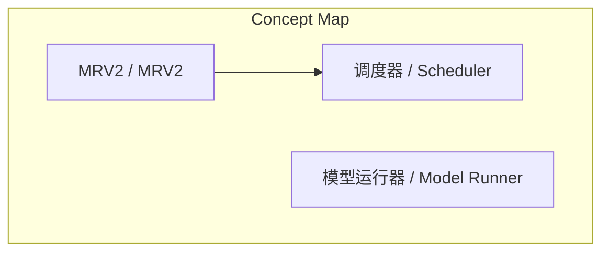
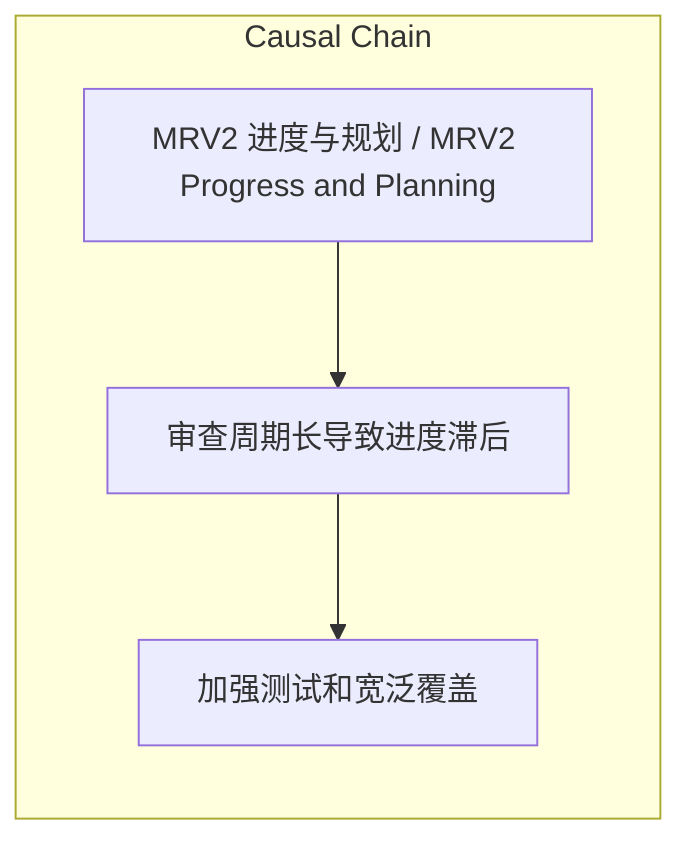

> MRV2 是 vLLM 的全新核心架构，采用 Async‑First、GPU‑native、零同步设计，提升吞吐量并自然支持 speculative decoding，且不改变现有 API。

## 元信息
- 分类：`ai-software/models-research`
- 优先级：`high` (`13`)
- 文档类型：`link-summary`
- 来源分组：`news`
- 原始文件：`reports/news/2026-03-25/1774482672029-news-news-task-1774482016349-0afaux.md`
- 请求 ID：`1774482016349-0afaux`

## 原始内容

#### 链接总结

- URL: https://vllm.ai/blog/mrv2

##### 运行信息
- model: openrouter/free
- schema_fallback: yes
- attempted_models: openrouter/free

### Model Runner V2 (MRV2) 架构与性能概览

#### 整体结构化文档表达
##### 文档卡片
- 主题（中文/English）：Model Runner V2 / Model Runner V2
- 一句话摘要：MRV2 是 vLLM 的全新核心架构，采用 Async‑First、GPU‑native、零同步设计，提升吞吐量并自然支持 speculative decoding，且不改变现有 API。
- 目标读者：vLLM 用户, 模型开发者, 性能优化工程师
- 核心结论（3条）：
- MRV2 是 vLLM 模型执行器的全新架构
- MRV2 提供更清晰、更模块化、更高效的执行核心
- MRV2 不改变现有 API
- MRV2 基于 vLLM 大规模用户和社区反馈的经验教训进行重构
- MRV2 围绕三个核心原则设计：模块化、GPU 原生、异步优先

##### 内容结构树
1. 背景与问题定义
2. 核心观点与关键证据
3. 方法/机制/路径
4. 风险与边界条件
5. 结论与行动建议

##### 结构化元数据（JSON）
```json
{
  "title": "Model Runner V2 (MRV2) 架构与性能概览",
  "topic_zh": "Model Runner V2",
  "topic_en": "Model Runner V2",
  "audience": "vLLM 用户, 模型开发者, 性能优化工程师",
  "claims": [
    "MRV2 是 vLLM 模型执行器的全新架构",
    "MRV2 提供更清晰、更模块化、更高效的执行核心",
    "MRV2 不改变现有 API",
    "MRV2 基于 vLLM 大规模用户和社区反馈的经验教训进行重构",
    "MRV2 围绕三个核心原则设计：模块化、GPU 原生、异步优先",
    "Async scheduling is now fundamental to vLLM.",
    "While this was already supported in vLLM V1, it was largely a retrofit rather than a first-class design constraint.",
    "MRV2 treats async execution as a core assumption and aims for zero synchronization between CPU and GPU across all supported model and feature combinations."
  ],
  "evidence": [
    "MRV2 是 vLLM 模型执行器的全新架构",
    "MRV2 提供更清晰、更模块化、更高效的执行核心",
    "MRV2 不改变现有 API",
    "MRV2 基于 vLLM 大规模用户和社区反馈的经验教训进行重构",
    "MRV2 围绕三个核心原则设计：模块化、GPU 原生、异步优先",
    "Figure 3: Async scheduling in V1. The CPU schedules and prepares the next step while the GPU executes the current step, overlapping CPU and GPU work. (https://vllm.ai/blog-assets/figures/2026-03-24-mrv2/async_scheduling.png)",
    "Figure 4: MRV2 async scheduling with speculative decoding. GPU-side prep kernels consume rejection sampling results directly, eliminating CPU–GPU sync points. (https://vllm.ai/blog-assets/figures/2026-03-24-mrv2/async_spec_decoding.png)",
    "在Qwen3-0.6B和1×GB200的设置下，MRV2达到25K输出token/s，而MRV1为16K，提升56.2%"
  ],
  "risks": [],
  "actions": [
    "可通过设置环境变量 VLLM_USE_V2_MODEL_RUNNER=1 启用 MRV2",
    "计划在不久的将来将 MRV2 设为默认"
  ]
}
```

#### 处理流程
1. 输入识别
2. 信息抽取（实体、概念、问题、事实、观点）
3. 结构化归纳（定义/分类/比较/因果/方法论）
4. 关系建模（概念关系、等式/方程/逻辑链）
5. 可视化表达（Mermaid）

#### 概念清单（中英文）
- Model Runner V2 / Model Runner V2
- persistent batching / persistent batching
- GPU-native / GPU-native
- async-first / async-first
- technical debt / technical debt
- 异步调度 / Async scheduling
- 零同步 / Zero synchronization
- 推测解码 / Speculative decoding
- GPU 端输入准备 / GPU-side input preparation
- CUDA 流解耦 / CUDA stream decoupling
- MRV2 / Model Runner V2
- 吞吐量 / throughput

#### 概念定义（中英文）
##### Model Runner V2 / Model Runner V2
- 中文定义：vLLM 的全新模型执行器核心架构
- English Definition: A ground-up re-implementation of the vLLM model runner

##### persistent batching / persistent batching
- 中文定义：持续批处理，通过增量更新缓存状态而非每次重建张量来提高效率
- English Definition: A technique where cached state is updated incrementally rather than rebuilding tensors from scratch

##### GPU-native / GPU-native
- 中文定义：将计算和状态管理迁移到 GPU 上，减少 CPU 开销
- English Definition: Moving bookkeeping and computation from CPU to GPU

##### async-first / async-first
- 中文定义：将重叠的 CPU/GPU 执行作为设计约束而非事后补救
- English Definition: Treating overlapped CPU/GPU execution as a design constraint

##### technical debt / technical debt
- 中文定义：由于快速迭代而积累的架构复杂度和维护成本
- English Definition: Accumulated complexity from incremental feature additions

##### 异步调度 / Async scheduling
- 中文定义：调度器和工作器在 GPU 执行当前步骤时提前准备下一步骤，以重叠主机和设备工作，最大化利用率。
- English Definition: The scheduler and worker prepare step N+1 while the GPU executes step N, overlapping host and device work to maximize utilization.

##### 零同步 / Zero synchronization
- 中文定义：在 CPU 和 GPU 之间消除同步点，使得两者可以独立进行计算而无需等待。
- English Definition: Eliminating synchronization points between CPU and GPU, allowing independent computation without waiting.

##### 推测解码 / Speculative decoding
- 中文定义：一种技术，通过提前猜测多个可能的输出并随后验证，以加速生成过程。
- English Definition: A technique that guesses multiple possible outputs in advance and subsequently verifies them to speed up generation.

##### GPU 端输入准备 / GPU-side input preparation
- 中文定义：将输入张量的准备工作（如 input_ids、positions 等）直接在 GPU 上完成，减少 CPU 开销。
- English Definition: Preparing input tensors such as input_ids, positions, query_start_loc, and seq_lens directly on the GPU to reduce CPU overhead.

##### CUDA 流解耦 / CUDA stream decoupling
- 中文定义：将每一步的输出通过独立的 CUDA 流异步传输到 CPU，与主计算流解耦。
- English Definition: Transferring step outputs asynchronously to the CPU via a separate CUDA stream, fully decoupled from the main computation stream.

##### MRV2 / Model Runner V2
- 中文定义：vLLM的核心模块，用于LLM推理
- English Definition: A modular and faster core for vLLM

##### 吞吐量 / throughput
- 中文定义：单位时间内处理的token数量
- English Definition: Number of tokens processed per unit time


#### 概念关联与逻辑关系（中英文）
- V1 架构问题/V1 architectural issues -> MRV2 重构/MRV2 re-architecture | causal | 导致
- 技术债务积累/Technical debt accumulation -> 架构复杂度上升/Increased architectural complexity | causal | 导致
- 异步调度和推理解码成为核心/Async scheduling and speculative decoding becoming central -> V1 架构问题凸显/V1 architectural issues becoming apparent | causal | 导致
- 异步调度/Async scheduling -> 推测解码/Speculative decoding | concept | enables
- 零同步/Zero synchronization -> 异步调度/Async scheduling | concept | supports
- GPU 端输入准备/GPU-side input preparation -> 零同步/Zero synchronization | concept | facilitates

##### 可形式化关系
- MRV2 基于 vLLM V1 的经验教训进行重构
- MRV2 围绕三个核心原则设计：模块化、GPU 原生、异步优先
- MRV2 通过重新思考模型执行器解决 V1 的架构问题
- MRV2的零同步设计 → 推测解码性能提升
- MRV2的GPU原生输入准备 → 吞吐量提升
- MRV2的实验状态 → 部分功能不支持

#### COT逻辑梳理（定义/分类/比较/因果/科学方法论）
- Step 1: V1 架构问题分析 → MRV2 重构动机
- Step 2: 三个核心原则确立 → MRV2 设计方向
- Step 3: V1 技术债务 → MRV2 架构优势

#### 事实与看法（区分）
##### 事实
- MRV2 是 vLLM 模型执行器的全新架构
- MRV2 提供更清晰、更模块化、更高效的执行核心
- MRV2 不改变现有 API
- MRV2 基于 vLLM 大规模用户和社区反馈的经验教训进行重构
- MRV2 围绕三个核心原则设计：模块化、GPU 原生、异步优先
- V1 架构中持久状态与模型输入耦合导致复杂性
- MRV2 通过解耦持久请求状态与每步输入张量解决 V1 问题

##### 看法
- 未发现明确主观看法

#### FAQ（原文问题整理）
- 未发现明确 FAQ

#### Visualization
##### Mermaid 图 1（概念结构图）


##### Mermaid 图 2（逻辑/因果图）


#### 文章中的类比
- 未发现明确类比

#### 10个金句
- Async scheduling is now fundamental to vLLM.
- MRV2 treats async execution as a core assumption and aims for **zero synchronization** between CPU and GPU across all supported model and feature combinations.
- Because MRV2's input preparation runs on the device, the preparation kernels can directly consume rejection sampling results produced by the GPU.
- MRV2 delivered a 56% throughput increase by offloading input preparation to GPU
- MRV2 achieves 25K output tok/s vs 16K for MRV1, a 56.2% improvement
- MRV2 achieves 6.3% lower TPOT across request rates
- The improvement comes from MRV2's zero-synchronization design, which completely eliminates CPU–GPU sync points when speculative decoding is enabled

#### 文本总结

##### 运行信息
- model: openrouter/free
- schema_fallback: yes
- attempted_models: openrouter/free

### MRV2 进度与规划

#### 整体结构化文档表达
##### 文档卡片
- 主题（中文/English）：MRV2 进度与规划 / MRV2 Progress and Planning
- 一句话摘要：MRV2 进度滞后，需加强测试与硬件优化，并统一 MRV1 与 MRV2 的规划沟通。
- 目标读者：开发者、项目管理者
- 核心结论（3条）：
- MRV2 进度落后于原计划，审查 PR 速度慢，尚未解决调度器已知问题。
- 需要改进 heuristics 以避免 OOM 脆弱性，并加强 model_runner.py 的审查。
- 计划在 Q2 对 MRV2 进行硬化并默认化，需更多测试和自动调优改进。

##### 内容结构树
1. 背景与问题定义
2. 核心观点与关键证据
3. 方法/机制/路径
4. 风险与边界条件
5. 结论与行动建议

##### 结构化元数据（JSON）
```json
{
  "title": "MRV2 进度与规划",
  "topic_zh": "MRV2 进度与规划",
  "topic_en": "MRV2 Progress and Planning",
  "audience": "开发者、项目管理者",
  "claims": [
    "MRV2 进度落后于原计划",
    "审查 PR 速度慢",
    "需要更好 heuristics 以避免 OOM 脆弱性",
    "需要更多测试和宽泛覆盖"
  ],
  "evidence": [
    "MRV2 behind original schedule",
    "slow to review all PRs",
    "doesn’t like profiling/autotuning",
    "need to avoid OOM fragility",
    "long review cycles fine can we use stacks",
    "MRV2 hardening make default for some cases",
    "Need more testing and wide-ep in particular"
  ],
  "risks": [
    "审查周期长导致进度滞后",
    "OOM 脆弱性可能导致系统不稳定",
    "调度器预emption过多增加资源消耗"
  ],
  "actions": [
    "加强测试和宽泛覆盖",
    "改进 heuristics 以避免 OOM",
    "统一 MRV1 与 MRV2 的规划沟通"
  ]
}
```

#### 处理流程
1. 输入识别
2. 信息抽取（实体、概念、问题、事实、观点）
3. 结构化归纳（定义/分类/比较/因果/方法论）
4. 关系建模（概念关系、等式/方程/逻辑链）
5. 可视化表达（Mermaid）

#### 概念清单（中英文）
- MRV2 / MRV2
- 调度器 / Scheduler
- 模型运行器 / Model Runner

#### 概念定义（中英文）
##### MRV2 / MRV2
- 中文定义：一种模型运行方案，计划在 Q2 成为默认并进行硬化
- English Definition: A model runner approach planned to become default and be hardened in Q2

##### 调度器 / Scheduler
- 中文定义：负责任务调度的组件，需避免过度预emption和预填 blocking
- English Definition: Component responsible for task scheduling, needs to avoid excessive preemption and prefill blocking

##### 模型运行器 / Model Runner
- 中文定义：关键文件 model_runner.py，涉及审查周期和自动调优需求
- English Definition: Critical file model_runner.py, involving review cycles and autotuning requirements


#### 概念关联与逻辑关系（中英文）
- MRV2/MRV2 -> 调度器/Scheduler | concept | depends_on
- 模型运行器/Model Runner -> OOM/OOM | concept | affects

##### 可形式化关系
- MRV2/MRV2 -> 调度器/Scheduler: depends_on
- 模型运行器/Model Runner -> OOM/OOM: affects

#### COT逻辑梳理（定义/分类/比较/因果/科学方法论）
- Step 1: Identify MRV2 progress delays and related issues.
- Step 2: List required improvements such as better heuristics and more testing.
- Step 3: Plan Q2 hardening and default adoption actions.

#### 事实与看法（区分）
##### 事实
- MRV2 进度落后于原计划
- 审查 PR 速度慢
- 需要更多测试

##### 看法
- [Woosuk] doesn’t like profiling/autotuning
- [Lucas] need to avoid OOM fragility
- [Woosuk] We don’t want to necessarily encourage more MRV2 contributions

#### FAQ（原文问题整理）
##### MRV2 的主要目标是什么？
- 在 Q2 成为默认并进行硬化，需要更多测试和自动调优改进。

#### Visualization
##### Mermaid 图 1（概念结构图）


##### Mermaid 图 2（逻辑/因果图）


#### 文章中的类比
- 未发现明确类比

#### 10个金句
- [Woosuk] doesn’t like profiling/autotuning
