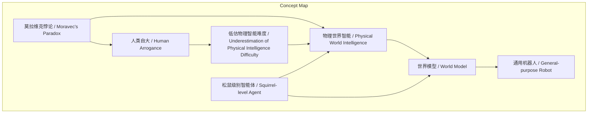
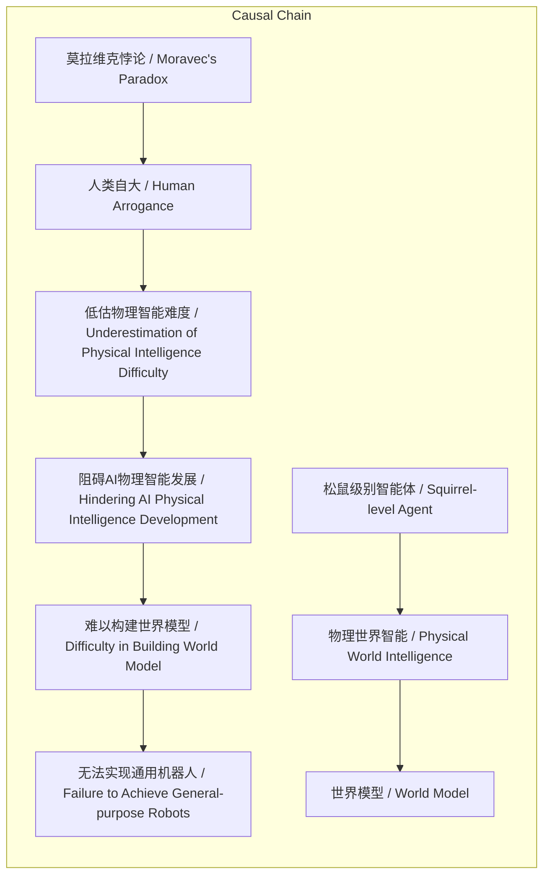

> 本文阐述莫拉维克悖论的核心内容，指出AI在符号逻辑任务上易而在物理智能任务上难的反差，强调突破物理世界智能是构建通用机器人的关键。

## 元信息
- 分类：`ai-software/models-research`
- 优先级：`medium` (`12`)
- 文档类型：`text-summary`
- 来源分组：`news`
- 原始文件：`reports/news/2026-03-21/1774053256241-news-news-task-1774053173802-38gty3.md`
- 请求 ID：`1774053173802-38gty3`

## 原始内容

#### 文本总结

### 莫拉维克悖论揭示AI物理智能短板

#### 整体结构化文档表达
##### 文档卡片
- 主题（中文/English）：莫拉维克悖论与AI发展路径 / Moravec's Paradox and AI Development Path
- 一句话摘要：本文阐述莫拉维克悖论的核心内容，指出AI在符号逻辑任务上易而在物理智能任务上难的反差，强调突破物理世界智能是构建通用机器人的关键。
- 目标读者：人工智能研究者、科技政策制定者、科技爱好者
- 核心结论（3条）：
  1. 莫拉维克悖论表现为AI擅长复杂计算却难以应对物理世界的基本生存任务。
  2. 人类因自大而低估物理智能难度，高估大模型的逻辑能力。
  3. 实现物理世界智能是构建世界模型和通用机器人大脑的必经之路。

##### 内容结构树
1. 背景与问题定义：介绍莫拉维克悖论及其经典表述。
2. 核心观点与关键证据：对比两类任务难度，引用谢赛宁和Sutton的观点。
3. 方法/机制/路径：提出通过构建松鼠级别智能体来突破悖论，发展世界模型。
4. 风险与边界条件：未提及
5. 结论与行动建议：强调物理智能的重要性，呼吁打破人类视角误区。

##### 结构化元数据（JSON）
```json
{
  "title": "莫拉维克悖论揭示AI物理智能短板",
  "topic_zh": "莫拉维克悖论与AI发展路径",
  "topic_en": "Moravec's Paradox and AI Development Path",
  "audience": "人工智能研究者、科技政策制定者、科技爱好者",
  "claims": [
    "莫拉维克悖论描述AI在符号逻辑任务上容易而在物理智能任务上困难的现象",
    "人类因自大而低估物理世界智能的难度",
    "突破物理世界智能是构建世界模型和通用机器人的核心"
  ],
  "evidence": [
    "谢赛宁引用悖论核心：'对机器简单的事情对人很难而对机器难的事情对人却很简单'",
    "对比示例：AI易掌握复杂计算、逻辑推理、写代码，但难实现物理移动、端茶倒水、生存",
    "引用Rich Sutton观点：打造松鼠智能比让AI写代码更困难伟大",
    "谢赛宁指出人类将语言符号逻辑视为智能最高代表，忽视物理世界信号处理难度"
  ],
  "risks": [],
  "actions": [
    "重点发展机器在真实物理世界中的感知与行动能力",
    "构建松鼠级别智能体作为基础",
    "以此为基础扩展至更高层次认知任务"
  ]
}
```

#### 处理流程
基于输入文本进行识别、抽取、归纳、建模与可视化。

#### 概念清单（中英文）
- 莫拉维克悖论 / Moravec's paradox
- 人工智能 / Artificial Intelligence
- 大语言模型 / Large Language Model (LLM)
- 强化学习之父 / Father of Reinforcement Learning
- Rich Sutton / Rich Sutton
- 松鼠级别智能体 / Squirrel-level Agent
- 世界模型 / World Model
- 通用机器人 / General-purpose Robot
- 物理世界 / Physical World
- 高维连续嘈杂信号 / High-dimensional Continuous Noisy Signals
- 人类自大 / Human Arrogance

#### 概念定义（中英文）
- 莫拉维克悖论 / Moravec's paradox：指人工智能在符号逻辑任务（如计算、推理）上表现容易，而在物理世界感知与行动任务上表现困难的现象，与人类能力分布相反。
- 大语言模型 / Large Language Model (LLM)：一种当前AI模型，擅长处理语言和符号逻辑任务（如写代码），但物理智能能力有限。
- 松鼠级别智能体 / Squirrel-level Agent：指能在真实物理世界中自主生存、感知、行动，具备基本目标、饥饿感和情感社群的智能体。
- 世界模型 / World Model：指能够理解和模拟真实物理世界的模型，是机器处理高维连续嘈杂信号的基础。
- 物理世界 / Physical World：指真实的、充满高维连续嘈杂信号的物理环境，与虚拟符号世界相对。
- 人类自大 / Human Arrogance：指人类倾向于将自身擅长的语言符号逻辑视为智能最高形式，而低估物理世界智能难度的认知偏差。
- 人工智能 / Artificial Intelligence：未发现明确内容（原文仅提及作为领域）
- 强化学习之父 / Father of Reinforcement Learning：未发现明确内容（原文仅作为Rich Sutton的称呼）
- Rich Sutton / Rich Sutton：未发现明确内容（原文仅提及姓名和观点）
- 通用机器人 / General-purpose Robot：未发现明确内容（原文仅提及作为目标）
- 高维连续嘈杂信号 / High-dimensional Continuous Noisy Signals：未发现明确内容（原文仅描述为物理世界信号特征）

#### 概念关联与逻辑关系（中英文）
1. 莫拉维克悖论 / Moravec's paradox 导致 人类自大 / Human Arrogance 在AI评估中的体现：人类因自身优势而误判AI能力。
   形式化：莫拉维克悖论 → 人类自大 → 低估物理智能难度
2. 物理世界智能 / Physical World Intelligence 是构建 世界模型 / World Model 的必要条件：只有能处理物理世界信号，才能建立有效世界模型。
   形式化：物理世界智能 → 世界模型
3. 松鼠级别智能体 / Squirrel-level Agent 是 通用机器人 / General-purpose Robot 大脑的基础：从简单物理智能体扩展到复杂任务。
   形式化：松鼠级别智能体 → 通用机器人大脑

#### COT逻辑梳理（定义/分类/比较/因果/科学方法论）
Step 1: 定义莫拉维克悖论：基于原文，悖论描述AI与人类在两类任务上的能力反差——“对机器简单的事情对人很难而对机器难的事情对人却很简单”。
Step 2: 分类任务：将任务分为符号逻辑类（复杂计算、逻辑推理、写代码、规划太空任务）和物理世界类（物理移动、感知环境、端茶倒水、生存）。
Step 3: 比较：对比人类与AI在两类任务上的表现，指出AI在符号逻辑类易掌握，在物理世界类难如登天；人类则相反。
Step 4: 因果分析：人类自大导致只重视符号逻辑智能，忽视物理智能，从而低估AI在物理世界的挑战，高估大模型能力。
Step 5: 科学方法论：建议以构建物理世界智能体（如松鼠级别）为起点，发展处理高维连续嘈杂信号的能力，进而构建世界模型，最终实现通用机器人。

#### 事实与看法（病毒）
##### 事实
- 谢赛宁在访谈中提到了莫拉维克悖论。
- 悖论核心表述为“对机器简单的事情对人很难而对机器难的事情对人却很简单”。
- 具体表现：AI易掌握复杂计算、逻辑推理、写代码；难实现物理移动、端茶倒水、生存。
- 谢赛宁引用Rich Sutton的观点：打造松鼠智能比让AI写代码更困难伟大。
- 谢赛宁指出人类将语言符号逻辑视为智能最高代表，忽视物理世界信号处理难度。
- 打破悖论是构建世界模型和通用机器人大脑的核心所在。

##### 看法
- 人们容易对大语言模型的逻辑能力感到震撼却低估物理世界生存难度是出于“人类的自大”。
- 能够构建松鼠级别智能体是比写代码更困难和伟大的成就。
- 在松鼠智能体基础上让AI写代码或上火星将是容易的。

#### FAQ（原文问题整理）
未发现明确提问。

#### Visualization
##### Mermaid 图 1（概念结构图）


##### Mermaid 图 2（逻辑/因果图）


#### 文章中的类比
- 打造松鼠级别智能体与让AI写代码的难度对比：前者比后者更困难伟大。
- 在松鼠智能体基础上扩展至高层次任务（如写代码、上火星）的类比：基础打牢后，高阶任务变容易。

#### 10个金句
1. “对机器简单的事情对人很难而对机器难的事情对人却很简单。”
2. “诸如复杂的计算、逻辑推理、考试、写代码（例如拿到国际信息学奥林匹克金牌）或者是规划上月球和火星的方案。这些对人类来说需要极高智商和长期训练才能完成的对于当前的人工智能（如大语言模型 LLM）来说反而相对容易掌握。”
3. “那些人类甚至普通动物凭借演化本能就能轻松做到的事——比如在复杂的物理世界中自由移动、感知真实环境、端茶倒水或者仅仅是活下去对机器来说却难如登天。”
4. “能够打造出一只松鼠的智能实际上比让AI写代码要困难和伟大得多。”
5. “如果有一天我们能构建出一个松鼠级别的智能体——让它能在真实的物理世界里活下去、有自己的目标、知道饥饿、拥有一定的情感和社群活动那么在此基础上让它去写代码或上火星将是再容易不过的事情。”
6. “人们之所以容易对大语言模型的逻辑能力感到震撼却低估了在物理世界生存的难度完全是出于‘人类的自大’。”
7. “人类习惯于将自己独有的语言和符号逻辑视为智能的最高代表却忽视了真实物理世界中处理高维、连续、嘈杂信号的难度。”
8. “打破莫拉维克悖论让机器拥有处理真实物理世界的能力不仅是构建未来真正‘世界模型’的必经之路更是打造出能够在千家万户承担家务的通用机器人‘大脑’的核心所在。”
9. “呼吁打破这种人类视角的认知误区。”
10. 原文未提供
