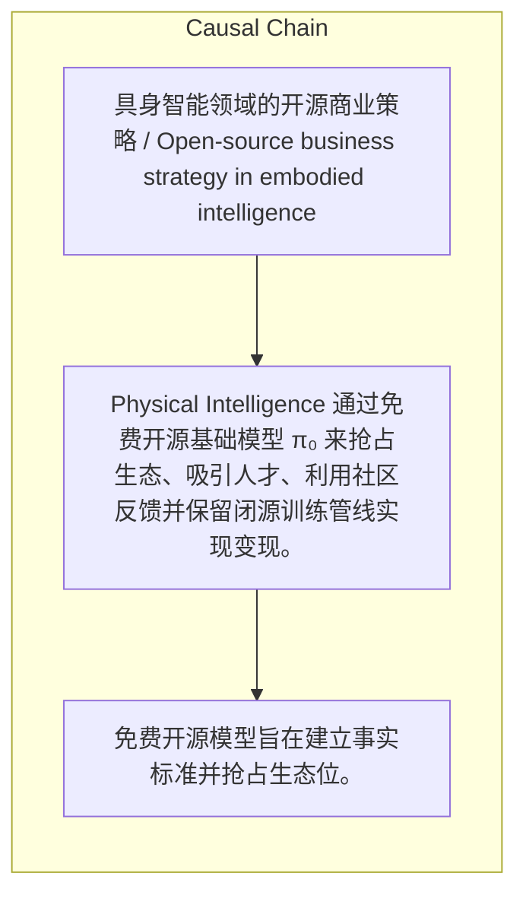

> Physical Intelligence 通过免费开源基础模型 π₀ 来抢占生态、吸引人才、利用社区反馈并保留闭源训练管线实现变现。

## 元信息
- 分类：`ai-software/models-research`
- 优先级：`high` (`13`)
- 文档类型：`text-summary`
- 来源分组：`news`
- 原始文件：`reports/news/2026-03-27/1774601383795-news-news-task-1774600959296-sonr19.md`
- 请求 ID：`1774600959296-sonr19`

## 原始内容

#### 文本总结

##### 运行信息
- model: openrouter/free
- schema_fallback: yes
- attempted_models: openrouter/free

### PI开源商业策略

#### 整体结构化文档表达
##### 文档卡片
- 主题（中文/English）：具身智能领域的开源商业策略 / Open-source business strategy in embodied intelligence
- 一句话摘要：Physical Intelligence 通过免费开源基础模型 π₀ 来抢占生态、吸引人才、利用社区反馈并保留闭源训练管线实现变现。
- 目标读者：机器人开发者、AI研究者、产业客户
- 核心结论（3条）：
- 免费开源模型旨在建立事实标准并抢占生态位。
- 开源模型吸引顶尖人才并充当有效的招聘广告。
- 利用社区反馈加速数据飞轮，同时保留闭源训练管线和专有数据以实现闭源变现。

##### 内容结构树
1. 背景与问题定义
2. 核心观点与关键证据
3. 方法/机制/路径
4. 风险与边界条件
5. 结论与行动建议

##### 结构化元数据（JSON）
```json
{
  "title": "PI开源商业策略",
  "topic_zh": "具身智能领域的开源商业策略",
  "topic_en": "Open-source business strategy in embodied intelligence",
  "audience": "机器人开发者、AI研究者、产业客户",
  "claims": [
    "Physical Intelligence 成立于2024年，融资超10亿美元，估值达56亿美元。",
    "其核心基础模型 π₀ 免费对全世界开放。",
    "免费开源不是慈善，而是具身智能领域最‘心机’的商业策略。",
    "开源后 OpenPI GitHub 仓库成为机器人领域最火热的项目之一。",
    "公司保留完整的训练 Pipeline 和数万小时专有真实数据不予公开。"
  ],
  "evidence": [],
  "risks": [],
  "actions": []
}
```

#### 处理流程
1. 输入识别
2. 信息抽取（实体、概念、问题、事实、观点）
3. 结构化归纳（定义/分类/比较/因果/方法论）
4. 关系建模（概念关系、等式/方程/逻辑链）
5. 可视化表达（Mermaid）

#### 概念清单（中英文）
- Physical Intelligence (PI) / Physical Intelligence (PI)
- π₀ 模型 / π₀ model
- 开源策略 / Open-source strategy
- 事实标准 / De facto standard
- 闭源变现 / Closed‑source monetization

#### 概念定义（中英文）
##### Physical Intelligence (PI) / Physical Intelligence (PI)
- 中文定义：一家2024年成立、融资超10亿美元、估值56亿美元的具身智能商业初创公司。
- English Definition: A 2024-founded embodied intelligence startup with over $1B funding and $5.6B valuation.

##### π₀ 模型 / π₀ model
- 中文定义：Physical Intelligence 的核心基础模型，已免费对全世界开放。
- English Definition: The core foundation model of Physical Intelligence, made freely available worldwide.

##### 开源策略 / Open-source strategy
- 中文定义：通过免费开源基础模型来抢占生态、吸引人才、利用社区反馈并保留闭源变现手段的商业做法。
- English Definition: A business practice of freely releasing a foundation model to capture ecosystem, attract talent, leverage community feedback, while retaining closed‑source assets for monetization.

##### 事实标准 / De facto standard
- 中文定义：当足够多的开发者在某个技术框架上构建应用时，该框架成为行业事实上的标准。
- English Definition: When a critical mass of developers build on a technology framework, it becomes the industry’s de facto standard.

##### 闭源变现 / Closed‑source monetization
- 中文定义：保留核心训练管线和专有数据不公开，以向需要最高性能的客户提供付费服务或合作。
- English Definition: Keeping the core training pipeline and proprietary data closed to offer premium performance to paying customers.


#### 概念关联与逻辑关系（中英文）
- 未发现明确概念关系

##### 可形式化关系
- PI 提供 π₀ 模型 → 建立事实标准
- 事实标准 → 吸引开发者使用 → 社区反馈回流
- 闭源训练管线 + 专有数据 → 竞争优势 → 变现

#### COT逻辑梳理（定义/分类/比较/因果/科学方法论）
- Step 1: 抢占生态位，让全球机器人开发者在 π₀ 框架上构建应用，以建立事实标准。
- Step 2: 利用开源模型吸引顶尖人才，将 OpenPI GitHub 打造成行业招聘广告。
- Step 3: 通过社区反馈加速数据飞轮，同时保闭源训练管线和专有数据实现闭源变现。

#### 事实与看法（区分）
##### 事实
- Physical Intelligence 成立于2024年。
- 融资超过10亿美元。
- 估值达到56亿美元。
- π₀ 模型免费对全世界开放。
- OpenPI GitHub 仓库成为机器人领域最火热的项目之一。
- 公司保留完整的训练 Pipeline 和数万小时专有真实数据不予公开。

##### 看法
- 该免费开源策略被业内视为具身智能领域最‘心机’的商业策略。

#### FAQ（原文问题整理）
##### 为什么 PI 选择免费开源其基础模型？
- 为了抢占生态位、建立事实标准、吸引顶尖人才、利用社区反馈降低研发成本，同时保留闭源训练管线和数据以实现变现。

#### Visualization
##### Mermaid 图 1（概念结构图）


##### Mermaid 图 2（逻辑/因果图）


#### 文章中的类比
- 未发现明确类比

#### 10个金句
- 原文未提供
