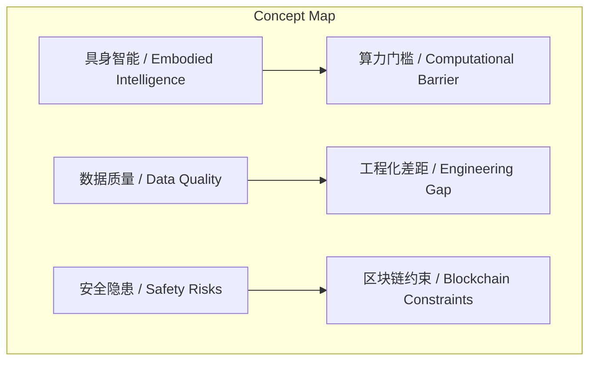
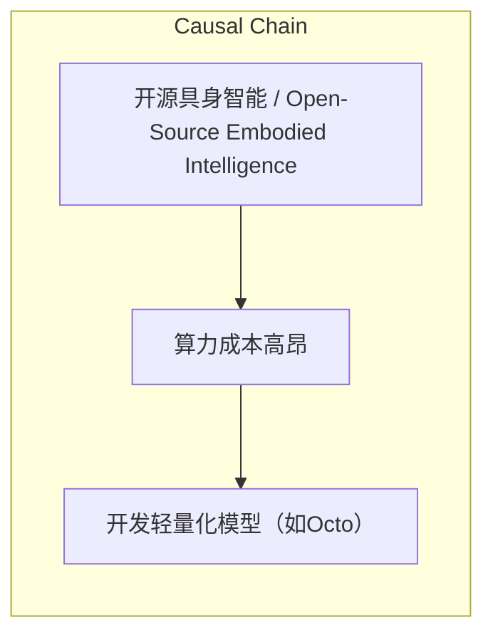

> 开源具身智能在算力、数据、工程化和安全方面面临挑战，但通过创新应对，未来可能实现生态平衡。

## 元信息
- 分类：`ai-software/models-research`
- 优先级：`high` (`13`)
- 文档类型：`text-summary`
- 来源分组：`news`
- 原始文件：`reports/news/2026-03-27/1774603057331-news-news-task-1774602686721-qydd2r.md`
- 请求 ID：`1774602686721-qydd2r`

## 原始内容

#### 文本总结

##### 运行信息
- model: openrouter/free
- schema_fallback: yes
- attempted_models: openrouter/free

### 开源具身智能面临四大挑战与质变潜力

#### 整体结构化文档表达
##### 文档卡片
- 主题（中文/English）：开源具身智能 / Open-Source Embodied Intelligence
- 一句话摘要：开源具身智能在算力、数据、工程化和安全方面面临挑战，但通过创新应对，未来可能实现生态平衡。
- 目标读者：研究人员、开发者、企业决策者
- 核心结论（3条）：
- 算力门槛：开源社区训练顶级模型需极高算力投入，远不及闭源巨头
- 数据质量：Open X-Embodiment数据集多样性强但一致性差
- 工程化差距：开源模型难以从Demo转化为商业产品

##### 内容结构树
1. 背景与问题定义
2. 核心观点与关键证据
3. 方法/机制/路径
4. 风险与边界条件
5. 结论与行动建议

##### 结构化元数据（JSON）
```json
{
  "title": "开源具身智能面临四大挑战与质变潜力",
  "topic_zh": "开源具身智能",
  "topic_en": "Open-Source Embodied Intelligence",
  "audience": "研究人员、开发者、企业决策者",
  "claims": [],
  "evidence": [],
  "risks": [
    "算力成本高昂",
    "数据标注标准参差不齐",
    "工程化能力薄弱",
    "物理AI安全风险"
  ],
  "actions": [
    "开发轻量化模型（如Octo）",
    "构建标准化数据集",
    "建立商业工程团队",
    "实施区块链安全机制"
  ]
}
```

#### 处理流程
1. 输入识别
2. 信息抽取（实体、概念、问题、事实、观点）
3. 结构化归纳（定义/分类/比较/因果/方法论）
4. 关系建模（概念关系、等式/方程/逻辑链）
5. 可视化表达（Mermaid）

#### 概念清单（中英文）
- 具身智能 / Embodied Intelligence
- 算力门槛 / Computational Barrier
- 数据质量 / Data Quality
- 工程化差距 / Engineering Gap
- 安全隐患 / Safety Risks
- 区块链约束 / Blockchain Constraints

#### 概念定义（中英文）
##### 具身智能 / Embodied Intelligence
- 中文定义：具备物理世界交互能力的AI系统
- English Definition: AI systems with physical world interaction capabilities

##### 算力门槛 / Computational Barrier
- 中文定义：训练高级AI模型所需的计算资源门槛
- English Definition: Threshold of computational resources required for advanced AI training

##### 数据质量 / Data Quality
- 中文定义：数据的多样性和一致性
- English Definition: Diversity and consistency of data

##### 工程化差距 / Engineering Gap
- 中文定义：从学术研究到商业产品的技术转化能力差异
- English Definition: Difference in technical translation capability from academic research to commercial products

##### 安全隐患 / Safety Risks
- 中文定义：AI在物理世界中的潜在危险
- English Definition: Potential dangers of AI in physical world

##### 区块链约束 / Blockchain Constraints
- 中文定义：通过区块链技术实现不可篡改的行为规则
- English Definition: Immutable behavior rules implemented via blockchain technology


#### 概念关联与逻辑关系（中英文）
- 具身智能/Embodied Intelligence -> 算力门槛/Computational Barrier | concept | 依赖关系
- 数据质量/Data Quality -> 工程化差距/Engineering Gap | concept | 影响关系
- 安全隐患/Safety Risks -> 区块链约束/Blockchain Constraints | concept | 解决方案关系

##### 可形式化关系
- 具身智能/Embodied Intelligence -> 算力门槛/Computational Barrier: 依赖关系
- 数据质量/Data Quality -> 工程化差距/Engineering Gap: 影响关系
- 安全隐患/Safety Risks -> 区块链约束/Blockchain Constraints: 解决方案关系

#### COT逻辑梳理（定义/分类/比较/因果/科学方法论）
- Step 1: 开源社区在算力、数据、工程化和安全方面面临挑战
- Step 2: 闭源巨头在算力、数据一致性和工程团队上占据优势
- Step 3: 开源通过区块链等创新应对安全挑战，未来可能实现生态平衡

#### 事实与看法（区分）
##### 事实
- OpenVLA训练消耗64张A100显卡15天
- Open X-Embodiment数据集来自20多个实验室
- 特斯拉数据由单一软硬件系统采集

##### 看法
- 王昊预测开源模型1-2年内达到GPT-3水平

#### FAQ（原文问题整理）
##### 开源具身智能的主要挑战是什么？
- 算力门槛、数据质量、工程化差距和安全隐患

##### 开源社区如何应对安全风险？
- 通过区块链技术实现不可篡改的行为规则

#### Visualization
##### Mermaid 图 1（概念结构图）


##### Mermaid 图 2（逻辑/因果图）


#### 文章中的类比
- 未发现明确类比

#### 10个金句
- 开源模型在1-2年内完全可以达到类似大语言模型中GPT-3的水平
