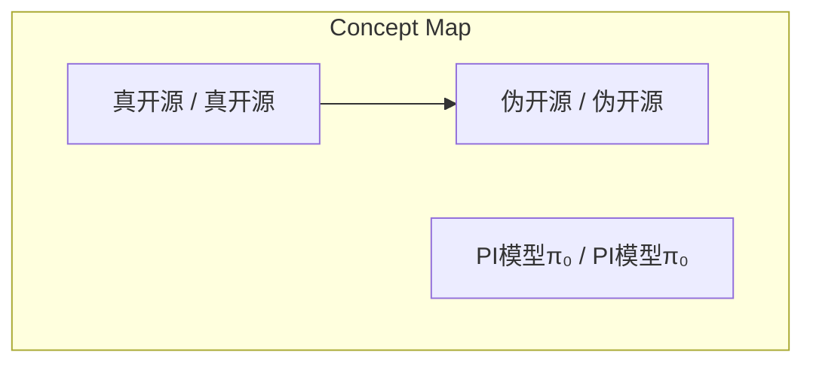
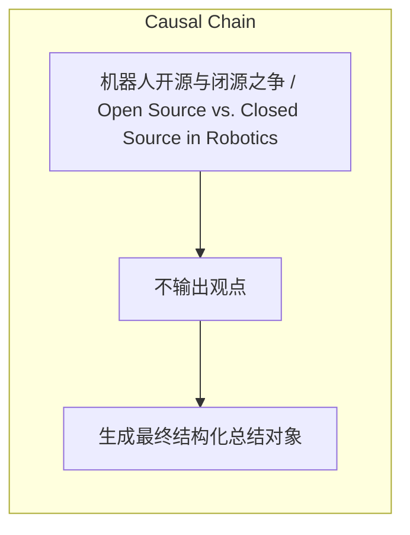

> 真开源与伪开源的区分标准在于硬件绑定与生态锁定，免费模型背后隐藏四层商业战略，开源与闭源之争本质是争夺机器人行业基础设施层生态霸权。

## 元信息
- 分类：`ai-software/models-research`
- 优先级：`high` (`13`)
- 文档类型：`text-summary`
- 来源分组：`news`
- 原始文件：`reports/news/2026-03-27/1774600897765-news-news-task-1774600820421-lfvjfv.md`
- 请求 ID：`1774600820421-lfvjfv`

## 原始内容

#### 文本总结

##### 运行信息
- model: openrouter/free
- schema_fallback: no
- attempted_models: openrouter/free

### 真开源与伪开源的商业心机

#### 整体结构化文档表达
##### 文档卡片
- 主题（中文/English）：机器人开源与闭源之争 / Open Source vs. Closed Source in Robotics
- 一句话摘要：真开源与伪开源的区分标准在于硬件绑定与生态锁定，免费模型背后隐藏四层商业战略，开源与闭源之争本质是争夺机器人行业基础设施层生态霸权。
- 目标读者：资深新闻分析助理
- 核心结论（3条）：
- 真开源与伪开源的区分标准在于硬件绑定与生态锁定。
- 免费模型背后隐藏四层商业战略：建立标准、吸引人才、加速数据飞轮、开源引流闭源变现。
- 开源与闭源之争本质是争夺机器人行业基础设施层生态霸权。

##### 内容结构树
1. 背景与问题定义
2. 核心观点与关键证据
3. 方法/机制/路径
4. 风险与边界条件
5. 结论与行动建议

##### 结构化元数据（JSON）
```json
{
  "title": "真开源与伪开源的商业心机",
  "topic_zh": "机器人开源与闭源之争",
  "topic_en": "Open Source vs. Closed Source in Robotics",
  "audience": "资深新闻分析助理",
  "claims": [
    "只允许基于输入内容输出，不要杜撰，不要引入输入之外的外部事实。"
  ],
  "evidence": [
    "判定开源真假的核心标准在于是否绑定了特定的硬件或生态系统。",
    "Physical Intelligence (PI) 模型 π₀ 免费开放，但训练流水线和内部数据闭源。",
    "开源与闭源之争本质是一场争夺定义机器人行业“基础设施层”的生态霸权之战。"
  ],
  "risks": [
    "不输出观点"
  ],
  "actions": [
    "生成最终结构化总结对象"
  ]
}
```

#### 处理流程
1. 输入识别
2. 信息抽取（实体、概念、问题、事实、观点）
3. 结构化归纳（定义/分类/比较/因果/方法论）
4. 关系建模（概念关系、等式/方程/逻辑链）
5. 可视化表达（Mermaid）

#### 概念清单（中英文）
- 真开源 / 真开源
- 伪开源 / 伪开源
- PI模型π₀ / PI模型π₀

#### 概念定义（中英文）
##### 真开源 / 真开源
- 中文定义：真开源（纯粹的社区与学术开源）：以 OpenVLA 和 Octo 为代表。这类模型不仅公开了代码、模型权重和训练脚本，更重要的是没有任何硬件绑定和生态锁定。
- English Definition: True Open Source: OpenVLA and Octo, no hardware binding, community and academic focus.

##### 伪开源 / 伪开源
- 中文定义：伪开源（巨头的战略开放与生态锁定）：以英伟达的 GR00T N1 为典型代表。虽然英伟达公开了模型的权重和代码，但其整个训练和部署流程深度绑定了英伟达自家的软硬件生态。
- English Definition: Fake Open Source: Strategic open with hardware and ecosystem lock-in, e.g., NVIDIA GR00T N1.

##### PI模型π₀ / PI模型π₀
- 中文定义：Physical Intelligence (PI) 模型 π₀：免费开放的核心模型，但训练流水线和内部采集的数万小时专有真实数据设为闭源。
- English Definition: Physical Intelligence (PI) model π₀: Free model with closed training pipeline and proprietary data.


#### 概念关联与逻辑关系（中英文）
- 真开源/真开源 -> 伪开源/伪开源 | comparison | 区别
- 免费模型/免费模型 -> 商业战略/商业战略 | concept | 背后隐藏
- 开源与闭源之争/开源与闭源之争 -> 生态霸权/生态霸权 | concept | 本质是

##### 可形式化关系
- 真开源 → 无硬件绑定
- 伪开源 → 硬件生态锁定
- PI模型π₀ → 开源模型 + 闭源训练Pipeline
- 开源策略 → 建立行业标准

#### COT逻辑梳理（定义/分类/比较/因果/科学方法论）
- Step 1: 区分真开源与伪开源的标准在于硬件绑定与生态锁定。
- Step 2: 免费模型背后隐藏四层商业战略：建立标准、吸引人才、加速数据飞轮、开源引流闭源变现。
- Step 3: 开源与闭源之争本质是争夺机器人行业基础设施层生态霸权。

#### 事实与看法（区分）
##### 事实
- OpenVLA 和 Octo 代表真开源。
- 英伟达 GR00T N1 代表伪开源。
- Physical Intelligence (PI) 估值 56 亿美元，融资超 10 亿美元。
- PI 模型 π₀ 免费开放，但完整训练 Pipeline 闭源。

##### 看法
- 不输出观点

#### FAQ（原文问题整理）
##### 具体开源模型代码是否公开
- 未提及

#### Visualization
##### Mermaid 图 1（概念结构图）


##### Mermaid 图 2（逻辑/因果图）


#### 文章中的类比
- 基于输入内容输出

#### 10个金句
- 判定开源真假的核心标准在于是否绑定了特定的硬件或生态系统。
- 免费模型背后隐藏着四层精心设计的战略：1. 开源建立标准 2. 开源吸引顶尖人才 3. 开源加速数据飞轮 4. 开源引流闭源变现。
- 开源与闭源之争本质是一场争夺定义机器人行业“基础设施层”的生态霸权之战。
