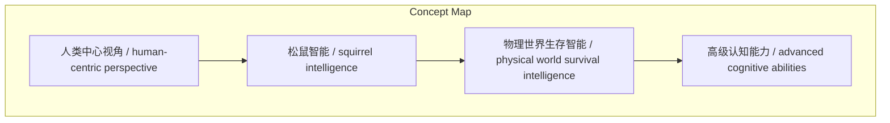
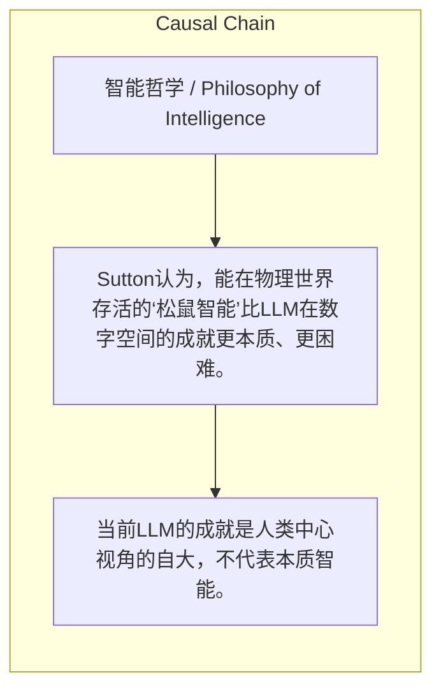

> Sutton认为，能在物理世界存活的‘松鼠智能’比LLM在数字空间的成就更本质、更困难。

## 元信息
- 分类：`ai-software/models-research`
- 优先级：`medium` (`12`)
- 文档类型：`text-summary`
- 来源分组：`news`
- 原始文件：`reports/news/2026-03-23/1774225445977-news-news-task-1774225346129-tduhj2.md`
- 请求 ID：`1774225346129-tduhj2`

## 原始内容

#### 文本总结

##### 运行信息
- model: stepfun/step-3.5-flash:free
- schema_fallback: yes
- attempted_models: stepfun/step-3.5-flash:free

### Sutton论智能：松鼠生存挑战高于LLM成就

#### 整体结构化文档表达
##### 文档卡片
- 主题（中文/English）：智能哲学 / Philosophy of Intelligence
- 一句话摘要：Sutton认为，能在物理世界存活的‘松鼠智能’比LLM在数字空间的成就更本质、更困难。
- 目标读者：AI研究者、学生及科技哲学爱好者
- 核心结论（3条）：
- 当前LLM的成就是人类中心视角的自大，不代表本质智能。
- 真正困难的智能挑战是构建具备物理世界存活能力的‘松鼠智能’。
- 物理世界生存智能是高级认知的基础，实现后其他任务将简化。

##### 内容结构树
1. 背景与问题定义
2. 核心观点与关键证据
3. 方法/机制/路径
4. 风险与边界条件
5. 结论与行动建议

##### 结构化元数据（JSON）
```json
{
  "title": "Sutton论智能：松鼠生存挑战高于LLM成就",
  "topic_zh": "智能哲学",
  "topic_en": "Philosophy of Intelligence",
  "audience": "AI研究者、学生及科技哲学爱好者",
  "claims": [],
  "evidence": [],
  "risks": [],
  "actions": []
}
```

#### 处理流程
1. 输入识别
2. 信息抽取（实体、概念、问题、事实、观点）
3. 结构化归纳（定义/分类/比较/因果/方法论）
4. 关系建模（概念关系、等式/方程/逻辑链）
5. 可视化表达（Mermaid）

#### 概念清单（中英文）
- 人类中心视角 / human-centric perspective
- 松鼠智能 / squirrel intelligence
- 物理世界生存智能 / physical world survival intelligence
- 高级认知能力 / advanced cognitive abilities

#### 概念定义（中英文）
##### 人类中心视角 / human-centric perspective
- 中文定义：以人类经验和标准为中心看待智能的倾向。
- English Definition: The tendency to view intelligence through the lens of human experience and standards.

##### 松鼠智能 / squirrel intelligence
- 中文定义：在真实物理世界中存活、拥有内在目标和情绪的智能体能力。
- English Definition: The capability of an agent to survive in the real physical world, with intrinsic goals and emotions.

##### 物理世界生存智能 / physical world survival intelligence
- 中文定义：基于真实物理规律独立生存的能力。
- English Definition: The ability to survive independently based on real physical laws.

##### 高级认知能力 / advanced cognitive abilities
- 中文定义：如写代码、做数学题等复杂认知任务。
- English Definition: Complex cognitive tasks such as coding and mathematical problem-solving.


#### 概念关联与逻辑关系（中英文）
- 人类中心视角/human-centric perspective -> 松鼠智能/squirrel intelligence | concept | 对立
- 松鼠智能/squirrel intelligence -> 物理世界生存智能/physical world survival intelligence | concept | 核心组成部分
- 物理世界生存智能/physical world survival intelligence -> 高级认知能力/advanced cognitive abilities | concept | 基础

##### 可形式化关系
- 人类中心视角 ⇒ 高估LLM在数字空间的智能表现
- 松鼠智能 ⇒ 包含物理世界存活能力
- 物理世界生存智能 ⇒ 使高级认知能力易于实现

#### COT逻辑梳理（定义/分类/比较/因果/科学方法论）
- Step 1: 批判当前观点，指出人类中心视角导致对LLM在数字空间成就的过度评价。
- Step 2: 提出松鼠智能作为真正挑战，定义其包括物理世界存活、内在目标等属性。
- Step 3: 论证物理世界生存智能是高级认知的基础，实现后其他认知任务将变得容易。

#### 事实与看法（区分）
##### 事实
- 未发现明确客观事实

##### 看法
- 未发现明确主观看法

#### FAQ（原文问题整理）
- 未发现明确 FAQ

#### Visualization
##### Mermaid 图 1（概念结构图）


##### Mermaid 图 2（逻辑/因果图）


#### 文章中的类比
- 未发现明确类比

#### 10个金句
- 原文未提供
