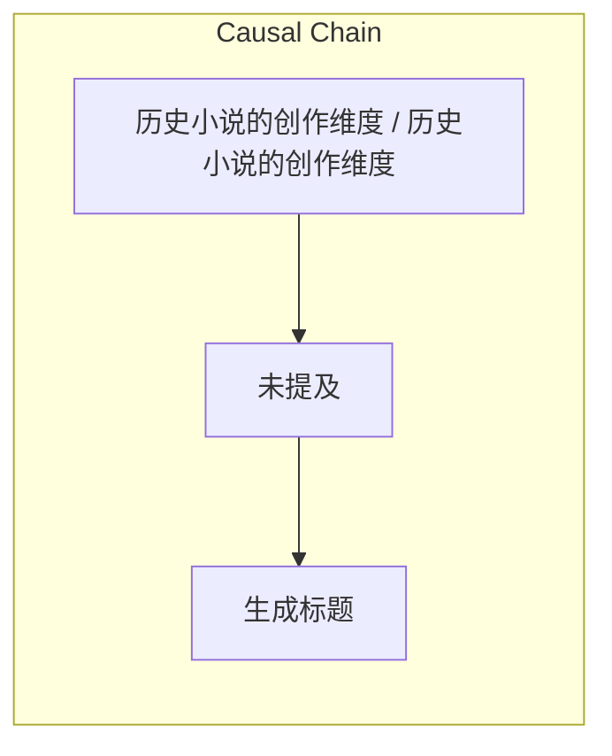

> 历史小说的创作本质是“挂衣服”在历史“钉子”上，其创作维度包括能写、好写、怎么写，最终价值在于与现代人共鸣。

## 元信息
- 分类：`ai-software/models-research`
- 优先级：`medium` (`12`)
- 文档类型：`text-summary`
- 来源分组：`news`
- 原始文件：`reports/news/2026-03-29/1774781044124-news-news-task-1774781030492-7g0cbh.md`
- 请求 ID：`1774781030492-7g0cbh`

## 原始内容

#### 文本总结

##### 运行信息
- model: openrouter/free
- schema_fallback: no
- attempted_models: openrouter/free

### 历史是挂衣钉 小说挂其上

#### 整体结构化文档表达
##### 文档卡片
- 主题（中文/English）：历史小说的创作维度 / 历史小说的创作维度
- 一句话摘要：历史小说的创作本质是“挂衣服”在历史“钉子”上，其创作维度包括能写、好写、怎么写，最终价值在于与现代人共鸣。
- 目标读者：新闻分析助理
- 核心结论（3条）：
- 历史小说的创作维度：能写、好写、怎么写
- 历史小说的终极价值在于与现代人共鸣
- 历史小说的创作本质是“挂衣服”在历史“钉子”上

##### 内容结构树
1. 背景与问题定义
2. 核心观点与关键证据
3. 方法/机制/路径
4. 风险与边界条件
5. 结论与行动建议

##### 结构化元数据（JSON）
```json
{
  "title": "历史是挂衣钉 小说挂其上",
  "topic_zh": "历史小说的创作维度",
  "topic_en": "历史小说的创作维度",
  "audience": "新闻分析助理",
  "claims": [
    "历史小说的创作维度：能写、好写、怎么写",
    "历史小说的终极价值在于与现代人共鸣"
  ],
  "evidence": [
    "资料明确指出这是一个伪命题",
    "创作者和读者的切入点不应是死板的学术研究",
    "所有好的历史小说都会和现代人的趣味、情感或痛感有重叠之处"
  ],
  "risks": [
    "未提及"
  ],
  "actions": [
    "生成标题",
    "提取核心结论",
    "提取正式关系",
    "结构化逻辑步骤"
  ]
}
```

#### 处理流程
1. 输入识别
2. 信息抽取（实体、概念、问题、事实、观点）
3. 结构化归纳（定义/分类/比较/因果/方法论）
4. 关系建模（概念关系、等式/方程/逻辑链）
5. 可视化表达（Mermaid）

#### 概念清单（中英文）
- 能写吗 / 能写吗
- 好写吗 / 好写吗
- 怎么写 / 怎么写

#### 概念定义（中英文）
##### 能写吗 / 能写吗
- 中文定义：历史小说的创作维度
- English Definition: Historical novel creation dimensions

##### 好写吗 / 好写吗
- 中文定义：为什么要写
- English Definition: Motivation for writing

##### 怎么写 / 怎么写
- 中文定义：怎么写
- English Definition: Technical execution rules


#### 概念关联与逻辑关系（中英文）
- 能写吗/能写吗 -> 历史小说的创作维度/历史小说的创作维度 | concept | 维度
- 好写吗/好写吗 -> 历史小说的创作维度/历史小说的创作维度 | concept | 维度
- 怎么写/怎么写 -> 历史小说的创作维度/历史小说的创作维度 | concept | 维度
- 挂衣服/挂衣服 -> 历史小说的创作本质/历史小说的创作本质 | concept | 动作
- 历史钉子/历史钉子 -> 挂衣服/挂衣服 | concept | 对象

##### 可形式化关系
- 遵守“钉子”的客观属性（三大规则）
- “衣服”不匹配“钉子”时的“架空”妥协
- “挂衣服”的终极价值在于连接现代人的现实共鸣

#### COT逻辑梳理（定义/分类/比较/因果/科学方法论）
- Step 1: 能写吗？（确立“挂衣服”的合法性）
- Step 2: 好写吗 / 为什么要写？（寻找“钉子”上的趣味与情怀）
- Step 3: 怎么写？（“挂衣服”的严苛规则与终极价值）

#### 事实与看法（区分）
##### 事实
- 历史小说的创作维度：能写、好写、怎么写
- 历史小说的终极价值在于与现代人共鸣
- 历史小说的创作本质是“挂衣服”在历史“钉子”上

##### 看法
- 历史小说的创作本质是“挂衣服”在历史“钉子”上

#### FAQ（原文问题整理）
##### 历史小说的创作维度：能写、好写、怎么写
- 未提及

#### Visualization
##### Mermaid 图 1（概念结构图）


##### Mermaid 图 2（逻辑/因果图）


#### 文章中的类比
- 历史是挂衣钉 小说挂其上

#### 10个金句
- 历史是一枚挂衣钉 用来挂我的小说
- 把小说挂在历史钉子上 在文学创作上是完全合理且具有积极意义的
- 所有好的历史小说都会和现代人的趣味、情感或痛感有重叠之处
