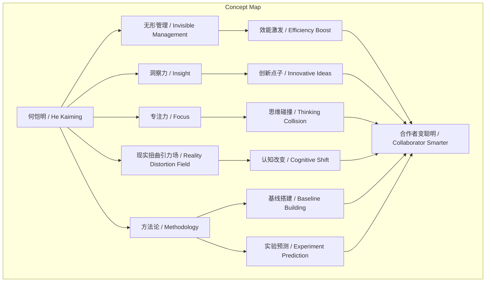
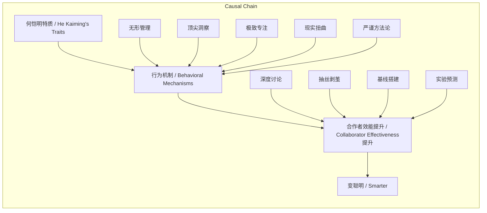

> 何恺明通过无形管理、顶尖洞察、极致专注与严谨方法论，显著提升合作者效能与认知维度。

## 元信息
- 分类：`ai-software/models-research`
- 优先级：`high` (`13`)
- 文档类型：`text-summary`
- 来源分组：`news`
- 原始文件：`reports/news/2026-03-20/1773966042658-news-news-task-1773965971131-izsg8k.md`
- 请求 ID：`1773965971131-izsg8k`

## 原始内容

#### 文本总结

### 何恺明：科研赋能者的四大魔力

#### 整体结构化文档表达
##### 文档卡片
- 主题（中文/English）：科研领导力特质 / Research Leadership Traits
- 一句话摘要：何恺明通过无形管理、顶尖洞察、极致专注与严谨方法论，显著提升合作者效能与认知维度。
- 目标读者：科研工作者、团队管理者、对高效协作感兴趣的人群。
- 核心结论（3条）：
  1. 何恺明的“无形管理”能极大激发合作者内在效能与“智商”。
  2. 其“点石成金”的洞察力与高维抽象思维是创新核心驱动力。
  3. 严谨的科研方法论训练（如基线搭建、实验预测）是提升问题解决能力的关键路径。

##### 内容结构树
1. 背景与问题定义：谢赛宁体验“变聪明”现象，引发对何恺明赋能机制的好奇。
2. 核心观点与关键证据：四大赋能原因——无形管理、洞察力、专注力、现实扭曲引力场、方法论。
3. 方法/机制/路径：抓重点、心流讨论、梯度信号探索、高基线搭建、Excel对比、结果预测。
4. 风险与边界条件：未提及。
5. 结论与行动建议：未发现明确行动建议，但隐含学习其严谨方法论。

##### 结构化元数据（JSON）
```json
{
  "title": "何恺明：科研赋能者的四大魔力",
  "topic_zh": "科研领导力特质",
  "topic_en": "Research Leadership Traits",
  "audience": "科研工作者、团队管理者",
  "claims": [
    "何恺明的无形管理能极大激发合作者效能",
    "其洞察力与抽象思维是创新关键",
    "严谨方法论训练提升解决复杂问题的能力"
  ],
  "evidence": [
    "合作者效率提升，感觉变聪明",
    "能抽丝剥茧提取核心，建立高维联系",
    "教导梯度信号、高基线、Excel对比等方法"
  ],
  "risks": [],
  "actions": []
}
```

#### 处理流程
1. 输入识别：输入文本为谢赛宁对何恺明工作赋能特质的阐述。
2. 信息抽取：抽取实体（何恺明、谢赛宁）、概念（IC、心流、现实扭曲引力场等）、观点（赋能机制）。
3. 结构化归纳：将赋能机制分类为管理、思维、方法论等维度。
4. 关系建模：建立何恺明特质（如专注力）与合作者效能提升（如认知拉升）的因果链。
5. 可视化表达：设计Mermaid图展示概念结构与逻辑流。

#### 概念清单（中英文）
- 谢赛宁 / Xie Saining
- 何恺明 / He Kaiming
- 个人贡献者 / Individual Contributor (IC)
- 管理者 / Manager
- 效率 / Efficiency
- 心流状态 / Flow State
- 心智周期 / Mental Cycle
- 现实扭曲引力场 / Reality Distortion Field
- 抓重点能力 / Ability to Identify Key Points
- 高维抽象空间 / High-dimensional Abstract Space
- 梯度信号 / Gradient Signal
- 工程基线 / Engineering Baseline
- 底层脚手架 / Underlying Scaffolding
- Excel表格 / Excel Spreadsheet
- 实验对比 / Experimental Comparison
- 结果预测 / Result Prediction

#### 概念定义（中英文）
- 个人贡献者（IC）：专注于一线技术工作而非管理职责的角色。
- 心流状态：完全沉浸于问题思考、屏蔽外界干扰的心理状态。
- 现实扭曲引力场：借用乔布斯术语，指个人能影响他人认知，使看似不可能之事变得可能。
- 梯度信号：在动手探索中寻找的改进方向或反馈信号。
- 工程基线：实验或项目的基础性能标准，需搭建得极高极稳。
- 底层脚手架：支撑研究的基础框架或基础设施。
- 抓重点能力：从复杂信息中提取核心脉络、建立高维联系的能力。

#### 概念关联与逻辑关系（中英文）
1. 何恺明（He Kaiming）的专注力（Focus）与思维碰撞（Thinking Collision）共同提升合作者认知维度（Cognitive Dimension）。
2. 抓重点能力（Key Point Identification）与高维抽象思维（High-dimensional Abstraction）共同产生创新点子（Innovative Ideas）。
3. 严谨方法论（Rigorous Methodology）与梯度信号探索（Gradient Signal Exploration）共同提高问题解决智商（Problem-solving IQ）。

#### COT逻辑梳理（定义/分类/比较/因果/科学方法论）
- Step 1（定义）：何恺明拥有能极大赋能身边人的特质，表现为合作者效率与认知的提升。
- Step 2（分类）：赋能机制分为五类——无形管理、洞察力、专注力、现实扭曲引力场、方法论。
- Step 3（比较）：与传统管理者相比，何恺明虽偏好IC角色，却通过无形方式（如深度讨论）激发效能，而非纯粹指引方向。
- Step 4（因果）：其行为（如抽丝剥茧、心流讨论）导致合作者“变聪明”，形成“特质→行为→效能提升”因果链。
- Step 5（科学方法论）：强调基线搭建、实验预测、精密对比，体现实证、系统、可重复的科研逻辑。

#### 事实与看法
##### 事实
- 何恺明个人极其偏好做一线“个人贡献者”，不享受纯粹管理角色。
- 他能在一堆复杂信息中抽丝剥茧，提取核心脉络。
- 他教导使用Excel表格进行实验对比，并强制在跑实验前进行结果预测。
- 他会把大部分心智周期分配给某一具体问题，并拉着合作者深度讨论。
##### 看法
- 何恺明是一位非常出色的“管理者”。
- 他拥有“现实扭曲引力场”，使周围人觉得做不到的事慢慢也能做到。
- 他的思维打磨能让普通东西变成“金子般充满价值的好Idea”。
- 他极大地赋能了身边人，使人“变聪明了”。

#### FAQ（原文问题整理）
- 未发现明确提问。

#### Visualization
##### Mermaid 图 1（概念结构图）


##### Mermaid 图 2（逻辑/因果图）


#### 文章中的类比
- 点石成金：指何恺明将普通想法打磨成高价值创意的能力。
- 现实扭曲引力场：借用乔布斯说法，形容其个人影响力能改变他人对可能性的认知。

#### 10个金句
1. “变聪明了”
2. “极大地赋能（empower）身边人”
3. “无形的管理与效能激发”
4. “点石成金的洞察与抽丝剥茧的能力”
5. “极致的专注力带来的思维碰撞”
6. “现实扭曲引力场”
7. “原本觉得完全做不到的事情，不知不觉中竟然慢慢也能做到了”
8. “不要凭空想象问题，而是要在动手探索中寻找‘梯度信号’”
9. “把工程基线（Baseline）和底层脚手架搭建到极高极稳的水平”
10. “使用精密的Excel表格进行实验对比”
