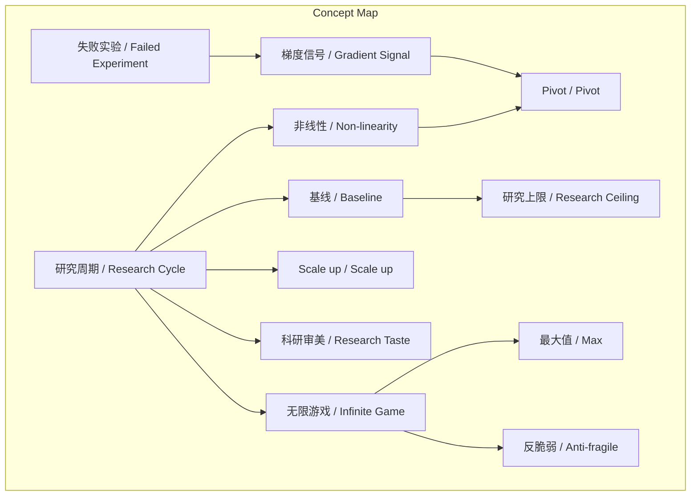
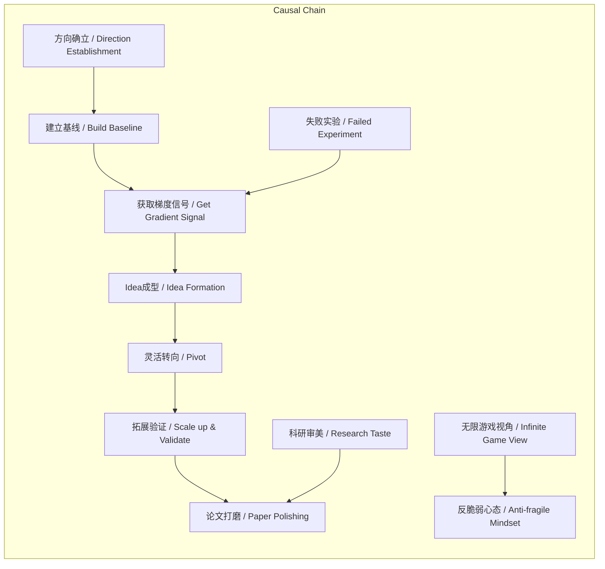

> 本文基于谢赛宁经验，系统阐述在周期压缩环境下科研的非线性本质，并拆解为方向确立、理念成型、拓展验证、论文打磨四阶段，最终指向“无限游戏”的职业生涯观。

## 元信息
- 分类：`ai-software/models-research`
- 优先级：`high` (`13`)
- 文档类型：`text-summary`
- 来源分组：`news`
- 原始文件：`reports/news/2026-03-20/1773965871390-news-news-task-1773965803838-dtj8xm.md`
- 请求 ID：`1773965803838-dtj8xm`

## 原始内容

#### 文本总结

### 科研非线性探索四阶段论

#### 整体结构化文档表达
##### 文档卡片
- 主题（科研方法论 / Research Methodology）：
- 一句话摘要：本文基于谢赛宁经验，系统阐述在周期压缩环境下科研的非线性本质，并拆解为方向确立、理念成型、拓展验证、论文打磨四阶段，最终指向“无限游戏”的职业生涯观。
- 目标读者：科研人员、研究生、创新领域从业者
- 核心结论（3条）：
  1. 优秀科研是非线性、充满曲折的探索过程，非线性是常态而非例外。
  2. 研究上限由基线（Baseline）质量决定，必须动手建立极致基线。
  3. 职业生涯优化“最大值”（Max）而非平均值，需具备反脆弱（Anti-fragile）心态。

##### 内容结构树
1. **背景与问题定义**：竞争激烈导致典型研究周期压缩至约6个月，但科研本质是非线性探索。
2. **核心观点与关键证据**：非线性是常态；基线决定上限；失败实验提供关键“梯度”信号；需随时转向（Pivot）；研究审美至关重要；职业生涯是优化“最大值”的“无限游戏”。
3. **方法/机制/路径**：四阶段法——动手探索建基线→从信号中生长Idea并灵活Pivot→Scale up验证→提前写作并极致打磨。
4. **风险与边界条件**：死守初始设想（“无聊想法”）；基线过低导致自欺欺人；过度在意单次成败或拒稿。
5. **结论与行动建议**：接受非线性，以黑客精神动手建基线，从失败中提取信号，提前完成初稿以留足打磨时间，培养反脆弱心态。

##### 结构化元数据（JSON）
```json
{
  "title": "科研非线性探索四阶段论",
  "topic_zh": "科研方法论",
  "topic_en": "Research Methodology",
  "audience": "科研人员、研究生、创新从业者",
  "claims": [
    "优秀科研是非线性、充满曲折的探索过程，非线性是常态。",
    "研究上限由基线（Baseline）质量决定，必须动手建立极致基线。",
    "职业生涯优化“最大值”（Max）而非平均值，需具备反脆弱（Anti-fragile）心态。"
  ],
  "evidence": [
    "典型研究周期被压缩在6个月左右。",
    "何恺明方法论：研究的上限取决于基线的好坏。",
    "失败的实验结果能提供明确的“梯度”信号。",
    "顶尖研究者会提前一个月写初稿，留足一个月打磨。",
    "职业生涯优化“最大值”，一两次突破即可产生深远影响。"
  ],
  "risks": [
    "从头到尾完全符合最初设想，意味着“无聊想法”。",
    "在低水平基线上工作，导致“灌水”而非突破。",
    "过分在意单次论文被拒或短期成败。"
  ],
  "actions": [
    "拒绝凭空想象，动手复现或拓展Baseline。",
    "通过高密度实验观察“Surprise”，寻找梯度信号。",
    "精细记录实验（如用Excel），跑实验前预测结果。",
    "在Idea成型后及时Scale up并补充实验证据。",
    "将论文写作视为沟通界面，像拍电影一样呈现决策过程。"
  ]
}
```

#### 处理流程
1. **输入识别**：来源为用户提供的关于谢赛宁科研周期观点的文本。
2. **信息抽取**：抽取实体（研究周期、基线、梯度信号、Idea、Pivot、Scale up、科研审美、无限游戏、反脆弱、最大值）、概念、问题（如何做优秀科研）、事实（周期6个月、何恺明影响）、观点（非线性是常态）。
3. **结构化归纳**：将内容归纳为背景、核心观点、四阶段方法、风险、结论；对概念进行定义与分类（如阶段、心态）。
4. **关系建模**：建立概念间逻辑链，如基线质量→研究上限；失败实验→梯度信号→方向调整；非线性→需要Pivot。
5. **可视化表达**：使用Mermaid绘制概念结构图与逻辑因果图。

#### 概念清单（中英文）
- 研究周期 / Research Cycle
- 基线 / Baseline
- 梯度信号 / Gradient Signal
- Idea / Idea
- 非线性 / Non-linearity
- Pivot / Pivot
- Scale up / Scale up
- 科研审美 / Research Taste
- 无限游戏 / Infinite Game
- 反脆弱 / Anti-fragile
- 最大值 / Max
- 动手探索 / Hands-on Exploration
- 方向确立 / Direction Establishment
- 实验验证 / Experimental Validation
- 论文打磨 / Paper Polishing

#### 概念定义（中英文）
- **研究周期 / Research Cycle**：一个典型科研项目从开始到论文完成的时长，文中指被压缩至约6个月的过程。
- **基线 / Baseline**：研究中复现或简单拓展的现有工作，作为比较和突破的起点。
- **梯度信号 / Gradient Signal**：实验中观察到的意料之外现象（尤其是失败结果），提供明确方向指引的信息。
- **Idea / Idea**：在探索过程中从实验信号里生长出来的核心研究理念，非初始凭空设想。
- **非线性 / Non-linearity**：科研过程充满变数、曲折，非从起点直线通达终点的路径。
- **Pivot / Pivot**：根据实验信号随时调整或转换研究方向的行为。
- **Scale up / Scale up**：将初步成型的Idea进行拓展，补充大量实验证据以支撑结论。
- **科研审美 / Research Taste**：对研究表达（如论文排版、叙事）的极致追求，以清晰传达决策过程。
- **无限游戏 / Infinite Game**：职业生涯整体视角，不追求单次成功，而优化一生中的最高成就。
- **反脆弱 / Anti-fragile**：从波动、失败中获益的心态，不过分在意短期成败。
- **最大值 / Max**：职业生涯优化的目标为取得一两次巅峰突破，而非每次成功。
- **动手探索 / Hands-on Exploration**：通过写代码、跑系统等实践行为确立方向，而非空想。
- **方向确立 / Direction Establishment**：研究初期通过实践找到可行探索路径的阶段。
- **实验验证 / Experimental Validation**：通过系统实验验证Idea的有效性并收集证据。
- **论文打磨 / Paper Polishing**：对论文初稿进行精细修改，优化表达、排版和叙事。

#### 概念关联与逻辑关系（中英文）
1. **基线质量（Baseline Quality） 直接决定 研究上限（Research Ceiling）**：基线搭建越极致，越可能在其上做出真正突破，而非在低水平“灌水”。
2. **失败实验（Failed Experiment） 提供 梯度信号（Gradient Signal） 进而引导 方向调整（Direction Pivot）**：性能大幅下降的失败结果给予明确梯度，指引寻找突破口，比无信号实验更有价值。
3. **非线性探索（Non-linear Exploration） 要求 随时Pivot（Pivot） 并依赖 梯度信号（Gradient Signal）**：因过程曲折，需从实验信号中生长Idea并灵活转向，非线性与Pivot互为因果。

#### COT逻辑梳理（定义/分类/比较/因果/科学方法论）
- **Step 1 (定义问题)**：在周期压缩的竞争环境下，科研本质被定义为非线性探索，而非线性发展。
- **Step 2 (分类阶段)**：将研究周期拆解为四个阶段：方向确立与动手探索期、理念成型与灵活转向期、拓展与实验验证期、论文写作与极致打磨期。
- **Step 3 (比较)**：比较线性研究（从头到尾符合初始设想，为“无聊想法”）与非线性研究（中后期灵感迸发，需Pivot）；比较优化“平均值”（如棋类）与优化“最大值”（科研职业生涯）。
- **Step 4 (因果分析)**：基线质量因果决定研究上限；失败实验因果提供梯度信号；提前写作因果留足打磨时间以提升沟通效果。
- **Step 5 (科学方法论)**：强调实验驱动（高密度实验观察Surprise）、记录与预测（用Excel追踪，预测实验结果）、审美作为方法论（打磨排版以清晰传达决策），形成“动手→信号→Idea→验证→表达”的闭环。

#### 事实与看法（病毒）
##### 事实
- 当前竞争激烈环境下，典型研究周期通常被压缩在6个月左右。
- 何恺明曾指出“研究的上限取决于基线的好坏”。
- 顶尖研究者会提前一个月写好初稿，留出整整一个月打磨。
- 职业生涯优化的是“最大值”（Max），一两次突破可对AI历史产生深远影响。
- 探索期需动手写代码、跑系统，复现或拓展Baseline。
##### 看法
- 优秀的科研从来不是线性发展，而是充满变数、极其曲折的非线性探索过程。
- 凭空想出的点子要么已被多人思考，要么是糟糕想法。
- 最差的研究是头到尾完全符合最初设想，意味着“无聊想法”。
- 研究者需具备反脆弱（Anti-fragile）心态，不过分在意单次成败。
- 论文打磨是打造“赏心悦目的沟通界面”，像拍电影一样呈现决策过程。

#### FAQ（原文问题整理）
- 未提及明确提问。原文为观点阐述，未设置疑问句式。

#### Visualization
##### Mermaid 图 1（概念结构图）

##### Mermaid 图 2（逻辑/因果图）


#### 文章中的类比
- 机器学习中的“随机梯度下降”：研究者通过高密度实验观察“梯度”信号，类似优化过程。
- 拍电影：论文打磨像拍电影一样，呈现研究者面临冲突时做出的选择，以清晰传达决策过程。

#### 10个金句
1. 优秀的科研从来不是从起点直线通达终点的线性发展，而是一个充满变数、极其曲折的非线性探索过程。
2. 研究的上限取决于基线的好坏。
3. 一个失败的、导致性能大幅下降的实验结果往往能提供极大的信息量，因为它给予了一个明确的“梯度”。
4. 真正的Idea属于探索过程，从实验信号里生长出来的Idea才是真正属于你的。
5. 最差的研究就是从头到尾都完全符合最初的设想，这通常意味着它是一个毫无惊喜的“无聊想法”。
6. 好的研究往往在进行到中后期（例如第5个月）时才会经历灵感的迸发或方向的重新收敛。
7. 研究者需要精细地记录和追踪实验（例如使用Excel表格对比特征），学会在跑每一个实验前预测结果。
8. 顶尖的研究者绝不推崇在截止日期（Deadline）前通宵赶稿，而是会提前一个月写好具备发表质量的初稿。
9. 研究员终其一生不需要每次都成功，其职业生涯优化的是“最大值”。
10. 研究者需要具备反脆弱（Anti-fragile）的心态，不要过分在意某一次论文被拒或短期的成败。
