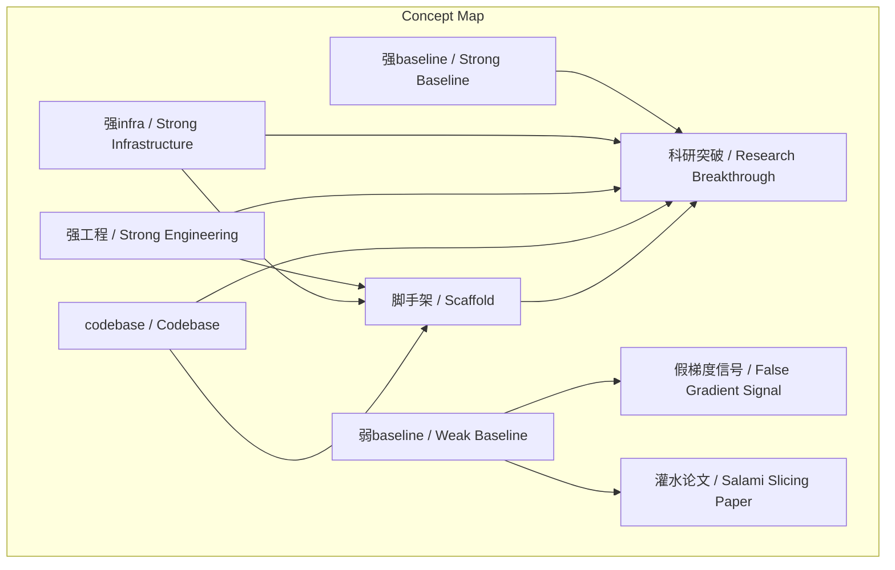
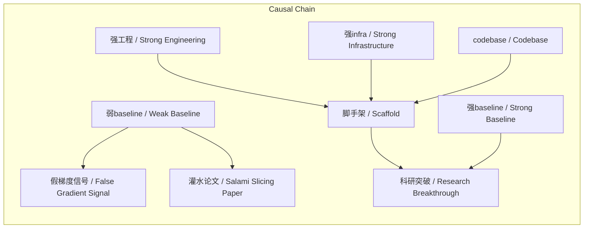

> 何恺明强调通过打造极致的基线、工程、基础设施和代码库，为突破性研究奠定不可动摇的基石。

## 元信息
- 分类：`ai-software/models-research`
- 优先级：`high` (`13`)
- 文档类型：`text-summary`
- 来源分组：`news`
- 原始文件：`reports/news/2026-03-20/1773966320491-news-news-task-1773966203304-ex3r6w.md`
- 请求 ID：`1773966203304-ex3r6w`

## 原始内容

#### 文本总结

### 强基线强工程：科研突破的基石

#### 整体结构化文档表达
##### 文档卡片
- 主题（中文/English）：科研方法论 / Research Methodology
- 一句话摘要：何恺明强调通过打造极致的基线、工程、基础设施和代码库，为突破性研究奠定不可动摇的基石。
- 目标读者：AI研究人员、工程师、科研管理者
- 核心结论（3条）：
  1. 研究上限由基线质量决定，弱基线易导致无效“灌水”。
  2. 基础设施与代码库是科研的“脚手架”，必须亲力亲为打造至极致。
  3. 所有突破均建立在坚不可摧的底层系统之上，否则探索无从谈起。

##### 内容结构树
1. 背景与问题定义：AI领域存在追求短期指标而忽视底层建设的现象，导致研究浮于表面。
2. 核心观点与关键证据：核心观点是“强基线、强工程、强infra、codebase”是突破前提。证据包括：何恺明在TPU上自建 infra 支撑MoCo/MAE/DiT；弱基线导致假信号；Fast R-CNN等工作的极致工程。
3. 方法/机制/路径：方法论是“工欲善其事，必先利其器”——亲力亲为，将基础设施、基线、工程、代码库做到极致，作为科研脚手架。
4. 风险与边界条件：风险是忽略底层建设会导致研究失去平台、探索失败；边界条件是此方法适用于需要系统性突破的前沿研究，可能不适用于快速迭代的应用型研究。
5. 结论与行动建议：结论是底层系统决定研究上限。行动建议：研究者应投入大量资源打造硬核工程能力与基础设施，避免在脆弱地基上建房子。

##### 结构化元数据（JSON）
```json
{
  "title": "强基线强工程：科研突破的基石",
  "topic_zh": "科研方法论",
  "topic_en": "Research Methodology",
  "audience": "AI研究人员、工程师、科研管理者",
  "claims": [
    "研究上限由基线质量决定，弱基线易导致无效“灌水”。",
    "基础设施与代码库是科研的“脚手架”，必须亲力亲为打造至极致。",
    "所有突破均建立在坚不可摧的底层系统之上，否则探索无从谈起。"
  ],
  "evidence": [
    "何恺明在TPU上完整搭建一整套基础设施，支撑了MoCo、MAE、DiT等重大工作。",
    "弱基线会导致“梯度信号”失真，产生假象。",
    "Fast R-CNN、Mask R-CNN等工作中做了大量极致工程，使基线远超普通论文水平。"
  ],
  "risks": [
    "脚手架不稳则科研工作无法进行，失去探索平台。",
    "在低水平地基上建房子，导致研究失败或无效。"
  ],
  "actions": [
    "亲力亲为打造极致的基础设施（Infra）和代码库（Codebase）。",
    "将基线（Baseline）做到“高到不能再高”的极致水平。",
    "将写代码视为科研突破的脚手架，而非仅仅是产品开发。"
  ]
}
```

#### 处理流程
未提及

#### 概念清单（中英文）
- 何恺明 / Kaiming He
- 谢赛宁 / 未提及
- 强baseline / Strong Baseline
- 强工程 / Strong Engineering
- 强infra / Strong Infrastructure
- codebase / Codebase
- 代码库 / Codebase
- 工欲善其事 必先利其器 / 未提及
- FAIR / FAIR
- TPU / Tensor Processing Unit
- MoCo / MoCo
- MAE / MAE
- DiT / DiT
- Fast R-CNN / Fast R-CNN
- Mask R-CNN / Mask R-CNN
- 基线 / Baseline
- 基础设施 / Infrastructure
- 梯度信号 / 未提及
- 灌水论文 / 未提及
- groundbreaking / Groundbreaking
- 脚手架 / 未提及
- 底层系统 / 未提及
- 基准模型 / 未提及

#### 概念定义（中英文）
- 何恺明 / Kaiming He: FAIR研究员，提出以强基线、强工程、强基础设施和代码库为核心的科研方法论。
- 谢赛宁 / 未提及: 访谈中提及的研究者，接受何恺明指导。
- 强baseline / Strong Baseline: 指质量极高、能作为研究上限试金石的基准模型，避免在弱基线上产生假信号或灌水论文。
- 强工程 / Strong Engineering: 指将系统搭建和代码实现做到极致的工程能力，作为科研突破的脚手架。
- 强infra / Strong Infrastructure: 指亲力亲为打造的极致底层系统与资源，支撑前沿研究。
- codebase / Codebase: 指代码库，通过极致工程打造，作为科研的基础平台。
- 代码库 / Codebase: 同codebase，指存储和管理代码的仓库，需做到极致以支撑研究。
- 工欲善其事 必先利其器 / 未提及: 成语，意为做好工作前需先准备好工具，在文中指打造极致底层平台。
- FAIR / FAIR: Facebook AI Research，何恺明所在研究机构。
- TPU / Tensor Processing Unit: 谷歌张量处理器，何恺明在其上搭建基础设施。
- MoCo / MoCo: 动量对比，何恺明团队在TPU infra上实现的工作之一。
- MAE / MAE: 掩码自编码器，何恺明团队工作之一。
- DiT / DiT: 可能指Diffusion Transformer，何恺明团队工作之一。
- Fast R-CNN / Fast R-CNN: 目标检测工作，体现了极致工程。
- Mask R-CNN / Mask R-CNN: 目标检测工作，体现了极致工程。
- 基线 / Baseline: 研究中的基准模型，用于比较新方法性能。
- 基础设施 / Infrastructure: 底层系统与资源，需亲力亲为打造至极致。
- 梯度信号 / 未提及: 指训练过程中的梯度信息，弱基线会导致其失真。
- 灌水论文 / 未提及: 指在弱基线上做出的无实质突破的论文。
- groundbreaking / Groundbreaking: 指具有颠覆性的创新。
- 脚手架 / 未提及: 比喻，指支撑科研突破的基础平台。
- 底层系统 / 未提及: 指基础设施和代码库等底层构建。
- 基准模型 / 未提及: 同基线，指用于比较的模型。

#### 概念关联与逻辑关系（中英文）
1. 强baseline / Strong Baseline 与 强infra / Strong Infrastructure 共同影响 科研突破 / Research Breakthrough。
   形式化：Research Breakthrough ∝ Strong Baseline × Strong Infrastructure
2. 弱baseline / Weak Baseline 导致 灌水论文 / Salami Slicing Paper 与 假梯度信号 / False Gradient Signal。
   逻辑表达式：Weak Baseline → (Salami Slicing Paper ∧ False Gradient Signal)
3. 强工程 / Strong Engineering 与 强infra / Strong Infrastructure 共同构成 脚手架 / Scaffold。
   等式：Scaffold = Strong Engineering ∧ Strong Infrastructure

#### COT逻辑梳理（定义/分类/比较/因果/科学方法论）
Step 1: 定义核心概念。强Baseline指质量极高的基准模型；强Infra指极致的基础设施；强工程指极致的工程能力；Codebase指代码库。
Step 2: 分类。这些概念可分为：基准类（Baseline）、支撑类（Infra, Codebase）、能力类（Engineering）。
Step 3: 比较。强Baseline vs 弱Baseline：强Baseline能真实反映研究潜力，弱Baseline导致假信号和灌水。
Step 4: 因果。因：打造强Baseline、强Infra、强工程、Codebase；果：实现科研突破。
Step 5: 科学方法论。何恺明的方法论强调：在探索前沿前，必须亲力亲为将底层系统做到极致，作为不可动摇的基石，避免在脆弱地基上研究。

#### 事实与看法（区分）
##### 事实
- 何恺明在TPU上完整搭建了一整套基础设施。
- 该基础设施支撑了MoCo、MAE、DiT等重大工作。
- Fast R-CNN、Mask R-CNN等工作中做了大量极致工程。
- 研究的上限取决于Baseline的好坏。
- 弱Baseline会导致梯度信号失真。
- 没有强工程和Infra，科研工作因脚手架不稳而失败。

##### 看法
- 强Baseline是决定研究上限的试金石。
- 在弱Baseline上做出性能提升往往是“灌水”论文。
- 只有把Baseline做到极致，新东西才是真正颠覆性创新。
- 绝不要在摇摇欲坠的低水平地基上建房子。
- 写代码应视为科研突破的脚手架，而非仅仅是做产品。

#### FAQ（原文问题整理）
未发现明确提问

#### Visualization
##### Mermaid 图 1（概念结构图）


##### Mermaid 图 2（逻辑/因果图）


#### 文章中的类比
- “工欲善其事，必先利其器”：比喻打造工具的重要性。
- “脚手架”：比喻基础设施和工程作为科研突破的支撑平台。

#### 10个金句
1. “强baseline、强工程、强infra、codebase”
2. “工欲善其事 必先利其器”
3. “研究的上限取决于Baseline的好坏。”
4. “如果在一种很弱的、有缺陷的Baseline上做出了性能提升，那往往只是一篇毫无实质突破的‘灌水’论文。”
5. “确保‘梯度信号’的真实性。”
6. “只有把Baseline做到‘高到不能再高’的极致水平，在这个坚实的基础上做出的新东西，才是真正具有颠覆性的创新（Groundbreaking）。”
7. “这指的是不应该把写代码仅仅视为做产品的，而是要将其视为‘research的breakthrough的脚手架’。”
8. “谢赛宁提到，何恺明等人在做目标检测（如Fast R-CNN、Mask R-CNN）时，做了大量极致的工程工作去搭建Infra和Codebase。”
9. “如果没有花足够大的心思去把系统搭建好、把工程做到极致，科研工作就会因为‘脚手架不稳’而什么都做不出来，也就失去了进行真正探索的平台。”
10. “绝不要在摇摇欲坠的低水平地基上建房子。”
