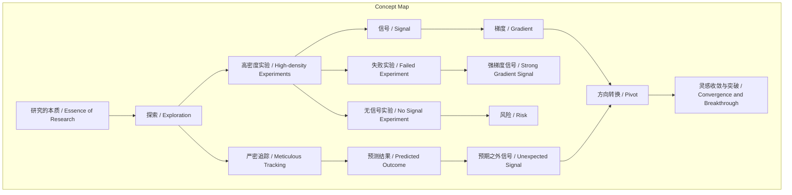
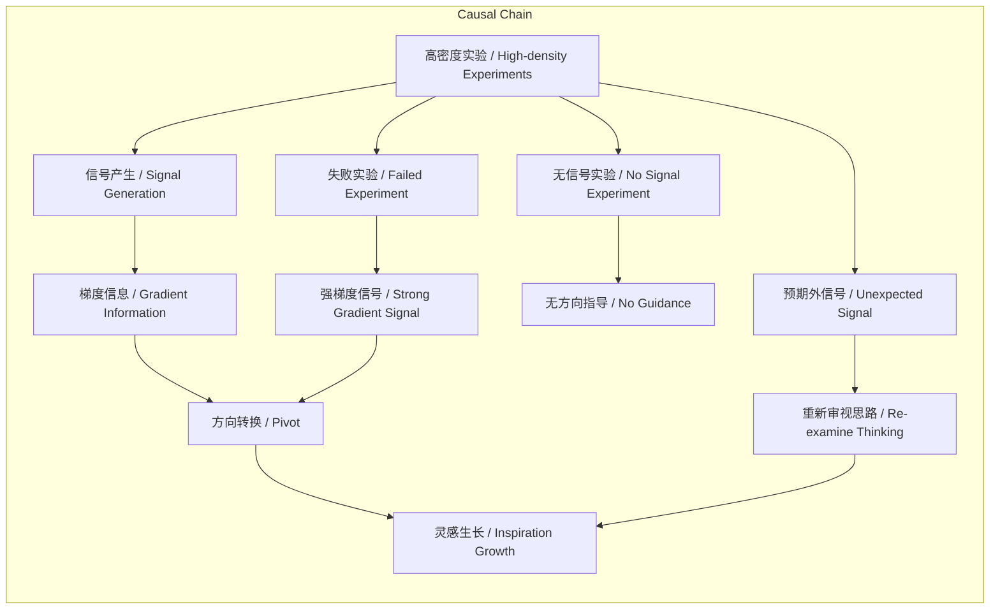

> 研究本质是非线性探索过程，通过高密度实验捕捉信号与梯度，在试错中衍生真正灵感。

## 元信息
- 分类：`ai-software/models-research`
- 优先级：`high` (`13`)
- 文档类型：`text-summary`
- 来源分组：`news`
- 原始文件：`reports/news/2026-03-20/1773966434490-news-news-task-1773966371120-nhifto.md`
- 请求 ID：`1773966371120-nhifto`

## 原始内容

#### 文本总结

### 研究如随机梯度下降：探索与信号的艺术

#### 整体结构化文档表达
##### 文档卡片
- 主题（中文/English）：研究方法论 / Research Methodology
- 一句话摘要：研究本质是非线性探索过程，通过高密度实验捕捉信号与梯度，在试错中衍生真正灵感。
- 目标读者：科研工作者、学生、对创新方法感兴趣者
- 核心结论（3条）：
  1. 研究必须是动手探索而非凭空想象，空想往往产出非好Idea或已被验证的糟糕想法。
  2. 失败实验提供强梯度信号，而“没有信号”的实验最危险，因无法提供方向指导。
  3. 真正灵感源于实验信号衍生，非线性波折和方向转换是优秀研究的常态。

##### 内容结构树
1. 背景与问题定义：研究非线性探索，非从A到B的直线过程，需高密度实验寻找信号与梯度。
2. 核心观点与关键证据：受何恺明影响，空想非好Idea；信号与梯度带来灵感；Idea生长于信号捕捉。
3. 方法/机制/路径：严密追踪实验（如Excel表格），跑实验前预测结果，从预期外信号寻灵感。
4. 风险与边界条件：无信号实验、boring idea、缺乏严密追踪。
5. 结论与行动建议：拥抱探索，捕捉梯度，随时准备转换方向（Pivot）。

##### 结构化元数据（JSON）
```json
{
  "title": "研究如随机梯度下降：探索与信号的艺术",
  "topic_zh": "研究方法论",
  "topic_en": "Research Methodology",
  "audience": "科研工作者、学生、创新者",
  "claims": [
    "研究必须是动手探索而非凭空想象",
    "失败实验提供强梯度信号，无信号实验最危险",
    "真正灵感来自实验信号衍生，非线性波折是优秀研究特征"
  ],
  "evidence": [
    "受何恺明方法论影响，谢赛宁指出空想Idea往往非好Idea",
    "失败实验（如性能掉10点）提供极大信息量，给出反向梯度",
    "不好不差的实验无梯度信号，不知方向",
    "初期Idea不真正属于自己，需在试错中生长",
    "最差研究完全符合设想，是无聊想法",
    "需严密追踪实验，预测结果，从预期外信号寻灵感"
  ],
  "risks": [
    "依赖空想而非探索",
    "实验无信号，无法提供方向",
    "研究过于顺利，缺乏惊喜，是boring idea"
  ],
  "actions": [
    "像黑客一样动手复现基线，把研究当玩具破解",
    "严密追踪实验细节（如Excel表格），跑实验前预测结果",
    "对失败实验乐观分析，寻找反向梯度",
    "根据信号随时准备转换方向（Pivot）"
  ]
}
```

#### 处理流程
1. 输入识别（来源：用户输入文本）
2. 信息抽取（实体、概念、问题、事实、观点）
3. 结构化归纳（定义/分类/比较/因果/方法论）
4. 关系建模（概念关系、等式/方程/逻辑链）
5. 可视化表达（Mermaid）

#### 概念清单（中英文）
- 研究的本质 / Essence of Research
- 随机梯度下降 / Stochastic Gradient Descent
- 探索 / Exploration
- 信号 / Signal
- 梯度 / Gradient
- 何恺明方法论 / He Kaiming's Methodology
- 谢赛宁 / Xie Saining
- 凭空想象 / Imagination Without Experimentation
- Idea / Idea
- 黑客 / Hacker
- 复现基线模型 / Baseline Replication
- 玩具 / Toy
- 试错 / Trial and Error
- 失败 / Failure
- 意外 / Surprise
- 性能下降 / Performance Drop
- 反向梯度 / Negative Gradient
- 算法 / Algorithm
- 没有信号 / No Signal
- 无聊想法 / Boring Idea
- 非线性波折 / Nonlinear Fluctuations
- 转换方向 / Pivot
- 收敛与突破 / Convergence and Breakthrough
- 严密追踪实验 / Meticulous Experiment Tracking
- Excel表格 / Excel Spreadsheet
- 对比特征 / Feature Comparison
- 预测结果 / Predicted Outcome
- 预期之外信号 / Unexpected Signal
- 深层原因 / Underlying Cause
- 创新灵感 / Innovative Inspiration

#### 概念定义（中英文）
- 研究的本质 / Essence of Research：研究是非线性探索过程，通过高密度实验寻找信号与梯度，而非直线规划。
- 随机梯度下降 / Stochastic Gradient Descent：机器学习优化算法，通过迭代计算梯度更新参数以最小化损失函数，比喻研究中通过实验反馈调整方向。
- 探索 / Exploration：非线性尝试过程，通过动手实验和试错寻找研究方向。
- 信号 / Signal：实验中观测到的有信息量的事件或现象，指导研究下一步行动。
- 梯度 / Gradient：表示变化方向和幅度的指标，在研究中比喻实验反馈的指导信息，用于判断优化方向。
- 何恺明方法论 / He Kaiming's Methodology：强调动手实验和探索的研究哲学，反对空想。
- 谢赛宁 / Xie Saining：研究者，受何恺明影响，倡导实验驱动的研究。
- 凭空想象 / Imagination Without Experimentation：不依赖实验的纯理论构思，往往产出非好Idea。
- Idea / Idea：研究中的初步构思或创新点。
- 黑客 / Hacker：指以实践和破解为乐的技术探索者，比喻研究者应动手实验。
- 复现基线模型 / Baseline Replication：重现现有模型作为实验起点，确保可比性。
- 玩具 / Toy：比喻研究应像破解玩具一样充满乐趣和实践性。
- 试错 / Trial and Error：通过实验错误学习和调整的过程。
- 失败 / Failure：实验性能大幅下降或未达预期，提供强梯度信号。
- 意外 / Surprise：意料之外的现象，是强信号来源。
- 性能下降 / Performance Drop：实验指标（如准确率）降低，如掉10个点。
- 反向梯度 / Negative Gradient：失败实验提供的反向指导信息，暗示应朝相反方向设计算法。
- 算法 / Algorithm：研究中的计算方法或模型设计。
- 没有信号 / No Signal：实验结果“不好也不差”，无显著变化，无法提供方向指导。
- 无聊想法 / Boring Idea：完全符合预期、无惊喜的研究构思，通常价值低。
- 非线性波折 / Nonlinear Fluctuations：研究过程中充满意外和方向调整，非直线进展。
- 转换方向 / Pivot：根据实验信号改变研究策略或重点。
- 收敛与突破 / Convergence and Breakthrough：灵感最终聚焦并实现创新。
- 严密追踪实验 / Meticulous Experiment Tracking：精细记录实验细节（如参数、结果），便于分析信号。
- Excel表格 / Excel Spreadsheet：用于对比实验特征的追踪工具。
- 对比特征 / Feature Comparison：比较不同实验间的变量差异。
- 预测结果 / Predicted Outcome：实验前对结果的预期，用于识别预期外信号。
- 预期之外信号 / Unexpected Signal：实际结果与预测不符，提示需重新审视思路。
- 深层原因 / Underlying Cause：信号背后的根本机制，可能蕴含创新灵感。
- 创新灵感 / Innovative Inspiration：从信号中衍生出的真正有价值的研究构思。

#### 概念关联与逻辑关系（中英文）
1. 探索（Exploration）通过高密度实验（High-density Experiments）产生信号（Signal）。
2. 失败实验（Failed Experiment）提供强梯度信号（Strong Gradient Signal），而“没有信号”（No Signal）的实验无法指导方向。
3. 预期之外信号（Unexpected Signal）促使研究者重新审视思路，从而衍生出真正灵感（True Inspiration）。

#### COT逻辑梳理（定义/分类/比较/因果/科学方法论）
- Step 1（定义）：研究本质是探索过程，类似随机梯度下降，非线性且依赖实验反馈。
- Step 2（分类）：研究方式分为空想（Imagination Without Experimentation）与探索（Exploration），空想往往产出非好Idea。
- Step 3（比较）：实验类型比较——失败实验（强梯度信号） vs 无信号实验（无梯度，最危险） vs 符合预期的实验（boring idea）。
- Step 4（因果）：实验信号（尤其预期外）导致方向转换（Pivot）和灵感生长，非线性波折是优秀研究特征。
- Step 5（科学方法论）：严密追踪实验（Meticulous Experiment Tracking）和预测结果（Predicted Outcome）是捕捉信号的方法，从偏差中学习以驱动创新。

#### 事实与看法（病毒）
##### 事实
- 研究的本质是一场类似“随机梯度下降”的探索。
- 受何恺明方法论影响，谢赛宁指出坐在房间里凭空想出来的Idea往往不是好Idea。
- 失败实验（如性能掉10个点）能提供极大的信息量。
- 最糟糕的实验结果是“不好也不差”地停留在原地。
- 研究者必须极其严密地追踪实验（例如使用精细设计的Excel表格对比特征）。
- 跑每一个实验前需要提前预测结果。

##### 看法
- 如果凭空想出来，要么世界上已有成百上千人同时思考，要么它大概率是糟糕想法。
- 观测到意料之外的现象是最幸福的事情。
- 失败实验给出明确的反向梯度，向着相反方向设计算法可能获得巨大提升。
- 一开始设想的最初期Idea并不真正属于你。
- 最差的研究就是从头到尾都完全符合最初的设想、没有遇到任何困难，是无聊想法。
- 优秀的研究充满了非线性的波折，需要随时准备转换方向。
- 预期之外的信号会促使研究者重新审视思路，在深层原因中寻找到真正有价值的创新灵感。

#### FAQ（原文问题整理）
- 为什么研究必须是探索而不是“凭空想象”？
  - 因为凭空想出来的Idea往往非好Idea，要么已被多人思考，要么是糟糕想法；真正研究需动手探索，在试错中找方向。
- “信号”与“梯度”如何带来灵感？
  - 实验反馈提供梯度信号：失败实验给强反向梯度，指导算法设计；预期外信号促使重新审视，衍生灵感。
- 真正的Idea如何生长？
  - 初期Idea不真正属于自己，只有在探索和试错中，从实验信号里生长、衍生出来的Idea才是真正灵感。

#### Visualization
##### Mermaid 图 1（概念结构图）


##### Mermaid 图 2（逻辑/因果图）


#### 文章中的类比
- 研究如“随机梯度下降”：研究过程类似机器学习优化，通过实验梯度迭代调整。
- 研究如“玩具”：研究者应像破解玩具一样，以实践和乐趣驱动探索。

#### 10个金句
1. 研究的本质是一场类似“随机梯度下降”的探索。
2. 坐在房间里凭空想出来的Idea往往不是好Idea。
3. 观测到意料之外的现象（Surprise）是最幸福的事情。
4. 一个导致性能大幅度下降的失败实验其实能提供极大的信息量。
5. 最糟糕的实验结果不是性能下降，而是“不好也不差”地停留在原地。
6. 一开始设想的最初期Idea并不真正属于你。
7. 最差的研究，就是从头到尾都完全符合最初的设想、没有遇到任何困难。
8. 优秀的研究充满了非线性的波折。
9. 研究者必须极其严密地追踪实验。
10. 如果预测错了，这种预期之外的信号就会促使研究者重新审视思路。
