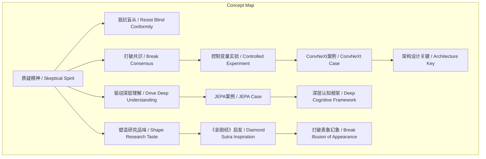
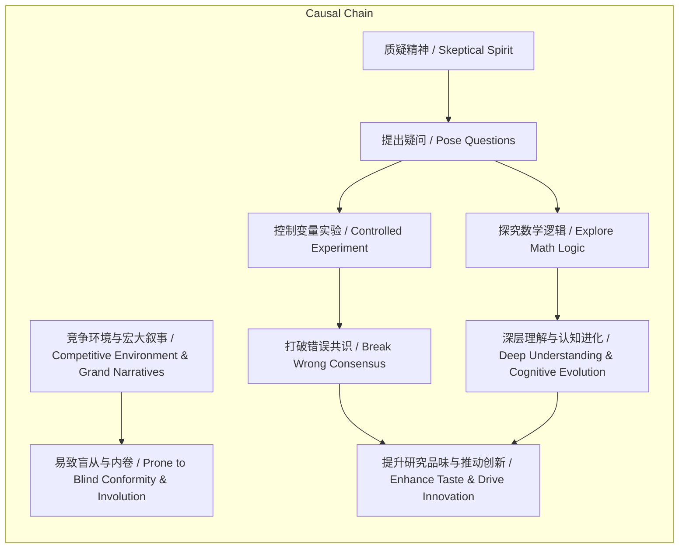

> 阐述谢赛宁科研方法论中质疑精神的核心地位，及其在抵抗盲从、打破共识、驱动深层理解与塑造研究品味四方面的具体体现。

## 元信息
- 分类：`ai-software/models-research`
- 优先级：`high` (`14`)
- 文档类型：`text-summary`
- 来源分组：`news`
- 原始文件：`reports/news/2026-03-20/1774012441977-news-news-task-1774012348710-20g3lz.md`
- 请求 ID：`1774012348710-20g3lz`

## 原始内容

#### 文本总结

### 谢赛宁：质疑精神是AI研究核心原则

#### 整体结构化文档表达
##### 文档卡片
- 主题（中文/English）：科研方法论 / Research Methodology
- 一句话摘要：阐述谢赛宁科研方法论中质疑精神的核心地位，及其在抵抗盲从、打破共识、驱动深层理解与塑造研究品味四方面的具体体现。
- 目标读者：AI研究者、科研人员、相关领域学生
- 核心结论（3条）：
  1. 质疑精神是抵抗竞争环境盲从、保持独立思考的关键。
  2. 质疑精神通过打破行业共识（如ViT成功归因），结合控制变量实验，探寻技术真正内核（如架构设计）。
  3. 质疑精神驱动从表象到实质的认知进化，并塑造具备哲学深度的研究品味。

##### 内容结构树
1. **背景与问题定义**：AI研究环境竞争激烈，充斥大语言模型、Scaling Law等宏大叙事，研究者易被裹挟盲从，丧失质疑精神，陷入内卷。
2. **核心观点与关键证据**：
   - 观点：质疑精神是指导做事情的核心原则。
   - 证据1：ConvNeXt研发中，质疑“ViT成功源于自注意力”的共识，通过控制变量实验证明宏观与微观架构设计才是关键。
   - 证据2：对JEPA的质疑促使探究其数学逻辑，发现其是通向通用智能体的深层认知框架，完成“从质疑到理解再到成为”的认知进化。
   - 证据3：受《金刚经》“凡所有相，皆是虚妄”启发，质疑精神帮助打破论文包装、流行趋势等表象幻象，求索真理实质。
3. **方法/机制/路径**：保持质疑精神 → 对现有共识提出疑问 → 通过严谨的控制变量实验或探究数学逻辑进行验证 → 打破错误认知，抵达深层理解。
4. **风险与边界条件**：未提及明确风险与边界条件。
5. **结论与行动建议**：研究者应主动培养质疑精神，不沉迷表象，通过实验与逻辑探究技术本质，以塑造高品味研究并推动突破性创新。

##### 结构化元数据（JSON）
```json
{
  "title": "谢赛宁：质疑精神是AI研究核心原则",
  "topic_zh": "科研方法论",
  "topic_en": "Research Methodology",
  "audience": "AI研究者、科研人员、学生",
  "claims": [
    "质疑精神是指导如何做事情的核心原则之一",
    "保持质疑精神能抵抗盲从，保持独立思考",
    "质疑精神打破行业共识，探寻技术真正内核",
    "质疑精神驱动深层理解与认知进化",
    "质疑精神塑造具备哲学深度的研究品味"
  ],
  "evidence": [
    "ConvNeXt模型研发中，质疑ViT成功归因于自注意力，通过控制变量实验证明架构设计更重要",
    "对JEPA的质疑促使探究其数学逻辑，发现其为通用智能体深层认知框架",
    "受《金刚经》启发，质疑精神帮助打破表象幻象，求索实质"
  ],
  "risks": [],
  "actions": [
    "在研究中保持质疑精神",
    "通过控制变量实验验证行业共识",
    "探究技术背后的数学逻辑",
    "培养哲学深度，打破表象沉迷"
  ]
}
```

#### 处理流程
1. 输入识别（来源：用户输入文本）
2. 信息抽取（实体、概念、问题、事实、观点）
3. 结构化归纳（定义/分类/比较/因果/方法论）
4. 关系建模（概念关系、等式/方程/逻辑链）
5. 可视化表达（Mermaid）

#### 概念清单（中英文）
- 谢赛宁 / Xie Saining
- 科研方法论 / Research Methodology
- 质疑精神 / Skeptical Spirit
- 竞争环境 / Competitive Environment
- 盲从 / Blind Conformity
- 宏大叙事 / Grand Narrative
- 大语言模型 / Large Language Models (LLM)
- Scaling Law / Scaling Law
- AI研究 / AI Research
- 独立思考 / Independent Thinking
- 内卷 / Involution
- 行业共识 / Industry Consensus
- 突破性创新 / Breakthrough Innovation
- ConvNeXt模型 / ConvNeXt Model
- Vision Transformer / Vision Transformer (ViT)
- 自注意力机制 / Self-attention Mechanism
- 控制变量实验 / Controlled Variable Experiment
- 宏观与微观的整体架构设计 / Macro and Micro Overall Architecture Design
- Yann LeCun / Yann LeCun
- JEPA / JEPA (Joint Embedding Predictive Architecture)
- 联合嵌入预测架构 / Joint Embedding Predictive Architecture
- 自监督学习算法 / Self-supervised Learning Algorithm
- 通用智能体 / General Intelligence Agent
- 深层认知框架体系 / Deep Cognitive Framework System
- 研究品味 / Research Taste
- 《金刚经》 / Diamond Sutra
- 凡所有相 皆是虚妄 / All phenomena are illusory
- 表象 / Appearance
- 论文包装 / Paper Packaging
- 流行趋势 / Popular Trends
- 幻象 / Illusion
- 真理与实质 / Truth and Essence

#### 概念定义（中英文）
- **谢赛宁 / Xie Saining**：AI研究者，ConvNeXt模型研发者，推崇以质疑精神为核心的科研方法论。
- **科研方法论 / Research Methodology**：指导科学研究活动的方法与原则体系，本文特指谢赛宁强调质疑精神的方法论。
- **质疑精神 / Skeptical Spirit**：谢赛宁科研方法论的核心原则，指对现有观点、共识和表象保持审慎怀疑，并通过实验与逻辑探究以追求深层理解的思维习惯。
- **竞争环境 / Competitive Environment**：AI研究领域内高度激烈、资源与成果竞争激烈的学术生态。
- **盲从 / Blind Conformity**：在竞争压力下不加批判地追随主流观点、趋势或宏大叙事的行为。
- **宏大叙事 / Grand Narrative**：如大语言模型、Scaling Law等被广泛传播、可能简化复杂性的主导性研究范式或理论。
- **大语言模型 / Large Language Models (LLM)**：基于大规模数据训练的深度学习语言模型，是当前AI研究的重要方向。
- **Scaling Law / Scaling Law**：指模型性能随规模（数据、计算、参数）扩大而提升的经验规律，是AI领域的流行概念。
- **AI研究 / AI Research**：人工智能领域的科学探索与技术开发活动。
- **独立思考 / Independent Thinking**：不依赖外部权威或潮流，基于自身分析形成判断的能力。
- **内卷 / Involution**：在竞争环境中，个体投入更多资源却未带来实质性进步，导致整体效率下降的恶性循环。
- **行业共识 / Industry Consensus**：研究领域内被广泛接受的观点或解释，如“ViT成功源于自注意力”。
- **突破性创新 / Breakthrough Innovation**：显著超越现有水平、开辟新方向的技术或理论进步。
- **ConvNeXt模型 / ConvNeXt Model**：谢赛宁团队研发的视觉模型，通过实验挑战了ViT成功归因于自注意力的共识。
- **Vision Transformer / Vision Transformer (ViT)**：将Transformer架构应用于图像任务的模型，曾被认为成功关键在于自注意力机制。
- **自注意力机制 / Self-attention Mechanism**：Transformer的核心组件，用于计算序列元素间的关联权重，原文指其被过度强调。
- **控制变量实验 / Controlled Variable Experiment**：在实验中仅改变一个因素而保持其他条件不变，以确定该因素因果效应的科学方法。
- **宏观与微观的整体架构设计 / Macro and Micro Overall Architecture Design**：指模型在整体结构（宏观）与局部模块（微观）上的综合设计，谢赛宁认为这是ConvNeXt性能的关键。
- **Yann LeCun / Yann LeCun**：著名AI研究者，提出JEPA架构。
- **JEPA / JEPA (Joint Embedding Predictive Architecture)**：Yann LeCun提出的联合嵌入预测架构，一种自监督学习框架，谢赛宁认为其是通向通用智能体的深层认知体系。
- **联合嵌入预测架构 / Joint Embedding Predictive Architecture**：JEPA的中文全称，通过预测嵌入空间中的表示进行自监督学习。
- **自监督学习算法 / Self-supervised Learning Algorithm**：从数据自身生成监督信号进行训练的机器学习方法。
- **通用智能体 / General Intelligence Agent**：具备广泛认知与行动能力的AI系统，是AI研究的长期目标。
- **深层认知框架体系 / Deep Cognitive Framework System**：指JEPA所代表的、超越具体算法的基础性理论框架，涉及智能的本质。
- **研究品味 / Research Taste**：研究者对问题重要性、方法优雅性及工作深度的判断与鉴赏能力。
- **《金刚经》 / Diamond Sutra**：佛教经典，其中“凡所有相，皆是虚妄”被谢赛宁引申为研究应超越表象。
- **凡所有相 皆是虚妄 / All phenomena are illusory**：《金刚经》核心观点，意指一切现象皆无自性、为心所现，谢赛宁用以比喻研究中的表象与幻象。
- **表象 / Appearance**：事物的表面现象或形式，如论文的复杂包装、流行趋势。
- **论文包装 / Paper Packaging**：指学术论文在表述、实验设计或呈现上的过度修饰，可能掩盖实质不足。
- **流行趋势 / Popular Trends**：研究领域内短期受追捧的热点方向或方法。
- **幻象 / Illusion**：由表象或错误认知产生的虚假印象，谢赛宁认为需用质疑精神打破。
- **真理与实质 / Truth and Essence**：隐藏在表象之下的技术或理论根本原理与核心价值。

#### 概念关联与逻辑关系（中英文）
1. **质疑精神 / Skeptical Spirit** 与 **控制变量实验 / Controlled Variable Experiment** 共同导致 **打破行业共识 / Industry Consensus**：质疑精神提出疑问，控制变量实验提供证据，二者结合推翻错误共识（如ViT自注意力核心论）。
   - 形式化：质疑精神 ∧ 控制变量实验 → ¬行业共识
2. **质疑精神 / Skeptical Spirit** 直接驱动 **深层理解 / Deep Understanding**：通过质疑促使探究数学逻辑，实现认知进化（如从质疑JEPA到理解其框架）。
   - 形式化：质疑精神 → 探究(数学逻辑) → 深层理解
3. **质疑精神 / Skeptical Spirit** 与 **研究品味 / Research Taste** 相互强化：质疑精神帮助打破表象幻象，从而提升对实质的鉴赏力，高品味研究又更倾向于质疑。
   - 形式化：质疑精神 → 打破(表象) → 提升(研究品味)；研究品味 → 更有效质疑

#### COT逻辑梳理（定义/分类/比较/因果/科学方法论）
- **Step 1 (定义)**：界定核心概念“质疑精神”为谢赛宁方法论中指导科研的核心原则，强调其非为反对而反对，而是追求深层理解的必经阶段。
- **Step 2 (分类)**：将质疑精神的作用分为四类：1) 抵抗盲从以保独立思考；2) 打破共识以探技术内核；3) 驱动认知进化；4) 塑造研究品味。
- **Step 3 (比较)**：比较传统观点（ViT成功因自注意力）与谢赛宁实证结论（架构设计更重要），通过控制变量实验显示前者为表象，后者为实质。
- **Step 4 (因果)**：建立因果链：竞争环境与宏大叙事 → 易导致盲从与内卷；质疑精神 → 提出对共识的疑问 → 实施控制变量实验/探究逻辑 → 获得新证据 → 打破共识/实现认知进化 → 提升研究品味与推动创新。
- **Step 5 (科学方法论)**：体现假设-验证循环：1) 基于质疑形成假设（如“自注意力非关键”）；2) 设计控制变量实验验证；3) 分析结果，修正或确认理论；4) 推广至更一般框架（如从算法到认知体系）。

#### 事实与看法（病毒）
##### 事实
- 谢赛宁及其团队研发了ConvNeXt模型。
- 在ConvNeXt研发时，行业普遍认为Vision Transformer（ViT）的成功主要归功于自注意力机制。
- 谢赛宁团队通过大量控制变量实验，证明决定模型性能的关键是宏观与微观的整体架构设计，自注意力机制可能是最不重要的部分。
- 谢赛宁经历了“从质疑JEPA到理解JEPA再到成为JEPA”的过程。
- JEPA由Yann LeCun提出，是一种联合嵌入预测架构。
- 谢赛宁受《金刚经》中“凡所有相，皆是虚妄”的启发。
##### 看法
- 质疑精神是指导如何做事情的核心原则之一。
- 保持质疑精神是研究者在浮躁时代保持独立思考、不迷失于盲目内卷的关键。
- 真正的突破性创新往往诞生于对现有“共识”的质疑之中。
- 质疑是通往更深层次理解的必经阶段。
- 高品味的研究者绝不能沉迷于事物的表象（相），如论文复杂的包装或虚假的流行趋势。
- 质疑精神能帮助研究者打破幻象，抽丝剥茧地求索隐藏在背后的真理与实质。

#### FAQ（原文问题整理）
- 未发现明确提问句。原文包含隐含疑问（如“这是否只是又一个普通的自监督学习算法”），但未以直接提问形式呈现。

#### Visualization
##### Mermaid 图 1（概念结构图）

##### Mermaid 图 2（逻辑/因果图）


#### 文章中的类比
- 将研究中的表象（如论文包装、流行趋势）类比于《金刚经》中的“相”，认为其“皆是虚妄”，需用质疑精神打破幻象以求索真理与实质。

#### 10个金句
1. 质疑精神是指导如何做事情的核心原则之一。
2. 保持质疑精神是研究者在这个浮躁的时代中保持“你是你自己的天才”的独立思考能力、不迷失于盲目内卷的关键所在。
3. 真正的突破性创新往往诞生于对现有“共识”的质疑之中。
4. 决定模型性能的关键其实是宏观与微观的整体架构设计，而自注意力机制可能是其中最不重要的一环。
5. 质疑并不是为了反对而反对，而是通往更深层次理解的必经阶段。
6. 从质疑 JEPA 到理解 JEPA 再到成为 JEPA。
7. 一开始他质疑这是否只是“又一个普通的自监督学习算法”。
8. 发现 JEPA 其实是一整套通向通用智能体的深层认知框架体系。
9. 高品味的研究者绝不能沉迷于事物的表象（相）。
10. 质疑精神能帮助研究者打破这些幻象，抽丝剥茧地去求索隐藏在背后的真理与实质。
